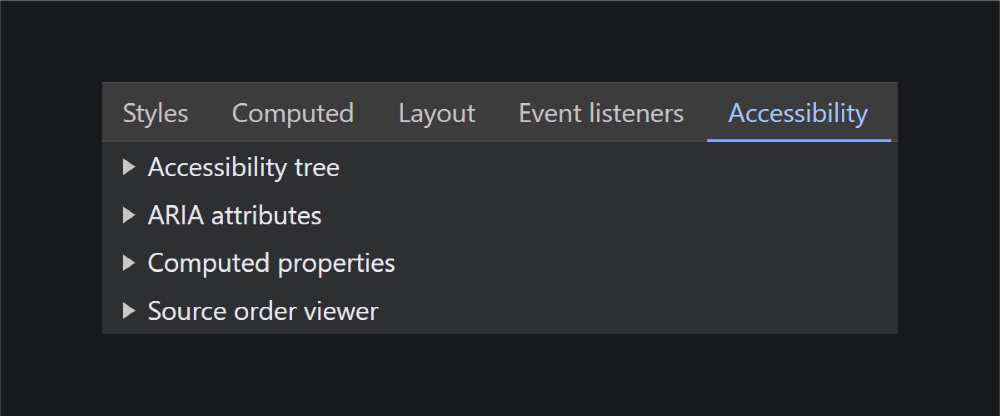
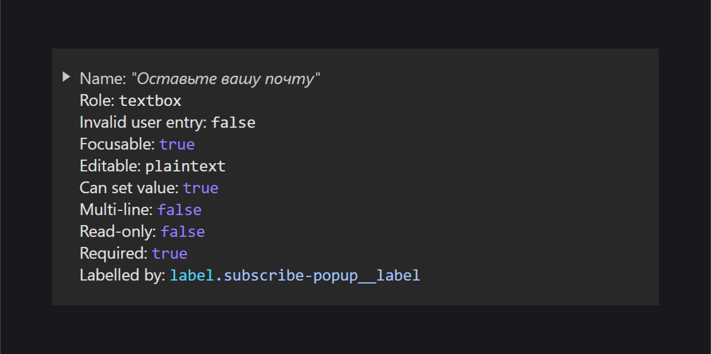

_Дерево доступности (accessibility tree)_ — это представление элементов документа в виде дерева на основе [DOM](/js/dom/) (Document Object Model, Объектная модель документа). Благодаря дереву доступности вспомогательные технологии, например, [скринридеры](/a11y/screenreaders/), знают про содержимое страницы и что на ней происходит.

## Как создаётся

В дерево доступности попадает информация о том, как свёрстана страница. Больше всего на него влияет HTML, чуть меньше CSS и JavaScript. При этом дерево доступности не полностью копирует DOM-дерево. Например, в него не попадают элементы со свойствами [`display: none`](/css/display/), [`visibility: hidden`](/css/visibility/), [атрибутом `hidden`](/html/hidden/) или декоративные [`<div>`](/html/div/).

Вспомогательные технологии взаимодействуют с деревьями не напрямую, а через посредника — [Accessibility API](/a11y/screenreaders/#accessibility-api) операционной системы пользователя. В свою очередь, деревья строят и передают дальше браузеры.

Одно и то же дерево доступности может быть разным в зависимости от браузера. К примеру, могут отличаться названия ролей и по разному вычисляться имена элементов.

Дерево доступности создаётся параллельно с [DOM-деревом](/js/dom/#iz-chego-sostoit-dom). Браузеры ждут, пока страница окончательно отрисуется, а потом решают, что забрать в дерево доступности. Кроме информации о семантических тегах, в них, к примеру, попадает содержимое псевдоэлементов [`::before`](/css/before/) и [`::after`](/css/after/) и дополнительная разметка для вспомогательных технологий.

## Объекты доступности

Дерево доступности состоит из _объектов доступности (accessible object)_. Каждый объект представляет один элемент интерфейса и может содержать роль, имя, описание, свойства и состояния.

ТУТ БУДЕТ КАРТИНКА.

У большинства семантических тегов по умолчанию есть нужные роли, имена и состояния, однако их можно явно задавать и изменять с помощью _[ARIA](/a11y/aria-intro/) (Accessible Rich Internet Applications)_. Это вспомогательная техника для создания более доступного содержимого для скринридеров и других вспомогательных технологий. Расширяет возможности HTML с помощью специальных атрибутов и ролей.

Одно из главных правил использования ARIA — стараться не использовать ARIA. Так что она пригодится, когда не хватает возможностей HTML. К примеру, для сложных интерактивных элементов — вкладок, выпадающих списков, модальных окон или оповещений об ошибках. В этом случае ARIA и JavaScript сделают поведение интерактивного элемента понятным и предсказуемым.

Объекты доступности попадают в дерево, если произошло одно из двух событий:

- элемент, его содержимое, свойства и отношения с другим на странице важны для вспомогательных технологий;
- сработало доступное событие — пользователь зашёл на сайт со скринридером, экранной лупой и так далее.

Теперь давайте подробнее разберём все части объекта доступности.

### Роль

Описывает то, что это за объект и можно ли с ним взаимодействовать. Бывают встроенными и явными.

Встроенные роли есть по умолчанию у [семантических тегов](/html/#semantika). Например, у ссылки [`<a>`](/html/a/) с атрибутом `href` есть [роль `link`](/a11y/role-link/):

```html
<a href="/cozy-page/">Уютная страница</a>
```

Даже в [`<span>`](/html/span/) и `<div>` встроена роль [`generic`](/a11y/role-generic/), но это не добавляет им нужной семантики 🤯

Явные роли задают с помощью ARIA. К примеру, лёгким движением руки `<span>` превращается в ссылку благодаря атрибуту `role="link"`, CSS и JavaScript.

```html
<span role="link">Уютная страница</span>
```

На практике лучше так не делать и использовать по максимуму возможности HTML. Тогда не придётся писать скрипт, чтобы сделать `<span>` настоящей ссылкой со всеми нужными свойствами и поведением.

Подробнее с концепцией ролей познакомитесь в статье «[ARIA-роли](/a11y/aria-roles/)».

### Имя

Другое название — доступное имя (accessible name). Если просто, то это подпись к объекту доступности. Имена — важная часть опыта пользователей, которые слушают интерфейсы. Они помогают разобраться, что это за элемент и какая у него цель. Обычно озвучиваются при фокусе и берутся из текстового содержимого тегов или атрибутов.

Вернёмся к примеру со ссылкой. В её случае имя берётся из текста между открывающим и закрывающим тегами — «Уютная страница».

```html
<a href="/cozy-page/">Уютная страница</a>
```

С полями всё ещё проще. Их имя берётся из тега [`<label>`](/html/label/), когда он связан с полем атрибутом `for`. В этом примере это «Любимый покемон».

```html
<label for="pokemon">Любимый покемон:</label>
<input type="text" id="pokemon">
```

Если у `<button>` нет текста, пользователи вспомогательных технологий узнают только о том, что это какая-то кнопка.

```html
<button type="button"></button>
```

Имена могут браться и из атрибутов [`aria-label`](/a11y/aria-label/) и [`aria-labelledby`](/a11y/aria-labelledby/). Например, имя этой кнопки с иконкой внутри — «Сделать комплимент».

```html
<button aria-label="Сделать комплимент">
  <!-- Иконка -->
</button>
```

У способов предоставления имён есть разные особенности и приоритетность. Подробнее узнаете из спецификации [Accessible Name and Description Computation 1.1](https://www.w3.org/TR/accname-1.1/).

### Описание

Другие названия — доступное описание (accessible description) или вспомогательный текст (helper text). Это дополнение к имени, которое подробнее рассказывает об объекте или содержит подсказку к нему. Озвучивается после имени и роли, если выбрана такая настройка в скринридере.

На самом деле это необязательная часть объекта доступности, которая помогает пользователям глубже разобраться в интерфейсе. Описания особенно полезны, когда на сайте есть сложные или нестандартные элементы.

Описания к элементам добавляются с помощью [`aria-describedby`](/a11y/aria-describedby/), [`aria-details`](/a11y/aria-details/) и [`aria-description`](/a11y/aria-description/).

Например, описание этой кнопки — «Выберите любимый цвет, и он появится на фоне страницы». Оно берётся из `<span>` с текстом, который связан с [`<button>`](/html/button/) атрибутом `aria-describedby`.

```html
<button
  type="button"
  aria-describedby="hint"
>
  Выбрать тему
</button>

<span id="hint">
  Выберите любимый цвет, и он появится
  на фоне страницы.
</span>
```

### Свойства и состояния

Содержат детали о раскладке и возможных действиях с объектами. К примеру, выбран или нет сейчас элемент, связан ли с ним другой и так далее.

Во многие семантические теги, кроме роли, встроены ещё свойства и состояния. Например, у чекбоксов есть атрибут `checked`. Он сообщает вспомогательным технологиям, что сейчас выбрано. В этом примере кому-то точно нравится пицца с ананасом 🍍

```html
<label for="pineapple">
  Люблю пиццу с ананасом:
</label>
<input id="pineapple" type="checkbox" checked>
```

Свойствами и состояниями можно управлять и с помощью ARIA. Есть ARIA-атрибуты, которые дублируют атрибуты из HTML, как [`aria-checked`](/a11y/aria-checked/).

```html
<span id="label">
  Люблю пиццу с ананасом:
</span>
<span
  role="checkbox"
  aria-labelledby="label"
  aria-checked="true"
>
</span>
```

Есть уникальные ARIA-атрибуты, которые передают вспомогательным технологиям ещё больше информации об элементах. Например, [`aria-expanded`](/a11y/aria-expanded/) сообщает о том, свёрнуто или нет связанное содержимого. В этом примере список товаров пока свёрнут.

```html
<button
  aria-expanded="false"
  aria-controls="list"
>
  Все товары
</button>
<ul id="list">
  <!-- Список ссылок -->
</ul>
```

Подробнее про свойства и состояния рассказываем в статье «[ARIA-атрибуты](/a11y/aria-attrs/)».

## Как отлаживать

На дерево доступности можно посмотреть через браузерные инструменты разработчика.

<details>
  <summary>Chrome, Edge</summary>

  Вкладка «Специальные возможности» (Accessibility) из основной панели «Элементы» (Elements).

  Дополнительно можете включить экспериментальную настройку «Дерево доступности на всю страницу» (Enable full-page accessibility tree), выбрав соответствующий чекбокс в аккордеоне «Дерево доступности» (Accessibility Tree). В этом случае в блоке со структурой страницы появится переключатель с фигурой человека для смены вида дерева.

  Второй способ. Настройки (Settings) > вкладка «Экспериментальные функции» (Experiments) > чекбокс «Включить дерево доступности на всю страницу в панели "Элементы"» (Enable full accessibility tree view in the Elements panel).

</details>

<details>
  <summary>Firefox</summary>

  Настроить инструменты разработчика и получить помощь (Customize developer tools and get help) > Настройки (Settings) (можно открыть клавишей <kbd>F1</kbd>) > чекбокс «Поддержка доступности» (Accessibility) в разделе с инструментами разработчика по умолчанию. После этого появится отдельная вкладка «Поддержка доступности».

</details>

<details>
  <summary>Safari</summary>

  Вкладка «Узел» (Node) в основной панели «Элементы» (Elements) > аккордеон «Специальные возможности» (Accessibility).

</details>

В Chrome и Firefox самые детальные превью деревьев. В этих браузерах можете найти как целое дерево доступности, так и заглянуть в отдельные узлы.

Заглянем в дерево доступности в Chrome, которое получилось на основе DOM-дерева [главной страницы Доки](https://doka.guide/). Визуально оно напоминает иерархию папок в системе, где вместо папок — узлы, а вместо их названий — роли тегов. На скриншоте есть четыре больших узла с хедером [`banner`](/a11y/role-banner/), основной частью страницы [`main`](/a11y/role-main/), футером [`contentinfo`](/a11y/role-contentinfo/) и диалоговым окном [`dialog`](/a11y/role-dialog/). Внутри крупных узлов есть другие, поменьше. К примеру, в `banner` есть секция `section`, текстовое поле [`textbox`](/a11y/role-textbox/) и тексты «Дока» и «/» (косая черта).


В отдельных узлах найдёте подробную ифнормацию про объект доступности: его ARIA-атрибуты и вычисляемые свойства, к примеру, имя и роль.



Давайте теперь посмотрим на реальный объект доступности. Возьмём поле [`<input type="email">`](/html/input/) для почты из попапа с подпиской на рассылку Доки.

```html
<label class="subscribe-popup__label">
  <input
    class="subscribe-popup__input"
    type="email"
    name="email"
    placeholder="dog@doka.guide"
    inputmode="email"
    required
  >
  <span class="subscribe-popup__hint">
    Оставьте вашу почту
  </span>
</label>
```

- _Name_ — имя поля из `<label>`. Это «Оставьте вашу почту».
- _Role_ — встроенная роль элемента. Это `textbox`.
- _Invalid user entry: false_ — в поле пока нет неправильных данных.
- _Focusable: true_ — на элемент можно сделать фокус с клавиатуры.
- _Editable: plaintext_ — поле редактируется и принимает только текст.
- _Can set value: true_ — можно задать любое дополнительное значение.
- _Multi-line: false_ — поле однострочное, нельзя перейти на новую строку.
- _Read-only: false_ — поле не только для чтения и в него можно вводить данные.
- _Required: true_ — поле обязательно для заполнения из-за атрибута [`required`](/html/required/).
- _Labelled by_ — название поля берётся из `<label>` с классом `.subscribe-popup__label`.



На практике лучше не полагаться полностью на деревья в браузерах, когда тестируете доступность интерфейса. Браузеры показывают вам не _реальное_ дерево, а его визуальное превью. Оно не отражает, как скринридеры на самом деле читают интерфейс и не всегда быстро обновляются, когда происходят динамические изменения на странице: изменяется название элемента, появляется или скрывается подсказка к нему и тому подобное.

Подробнее про работу с деревом доступности в разных браузерах:

- [Дерево доступности в инструментах разработчика в Chrome](https://developer.chrome.com/blog/full-accessibility-tree/).
- [Документация про инспектор доступности Firefox](https://firefox-source-docs.mozilla.org/devtools-user/accessibility_inspector/).
- [Тестирование доступности в Safari](https://developer.apple.com/library/archive/documentation/Accessibility/Conceptual/AccessibilityMacOSX/OSXAXTestingApps.html#//apple_ref/doc/uid/TP40001078-CH210-TPXREF101).

## AOM

Пока что к дереву доступности нет прямого доступа, поэтому им нельзя управлять или читать его напрямую. _[Объектная модель доступности](https://wicg.github.io/aom/explainer.html) (Accessibility Object Model или коротко AOM)_ решит эту проблему в будущем. Это экспериментальное API (Application Programming Interface, Интерфейс программирования приложения), которое позволит разработчикам получить прямой доступ к дереву доступности.

## Что ещё почитать

Дополнительные ссылки по теме для пытливых умов 🧠

- [Semantics to Screen Readers](https://alistapart.com/article/semantics-to-screen-readers/).
- [Accessibility APIs: A Key To Web Accessibility](https://www.smashingmagazine.com/2015/03/web-accessibility-with-accessibility-api/).
- [The Accessibility Tree](https://whatsock.com/training/).
