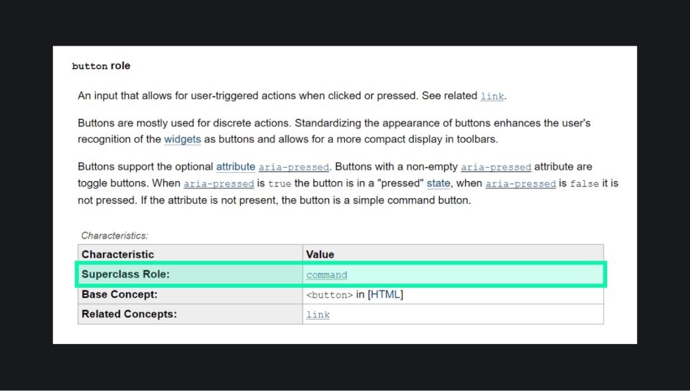
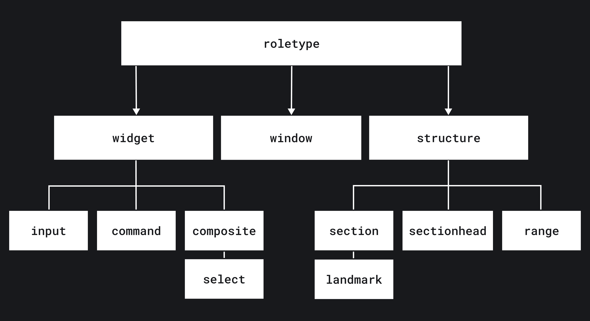

## Кратко

Абстрактные ARIA-роли — это базовый тип ролей в [WAI-ARIA](/a11y/aria-intro/) (Web Accessibility Initiative – Accessible Rich Internet Applications или коротко ARIA) и фундамент для других. Это сложная концепция, которая в первую очередь нужна авторам ARIA. Обычным разработчикам они помогут глубже понять устройство спецификации и модели ролей.

У абстрактных ролей нет практической пользы, но они важны для _онтологии_ — описания того, как устроены и связаны между собой все [ARIA-роли](/a11y/aria-roles/). Так что у них две задачи:

- поддерживать в порядке модель ролей в спецификации — на какие категории они делятся;
- упростить процесс добавления новых ролей: благодаря абстрактным ролям понятно, какие функции могут быть у новых сущностей и как они связаны с уже существующими.

<aside>

⚠️ Не используйте абстрактные роли в коде. Они нужны только браузерам и авторам спецификации.

</aside>

HTML-теги и ARIA-роли делятся на несколько больших групп в зависимости от того, что они делают на странице, какое у них содержимое и как с ними взаимодействуют пользователи. Это элементы с поведением окон, интерактивные и для структуры страниц. Абстрактные роли как раз описывают эту классификацию.

## Роль-суперкласс

С абстрактными ролями связан ещё один термин из WAI-ARIA — _роль-суперкласс (superclass role)_. Они описывают, как конкретная роль встроена в модель из спецификации и какие у неё функции, ограничения и другие особенности.

Если заглянете в ARIA, в описании к каждой сущности найдёте роль-суперкласс, и обычно это абстрактные роли. К примеру, роль-суперкласс для кнопок [`button`](/a11y/role-button/) — `command`, пунктов нумерованного и ненумерованного списков [`listitem`](/a11y/role-listitem/) — `section` и так далее.

Ролью-суперклассом могут быть одновременно две абстрактные роли и даже другие их типы. Например переключатель [`switch`](/a11y/role-switch/) основан на чекбоксе [`checkbox`](/a11y/role-checkbox/).

Всего есть 12 абстрактных ролей. `roletype` — базовая роль. На ней основаны ключевые `window`, `structure` и `widget`. На `structure` построены `section`, `sectionhead` и `range`. В свою очередь `section` — роль-суперкласс для `landmark`. Наконец, роль `widget` ведёт к `command`, `input` и `composite`. На последней роли базируется `select`.

Отношения между абстрактными ролями в виде схемы:

Теперь давайте подробнее разберёмся с каждой из этих ролей.

## `roletype`

Базовая роль, на которой основаны другие. Она определяет структуру и функциональность всех элементов — от параграфа до кнопки. В общем-то это и есть сама концепция роли 👾

На `roletype` основаны ключевые абстрактные роли `window`, `structure` и `widget`.

## `window`

Окна программ или экраны приложений. `window` — роль-суперкласс для диалоговых окон [`dialog`](/a11y/role-dialog/).

## `structure`

Элементы, которые определяют структуру документа. Помогает вспомогательным технологиям отличать статичные элементы от интерактивных. К примеру, `structure` — роль-суперкласс для элементов без семантики [`generic`](/a11y/role-generic/) или разделителя [`separator`](/a11y/role-separator/). Также на `structure` построены другие абстрактные роли `section`, `sectionhead`, `landmark` и `range`.

### `section`

Структурные элементы для разделов документов или приложений. Роль-суперкласс для группы элементов [`group`](/a11y/role-group/), картинок [`img`](/a11y/role-img-image/), параграфов [`paragraph`](/a11y/role-paragraph/), цитат [`blockquote`](/a11y/role-blockquote/) или нумерованных и нумерованных списков [`list`](/a11y/role-list/).

#### `landmark`

Ориентиры — область документа для навигации. С помощью них вспомогательные технологии быстро перемещаются к нужным частям страницы и находят нужную информацию.

`landmark` — роль-суперкласс для хедера [`banner`](/a11y/role-banner/), футера [`contentinfo`](/a11y/role-contentinfo/), основной части страницы [`main`](/a11y/role-main/) или навигации [`navigation`](/a11y/role-navigation/).

### `sectionhead`

Заголовок, который описывает смысл или содержание документа и приложения. Роль-суперкласс для заголовков ячеек или строк таблиц [`columnheader`](/a11y/role-columnheader/) и [`rowheader`](/a11y/role-rowheader/), заголовков [`heading`](/a11y/role-heading/) и вкладок [`tab`](/a11y/role-tab/).

### `range`

Элемент для ввода данных с диапазоном значений. Роль-суперкласс для индикаторов выполнения задачи [`progressbar`](/a11y/role-progressbar/), ползунков для выбора чисел из диапазона [`slider`](/a11y/role-slider/) или числовых значений в заданном диапазоне [`meter`](/a11y/role-meter/).

## `widget`

Интерактивные элементы, с которыми взаимодействуют пользователи. Для вспомогательных технологий элементы на основе `widget` это знак, что на них можно нажать, сделать фокус с клавиатуры, ввести данные и так далее. [Скринридеры](/a11y/screenreaders/) изменяют режим взаимодействия с такими элементами и переключаются на подходящую навигацию, когда встречают их на странице. К примеру, навигация с клавиши <kbd>Tab</kbd> переключается на стрелки, если это группа радиокнопок.

`widget` — роль-суперкласс для абстрактных ролей `command`, `input`, `composite` и `select`. Также работает и для ролей, которые можем использовать на практике. Например, для вкладок `tab`, строк таблиц [`row`](/a11y/role-row/) и полосы прокрутки [`scrollbar`](/a11y/role-scrollbar/).

### `input`

Интерактивные элементы, в которые вводят данные. На `input` основаны, например, роли чекбоксов `checkbox`, радиокнопок [`radio`](/a11y/role-radio/), числовых полей [`spinbutton`](/a11y/role-spinbutton/) и текстовых полей [`textbox`](/a11y/role-textbox/).

### `command`

Интерактивные элементы, с которыми можно взаимодействовать всеми способами кроме ввода данных. К примеру, на основе `command` построены кнопки `button`, ссылки [`link`](/a11y/role-link/) и пункты меню [`menuitem`](/a11y/role-menuitem/).

### `composite`

Интерактивные элементы, в которых находятся другие. Роль-суперкласс для сеток [`grid`](/a11y/role-grid/), числовых полей `spinbutton`, панелей навигации [`tablist`](/a11y/role-tablist/) и для другой абстрактной роли `select`.

#### `select`

Интерактивные элементы с одной или несколькими опциями на выбор. Роль-суперкласс для сложных элементов — выпадающего списка [`listbox`](/a11y/role-listbox/), «настоящего» меню [`menu`](/a11y/role-menu/), группы радиокнопок [`radiogroup`](/a11y/role-radiogroup/) и древовидного списка [`tree`](/a11y/role-tree/).
