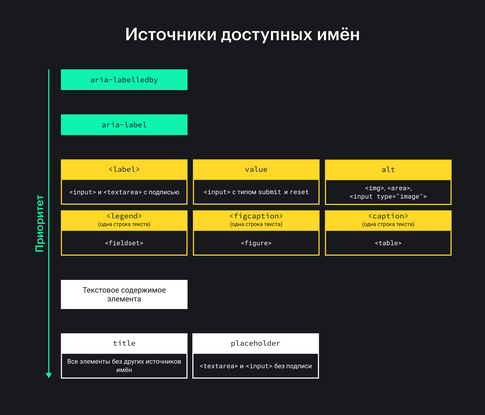
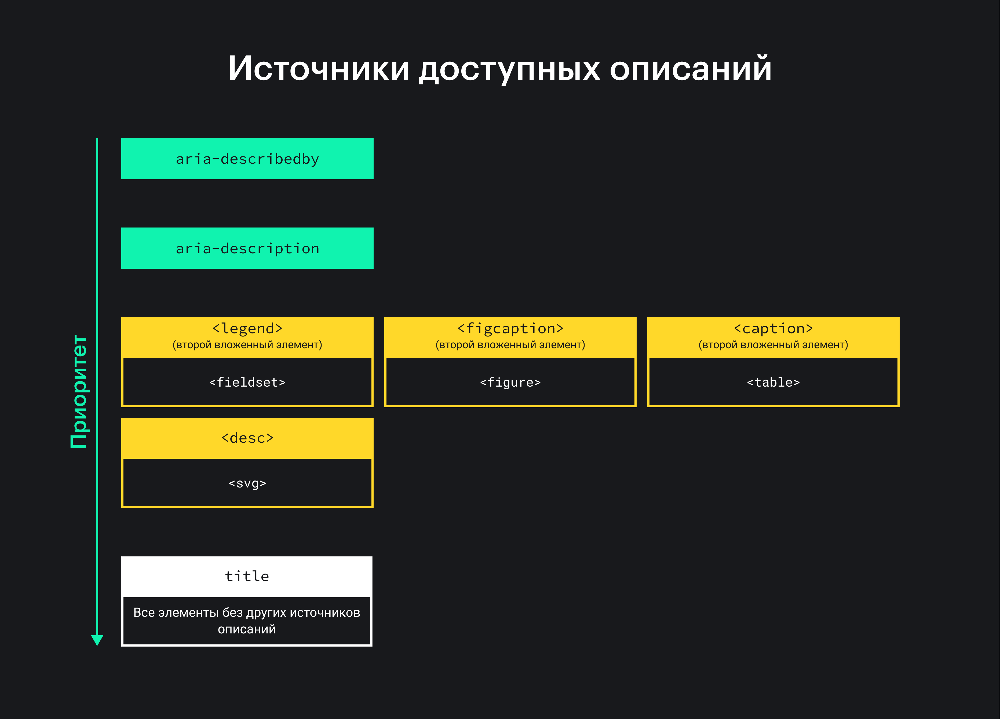

## Кратко

На сайтах большинство элементов содержит имя и описание. Благодаря им пользователи вспомогательных технологий знают, для чего нужен элемент, как с ним взаимодействовать, а также ориентируются по целым сайтам и отдельным страницам. Например, кнопка с текстом «Отправить» имеет имя «Отправить» и описание «Обработка заявки займёт вечность». Так люди, которые слушают интерфейс, узнают о назначении кнопки и дополнительных деталях, связанных с действием.

## Доступное имя

_Доступное имя (accessible name)_ — подпись к элементу на странице сайта или в другом пользовательском интерфейсе, которая кратко описывает, что он делает. Как правило, это короткая строка из 1–4 слов в зависимости от языка. Значение для имени берётся из текстового содержимого элемента. Такие имена называют видимыми. Имена также бывают невидимыми. Пример — `alt` для альтернативного текста (alt-текста) к картинке.

Здесь текст «Скачать картинку» — видимое доступное имя ссылки.

```html
<a href="picture.png" download>
  Скачать картинку
</a>
```

Такие элементы, как заголовки, ссылки и кнопки получают доступное имя из своего содержимого. Это могут быть и сложные элементы с интерактивными или динамическими функциями. Если в них нет текста, пользователи вспомогательных технологий узнают только о роли, которая попала в [дерево доступности](/a11y/a11y-tree/). Как правило, [скринридеры](/a11y/screenreaders/) сначала объявляют имя, а уже потом роль и состояние.

На самом деле имена нужны не всегда. Например, их не задают параграфам [`<p>`](/html/p/) или времени [`<time>`](/html/time/). В спецификации WAI-ARIA найдёте полный [список элементов, для которых требуются имена](https://www.w3.org/TR/wai-aria-1.3/#namecalculation) (помечены фразой «name required»).

## Доступное описание

_Доступное описание (accessible description)_ — дополнительная информация, которая даёт полное представление о назначении или содержании элемента. Примеры — инструкции или требования к формату данных для поля ввода.

Поскольку описания — необязательные строки и длиннее имён, они озвучиваются самыми последними (после имени, роли и состояния), иногда с небольшой задержкой.

Описания тоже бывают видимыми и невидимыми. К примеру, невидимое описание может в некоторых случаях браться из альтернативного текста к картинке. Такой текст визуально скрыт, но доступен вспомогательным технологиям. Подробнее о подходе рассказываем в статье [«Как описывать картинки»](/a11y/how-to-describe-pictures/).

Пользователям с особенностями зрения не всегда просто понять, что делают нестандартные элементы. Подробные описания улучшают пользовательский опыт и помогают получить информацию о содержании, которую они упускают из-за сложного интерфейса. Также некоторые сложные элементы разрабатываются с учётом конкретных потребностей пользователей. К примеру, с использованием новых технологий или для взаимодействия жестами. Описания помогают таким пользователям быстрее понять, как пользоваться сайтом.

## Для чего нужны

У доступных имён и описаний две цели: рассказать о назначении элемента и выделить его среди других на странице.

Разница между именем и описанием в том, что описание более подробное и необязательное, тогда как имя напрямую влияет на доступность интерфейса для вспомогательных технологий.

## Как задать

Имена и описания добавляют двумя способами. Нативным, с использованием стандартного HTML, и при помощи [ARIA-атрибутов](/a11y/aria-attrs/). Другое название — источники доступных имён и описаний.

### Нативные способы

К нативным способам относится текстовое содержимое элементов. Это то, что размещаете между открывающим и закрывающим тегами. В спецификации это называют контентным источником. Например, так работают ссылки [`<a>`](/html/a/), кнопки [`<button>`](/html/button/), заголовки [`<h1>`−`<h6>`](/html/h1-h6/) и вкладки [с ролью `tab`](/a11y/role-tab/). Полный список ролей, которые поддерживают этот способ, найдёте в разделе WAI-ARIA [Roles Supporting Name from Content](https://www.w3.org/TR/wai-aria-1.2/#namefromcontent).

Некоторые теги тоже задают имена отдельным элементам или группе:

- [`<legend>`](/html/legend/) в [`<fieldset>`](/html/fieldset/);
- [`<caption>`](/html/caption/) в [`<table>`](/html/tables/);
- [`<figcaption>`](/html/figure-figcaption/) в `<figure>`.

В примере используем `<fieldset>` для группировки полей формы, а `<legend>` — для присвоения имени группе.

```html
<fieldset>
  <legend>Контактная информация</legend>

  <label for="name">Имя:</label>
  <input type="text" id="name" name="name" required>

  <label for="email">Почта:</label>
  <input type="email" id="email" name="email" required>
</fieldset>
```

В HTML-таблицах не обязательно использовать подпись `<caption>`, но она улучшает доступность и делает содержимое проще для понимания. Если у таблицы нет атрибутов `aria-label` или [`aria-labelledby`](/a11y/aria-labelledby/), то доступное имя берётся из `<caption>`.

Кроме того, для скринридеров таблица без `<caption>` теряет семантику и становится декоративной. Это значит, что она нужна для оформления и организации элементов на странице, а не для хранения данных.

В примере текст «Часы работы» в `<caption>` — это имя, которое рассказывает о контексте таблицы.

```html
<table>
  <caption>Часы работы</caption>
  <tr>
    <td>Понедельник</td>
    <td>08:00–20:00</td>
  </tr>
  <tr>
    <td>Пятница</td>
    <td>10:00–15:00</td>
  </tr>
</table>
```

Такую же роль имени выполняет подпись `<figcaption>` в `<figure>`. Она располагается до или, чаще всего, после рисунка. В этом случае текст в `alt` станет доступным описанием. Скринридер сначала зачитает содержимое `<figcaption>` и только потом альтернативный текст.

```html
<figure>
  
  <figcaption>
    Прогулка по городскому парку.
  </figcaption>
</figure>
```

Элементам форм вроде [`<textarea>`](/html/textarea/), [`<select>`](/html/select/) и [`<input>`](/html/input/) доступное имя добавляют при помощи [`<label>`](/html/label/).

```html
<label for="car-model">Выберите тип кузова автомобиля:</label>
<select id="car-model">
  <option value="sedan">Sedan</option>
  <option value="suv">SUV</option>
  <option value="hatchback">Hatchback</option>
</select>
```

`title` и `placeholder` используют для краткой дополнительной информации или подсказок, но ещё и для хранения доступных имён. В реальности атрибуты предназначены для другого и считаются резервным источником. Некоторые вспомогательные технологии и браузеры вообще не считают содержимое `title` и `placeholder` именами, поэтому пользователи не узнают о них. Так что хранить имена в этих атрибутах — плохая практика.

### Способы с ARIA

Имена и описания задают не только стандартными способами с помощью HTML, но и атрибутами [`aria-labelledby`](/a11y/aria-labelledby/) и [`aria-label`](/a11y/aria-label/).

`aria-labelledby` связывает содержимое одного элемента с именем, которое хранится в другом элементе.

```html
<h2 id="cake-recipe">
  Торт Муравейник
</h2>
<p>
  Чтобы приготовить торт, посмотрите
  короткое видео на YouTube!
  <a
    href="/youtubelink"
    aria-labelledby="cake-recipe"
  >
    Смотреть видео
  </a>
</p>
```

Когда элемент не связан с видимым текстом, используют `aria-label`.

```html
<button aria-label="Закрыть">
  X
</button>
```

Доступные описания добавляют с помощью [`aria-describedby`](/a11y/aria-describedby/) и [`aria-description`](/a11y/aria-description/).

`aria-describedby` связывает элемент с другим как описание.

```html
<form>
  <label for="name">Имя:</label>
  <input
    id="name"
    type="text"
    aria-describedby="format"
  >
  <span id="format">
    Ваше имя заглавными буквами на латинице.
  </span>
</form>
```

Когда добавляете невидимое описание для элемента, можете использовать `aria-description`. Атрибут похож на `aria-label`, но предназначен для более подробных текстов с дополнительными деталями. Такое описание видно только вспомогательным технологиям. В случае `aria-description` скринридер прочтёт описание после имени элемента и другой основной информации.

```html

```

<aside>

📚 Атрибут `aria-description` появился в [черновике WAI-ARIA 1.3](https://w3c.github.io/aria/). Пока что рекомендуем использовать `aria-describedby` и другие надёжные способы описания элементов.

</aside>

## Как вычисляются

Браузеры вычисляют имена на основе специальных алгоритмов. В этом списке источники имён расположены от более приоритетных к менее:

1. `aria-labeledby` — самый высокий приоритет, связывает один элемент с другим, в котором хранится имя.
1. `aria-label` — задаёт имя прямо в элементе.
1. Специальные HTML-теги и атрибуты c одинаковым уровнем приоритета:
 * `<label>` — устанавливает явную связь между именем и элементом формы через атрибут `for` или вложенность.
 * `value` — задаёт имя для полей с типом `submit` для отправки данных и `reset` для сброса.
 * `alt` — содержит имя для картинок ``, областей изображений [`<area>`](/html/area/) и кнопок для загрузки файлов с графикой `<input type="image">`.
 * Первый параграф, вложенный в `<caption>` — добавляет имя для таблицы.
 * Первый элемент, вложенный в `<figcaption>` — задаёт имя содержимому `<figure>`.

4. Текстовое содержимое элемента.
5. `title` и `placeholder` — добавляют всплывающую и видимую подсказку соответственно, плохие источники имён. Скринридер озвучит их в безвыходной ситуации.



Вычисление доступного описания похоже на вычисление имени:

1. `aria-describedby` — самый высокий приоритет, связывает основной элемент с описанием, которое хранится в одном или нескольких других.
1. `aria-description` — задаёт описание элементу напрямую.
1. Cобственные описания из `<legend>` в `<fieldset>`, `<caption>` в `<table> `, `<figcaption>` в `<figure>`, `<desc>` в `<svg>`.
1. `title` — наименьший приоритет, добавляет всплывающую подсказку.



<aside>

💡 `aria-describedby` и `aria-labelledby` перезаписывают текст элементов. Используйте атрибуты с осторожностью.

</aside>

## Правила именования

- Описательный текст: проверьте, что доступное имя кратко и точно описывает назначение или функцию элемента.
- Простота: используйте простые слова и формулировки для имён, особенно когда они видны всем.
- Видимость: отдавайте предпочтение видимым, а не визуально скрытым именам.
- Альтернативные методы: используйте альтернативные методы, если нет видимого текста (например, только значок). К примеру, ARIA-атрибуты.
- Без повторов: не повторяйте роль в имени, чтобы скринридер не называл её дважды. Например, избегайте слова «кнопка» в имени `<button>`.
- Важное: размещайте важные слова на первом месте. В случае кнопок это глагол, в случае ссылок — конечная страница.
- Консистентность: используйте одно и то же имя, когда элемент находится на нескольких страницах, но делает одно и то же.
- Перезаписанные значения: не изменяйте видимое доступное имя с помощью `aria-label` и похожих атрибутов.
- Динамический контент: обновляйте имена, если содержимое страницы динамическое и изменяется из-за действий пользователей или обновлений с сервера.
- Альтернативный текст: добавьте альтернативный текст для изображений со смысловой нагрузкой в атрибут `alt`. Если это ссылка с картинкой, расскажите, куда она ведёт.
- Перевод: переводите имена на языки, которые поддерживаете в интерфейсе.

## Дополнительные ссылки

- [Вычисление доступного имени и описания](https://www.w3.org/TR/accname-1.1/#mapping_additional_nd_te)
- [Предоставление доступных имён и описаний](https://www.w3.org/WAI/ARIA/apg/practices/names-and-descriptions/#naming_role_guidance)
- [Более доступные имена](https://hidde.blog/better-accessible-names/)
