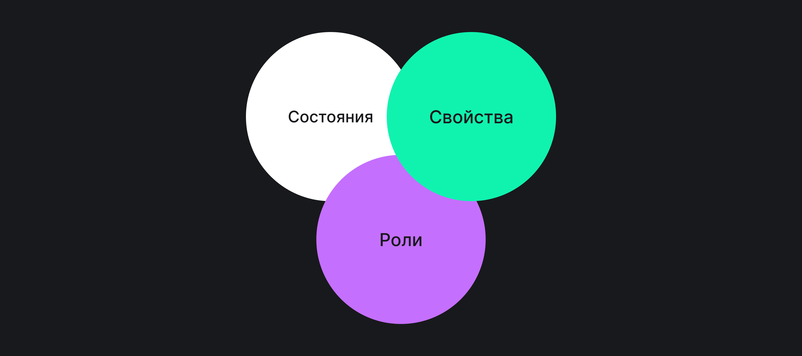

## Кратко

_ARIA (Accessible Rich Internet Applications)_ — это набор дополнительных атрибутов, которые расширяют возможности HTML, SVG и других языков для создания более [доступных интерфейсов](/a11y/chto-takoe-a11y/).

<aside>

💰 _RIA (Rich Internet Applications, Насыщенное интернет-приложение)_ — веб-приложение, которое загружается через интернет близко к десктопному приложению по опыту взаимодействия с ним.

</aside>

ARIA помогает повысить уровень доступности элементов или сделать статичную страницу динамическим веб-приложением для пользователей вспомогательных технологий. С помощью ARIA-разметки можно улучшить доступность интерактивных элементов, связать элементы друг с другом, указать в каком состоянии они находятся, отметить изменения на странице или описать структуру документа.

ARIA не влияет на внешний вид элементов и их поведение, а также не изменяет [DOM](/js/dom/). ARIA-атрибуты изменяют только то, как с элементами и страницами взаимодействуют браузеры, [Accessibility API](/html/screenreaders/#accessibility-api) и вспомогательные технологии.

## Кому помогает

Главные пользователи ARIA — это люди с визуальными, моторными и когнитивными особенностями, которые пользуются вспомогательными технологиями и настройками доступности в операционных системах или браузерах. Это могут быть:

- [Скринридеры](/html/screenreaders/).
- Дисплеи Брайля.
- Экранные лупы.
- Альтернативные устройства ввода и манипуляторы — выносные компьютерные кнопки, головные указатели, виртуальные клавиатуры.
- Голосовое управление и программы для преобразования текста в речь.

Пользователи вспомогательных технологий обычно пользуются для навигации клавиатурой.

## Как это понять

Внешний вид элементов не всегда совпадает с их функциями. К примеру, элемент в демо выглядит внешне как кнопка с текстом «Очистить форму».

<iframe title="Ненастоящая кнопка с <div>" src="demos/fake-button/" height="250"></iframe>

Для этого элемента используется семантически нейтральный тег [`<div>`](/html/div/). Поэтому для пользователей скринридеров это не кнопка, и они не могут сфокусироваться на элементе.

```html
<div class="button button-blue">Очистить форму</div>
```

В этой ситуации ARIA поможет превратить `<div>` в кнопку. Добавим ARIA-роль [`button`](/a11y/role-button/), а ещё поместим элемент в порядок фокуса с помощью HTML-атрибута `tabindex="0"`.

```html
<div class="button button-blue" role="button" tabindex="0">Очистить форму</div>
```

Теперь элемент доступен для скринридеров. Пользователи могут установить на нём фокус и узнать, что это кнопка с названием «Очистить форму».

Самое лучшее решение проблемы с доступностью этой кнопки — HTML-тег [`<button>`](/html/button/). Тогда не нужно добавлять к элементу дополнительные атрибуты и отслеживать клики с помощью скрипта. Это всё уже есть в теге по умолчанию. Звучит странно, но одно из главных правил использования ARIA — стараться не использовать ARIA.

```html
<button class="button button-blue">Очистить форму</button>
```

Более сложный пример — сообщение об успешности или неуспешности действия. Как рассказать пользователям вспомогательных технологий, что на странице что-то произошло? Например, что форма успешно очищена.

Тут снова ARIA спешит на помощь. Добавим для сообщения об успешной очистке формы [`role="status"`](/a11y/role-status/) и свяжем с ним кнопку с помощью атрибута [`aria-controls`](/a11y/aria-controls/). Благодаря этой ARIA-роли скринридер автоматически объявит сообщение, когда пользователь нажмёт на кнопку.

```html
<button class="button button-aqua" aria-controls="message">Очистить форму</button>
<div class="status-message" role="status" id="message"></div>
```

<iframe title="Кнопка с сообщением об успешной очистке формы" src="demos/status-message/" height="250"></iframe>

## Когда не нужно использовать

> Мастерство владения ARIA заключается не столько в том, как это использовать, а когда это не стоит использовать.
[ARIA Spec for the Uninitiated: Part 3](https://www.deque.com/blog/aria-spec-for-the-uninitiated-part-3/), Джерард Коэн.

ARIA вообще не нужна тогда, когда нам хватает возможностей HTML, SVG и других языков. Поэтому вместо `<div role="button">` лучше использовать `<button>`, а вместо [`<div role="main">`](/a11y/role-main/) — [`<main>`](/html/main/). У семантических HTML-элементов уже есть практически всё, что нужно для доступности. К примеру, в них встроены нужные роли и функциональность в случае интерактивных элементов.

<aside>

🎭 Роли бывают встроенными и явно заданными. Встроенные роли есть у большинства семантических HTML-тегов по умолчанию, а явно задать роль элементу можно как раз с помощью ARIA.

</aside>

Есть несколько ресурсов, которые помогут быстро узнать о встроенных ролях HTML-тегов:

- [HTML-элементы и доступные имена](https://russmaxdesign.github.io/html-elements-names/).
- [Периодическая таблица семантики](https://gerardkcohen.github.io/periodic-table-of-semantics.html).
- [Таблица с HTML-элементами, встроенными ролями и возможными атрибутами](https://www.w3.org/TR/html-aria/#docconformance) из спецификации [ARIA in HTML](https://www.w3.org/TR/html-aria/).

## Когда пригодится

ARIA пригодится во всех случаях, когда возможностей HTML недостаточно. То есть, когда нет элементов с нужными ролями, свойствами и состояниями. Дополнительные атрибуты понадобятся в нескольких ситуациях:

- Динамическое обновление контента. Например, таймеры, оповещения, подгружающиеся не сразу части страниц.
- Кастомные интерактивные элементы и улучшение навигации с клавиатуры, особенно когда используется JavaScript. Примеры — выпадающий список, вкладки, тултип или всплывающее окно.
- Добавление дополнительных ориентиров на страницу. Это такие части страницы, по которым могут быстро перемещаться пользователи вспомогательных технологий. Примеры — область вкладок или поиска.
- Исправление проблем с доступностью в браузерах и для вспомогательных технологий из-за разной поддержки фич из HTML, CSS и других языков.

## Как устроено

ARIA состоит из трёх частей — ролей, состояний и свойств.



_Роли_ — основные цели и функции элемента. Задаются через `role=""`.

Роли бывают разных типов. Одни могут отвечать за интерактивные элементы, к примеру, [`button`](/a11y/role-button/) и `tab`. Какие-то роли нужны для создания ориентиров на странице. Например, [`search`](/a11y/role-search/) и [`banner`](/a11y/role-banner/).

Есть роли для составных элементов, для которых нужны конкретные дочерние элементы. Например, у элемента с ролью `list` должен быть минимум один вложенный элемент с ролью `lisitem`. Это логично, ведь список делают списком пункты в нём.

_Состояния (states)_ — в каком состоянии находятся интерактивный или неинтерактивный элемент.

<aside>

🕹️ Интерактивный элемент — это элемент интерфейса, с которым можно взаимодействовать разными способами. К примеру, на таком элементе можно сделать фокус, ввести в него данные или совершить действие при нажатии или клике. К интерактивным элементам относятся кнопки, ссылки, поля, вкладки, выпадающие списки, тултипы и другие похожие контролы.

</aside>

_Свойства (properties)_ — дополнительные функции элемента.

Состояния и свойства похожи друг на друга и задаются через атрибут `aria-*=""`. Их часто объединяют и называют _ARIA-атрибутами_. Основная разница между ними в том, что значения атрибутов свойств часто не так сильно изменяются, как у атрибутов состояний. К примеру, значение свойства [`aria-label`](/a11y/aria-label/) изменяется реже, чем состояния [`aria-checked`](/a11y/aria-checked/).

ARIA-атрибуты тоже бывают разными. Какие-то атрибуты можно сочетать практически со всеми ролями элементов, например, [`aria-live`](/a11y/aria-live/) и `aria-label`. Какие-то подходят только для интерактивных элементов, например, [`aria-hidden`](/a11y/aria-hidden/) и [`aria-pressed`](/a11y/aria-pressed/). Есть атрибуты, которые обязательно нужны для определённых ролей. К примеру, у элемента с ролью `combobox` обязательно должно быть состояние [`aria-expanded`](/a11y/aria-expanded/).

Полные [список ролей](https://www.w3.org/TR/wai-aria-1.2/#role_definitions) и [список атрибутов](https://www.w3.org/TR/wai-aria-1.2/#state_prop_def) из спецификации ARIA 1.2.

## Правила использования

Есть пять основных правил использования ARIA.

### Не используйте ARIA

Не используйте ARIA, если можно использовать HTML-теги и атрибуты.

В большинстве случаев вместо ARIA-атрибутов можно использовать семантические HTML-теги.

```html
<!-- Неправильно ⛔ -->
<div role="banner">
  <div role="navigation"></div>
</div>

<!-- Правильно ✅ -->
<header>
  <nav></nav>
</header>
```

<aside>

📊 [Ежегодный отчёт WebAIM о доступности миллиона веб-страниц](https://webaim.org/projects/million/#aria) показывает, что на страницах с ARIA в среднем на 70% больше ошибок, чем на страницах без ARIA.

</aside>

### Не изменяйте семантику

Не изменяйте встроенную семантику элементов без серьёзной необходимости.

Когда используете ARIA-роли, встроенные роли HTML-тегов перезаписываются. Поэтому для кастомных элементов лучше использовать семантически нейтральные `<div>` и `<span>`, если это не исключительный случай.

```html
<!-- Неправильно ⛔ -->
<h2 role="tab">Я первая вкладка</h2>

<!-- Правильно ✅ -->
<div role="tab">
  <h2>Я первая вкладка</h2>
</div>
```

### Все интерактивные элементы доступны для клавиатуры

Роль — это обещание, что элемент будет вести себя в соответствии с ней. Если это интерактивный элемент, то он должен получать фокус с клавиатуры. К примеру, между вкладками принято перемещаться стрелками вправо и влево, а раскрывать нажатием на <kbd>Enter</kbd> или пробел.

Для того, чтобы сделать кастомный элемент интерактивным, используют HTML-атрибут `tabindex`. Старайтесь избегать положительных чисел в качестве значения атрибута и используйте его только там, где это действительно нужно. К примеру, зрячим пользователям клавиатуры не нужен фокус на параграфах, заголовках и похожем текстовом содержимом страницы.

```html
<!-- Неправильно ⛔ -->
<span role="button" tabindex="1">Загрузить фото</span>

<!-- Правильно ✅ -->
<span role="button" tabindex="0">Загрузить фото</span>
```

Подробнее про навигацию с клавиатуры для разных интерактивных элементов рассказано в [разделе про паттерны APG](https://www.w3.org/WAI/ARIA/apg/patterns/) (ARIA Authoring Practices Guide, Руководства по авторским ARIA-практикам).

### Будьте осторожны с `role="presentation"` и `aria-hidden="true"`

Не используйте [`role="presentation"`](/a11y/role-presentation-none/) и `aria-hidden="true"` на видимых элементах, которые находятся в порядке фокуса.

Роль `presentation` удаляет семантику элемента. Интерактивный элемент останется в порядке фокуса даже со сброшенной семантикой. В этом случае пользователи скринридеров смогут на нём сфокусироваться, но не узнают роль элемента.

Свойство `aria-hidden` скрывает элемент от скринридеров и других вспомогательных технологий, но не скрывает его визуально. Если используете этот ARIA-атрибут на неинтерактивном элементе с вложенным интерактивным, то вложенный элемент унаследует этот атрибут. Это тоже приведёт к проблемам с доступностью для вспомогательных устройств.

```html
<!-- Неправильно ⛔ -->
<button role="presentation">Передать привет</button>

<button aria-hidden="true">Передать привет</button>

<div aria-hidden="true">
  <button>Передать привет</button>
</div>

<!-- Правильно ✅ -->
<!--
  Описание картинки берётся из параграфа,
  а с параграфом связан <div> с ролью картинки
-->
<div role="img" aria-labelledby="caption">
  
  <p id="caption">Собака наклонила голову, прижала уши и смотрит с интересом прямо в камеру.</p>
</div>

<button>
  <span class="emoji" aria-hidden="true">👊</span>
  <span class="text">Передать привет</span>
</button>
```

### Интерактивным элементам нужны имена

У всех интерактивных элементов должны быть доступные имена. Они подробнее раскрывают цель элемента. Скринридеры объявляет их перед ролью.

Имена задаются двумя способами:

- с помощью HTML — текстовое содержимое тегов и атрибутов [`alt`](/html/img/#alt) и [`title`](/html/global-attrs/#title);
- с помощью ARIA-атрибутов `aria-label` и [`aria-labelledby`](/a11y/aria-labelledby/).

```html
<!-- Неправильно ⛔ -->
<button>
  
</button>

<!-- Правильно ✅ -->
<button>
  
</button>

<button aria-label="Твиттер">
  
</button>
```

### Дополнительные правила

- Не засоряйте разметку лишними ARIA-ролями и атрибутами.
- Всегда тестируйте элементы с ARIA в разных браузерах и с разными скринридерами.

## Спецификация

WAI-ARIA (Web Accessibility Initiative – Accessible Rich Internet Applications) — техническая спецификация, которая описывает как устроена и должна работать ARIA-разметка. Спецификация похожа на [ECMAscript](/js/language-versions/#chto-eshchyo-za-ecmascript). Она описывает, как надо реализовывать ARIA в браузерах и конкретных языках, которые называют хостовыми. К примеру, в вебе хостовые языки — это HTML и SVG.

У WAI-ARIA есть несколько версий.

- [WAI-ARIA 1.0](https://www.w3.org/TR/wai-aria/), 20 марта 2014.
- [WAI-ARIA 1.1](https://www.w3.org/TR/wai-aria-1.1/), 14 декабря 2017. Актуальные рекомендации.
- [WAI-ARIA 1.2](https://www.w3.org/TR/wai-aria-1.2/), 8 декабря 2021. Кандидат в рекомендации.
- [WAI-ARIA 1.3](https://w3c.github.io/aria/), 22 июля 2022. Черновик.

За обновлениями WAI-ARIA можно следить на [странице с новостями W3C](https://www.w3.org/WAI/news/).

### Связанные рекомендации

- [APG](https://www.w3.org/WAI/ARIA/apg/) — рекомендации на простом языке о том, как правильно использовать ARIA.
- [Using ARIA](https://www.w3.org/TR/using-aria/) — рекомендации, как делать более доступными HTML-элементы при помощи ARIA 1.1.

### Связанные спецификации

- [ARIA in HTML](https://www.w3.org/TR/html-aria/) — модуль спецификации о том, как использовать ARIA 1.1 в HTML и на что обращать внимание при тестировании.
- [Core Accessibility API Mappings 1.2](https://www.w3.org/TR/core-aam-1.2/) (CORE-AAM) — как user agent взаимодействуют с Accessibility API.
- [Accessible Name and Description: Computation and API Mappings 1.2](https://www.w3.org/TR/accname-1.2/) (ACCNAME-AAM) — как user agent определяют имена и описания элементов и передают их Accessibility API.
- [HTML Accessibility API Mappings 1.0](https://www.w3.org/TR/html-aam-1.0/) (HTML-AAM) — дополнения к спецификациям про HTML.
- [SVG Accessibility API Mappings 1.0](https://www.w3.org/TR/svg-aam-1.0/) (SVG-AAM) — дополнения к спецификациям про SVG.

## Поддержка и тестирование

Тема поддержки ARIA не самая простая. Дело в том, что в этом участвует несколько сторон — браузеры, Accessibility API и операционные системы, а также вспомогательные технологии. У них могут быть разные версии, баги и реализации фич ARIA.

Поддержка ARIA браузерами достаточно высокая — 98.7% в 2022 году, если верить [Can I Use](https://caniuse.com/wai-aria). Скринридеры сильно отличаются друг от друга и обычно у них разные подходы к реализации фич из ARIA.

Другая проблема — поддержка ARIA на мобильных устройствах. Многие ARIA-атрибуты привязаны к навигации с клавиатуры, поэтому не всегда хорошо поддерживаются на тач-устройствах.

Так что, ARIA познаётся при тестировании собственными силами и с реальными пользователями вспомогательных технологий.

Есть несколько сайтов, которые помогут заранее прикинуть уровень поддержки атрибутов ARIA:

- [Accessibility Support](http://a11ysupport.io/).
- [База WAI-ARIA от PowerMapper Software](https://www.powermapper.com/tests/screen-readers/aria/) с результатами тестирования со вспомогательными технологиями.

За багами из-за разной реализации ARIA в скринридерах и браузерах удобно следить по багтрекерам:

- [NVDA Bugs](https://github.com/nvaccess/nvda/issues?q=is%3Aissue+is%3Aopen/) — скринридер NVDA.
- [JAWS Bugs](https://github.com/FreedomScientific/VFO-standards-support/issues?q=is%3Aissue+is%3Aopen/) — скринридер JAWS.
- [iOS & macOS Bug Tracker](https://www.applevis.com/bugs/) — Safari и скринридер VoiceOver.
- [Open Radar](http://www.openradar.me/page/1) — macOS, iOS и VoiceOver.
- [Chromium Bug Tracker](https://bugs.chromium.org/p/chromium/issues/list?q=type%3DBug).
- [IssueTracker](https://issuetracker.google.com/) — Android и скринридер TalkBack.
- [Bugzilla](https://bugzilla.mozilla.org/) — Firefox.

Есть отдельный инструмент для поиска по GitHub-репозиториям — [Find accessibility stats by github repository](https://github-a11y-stats.netlify.app/).

Автоматические инструменты эффективны для поиска основных и очевидных проблем с ARIA и кодом в целом. Вот некоторые из них:

- [W3C HTML validator](https://validator.w3.org/nu/).
- [axe](https://www.deque.com/axe/) и [Lighthouse](https://developer.chrome.com/docs/lighthouse/overview/) в инструментах разработчиков Chrome.
- [IBM Equal Access Accessibility Checker](https://github.com/IBMa/equal-access/) — расширение, плагин и модуль для [Node.js](/tools/nodejs/).
- [WAI-ARIA usage bookmarklet](https://thepaciellogroup.github.io/WAI-ARIA-Usage/WAI-ARIA_usage.html) — букмарклет.
- [ANDI](https://www.ssa.gov/accessibility/andi/help/install.html) — ещё один букмарклет, который проверяет даже содержимое [`iframe`](/html/iframe/).

На сайте W3C найдёте [полный список инструментов для оценки доступности](https://www.w3.org/WAI/ER/tools/).

## Ссылки

- [WAI-ARIA Overview](https://www.w3.org/WAI/standards-guidelines/aria/), W3C.
- [WAI-ARIA basics](https://developer.mozilla.org/en-US/docs/Learn/Accessibility/WAI-ARIA_basics/), MDN.
- ARIA Spec for the Uninitiated — [часть 1](https://www.deque.com/blog/aria-spec-for-the-uninitiated-part-1/) ([перевод на русский язык](https://web-standards.ru/articles/five-rules-of-aria/)), [часть 2](https://www.deque.com/blog/aria-spec-for-the-uninitiated-part-2/) и [часть 3](https://www.deque.com/blog/aria-spec-for-the-uninitiated-part-3/), Джерард Коэн.
