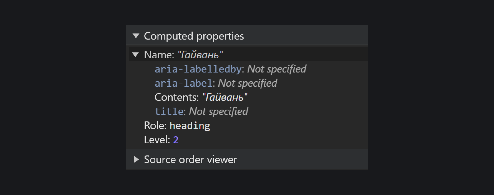
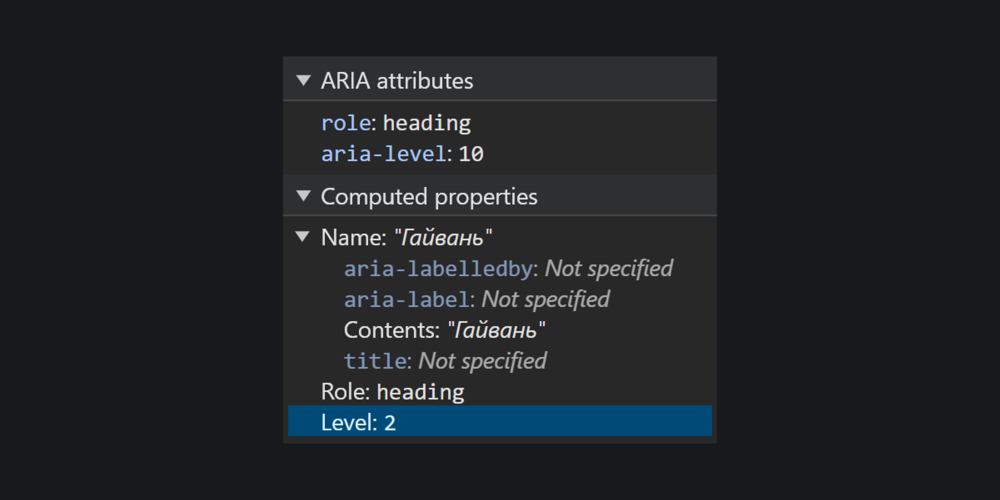
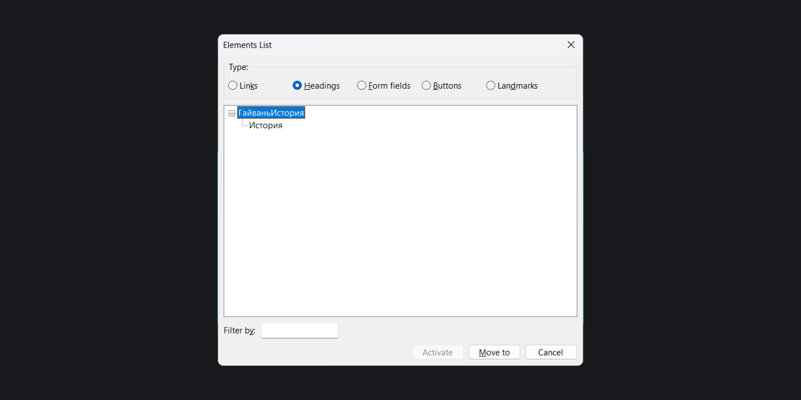

## Кратко

[Свойство виджета](/a11y/aria-attrs/#atributy-vidzhetov) из [WAI-ARIA](/a11y/aria-intro/#specifikaciya) для указания места элементов в их иерархии. Это важно для заголовков, древовидных и ассоциативных списков и других похожих элементов.

`aria-level` помогает браузерам и вспомогательным технологиям рассказать об уровнях элементов, когда не можете передать их иерархию с помощью чистого HTML.

## Пример

```html
<span
  role="heading"
  aria-level="1"
>
  Гайвань
</span>
<p>
  Традиционная китайская посуда для заваривания чая.
  Дословно переводится как «чаша с крышкой».
</p>
<p>
  Состоит из трёх частей: крышки, чаши и блюдца. В чашу кладут
  чайные листья для заварки. Крышка сохраняет тепло и усиливает
  аромат чая. Блюдце используют как подставку для чаши,
  чтобы было удобнее разливать заваренный чай по пиалам.
</p>
<p>
  Самые распространённые материалы, из которых делают
  гайвани, — фарфор и керамика.
</p>
```

<iframe title="Кастомный заголовок" src="demos/custom-heading/" height="500"></iframe>

[Скринридеры](/a11y/screenreaders/) прочтут код примерно так: «Гайвань, заголовок первого уровня».

## Как пишется

Добавьте к нужному элементу `aria-level` с положительным числом от `1` и больше. Например, `aria-level="3"`. Исключение — кастомные заголовки [с ролью `heading`](/a11y/role-heading/). Их максимальный уровень не может быть выше `6`.

`aria-level` можно использовать для элементов со следующими явными [ARIA-ролями](/a11y/aria-roles/):

- `heading` (по умолчанию есть у [`<h1>`–`<h6>`](/html/h1-h6/)).
- [`row`](/a11y/role-row/) (уже встроена в [`<tr>`](/html/tables/#tr)).
- [`treeitem`](/a11y/role-listitem/).
- [`associationlistitemkey`](/a11y/role-associationlistitemkey/) (есть у [`<dt>`](/html/dl-dd-dt/)).
- [`comment`](/a11y/role-comment/).

Чем ниже элемент в иерархии или глубже вложен в другие, тем выше его уровень. Обычно во вложенных элементах уровень первого элемента, родителя, не указывают. Отсчёт начинается с первого вложенного элемента — ребёнка.

Пример со вложенными элементами.

```html
<!-- Нерабочий код ❌-->

<div>
  Первый уровень

  <span aria-level="2">
    Второй уровень
  </span>

  <span aria-level="2">
    Второй уровень

    <span aria-level="3">
      Третий уровень

      <span aria-level="4">
        Четвёртый уровень
      </span>

      <span aria-level="4">
        Четвёртый уровень
      </span>
    </span>
  </span>
</div>
```

Пример с отдельными элементами, когда важно показать их иерархию.

```html
<!-- Нерабочий код ❌-->

<span aria-level="1">
  Первый уровень
</span>

<span aria-level="2">
  Второй уровень
</span>

<span aria-level="3">
  Третий уровень
</span>

<span aria-level="4">
  Четвёртый уровень
</span>

<span aria-level="2">
  Второй уровень
</span>

<span aria-level="3">
  Третий уровень
</span>
```

### Заголовки

Используйте для заголовков теги `<h1>`–`<h6>`. У них по умолчанию есть свойство `aria-level`. Когда по **крайне** важной причине верстаете кастомные заголовки, учитывайте несколько особенностей поведения `aria-level`.

Заголовок с ролью `heading` без `aria-level` автоматически получает второй уровень.

```html
<span
  role="heading"
>
  Гайвань
</span>
```

<iframe title="Кастомный заголовок без уровня" src="demos/custom-heading-without-lvl/" height="280"></iframe>

Проверим в инструменте разработчика в Chrome. Браузер вычисляет второй уровень в строке со свойством «Level».



Пытливые умы могут добавить заголовок выше шестого уровня, чтобы перехитрить браузеры. Будьте готовы к тому, что эксперимент закончится неудачей. Например, здесь пытаемся убедить браузер в существовании заголовка десятого уровня:

```html
<!-- Не делайте так ❌-->

<span
  role="heading"
  aria-level="10"
>
  Гайвань
</span>
```

<iframe title="Кастомный заголовок 10 уровня" src="demos/custom-heading-with-10-lvl/" height="280"></iframe>

Некоторые старые браузеры понимали значения до `9`. Новые браузеры всегда вычисляют `2`, когда уровень `heading` выше шестого. Так что десятый уровень `aria-level` из примера станет вторым.



Лучше не вкладывать заголовки друг в друга, чтобы сверстать подзаголовки. Ради интереса попробуем вложить в один заголовок с `aria-level="1"` другой с `aria-level="2"`.

```html
<!-- Не делайте так ❌-->

<span
  role="heading"
  aria-level="1"
>
  Гайвань
  <span
    role="heading"
    aria-level="2"
  >
    История
  </span>
</span>
```

<iframe title="Вложенные кастомные заголовки" src="demos/nested-headings/" height="350"></iframe>

Браузеры решат, что это два отдельных заголовка первого и второго уровня.

Скринридеры вообще запутаются. Например, NVDA скажет: «Гайвань, заголовок первого уровня. История, заголовок первого уровня, заголовок второго уровня». В списке всех заголовков страницы будет правильная иерархия, но повторятся названия вложенных. Получается, что название заголовка первого уровня — «ГайваньИстория», а второго — «История».



### Древовидные списки

Тип списков, в которых видна иерархия элементов. Они часто встречаются в файловых системах, где видны папки и как они вложены.

Самому списку задают роль [`tree`](/a11y/role-tree/), а его пунктам — `treeitem` с нужным значением `aria-level`.

Допустим, у нас есть основная (корневая) папка «Мои файлы» с двумя вложенными «Всякое» и «Разное». Внутри «Всякое» есть текстовые файлы и ещё одна папка «Черновики». Папки «Всякое» и «Разное» напрямую вложены в основную, так что они первого уровня `aria-level="1"`. Файлы и папки внутри первого уровня станут второго `aria-level="2"`. В папке второго уровня «Черновики» находятся файлы третьего уровня `aria-level="3"`.

```html
<h3 id="label">
  Мои файлы
</h3>
<!-- Основная папка -->
<ul
  role="tree"
  aria-labelledby="label"
>
  <!-- Вложенная папка № 1 -->
  <li
    role="treeitem"
    aria-level="1"
    aria-expanded="false"
    aria-selected="false"
  >
    <span>
      Всякое
    </span>
    <!-- Файлы папки № 1 -->
    <ul role="group">
      <li
        role="treeitem"
        aria-level="2"
        aria-selected="false"
      >
        final-report.docx
      </li>
      <!-- Папка, вложенная в папку № 1 -->
      <li
        role="treeitem"
        aria-level="2"
        aria-selected="false"
      >
        <span>
          Черновики
        </span>
      </li>
        <!-- Файлы вложенной папки -->
        <ul role="group">
          <li
            role="treeitem"
            aria-level="3"
            aria-selected="false"
          >
            final-report-draft.docx
          </li>
        </ul>
      </li>
    </ul>
  </li>

  <!-- Вложенная папка № 2 -->
  <li
    role="treeitem"
    aria-level="1"
    aria-expanded="false"
    aria-selected="false"
  >
    <span>
      Разное
    </span>
    <!-- Файлы папки № 2 -->
    <ul role="group">
      <li
        role="treeitem"
        aria-level="2"
        aria-expanded="false"
        aria-selected="false"
      >
        <span>
          file-1.docx
        </span>
      </li>
      <!-- Другие элементы -->
    </ul>
  </li>
</ul>
```

### Древовидные сетки

Древовидная сетка похожа на таблицу, которая состоит из нескольких раскрывающихся ячеек. Данные внутри ячеек расположены в определённой иерархии. Вы могли видеть такие сетки в почтовых клиентах. В них важно показать связь писем между собой.

Сетке задают роль [`treegrid`](/a11y/role-treegrid/), а в строках `row` уже группируют ячейки [`gridcell`](/a11y/role-gridcell/).

В древовидных сетках `aria-level` может быть только у строк с ролью `row`. Предположим, мы хотим показать цепочку их трёх писем. У первого письма в ней будет первый уровень `aria-level="1"`, у ответа на него — второй `aria-level="2"`, а у ответа на ответ — третий `aria-level="3"`.

```html
<h3 id="label">
  Полученные письма
</h3>
<table
  role="treegrid"
  aria-labelledby="label"
>

  <colgroup>
    <col id="col-1">
    <col id="col-2">
    <col id="col-3">
  </colgroup>

  <thead>
    <tr>
      <th scope="col">
        Тема
      </th>
      <th scope="col">
        Содержимое
      </th>
      <th scope="col">
        Адрес
      </th>
    </tr>
  </thead>

  <tbody>
    <!-- Первое письмо -->
    <tr
      role="row"
      aria-level="1"
      aria-expanded="true"
    >
      <td role="gridcell">
        Продам картофель
      </td>
      <td role="gridcell">
        Дорого. Медленно. Некачественно.
      </td>
      <td role="gridcell">
        <a href="mailto:potato@potatomail.mail">
          potato@potatomail.mail
        </a>
      </td>
    </tr>

    <!-- Ответ на первое письмо -->
    <tr
      role="row"
      aria-level="2"
    >
      <td role="gridcell">
        re: Продам картофель
      </td>
      <td role="gridcell">
        У меня свой картошки полно.
      </td>
      <td role="gridcell">
        <a href="mailto:potato2@potatomail.mail">
          potato2@potatomail.mail
        </a>
      </td>
    </tr>

    <!-- Ответ на предыдущее письмо -->
    <tr
      role="row"
      aria-level="3"
    >
      <td role="gridcell">
        re: Продам картофель
      </td>
      <td role="gridcell">
        Если у тебя много картошки, отдай тогда мне.
      </td>
      <td role="gridcell">
        <a href="mailto:potato3@potatomail.mail">
          potato3@potatomail.mail
        </a>
      </td>
    </tr>
  </tbody>
</table>
```

### Комментарии

На многих социальных платформах можно отвечать на другие комментарии. Визуально это выглядит как вложенные в друг друга блоки с именем пользователя, временем публикации и текстом комментария. Один из способов передать это на уровне кода — `aria-level`.

К примеру, первый пользователь отреагировал на пост в соцсети, другой оставил комментарий к нему, а третий — ответил на комментарий второго. Получается, первый комментарий с ролью `comment` будет без `aria-level`, второй — с `aria-level="1"`, а третий — с `aria-level="2"`.

<aside>

⚠️ `comment` — новая роль для комментариев из черновика [спецификации WAI-ARIA 1.3](https://www.w3.org/TR/wai-aria-1.3/). Сейчас лучше не использовать код из примера на практике.

</aside>

```html
<!-- Изначальный комментарий -->
<div
  role="comment"
>
  <h3>А я — томат</h3>
  <time datetime="2024-01-03T14:04">
    3 дня назад
  </time>
  <p>
    Люблю окрошку на квасе 🥰
  </p>

  <!-- Комментарий в ответ на первый -->
  <div
    role="comment"
    aria-level="1"
  >
    <h3>Сырная косичка</h3>
    <time datetime="2024-01-04T23:11">
      2 дня назад
    </time>
    <p>
      Окрошка на кефире лучшая!
    </p>

    <!-- Комментарий в ответ на второй -->
    <div
      role="comment"
      aria-level="2"
    >
      <h3>Картошка фри</h3>
      <time datetime="2024-01-05T10:34">
        1 день назад
      </time>
      <p>
        Фу, окрошка 🤢 А вот картошка…
      </p>
    </div>
  </div>
</div>
```
