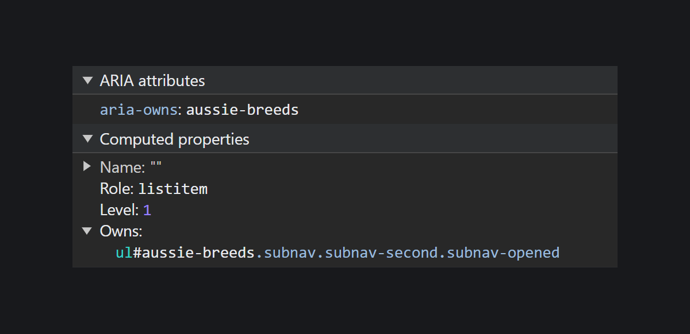

## Кратко

[Свойство связи](/a11y/aria-attrs/#atributy-svyazi) из [WAI-ARIA](/a11y/aria-intro/#specifikaciya). Указывает на то, что элемент связан с другим как родитель и ребёнок визуально, функционально или в контексте одной страницы, но это не отражено в [DOM](/js/dom/).

Иногда внешний вид страницы отличается от разметки. К примеру, выпадающее подменю в сложном меню может находиться в коде на одном уровне с кнопкой, но не находиться в одном контейнере с ней. При этом в интерфейсе они визуально расположены рядом.

`aria-owns` искусственно создаёт отношения как у родителя и ребёнка в [дереве доступности](/a11y/screenreaders/#derevo-dostupnosti). Атрибут не изменяет внешний вид элементов их расположение в HTML-коде.

<aside>

⚠️ [VoiceOver пока не поддерживает `aria-owns`](https://a11ysupport.io/tech/aria/aria-owns_attribute) на macOS и в iOS.

</aside>

Не используйте `aria-owns`, когда элементы уже расположены в HTML в нужном порядке. Также не изменяйте так уже существующую правильную иерархию элементов. `aria-owns` не замена логической структуры DOM.

## Пример

```html
<input
  type="text"
  role="combobox"
  aria-label="Любимое животное"
  aria-autocomplete="list"
  aria-expanded="true"
  aria-owns="owned-listbox"
>

<ul
  role="listbox"
  id="owned-listbox"
>
  <li role="option">Опоссум</li>
  <li role="option">Капибара</li>
</ul>
```

## Как пишется

Задайте тегу `aria-owns` со значением в виде строки текста и добавьте к нужному дочернему элементу `id` с таким же значением. ID должны быть уникальными и не повторяться.

Через `aria-owns` дочерний элемент связывают только с одним родителем, а вот у родителя может быть несколько детей. Когда в `aria-owns` несколько ID, разделите и пробелом и перечислите в том же порядке, в котором визуально расположены нужные элементы.

Представим, что элемент с классом `.third-child` расположен после `.first-child` с помощью [свойства `order`](/css/order/):

```html
<div
  class="parent"
  aria-owns="child-1 child-3 child-2"
>
</div>

<span
  class="first-child"
  id="child-1"
>
  Первый ребёнок 🐶
</span>

<span
  class="second-child"
  id="child-2"
>
  Второй ребёнок 🐱
</span>

<span
  class="third-child"
  id="child-3"
>
  Третий ребёнок 🐢
</span>
```

Когда у родителя есть несколько детей, одни из которых вложены внутрь, а другие связаны с помощью `aria-owns`, [скринридер](/a11y/screenreaders/) сначала найдёт вложенный элемент, а потом связанный ARIA-атрибутом.

Хотя это глобальный атрибут и его можно использовать для всех тегов и [ARIA-ролей](/a11y/aria-roles/), дочерние и родительские элементы не должны быть скрыты от вспомогательных технологий с помощью [`aria-hidden="true"`](/a11y/aria-hidden/) и других способов. Конечно, если не переключаете их видимость с помощью JavaScript.

Также лучше не добавлять `aria-owns` к [`<area>`](/html/area/), [`<option>`](/html/option/), [`<optgroup>`](/html/optgroup/) и тегам, в которые нельзя вкладывать другие элементы. Например, [`<br>`](/html/br/), [`<textarea>`](/html/textarea/) или в элемент с [`ролью scrollbar`](/a11y/role-scrollbar/).

Подходящие ситуации для `aria-owns`:

- кнопки, которые управляют элементами из других компонентов;
- сложная структура страниц, когда из-за CSS-стилей или скриптов не получается вложить элементы в друг друга на уровне HTML;
- когда нет полного доступа к HTML из-за микросервисов или системы управления контентом, но нужно сделать разметку доступной для скринридеров.

Конкретные примеры компонентов — попап с подменю у меню или у поля для выбора даты, вкладки, древовидные списки и сетки. Если никак не обойтись без `order` и для улучшения доступности разметки используете `aria-owns`, не забудьте про логичный порядок фокуса с клавиатуры.

Разберём как работает `aria-owns` на примере. На странице есть два списка ссылок, которые появляются при клике по кнопке:

```html
<ul>
  <li>Ирландия</li>
  <li>Австралия</li>
</ul>

<ul>
  <li>Австралийская овчарка</li>
  <li>Австралийская пастушья собака</li>
</ul>
```

Мы хотим вложить второй список с породами собак в первый. Лучше всего изменить разметку, но представим, что не можем это сделать. Добавим `aria-owns` к пункту списка «Австралия», а `id` — к целому списку с австралийскими породами собак.

```html
<ul>
  <li>Ирландия</li>
  <li aria-owns="aussie-breeds">
    Австралия
  </li>
</ul>

<ul id="aussie-breeds">
  <li>Австралийская овчарка</li>
  <li>Австралийская пастушья собака</li>
</ul>
```

Для скринридеров этот код будет выглядеть так:

```html
<ul>
  <li>Ирландия</li>
  <li>
    Австралия
    <ul>
      <li>Австралийская овчарка</li>
      <li>Австралийская пастушья собака</li>
    </ul>
  </li>
</ul>
```

В инструменте разработчика в Chrome у пункта списка с [ролью `listitem`](/a11y/role-listitem/) есть атрибут `aria-owns`, который связывает с ним [`<ul>`](/html/ul/) с `id="aussie-breeds"`.



<iframe title="Раскрывающееся меню" src="demos/nav-with-subnavs/" height="330"></iframe>

Если пользователь нажал на стрелку вниз, скринридер расскажет о втором списке примерно так: «Элемент включён как дочерний в правильном порядке». Обратите внимание, что некоторые скринридеры не рассказывают о связи элементов с `aria-owns`, когда переключаете видимость детей.

## Как понять

Одна из ключевых концепций в HTML — родительские, дочерние и соседние элементы. В коде родительский элемент — это тот, в который вложены другие. Получается, что родителю принадлежат какие-то дети, и все они живут в узлах. Эти отношения напоминают дерево и лежат в основе DOM (Document Object Model или объектной модели документа).

Для вспомогательных технологий `aria-owns` означает, что это родительский элемент, а связанный с ним с помощью `id` — дочерний.

## Подсказки

💡 [`aria-controls`](/a11y/aria-controls/) тоже устанавливает связь между элементами, но в случае управляющего и управляемого элементов. Например, выпадающий список в бургерном меню.

💡 Другой атрибут связи [`aria-arctivedescendant`](/a11y/aria-activedescendant/) обозначает текущий элемент внутри сложного интерактивного компонента. Например, выбранный пункт в выпадающем списке.
