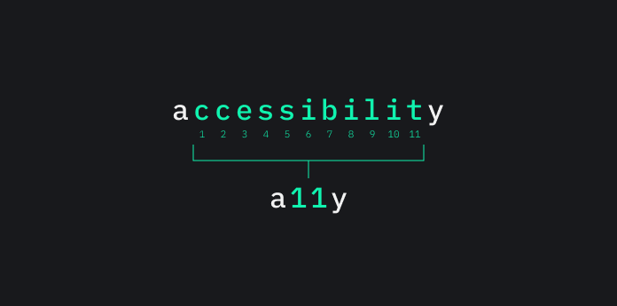
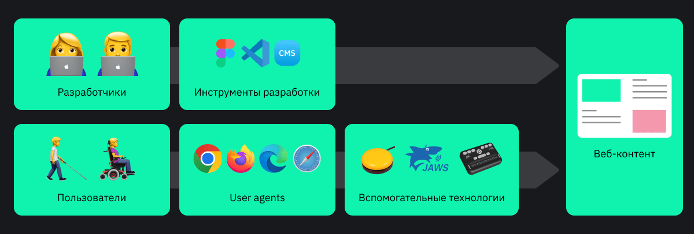

## Кратко

Одна из характеристик современного сайта — доступность (accessibility). Это означает, что сайтом могут без проблем пользоваться люди с инвалидностью.

В этой статье разберёмся с определениями доступности и связанных терминов, а также из чего состоит доступность в вебе, почему она важна и кому помогает, с какими трудностями сталкивается, какими инструментами достигается и какие законы её регулируют.

## Доступность в общем

### Определение

_Доступность_ — это процесс создания среды, продуктов и услуг, которыми могут пользоваться люди с инвалидностью. Иногда доступность определяют как степень, с которой что-то доступно для человека.

Вместо длинного слова «доступность» используют акроним «a11y». В нём зашифровано исходное слово «accessibility». Оно начинается с a, заканчивается на y, а между первой и последней буквами находится ещё 11 других. Читается просто — «а́лли» («ally») или «эй-элевен-уай» («a-eleven-y»).

Некоторые трактуют доступность широко и говорят, что она помогает всем людям. Это правда, особенно если человек столкнулся со временными трудностями или с ситуативными ограничениями. К примеру:

- сломал руку или ногу, заболел, забыл дома очки;
- находится в шумном и жарком месте, ведёт машину;
- пользуется устройствами с плохим интернет-соединением, чёрно-белым экраном или старой операционной системой.

Феномен, когда все люди могут пользоваться тем, что изначально создавалось только для людей с инвалидностью, называется эффектом скошенного тротуара (curb cut effect). Примеры — пандусы, скошенные тротуары, субтитры и автозаполнение полей форм на сайтах.

Однако сделать продукт или среду доступными для всех — не главная цель доступности. Это полезный побочный эффект, который делает этот подход более универсальным.

Разберёмся с тем, что такое инвалидность и связанные с ней понятия в контексте доступности. Инвалидность определяется по-разному в зависимости от подхода к её трактовке. Эти подходы называют ещё _моделями инвалидности_. К примеру, есть медицинская, социальная и экономическая модели.

В контексте доступности чаще всего используется социальный подход. С его точки зрения _инвалидность (disability)_ — это потеря или ограничения в возможности людей с определёнными медицинскими диагнозами участвовать в жизни общества наравне с другими из-за барьеров. Таким образом, инвалидность возникает при столкновении людей с разными барьерами, которые создало общество.

У слова «инвалидность» есть несколько синонимов. Это более нейтральные «особые потребности», «специальные потребности» и «особенности». Другие синонимы могут показаться кому-то негативными — это «ограниченные физические возможности», «ограниченные возможности здоровья» и «ограничения жизнедеятельности».

<aside>

🤔 В русском языке нет точного перевода «disability». В английском это слово означает не только медицинский диагноз и юридический статус, но и самоопределение человека, его принадлежность к определённой культуре и сообществу.

</aside>

_Барьер_ — это препятствие, которое мешает человеку с инвалидностью использовать среду, продукты и услуги. Есть много типов барьеров — физические, системные, технологические, информационные и так далее. Например, наземный переход без лифта, один способ связи без альтернатив, банкоматы только с сенсорной клавиатурой или фильмы без субтитров.

Доступностью занимаются специалисты из градостроительства, дизайна устройств и одежды, транспорта и прочих подобных сфер.

Адаптивный игровой контроллер, лифт для инвалидной коляски, кнопка с Брайлем, адаптивные шорты и тушь для ресниц с кольцом для пальца.

### Связанные концепции

Доступность тесно связана с другими концепциями создания продуктов и услуг — универсальным и инклюзивным дизайном, а также юзабилити.

_Универсальный дизайн_ сосредоточен на создании одинакового опыта для максимального количества людей. Это могут быть люди с инвалидностью, с разной комплекцией, ростом, различным навыками и т. д. Цель универсального дизайна — одно решение для всех. Например, автоматическая дверь или траволатор.

Универсальный дизайн сильно повлиял на доступность, поэтому некоторые объединяют их. Однако для доступности в первую очередь важен опыт людей с инвалидностью, в отличие от универсального дизайна.

_Инклюзивный дизайн_ интересует разнообразие людей. На основе этого разнообразия создаётся одно или несколько решений. Например, для инклюзивного дизайна важны раса, пол, гендер, уровень образования, возраст, язык, культурная принадлежность или инвалидность. То есть, инклюзивный дизайн охватывает больше групп людей, чем доступность. Несмотря на это, доступность в каких-то случаях приравнивают к инклюзивному дизайну или считают направлением инклюзивного дизайна.

_Юзабилити_ — степень эффективности, результативности продукта и удовлетворённости от него. Методы для улучшения юзабилити чем-то похожи на методы из доступности, но у них разные цели. В юзабилити-исследованиях часто не изучают потребности людей с инвалидностью, а цели юзабилити не достигаются в рамках доступности.

## Веб-доступность

_Веб-доступность (web accessibility)_ — создание сайтов, веб-приложений и связанных с вебом инструментов и технологий, которыми могут пользоваться люди с инвалидностью.

<aside>

🗣️ Обычно веб-доступность называют просто доступностью. Обычно из контекста понятно, что она связана с вебом.

</aside>

Доступный веб-интерфейс означает, что пользователи без проблем его понимают, воспринимают, перемещаются и взаимодействуют с ним.

Кроме веб-доступности есть ещё _цифровая доступность (digital accessibility)_. Она шире и затрагивает любые цифровые продукты — мобильные приложения, компьютерные игры, электронные документы, операционные системы и т. д.

Идея веб-доступности следует из фундаментального принципа веба, который сформулировал Консорциум Всемирной Паутины (World Wide Web Consortium, W3C).

> Веб создан для всех людей вне зависимости от их устройств, программного обеспечения, языка, местоположения или возможностей.

Веб-доступность охватывает весь процесс разработки. Это код, UI- и UX-дизайн, тесты, аудит, тексты и другой контент, а также организация всего процесса разработки. Поэтому рекомендации, требования и практики по веб-доступности могут быть:

- техническими — написание кода и тестирование;
- дизайнерскими — внешний вид сайтов, удобство их использования, удовольствие от взаимодействия;
- контентными — написание текстов, создание графики, видео и пр.;
- аудиторскими — проведение аудитов доступности;
- организационными и правовыми — законодательство, политика компании, организация внутренних процессов.

Часть рекомендаций и практик относится только к веб-доступности, другая часть универсальная и заимствована из других направлений разработки и дизайна. Например, ARIA-разметка — специфическая практика веб-доступности, а метод персон или простые тексты — универсальные.

## Зачем заниматься веб-доступностью

Веб-доступность важна по нескольким причинам:

1. Правовая — во многих странах веб-доступность регулируется законами, за нарушение которых накладываются штрафы.
1. Репутационная — забота о пользователях повышает доверие к компании и помогает стать конкурентоспособнее.
1. Этическая — каждый человек должен иметь возможность зайти на сайт.
1. Расширение охвата пользователей — аудитория сайта увеличивается благодаря людям с инвалидностью, их близким и друзьям, а также из-за повышения в поисковой выдаче.
1. Материальная — чем больше пользователей, тем больше зарабатывает компания.
1. Инновационная — доступные фичи делают продукты более инновационными и улучшают пользовательский опыт большого числа пользователей.

## Компоненты веб-доступности

Веб-доступность состоит из нескольких частей:

- User agents — браузеры, плагины, почтовые клиенты и т. п.
- Вспомогательные технологии — [скринридеры](/html/screenreaders/), экранные лупы, голосовые помощники.
- Веб-контент — дизайн, код и само наполнение сайтов и веб-приложений.
- Инструменты разработки — редакторы кода или графики, системы управления контентом (CMS), расширения для тестирования и др.
- Люди — кто создаёт сайты и кто пользуется ими.

Компоненты зависят друг от друга. Когда один компонент недоступен, это может повлиять на общий уровень доступности. Например, если HTML-тег реализован в браузере с ошибками, то скринридеры не смогут его правильно объявить. Чтобы это исправить, разработчикам придётся написать кастомный элемент.

## Принципы

Веб-доступность опирается на четыре принципа. Они описывают, какими должны быть веб-интерфейсы и их отдельные элементы и контент.

1. Воспринимаемость (Perceivable) — интерфейс можно воспринимать разными органами чувств, например, глазами, ушами и кожей.
1. Управляемость (Operable) — с интерфейсом можно взаимодействовать разными способами, к примеру, с помощью клавиатуры или голосом.
1. Понятность (Understandable) — интерфейс и контент легко понять, ясно как взаимодействовать с интерактивными элементами.
1. Устойчивость (Robust) — интерфейс соответствует техническим спецификациям и работает на разных устройствах, в разных браузерах и с разными вспомогательными технологиями.

Принципы сокращённо называют POUR по их первым буквам.

На этих же принципах основан важный документ о веб-доступности — [WCAG](https://www.w3.org/WAI/standards-guidelines/wcag/) (Web Content Accessibility Guidelines, Руководства по обеспечению доступности веб-контента).

## Пользователи веб-доступности

У пользователей с инвалидностью разные потребности. Они зависят от того, как люди воспринимают окружающий мир и взаимодействуют с ним. Веб-доступность концентрируется на пользователях со следующими особенностями:

- физическими или моторными — скелет, мышцы и конечности;
- неврологическими — нервная система;
- когнитивными — восприятие, познание и понимание;
- визуальными или зрительными — зрение;
- аудиальными — слух;
- речевыми — речевой аппарат.

Потребности отличаются не только между разными группами, но и внутри одной группы. Например, людям с цветовой слепотой (дальтонизмом) важна цветовая схема сайта и уровень контраста, а людям со слепотой — правильная HTML-разметка.

Пользователи с инвалидностью часто имеют не один медицинский диагноз. Например, у человека со слепотой может быть тревожное расстройство, а человек с врождённой глухотой может неразборчиво говорить.

Как и у доступности в целом, аудитория веб-доступности шире пользователей с инвалидностью. Доступный для кого-то интерфейс доступен для всех остальных. Людям с пониженным зрением будет проще прочитать крупный текст с большим межстрочным интервалом. Человек со сломанной мышкой без проблем закажет её на сайте с поддержкой клавиатуры.

### Пользовательские техники и инструменты

На веб-доступность также влияет, как и с помощью чего пользователи взаимодействуют с интерфейсами из-за своих потребностей. Пользовательские техники и инструменты делятся на несколько групп на основе задействованных технологий:

- Возможности браузеров — встроенные и расширенные с помощью браузерных расширений.
- Возможности операционных систем — высококонтрастные темы, выключение анимации и т. д.
- Вспомогательные технологии.

Стоит учитывать пользовательские техники и инструменты при разработке доступного сайта. Тестирование со скринридерами найдёт проблемы с кодом и улучшит опыт их пользователей. Проработанный адаптивный дизайн и тестирование сайтов при увеличении в 200% помогут пользователям экранных луп. Продуманные стили для анимации с директивой [`@media`](/css/media/) и проверкой значения `prefers-reduced-motion` помогут пользователям, которые отключили анимацию в операционной системе.

### Барьеры в вебе

Барьеры в вебе можно разделить на несколько типов. Одни влияют на прямой доступ к контенту сайтов, когда люди не пользуются специальными технологиями и техниками. Другие барьеры непрямые. В их случае проблемы возникают уже у пользователей вспомогательных технологий.

Также барьеры бывают техническими и связанными с кодом, когнитивными на уровне контента или существуют на уровне дизайна.

На барьеры влияют и потребности пользователей. К примеру, плохая поддержка клавиатуры или небольшая область клика — барьеры для пользователей с моторными особенностями. Высокая контрастность или анимация с красными вспышками мешают пользователям с неврологическими особенностями.

<aside>

💥 _Красная вспышка (red flash)_ — пара противоположных переходов, между которыми есть насыщенный красный цвет.

</aside>

Для пользователей с когнитивными особенностями барьеры — это поля без лейблов и сложные тексты без картинок. Элементы без текстовых альтернатив и невозможность увеличить интерфейс — барьеры для пользователей со зрительными особенностями, а отсутствие субтитров в видео — барьер для людей с аудиальными особенностями. Наконец, для людей с речевыми особенностями барьер — обратная связь только в виде звонка.

## Спецификации и стандарты

Стандартизацией веб-доступности занимается W3C и отдельная рабочая группа [W3C WAI](https://www.w3.org/WAI/about/) (W3C Web Accessibility Initiative — Инициатива по веб-доступности W3C). Есть две категории документов о веб-доступности:

- технические спецификации и стандарты;
- руководства и рекомендации.

Есть технические спецификации и стандарты, которые связаны с обычными веб-технологиями и языками. Например, спецификации [HTML](https://html.spec.whatwg.org/), [CSS](https://www.w3.org/Style/CSS/#specs), [SVG](https://www.w3.org/Graphics/SVG/) и стандарт [ECMAScript](https://www.ecma-international.org/publications-and-standards/standards/ecma-262/).

Другие спецификации и стандарты касаются только веб-доступности. К примеру, [WAI-ARIA](https://www.w3.org/WAI/standards-guidelines/aria/) (Web Accessibility Initiative – Accessible Rich Internet Applications). В спецификации описана дополнительная разметка для вспомогательных технологий.

Руководства и рекомендации также касаются только доступных практик, например:

- [WCAG](https://www.w3.org/WAI/standards-guidelines/wcag/) — руководства по доступности веб-контента.
- [ATAG](https://www.w3.org/WAI/standards-guidelines/atag/) (Authoring Tool Accessibility Guidelines, Руководства по доступности средств разработки) — рекомендации по созданию доступных инструментов для разработки.
- [UAAG](https://www.w3.org/WAI/standards-guidelines/uaag/) (User Agent Accessibility Guidelines, Руководства по доступности User agent) — рекомендации для тех, кто занимается браузерами и похожими технологиями.

## Инструменты

Инструменты для создания доступных сайтов могут быть универсальными и специфичными. Первая группа включает инструменты, которые подходят для всей команды. Это WCAG, другие рекомендации W3C WAI по созданию доступных интерфейсов и контента, документации по доступности разных компаний, данные об исследованиях пользователей, аудит и лучшие практики.

Во вторую группу входят инструменты для отдельных специалистов — дизайнеров, создателей контента, разработчиков, тестировщиков и менеджеров.

### Инструменты разработчиков и тестировщиков

- HTML, CSS, SVG, JavaScript и другие языки и технологии, особенно важна семантическая вёрстка.
- [ARIA-разметка](/a11y/aria-intro/), когда не хватает возможностей HTML.
- Библиотеки с доступными компонентами.
- Автоматические тесты — свои тесты или библиотеки для тестирования.
- Валидаторы кода.
- Браузерные расширения и инструменты разработчиков, букмарклеты, веб-сервисы.
- Ручное тестирование со вспомогательными технологиями и пользователями.

<aside>

🔖 _Букмарклет_ — небольшой скрипт, который сохраняется как закладка в браузере.

</aside>

### Инструменты дизайнеров

- Плагины для графических редакторов — проверка контраста, добавление подписей к элементам и пр.
- Сервисы — генераторы палитр цветов, визуализация порядка фокуса и т. д.
- Браузерные расширения — расчёт уровня контраста, имитация цветовой слепоты и др.
- Готовые доступные дизайн-системы и библиотеки компонентов.
- UX-дизайн и исследования — юзабилити-тестирование, метод персон, интервью и т. п.

### Инструменты создателей контента

Создатели контента — это контент-менеджеры, копирайтеры, редакторы, коммуникационные дизайнеры.

- Текстовые редакторы и веб-сервисы с проверкой орфографии, грамматики и сложности предложений.
- Программы и сервисы для создания субтитров.
- Программы для проверки вспышек и миганий в видео и анимации.
- Плагины в графических редакторах — проверка уровня контраста, имитация цветовой слепоты и пр.

### Инструменты менеджеров

- Обучение сотрудников веб-доступности — митапы, воркшопы, курсы, консультации и др.
- Матрица компетенций сотрудников.
- Модели зрелости доступности.
- Политика компании по веб-доступности.

## Законы о веб-доступности

Во многих странах приняты законы и стандарты о доступности сайтов и цифровых продуктов, например, мобильных приложений и десктопных программ.

<aside>

⚖️ На законы о доступности повлияли три документа — Всеобщая декларация прав человека (1948), Конвенция о защите прав человека и основных свобод (1953) и Конвенция о правах инвалидов (2008).

</aside>

Есть три группы законов:

- о гражданских правах людей с инвалидностью;
- о государственных закупках;
- об отдельных отраслях и индустриях.

Какие-то законы регулируют только государственный сектор — государственные сайты и приложения. К примеру, сайты министерств и ведомств, государственных организаций и фондов, порталы государственных услуг. Другая часть законов касается государственного и публичного секторов — сайтов коммерческих компаний. Например, интернет-магазинов, поисковиков или новостных порталов.

Законы о гражданских правах направлены против дискриминации людей с инвалидностью в разных сферах жизни общества, в том числе в цифровой среде.

  
Примеры законов о гражданских правах людей с инвалидностью

- США — [ADA](https://adata.org/factsheet/ADA-overview/) (Americans with Disabilities Act of 1990, Закон об американцах-инвалидах 1990 года).
- Австралия — [DDA](https://www.austlii.edu.au/cgi-bin/viewdb/au/legis/cth/consol_act/dda1992264/) (The Disability Discrimination Act 1992, Закон о дискриминации инвалидности 1992 года).
- Ирландия — [Закон об инвалидности 2005 года](https://www.irishstatutebook.ie/eli/2005/act/14/enacted/en/html/) (The Disability Act 2005).
- Страны Евросоюза — [EAA](https://eur-lex.europa.eu/legal-content/EN/TXT/?uri=CELEX%3A32019L0882/) (The European Accessibility Act, Европейский закон о доступности).

Законы о закупках регулируют доступность цифровых продуктов и сервисов, которые участвуют в государственных закупках. Если негосударственные компании получают деньги от государства, то их сайты и приложения должны соответствовать требованиям по веб-доступности.

  
Примеры законов о государственных закупках

- США — [Secrion 508](https://www.access-board.gov/law/ra.html#section-508-federal-electronic-and-information-technology) (Section 508 of the US Rehabilitation Act of 1973, Раздел 508 Американского закона о реабилитации 1973 года).
- Страны Евросоюза — [Европейский стандарт EN 301 549](https://accessibility-manual.dwp.gov.uk/accessibility-law/en301549-accessibility-requirements-for-ict-products-and-services/).

Отраслевые законы о доступности регулируют отдельные сферы и индустрии. К примеру, телевещание, образование или государство.

  
Примеры отраслевых законов

- Канада — [Веб-стандарты для правительства Канады](https://www.tbs-sct.canada.ca/pol/doc-eng.aspx?id=23601/) (Web Standards for the Government of Canada).
- США — [CVAA](https://www.fcc.gov/general/twenty-first-century-communications-and-video-accessibility-act-0/) (The 21st Century Communications and Video Accessibility Act, Закон о доступности коммуникаций и видео 21 века).
- Британия — [Правила доступности органов государственного сектора 2018 года](https://www.legislation.gov.uk/uksi/2018/852/contents/made/) (The Public Sector Bodies (Websites and Mobile Applications) Accessibility Regulations 2018).

В основном требования законов о веб-доступности основаны на рекомендациях WCAG. Если сайт соответствует критериям руководств, то закон не нарушается. Если не соответствует, его владелец получает штраф и предписание исправить проблемы с доступностью.

<aside>

👩‍⚖️ Одно из самых известных дел в США — дело Роблеса против Dominos’ Pizza. Компания нарушила ADA и была оштрафована из-за недоступного сайта и приложения для пользователя скринридера.

</aside>

Учитывайте, что законы быстро устаревают и постоянно изменяются. Лучше уточнять их актуальность.

### Законодательство России о веб-доступности

Российские законы и стандарт касаются доступности только государственных сайтов. Это регулируется двумя федеральными законами, приказом и стандартом.

- [Федеральный закон № 419-ФЗ](http://www.consultant.ru/document/cons_doc_LAW_171577/).
- [Федеральный закон № 8-ФЗ](http://www.consultant.ru/document/cons_doc_LAW_84602/).
- Приказ Министерства цифрового развития, связи и массовых коммуникаций Российской Федерации «О Порядке обеспечения условий доступности для инвалидов сайтов федеральных органов государственной власти, органов государственной власти субъектов Российской Федерации и органов местного самоуправления в информационно-телекоммуникационной сети „Интернет“» ([проект приказа](https://www.garant.ru/products/ipo/prime/doc/56820943/)).
- [ГОСТ Р 52872-2019. Интернет-ресурсы и другая информация, представленная в электронно-цифровой форме](https://protect.gost.ru/document.aspx?control=7&id=233736/).

Предыдущий гост касался доступности сайтов только для людей со слепотой и слабовидящих, а ещё рекомендовал отдельную версию сайта. Из-за это его критиковали многие специалисты и пользователи. Последний стандарт построен на рекомендациях из WCAG 2.1, охватывает более широкую аудиторию пользователей с инвалидностью и больше не советует разрабатывать отдельную версию сайта.

## Трудности

Когда занимаетесь веб-доступностью, можно столкнуться с несколькими трудностями.

Первая трудность — как убедить компанию или команду в необходимости доступности. Есть несколько подходов. Доступность можно продвигать через эмпатию. Например, показать как реальные пользователи сталкиваются с барьерами или напомнить, что все люди стареют, получают травмы и болеют. Другой вариант — продвижение веб-доступности через выгоду. Доступный сайт привлекает больше людей, повышает репутацию компании и ценность работы команды. Наконец, веб-доступность можно продвигать через обращение к законам. Свободный и равный доступ к информации — базовое право любого человека.

Вторая трудность — для улучшения веб-доступности в каких-то случаях нужны дополнительное время и деньги. К примеру, нужно обучить сотрудников, провести аудит или UX-исследования. Объём вложений напрямую зависит от размера продукта и команды, а также сложности изменений. Чем больше сайт, тем больше нужно времени и денег на повышение его уровня доступности. При этом легче и быстрее поправить код, а вот исправление дизайн-системы займёт больше времени.

<aside>

🎨 Этап дизайна — ключевой момент для доступности. На нём появляется 67% от всех проблем с ней, если верить [исследованиям Deque](https://www.deque.com/blog/auditing-design-systems-for-accessibility/#design-should-consider-accessibility).

</aside>

Ещё одна трудность — сбор статистики по пользователям. Её сложно собрать стандартными методами. К примеру, статистику по пользователям скринридеров. Эти вспомогательные технологии взаимодействуют с браузерами не напрямую, а через анонимные Accessibility API операционных систем.

Можно посчитать сколько людей пользуется клавиатурой для навигации, но нельзя узнать, у кого из них особенности моторики, кто пользуется скринридерами, а кто просто продвинутый пользователь.

Даже если есть данные о количестве пользователей вспомогательных технологий или доступных фич, всё равно сложно посчитать среди них людей с инвалидностью. Скринридерами могут пользоваться не только пользователи со слепотой, но и люди с дислекси́ей — избирательным нарушением способности к чтению, письму или счёту. Аудитория субтитров шире людей с нарушениями слуха. Есть те, кто смотрит видео без звука в общественном транспорте или не понимает произношение.

Альтернатива веб-аналитике — медицинская статистика. Она помогает понять примерное количество людей с инвалидностью в мире и в конкретной стране, но и с ней есть сложности:

- Слишком общие данные, по которым сложно сделать вывод о пользователях конкретных продуктов.
- Статистика собирается не везде.
- Разные методы сбора данных в разных странах.
- Недостоверные данные — шизофрению могут диагностировать как биполярное расстройство личности, а синдром аутистического спектра как шизофрению.
- Неполные данные — люди могут иметь только один диагноз из-за пособия по инвалидности.
- Неучтённые данные — не все люди хотят официальную инвалидность из-за стигматизации.

<aside>

📈 В 2011 году вышел [отчёт Всемирной организации здравоохранения](https://www.who.int/teams/noncommunicable-diseases/sensory-functions-disability-and-rehabilitation/world-report-on-disability/), что в мире живёт около 1 миллиарда человек с инвалидностью или 15 % от всего населения Земли.

</aside>

Последняя трудность — исследования пользователей. Они компенсируют статистику по пользователям, но их трудно и дорого проводить. Не во всех компаниях есть UX-исследователи или другие сотрудники с нужными навыками. Также не всегда просто найти людей с инвалидностью для таких исследований.

## Популярные вопросы о веб-доступности

Если сайт уже доступный, нужно и дальше продолжать заниматься веб-доступностью?

Да. Веб-доступность — это постоянный процесс, как и другие подходы к разработке. Особенно это заметно на активно изменяющихся сайтах. Со временем уровень доступности снижается, поэтому за этим стоит постоянно следить.

Можно ли решить проблемы с веб-доступностью на последнем этапе разработки?

Можно, но разбираться с доступностью лучше в начале. В этом случае быстрее и дешевле исправить проблемы с ней.

Веб-доступность — это только про скринридеры?

Нет, веб-доступность помогает не только людям со слепотой, но и слабовидящим, людям с глухотой, тревожными расстройствами, эпилепсией, параличом и т. д. Если заниматься только доступностью для скринридеров, то такой сайт недоступен для всех остальных пользователей с инвалидностью.

Оверлеи улучшают доступность сайта?

_Оверлеи (accessibility overlays)_ — это группа технологий, которые встраиваются поверх сайтов и исправляют проблемы с веб-доступностью. В реальности они не помогают повысить уровень доступности, а в каких-то случаях могут создать ещё больше барьеров для пользователей. Узнать больше об их вреде можно из [справки об оверлеях](https://overlayfactsheet.com/).

Рекомендаций из WCAG достаточно для того, чтобы сделать сайт доступным?

Для соблюдения законов о веб-доступности достаточно WCAG. Однако можно пойти дальше. Кроме WCAG есть ещё лучшие практики, основанные на исследованиях пользователей. К тому же, без тестирования на пользователях нельзя быть уверенным, что сайт доступный. Даже если он соответствует всем критериям WCAG.

Другие вопросы о веб-доступности и ответы на них найдёте в [проекте «Мифы о веб-доступности»](https://a11ymyths.com/ru/).

## Настоящее и будущее веб-доступности

### Текущее состояние

За состоянием доступности можно следить по нескольким ежегодным отчётам. Из них узнаете о самых распространённых проблемах с доступностью в вебе.

- [Web Almanac](https://almanac.httparchive.org/ru/) — состояние веба в целом от HTTP Archive.
- [The WebAIM Million](https://webaim.org/projects/million/) — уровень доступности одного миллиона домашних страниц от американской организации WebAIM.
- [Отчёт о состоянии доступности](https://diamond.la/soar/) (State of Accessibility Report, SOAR) — ситуация с доступностью в разных компаниях и индустриях от компании Diamond.

Также на многих IT-конференциях найдутся доклады про доступность. К примеру, блок про доступность на [Google I/O](https://io.google/). Есть и отдельные ежегодные конференции — [Axe-con](https://www.deque.com/axe-con/), [Inclusive Design 24](https://inclusivedesign24.org/), [WordPress Accessibility Day](https://wpaccessibility.day/), [Digital Accessibility Legal Summit](https://accessibility.legal) и др.

### Явления и тенденции

Веб-доступность становится одним из базовых требований к разработчикам, дизайнерам и другим IT-специалистам. Появляется больше связанных только с доступностью вакансий — консультанты, UX-исследователи, тестировщики, директоры команд по доступности или инклюзии и т. д.

На осознание важности веб-доступности влияет несколько факторов и тенденций.

Первый фактор — старение населения и приобретение людьми травм и заболеваний в течение жизни. Сейчас больше людей и компаний это понимают.

Второй фактор — усиление движения за права людей с инвалидностью. В массовой культуре нормализуется инвалидность, медиа больше пишут о людях с инвалидностью и активно реагируют на нарушения их прав, а ещё принимаются и совершенствуются законы о доступности.

Ещё одна тенденция — человекоориентированный дизайн. Компании ищут способы привлечь ещё больше пользователей, завоевать их доверие и повысить репутацию. Одна из таких категорий пользователей — люди с инвалидностью. Поэтому Microsoft активно развивает направление инклюзивного дизайна, а в Apple много внимания уделяют доступным фичам в операционных системах и доступному дизайну продуктов в целом.

### Будущее законов, стандартов и руководств

В ближайшие годы законы о веб-доступности изменятся с учётом рекомендаций из WCAG 2.1, а после WCAG 2.2. С другой стороны, страны Евросоюза до 2025 года должны внедрить требования Европейского закона о доступности. Благодаря этому в этих странах появятся одинаковые требования к цифровым продуктам, в том числе к сайтам.

W3C WAI к концу 2022 года завершит работу над [WCAG 2.2](https://www.w3.org/TR/WCAG22/). Уже сейчас разрабатывается [WCAG 3](https://www.w3.org/TR/wcag-3.0/). Эту версию окончательно примут минимум через 4 года. Также идёт работа над двумя новыми версиями WAI-ARIA — 1.2 и 1.3. За обновлениями можно следить на [странице со списком разрабатывающихся документов W3C WAI](https://www.w3.org/WAI/update/).

Изменения во WCAG влияют на инструменты для автоматического тестирования веб-доступности. Многие из них проверяют сайты на соответствие критериям WCAG. Так что, появление новых критериев или полное переосмысление оценки доступности сайтов изменяют подходы к тестированию. К примеру, во WCAG 3 появится новая система оценки и формула расчёта контрастности.
