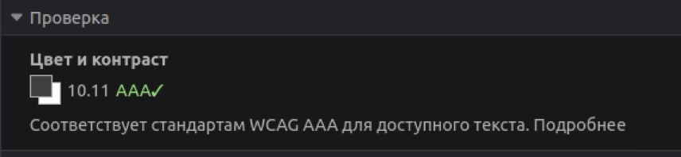
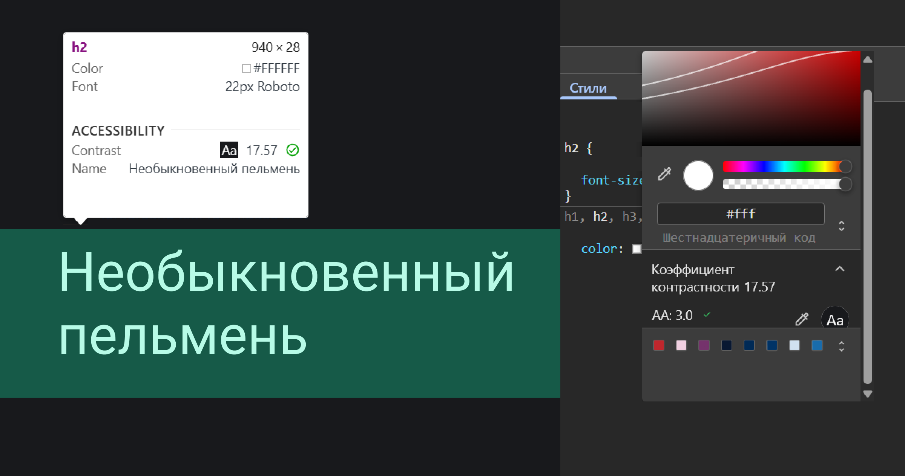

**Контраст в дизайне интерфейсов** — это противопоставление или резкое отличие по цвету и яркости между отдельными элементами; значимая или заметная разница между элементами в интерфейсе. 

## Зачем нам знать о контрасте

От уровня контраста интерфейса напрямую зависит то, насколько удобным и комфортным будет его использование. Особое внимание стоит уделять контрастности фона и основного контента — текста. Мы можем интуитивно оценить, насколько читаем тот или иной текст, но можем упустить из внимания особенности зрения, которые влияют на восприятие контрастности и различение похожих цветов. К примеру, дальтонизм. Также низкий контраст может помешать комфортному использованию интерфейса при ярком свете, на старых экранах и т. д.

- **Разборчивость**: людям с нормальным и пониженным зрением проще воспринимать текст.
- **Юзабилити**: контрастные интерфейсы проще воспринимаются на солнце, в темноте или на экране с низким разрешением.
- **Доступность**: пользователи со слабым и ослабленным из-за возраста зрением или люди с дальтонизмом могут использовать продукт без барьеров.
- **Соответствие законам и стандартам**: во многих странах доступность — это юридическое требование. Например, в странах-членах Евросоюза, США и Великобритании.

## Уровни контраста

При проектировании разборчивых интерфейсов для людей с разными особенностями зрения [WCAG (Web Content Accessibility Guidelines)](/a11y/wcag/) предлагают несколько уровней контрастности (соотношения между яркостью двух цветов).

**AA** — минимальный уровень:

- Текст размером до 18px (обычный текст): контраст не ниже 4.5:1.
- Крупный текст (≥18px или ≥14px жирный): контраст не ниже 3:1.
- Нетекстовые элементы интерфейса (разделители, иконки, статусы и прочее): контраст от 3:1 и выше.

**AAA** — повышенный уровень для интерфейсов, где требуется максимальная доступность:

- Обычный текст: не ниже 7:1.
- Крупный текст: не ниже 4.5:1.

Требования к контрастности для более крупного текста ниже. Текст большего размера, с более толстыми буквами и символами легче различать при меньшей контрастности. Это позволяет нам использовать более широкий диапазон цветов и шрифтов для крупного текста, что может быть полезно для дизайна.

Для декоративных элементов, иконок без текста и других нетекстовых частей интерфейса допускается меньшее соотношение контраста. При этом важно следить за контрастом ключевого содержимого и фона.

Компоненты интерфейса, недоступные для взаимодействия, не обязаны соответствовать требованиям к контрастности. Например, кнопка «Отправить» внизу формы. Такая кнопка видна, но не может быть нажата, пока не заполнены все обязательные поля.

## Способы проверки контраста

**Автоматические инструменты**:

- [Проверка контраста от WebAIM](https://webaim.org/resources/contrastchecker/)
- [Анализатор цветового контраста CCA](https://www.tpgi.com/color-contrast-checker/) (Colour Contrast Analyser)
- [Калькулятор контраста APCA](https://apcacontrast.com)
- [Калькулятор Huetone](https://huetone.ardov.me)
- Плагины для Figma, Sketch, программ для написания кода (IDE) и другие.

**Инструменты разработчика в браузере**:

- инструменты разработчика Firefox (раздел «Доступность»);
- инструменты разработчика в Chrome (показывает уровень контраста для текста);
- с помощью интрумента для аудита в Chrome (Lighthouse, aXe).

**Ручная проверка**:

формула контрастности: _(L1+0.05)/(L2+0.05)_, где L1 и L2 — относительные яркости фона и текста (от 0 до 1).

**Эмпатическое тестирование**:

проверка интерфейса с включёнными режимами дальтонизма или пониженной яркости (есть в macOS, Windows, Figma, браузерах).
