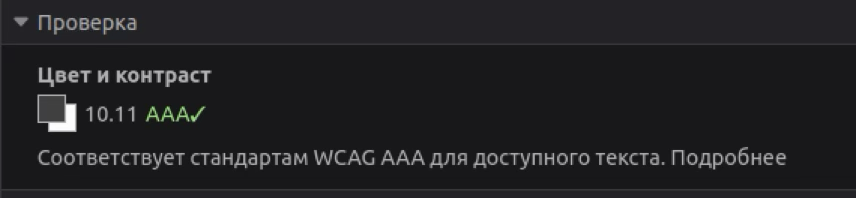
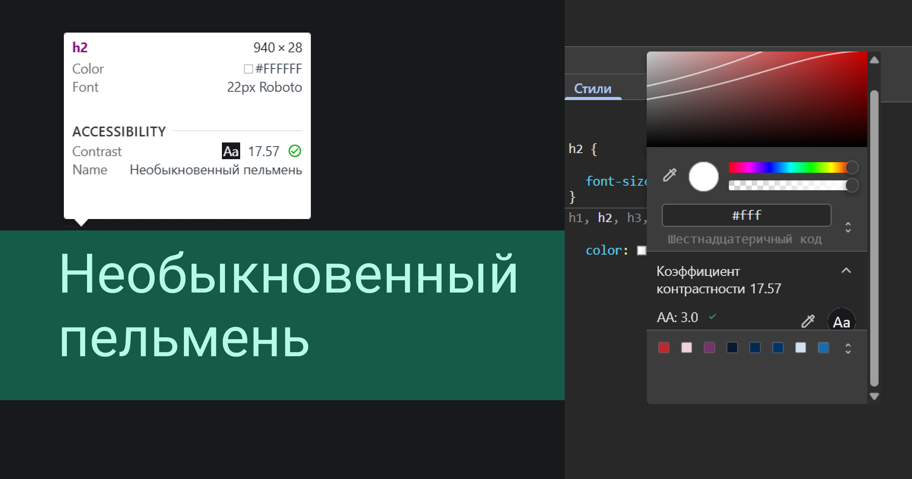
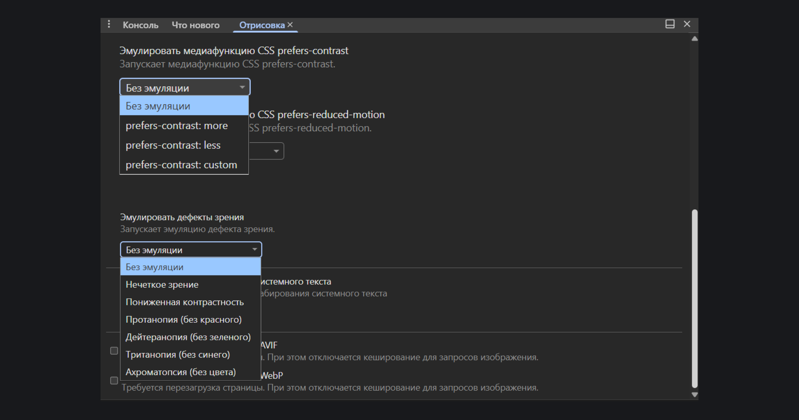
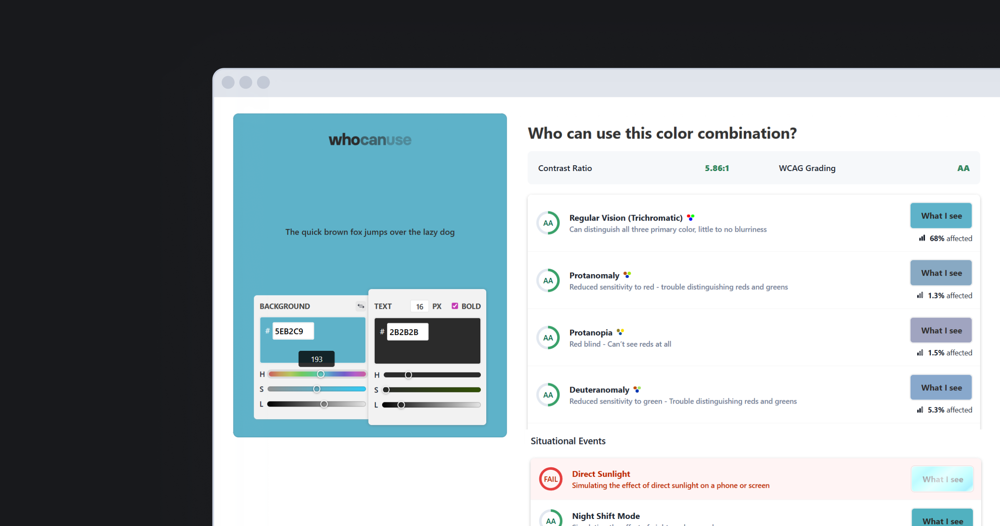

**Контрастность в дизайне интерфейсов** — это противопоставление или резкое отличие по цвету и яркости между отдельными элементами; значимая или заметная разница между элементами в интерфейсе.

## Зачем знать о контрастности

От уровня контрастности интерфейса напрямую зависит то, насколько удобным и комфортным будет его использование. Особое внимание стоит уделять контрасту фона и основного контента — текста. Мы можем интуитивно оценить, насколько читаем тот или иной текст, но можем упустить из внимания особенности зрения, которые влияют на восприятие контрастности и различение похожих цветов. К примеру, дальтонизм. Также низкий контраст цветов может помешать комфортному использованию интерфейса при ярком свете, на старых экранах и т. д.

- **Разборчивость**: людям с любым зрением проще воспринимать текст.
- **Юзабилити**: контрастные интерфейсы проще воспринимаются на солнце, в темноте или на экране с низким разрешением.
- **Доступность**: пользователи с особенностями зрения могут использовать продукт без барьеров.
- **Соответствие законам и стандартам**: во многих странах доступность — это юридическое требование. Например, в странах Евросоюза, США и Великобритании.

## Алгоритмы расчёта

При проектировании разборчивых интерфейсов для людей с разными особенностями зрения используют две системы расчёта контрастности — [WCAG 2 (Web Content Accessibility Guidelines)](/a11y/wcag/) и APCA.

### WCAG

Руководства по доступности контента (коротко WCAG 2) предлагают рассчитывать контрастность, сравнивая яркость одного цвета на фоне другого. На выходе получается соотношение из двух чисел, например, 2.5:1. Кроме этого учитывается размер и толщина (насыщенность) шрифта, который используется для текста.

<aside>
  🧮 Формула расчёта контрастности по WCAG 2: (L₁+0.05)÷(L₂+0.05), где L₁ и L₂ — относительные яркости фона и текста (от 0 до 1).
</aside>

В основе WCAG 2 — руководства и критерии нескольких уровней соответствия. Критерии про контрастность не исключение.

**AA** — минимальный уровень:

- Текст размером до 18px (обычный текст): не ниже 4.5:1.
- Крупный текст (≥18px или ≥14px жирный): не ниже 3:1.
- Нетекстовые элементы интерфейса (разделители, иконки, статусы и другие): от 3:1 и выше.

**AAA** — повышенный уровень для интерфейсов, где требуется максимальная доступность:

- Обычный текст: не ниже 7:1.
- Крупный текст: не ниже 4.5:1.

Требования к контрастности для более крупного текста ниже. Текст большего размера, с более толстыми буквами и символами легче различать при меньшей контрастности. Это позволяет нам использовать более широкий диапазон цветов и шрифтов для крупного текста, что может быть полезно для дизайна.

Для декоративных элементов, иконок без текста и других нетекстовых частей интерфейса допускается меньшее соотношение. При этом важно следить за контрастом ключевого содержимого и фона.

Компоненты интерфейса, недоступные для взаимодействия, не обязаны соответствовать требованиям. Например, кнопка «Отправить» внизу формы. Такая кнопка видна, но не может быть нажата, пока не заполнены все обязательные поля.

### APCA

_APCA (Accessible Perceptual Contrast Algorithm)_ — aлгоритм доступной контрастности на основе восприятия цветов. Это означает, что алгоритм учитывает не математическое соотношение яркости, а _светлоту цвета (lightness contrast, Lc)_. Светлота — яркость цвета текста или участка изображения по отношению к белому. Эта субъективная характеристика цвета, в отличие от яркости, так как строится на особенностях восприятия цветов человеческим глазом.

Светлота учитывает несколько факторов: семейство и толщину шрифта, его цвет и размеры, назначение текста (основной текст, заголовок, подзаголовок и пр.), а также цвет фона. В итоге получаем не соотношение одного цвета к другому (3.1:1), а значения светлости (Lc 60, Lc 75 и далее).

Например, для текста, набранного базовым шрифтом без засечек Arial, такие требования:

- Lc 15 — минимальная светлота для нетекстовых декоративных элементов.
- Lc 30 — минимум для дополнительного текста вроде плейсхолдеров, а также значимых нетекстовых элементов.
- Lc 45 — минимум для заголовков и другого крупного текста.
- Lc 60 — минимальное значение для основного текста (16px c жирным начертанием и 24px нормального начертания).
- Lc 75 — минимум для текста с обычным начертанием и размерами меньше 18px.
- Lc 90 — рекомендуемое значение для текста с обычным начертанием не меньше 14px.

## Способы проверки контраста

Сравнивать цвета можно с помощью автоматических инструментов: калькуляторов, расширений, плагинов и прямо в браузерах.

**Калькуляторы для алгоритма WCAG 2**:

- [Проверка контраста от WebAIM](https://webaim.org/resources/contrastchecker/): определяет и сравнивает цвета только в формате [HEX](/css/web-colors/#hex), показывает итоговое соотношение и статус соответствия критериям WCAG 2.
- [Отчёт о контрасте](https://contrast.report): кроме базовых функций калькуляторов симулирует тёмную и светлую темы, работает в режиме картинки в картинке (Picture-in-Picture).
- [Анализатор цветового контраста CCA](https://www.tpgi.com/color-contrast-checker/) (Colour Contrast Analyser): программа под Windows и macOS, поддерживает несколько форматов цветов, есть симулятор дальтонизма.
- [Contrasts](https://contrasts.app): приложение для macOS, поддерживает несколько цветовых форматов.

**Калькуляторы для APCA**:

- [Проверка контраста APCA + WCAG 2](https://mgifford.github.io/contrast-plus/): учитывает оба алгоритма расчёта контрастности, дополнительно оценивает контраст цвета интерактивных элементов и их фона, есть симуляторы нечёткого зрения и дальтонизма, подсказывает подходящие цвета, автоматически генерирует контрастные цветовые палитры.
- [Калькулятор контраста APCA](https://apcacontrast.com): рассчитывает контрастность только на основе APCA, удобный предпросмотр текста с разными начертаниями и размерами.
- [Калькулятор Huetone](https://huetone.ardov.me): космолёт в мире калькуляторов, гибкие настройки цветовых палитр, можно копировать цвета в виде дизайн-токенов и CSS-переменных.

**Плагины для Figma, Sketch и программ для написания кода (IDE)**:

- [Плагин для проверки контрастности от Stark](https://www.getstark.co/support/getting-started/using-the-contrast-checker/) (Figma и Scetch): использует алгоритм WCAG2, есть симуляторы дальтонизма, размытого зрения, пониженного контраста и яркого дневного освещения.
- [Polychrom](https://www.figma.com/community/plugin/1281280685402026529/polychrom) (Figma): плагин для проверки на основе алгоритма APCA, кроме базовых цветовых форматов поддерживает [OKLCH](https://en.wikipedia.org/wiki/Oklab_color_space), работает с палитрами, где есть смешанные цвета, предлагает подходящие начертания для текста разных размеров.

**Браузерные инструменты разработчика**:

- Firefox (раздел «Доступность»);
- Chrome (показывает уровень контраста для текста);
- встроенные в браузеры инструменты для аудита доступности (Lighthouse, axe).

**Эмпатическое тестирование**: проверка интерфейса с включёнными режимами дальтонизма, нечёткого зрения, пониженной или пониженной контрастности (есть в браузерах, Windows, Figma и на macOS).

Например, в Chrome эмуляция особенностей зрения находится во вкладке «Отрисовка». Можно эмулировать нечёткое зрение, пониженную контрастность, все виды дальтонизма (когда не воспринимается красный, зелёный, синий или ни один из цветов RGB-спектра). В этой же вкладке включается эмуляция [`prefers-contrast`](/a11y/prefers-contrast/) — одного из значений директивы [`@media`](/css/media/).

Есть отдельные сервисы для симуляции зрительного восприятия. Например, [Who Can Use](https://www.whocanuse.com). Это веб-сервис, который показывает как люди с обычным зрением, дальтонизмом, глаукомой и катарактой видят комбинации цветов. Дополнительно проверяет соотношения контраста при прямом солнечном свете и в ночном режиме.

При использовании градиента проверяйте контраст текста и интерактивных элементов отдельно для каждого цвета градиента (особенно для самого светлого и самого тёмного участка). Контраст должен соблюдаться на всём протяжении градиента.

## Контрастность в тёмной теме: главные правила

Проверять контрастность интерфейса при установленной тёмной теме можно теми же инструментами, которыми проверяют светлую тему, но есть свои нюансы.

**Не инвертируйте автоматически цвета из светлой темы**

То, что работало в светлой теме («акцентный синий на белом»), может потерять контраст в тёмной теме. Всегда пересчитывайте контраст заново.

**Избегайте чистых и высоконасыщенных цветов на темном фоне**

Ярко-красный, ярко-синий или ярко-зелёный на чёрном могут создавать эффект мерцания для некоторых людей. Также они создают ложное ощущение контраста (цветовой, а не яркостный). Лучше использовать приглушённые оттенки или добавлять полупрозрачную подложку под цветные элементы.

**Не используйте чистый белый на чистом чёрном**

Белый текст (#FFFFFF) на чёрном фоне (#000000) дают высокий контраст. Но такой режим вызывает эффект гало у людей с астигматизмом и быстрое утомление глаз. Используйте светло-серый для текста и тёмно-серый (или тёмно-синий) для фона.

**Проверяйте не только текст, но и компоненты**

В тёмной теме страдают: границы полей ввода (input borders), разделители (dividers), состояния наведения (hover), плейсхолдеры (они часто слишком бледные и плохо различимые).

**Уменьшайте яркость иконок и картинок, если это требуется**

Если картинки, иконки, графики или иллюстрации содержат белый цвет, они могут вызвать дискомфорт у пользователей. В таком случае стоит уменьшить яркость за счёт изменения цвета для иконок, свойств яркость(brightness), прозрачность(opacity) или насыщенность(saturate). Иногда стоит подумать о замене картинки на другую при использовании тёмной темы, если изменение свойств не решает проблему доступности.

**Обратите внимание на толщину линий шрифта**

В тёмной теме шрифты визуально кажутся жирнее, чем на светлом фоне. Это физиологический и оптический эффект, в основе которого лежит явление иррадиации (светорассеивание) в глазах. Мелкие буквы становятся менее читаемыми, визуально слипаясь, жирные шрифты выглядят более жирными, чем на самом деле, засечки или непривычное начертание букв могут ухудшить ситуацию. Проверяйте шрифты на настоящих устройствах. Увеличьте расстояние между символами для мелких шрифтов для читаемости, замените вес шрифта на более подходящий (например, менее тяжёлый), если он визуально больше подходит для восприятия.

**Дайте пользователю возможность переключать тему вручную**

Автоматическое определение системной темы — хорошо, но не все пользователи его включают или понимают как пользоваться. Добавьте явный переключатель в интерфейс, пользователь лучше всех понимает свои предпочтения.
