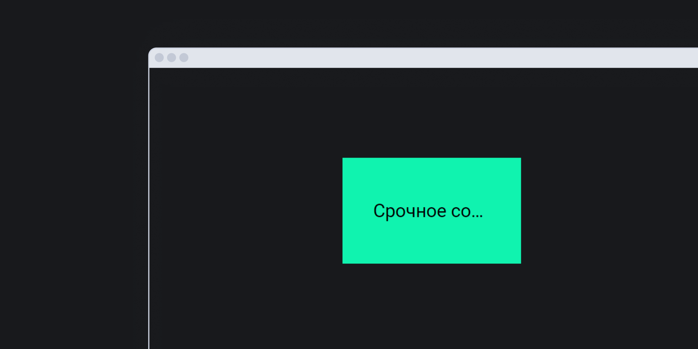

## Кратко

Мы привыкли, что в структуре сайта [CSS](/css/) отвечает только за визуальное представление, а всё касающееся контента задаётся в [HTML](/html/). Однако, это не совсем так. В CSS есть свойства, способные как улучшить восприятие вашего сайта для пользователя вспомогательных технологий, так и сильно усложнить ему жизнь.

В статье разберёмся, что это за свойства и почему так происходит.

## Важные уточнения

Большая часть материала в статье посвящена влиянию CSS на скринридеры.

В Доке есть отдельная [статья про скринридеры](/a11y/screenreaders/). Здесь я только кратко процитирую, что такое скринридер.

> _Скринридер (screen reader)_ — программа, которая превращает контент интерфейсов в речь или шрифт Брайля.
>
> Скринридеры нужны людям со слепотой и слабовидящим, а также пользователям с когнитивными особенностями, которым легче воспринимать информацию на слух. Например, людям с дислексией.

Также в тексте статьи много демок. Протестируйте их сами. Установите или включите скринридер — в статье про скринридеры есть [список существующих программ](/a11y/screenreaders/#vidy-skrinriderov) для каждой операционной системы. Инструкции по скачиванию и подключению обычно есть на сайтах скринридеров.

Наконец, все демки я протестировала со скринридером NVDA в Windows в Google Chrome. Если тестируете с другим скринридером, его поведение может немного отличаться от описанного в статье.

Об основном договорились, теперь можно двигаться дальше 🙂

## Списки

Чтобы не рассматривать скучные абстрактные примеры, давайте представим, что нам нужно пойти в магазин, купить кучу всего и ничего не забыть.

В этом нам поможет приложение для покупок — именно его мы увидим во всех демках.

Первое, что нужно сделать — составить список покупок.

Допустим, в этом случае нам не важно, сколько пунктов в списке, поэтому мы используем ненумерованный список — [`<ul>`](/html/ul/).

<iframe title="Списки с маркерами и без них" src="demos/list-style-none/" height="450"></iframe>

### Свойство `list-style: none`

Первое, что мы обычно делаем с ненумерованным списком, — убираем стандартные буллиты с помощью свойства [`list-style:none`](/css/list-style/#ispolzovanie-znacheniya-none). Кажется, что на скринридер такое изменение влиять не должно, ведь оно касается только визуального представления списка. Однако на практике это не так.

У обычного списка с буллитами NVDA сначала озвучивает количество элементов в списке, а затем перед каждым элементом произносит слово «маркер». Это даёт пользователю понять, что он перешёл к следующему пункту списка. Например:

> Список из четырёх элементов. Маркер. Апельсины. Маркер. Хлеб…

У списка с `list-style: none` количество элементов произносится, но слово «маркер» опускается. Элементы списка просто зачитываются подряд:

> Список из четырёх элементов. Апельсины. Хлеб…

В случае со скринридером VoiceOver свойство `list-style: none` приведёт к ещё большей путанице. В Safari список с `list-style: none` вовсе не озвучивается как список. Мы не услышим ни количество элементов, ни слово «маркер».

Если список нумерованный ([`<ol>`](/html/ol/)), то для каждого пункта списка скринридер зачитывает порядковый номер, например:

> Один. Апельсины. Два. Хлеб.

В случае с `list-style: none` этот номер игнорируется.

<aside>

🐛 В 2020 [в Safari исправили баг](https://bugs.webkit.org/show_bug.cgi?id=170179), из-за которого роль списка сбрасывалась у `<ul>`, вложенного в [`<nav>`](/html/nav/). Во всех остальных случаях семантика списка по-прежнему сбрасывается.

</aside>

### Кастомные маркеры

Получается, что совсем без маркера оставлять список как-то нехорошо. Чаще всего для списков верстают кастомные маркеры. Рассмотрим два распространённых способа это сделать.

#### Псевдоэлемент `::before`

Сделаем список повеселее, вместо стандартного маркера вставим эмодзи канцелярской кнопки — «📌».

Это можно сделать с помощью [псевдоэлемента `::before`](/css/before/) у элемента списка [`<li>`](/html/li/):

```css
.list_emoji li::before {
  content: '📌';
  display: block;
  position: absolute;
  top: -3px;
  left: -22px;
}
```

В свойстве [`content`](/css/content/) у псевдоэлемента указано его содержимое (эмодзи кнопки), а остальные свойства помогают спозиционировать `::before` относительно элемента списка.

Посмотрим на получившийся «нарядный» список. В демке он под заголовком «`::before`».

<iframe title="Списки с кастомными маркерами" src="demos/lists-with-custom-markers/" height="450"></iframe>

А как это звучит?

Скринридер озвучивает содержимое свойства `content`, поэтому перед каждым пунктом списка мы слышим название эмодзи:

> Канцелярская кнопка. Апельсины. Канцелярская кнопка. Хлеб…

[`content`](/css/content/) — ещё одно CSS-свойство, влияющее на поведение скринридера. Его содержимое почти всегда будет зачитано, если скринридер найдёт там что-то читабельное. Это может быть текст, цифры или эмодзи.

К счастью, громоздкую конструкцию, например, с адресом ссылки на картинку, NVDA не зачитает 🙂 В этом примере скринридер пропустит значение свойства `content` и не будет его читать:

```css
.local-link::before {
  content: url("/media/examples/firefox-logo.svg");
}
```

#### Псевдоэлемент `::marker`

Ещё один вариант создания кастомных маркеров — [псевдоэлемент `::marker`](/css/marker/).

Снова глянем на демку — теперь нас интересует список с маркерами-галочками.

<iframe title="Списки с кастомными маркерами" src="demos/lists-with-custom-markers/" height="450"></iframe>

В этом случае NVDA не будет зачитывать содержимое псевдоэлемента и опустит слово «маркер» перед элементом списка. То есть, как и в примере с `list-style: none` без кастомных маркеров, снова получим:

> Список из 4 элементов. Апельсины. Хлеб…

Значит, псевдоэлемент `::marker` влияет только на внешний вид списка.

### Бонусный фан-факт

В этой демке есть ещё один интересный элемент — кнопка. Она выглядит совершенно обычно, но нам важно, что все буквы здесь капитализированы с помощью свойства [`text-transform: uppercase`](/css/text-transform/).

```css
.button-uppercase {
  text-transform: uppercase;
}
```

Оказывается, раньше VoiceOver читал капитализированный текст по буквам. Из нашей кнопки получилось бы «<!-- yaspeller ignore:start -->Д.О.Б.А.В.И.Т.Ь.П.У.Н.К.Т.<!-- yaspeller ignore:end -->» 😱

Одно время в сообществе кипели обсуждения баг это или нет, но в какой-то момент такое поведение всё-таки признали багом и исправили. Сейчас с таким столкнуться уже невозможно.

## Свойство `order`

Список собрали и теперь самое время отправляться за покупками. Допустим, в нашем магазине карточки товаров выглядят как кнопки с эмодзи и текстами.

<iframe title="Изменение порядка элементов с помощью свойства order" src="demos/flex-order-property/" height="480"></iframe>

В демке обычный блок с [`display: flex`](/css/display/#kak-pishetsya). Попробуем озвучить весь список товаров скринридером.

**Ожидание:**

> Апельсины. Молоко. Воздушный змей. Сок. Брецель. Яблоки.

**Реальность:**

> Апельсины. Яблоки. Молоко. Сок. Брецель. Воздушный змей.

Кажется, что скринридер хаотично изменил порядок товаров. Даже без озвучки при прохождении списка с помощью клавиатуры видно, что фокус как будто прыгает по случайным элементам. На самом деле это не так.

Если заглянуть в код демки, мы увидим, что элементы в HTML стоят ровно в том порядке, в каком их читает скринридер. При этом каждому из них задано свойство [`order`](/css/order/). Как раз оно и определяет их визуальный порядок.

<aside>

🔢 Свойство `order` меняет позицию элемента только в визуальном отображении. Скринридер в этом случае продолжает проходить элементы ровно в том порядке, в котором они размечены в HTML.

</aside>

## `reading-flow`

Это [свойство из черновика CSS Display Module Level 4](https://drafts.csswg.org/css-display-4/#reading-flow). Пока оно даже не определилось с тем, как точно называется. Может `reading-order-items`, а может `reading-order`?

<aside>

🏗️ В начале 2024 [команда браузерного движка Blink](https://groups.google.com/a/chromium.org/g/blink-dev/c/d9jIhcVw8zQ/m/aM5d-3P7AQAJ) начала прикидывать, как будет работать `reading-flow` на практике.

</aside>

Свойство предлагают использовать для решения проблемы с `order`, которое изменяет визуальный порядок флекс- и грид-элементов и никак не изменяет логический. С его помощью сможете управлять порядком озвучивания элементов скринридером или фокусом с клавиатуры.

На практике `reading-flow` будет выглядеть так:

```html
<div class="wrapper">
  <a href="#">Первый элемент</a>
  <a href="#">Второй элемент</a>
  <a href="#">Третий элемент</a>
</div>
```

```css
.wrapper {
  display: flex;
  flex-direction: row-reverse;
  reading-flow: flex-visual;
}
```

## `text-overflow`

Свойство [`text-overflow`](/css/text-overflow/) визуально обрезает часть текста, когда он полностью не помещается в доступную область.

Это свойство никак не влияет на скринридеры, и они прочтут текст целиком. Однако зрячие пользователи столкнутся с проблемами при увеличении интерфейса или на небольших экранах. Из-за этого им будет трудно ориентироваться в интерфейсе и понять, что скрывается за многоточием. Возможно, одна строчка текста не нанесёт большого ущерба, чего не скажешь про большие тексты.

Представим, что хотим показать срочное сообщение и, при этом, сохранить ещё пару пикселей в интерфейсе.

```html
<p>
  Срочное сообщение, от которого зависит всё.
  С вашего счёта списан 1 000 000 000 галлактических
  кредитов.
</p>
```

```css
p {
  padding: 55px 40px;
  inline-size: 65%;
  white-space: nowrap;
  overflow: hidden;
  text-overflow: ellipsis;
  background-color: #10F3AF;
  color: #000000;
}
```

<iframe title="Обрезанный текст с text-overflow" src="demos/text-overflow/" height="340"></iframe>

Скорее всего, если только у вас не огромный экран, такое сообщение заинтригует, но не даст нужной информации. На мобильных экранах интрига нарастает ещё больше.



## `display: table` и `display: grid`

Итак, мы закупились в магазине согласно нашего списка и получили чек с перечнем купленного.

<iframe title="Таблицы и гриды" src="demos/table-and-grid-layout/" height="840"></iframe>

Первый вариант чека — стандартная таблица, свёрстанная с помощью тега [`<table>`](/html/tables/). Она выглядит как таблица и ~~крякает~~ читается скринридером как таблица.

При чтении этой таблицы скринридер честно расскажет нам, сколько в ней строк и столбцов:

> Таблица из 4 строк и 3 столбцов.

Также для каждой ячейки будет уточнять название и номер столбца, в котором она находится:

> Продукт. Столбец 1. Апельсины. Количество. Столбец 2. 1 килограмм.

А ещё при переходе на новую строку озвучит номер строки:

> Строка 3. Продукт. Столбец 1. Молоко.

Скринридеры прекрасно работают с таблицами, поэтому здесь никаких вопросов — всё читается так, как мы ожидали. Но верстать таблицы мало кто любит. А что, если сверстать то же самое, но с помощью [`display: grid`](/css/grid-guide/)?

Посмотрим на второй вариант чека. Визуально всё выглядит почти в точности так же, как и обычная таблица. Но внутри теперь не семантический тег `<table>`, а обычные [`<div>`](/html/div/) и [`<p>`](/html/p/). Ожидаемо такой компонент не будет читаться как таблица. В итоге мы услышим простое озвучивание контента блоков:

> Продукт. Количество. Цена. Апельсины. 1 килограмм.

Окей, у таблицы есть свойство `display: table`. Может, всё дело в нём? Попробуем сверстать псевдотаблицу с помощью обычных `<div>`, но зададим блоку-обёртке `display: table`. В демке это первый вариант с заголовком «Таблица и `display: table`».

<iframe title="Таблицы и гриды" src="demos/table-with-grid-layout/" height="840"></iframe>

Увы, скринридер всё ещё не считает это таблицей и снова читает только контент внутри блоков в ожидаемом нами порядке:

> Продукт. Количество. Цена. Апельсины. 1 килограмм.

Продолжим экспериментировать и теперь навесим свойство `display: grid` на настоящую семантическую таблицу. Зачем? Во-первых, почему бы и нет. А во-вторых, чтобы проверить утверждение, которое встречалось мне в нескольких статьях. В этом случае свойство `display: grid` должно сломать семантику таблицы.

Проверим на практике. Вторая таблица с заголовком «Контейнеры и `display: grid`» из демки свёрстана как таблица с `display: grid` у тега `<table>`.

На удивление, NVDA справился с такой путаницей отлично. Он прочитал элемент как настоящую таблицу и озвучил все строки и столбцы. Однако стоит помнить, что другие скринридеры могут повести себя в такой ситуации совершенно непредсказуемо. Это значит, что таких сюжетных поворотов в вёрстке лучше избегать 🙂

## `display: contents`

`contents` — это значение свойства `display` с пока что частичной поддержкой браузерами, благодаря которому можно напрямую применять стили к дочерним элементам внутри контейнера. Звучит как магия, но есть одно «но». Все элементы внутри контейнера с `display: contents` теряют свою семантику.

```css
.container {
  display: contents;
}
```

Как видим код мы:

```html
<div class="container">
  <p>
    Наша замечательна рассылка лучшая рассылка
    среди всех рассылок.
  </p>
  <button>Подписаться на рассылку</button>
</div>
```

Как видят код скринридеры:

```html
<span>
  Наша замечательна рассылка лучшая рассылка
  среди всех рассылок.
</span>
<span>Подписаться на рассылку</span>
```

<aside>

🐛 Баг с теряющейся семантикой из-за `display: contents` поправили в [Chrome 89](https://issues.chromium.org/issues/41384724), [Firefox 68.0](https://bugzilla.mozilla.org/show_bug.cgi?id=1455357) и [Safari 114](https://bugs.webkit.org/show_bug.cgi?id=185679).

</aside>

Другая особенность поведения `display: contents` связана интерактивными элементами. Если это свойство задано ссылкам, кнопкам и похожим элементам, пользователи не могут взаимодействовать с ними с клавиатуры.

```css
a {
  display: contents;
  font-size: 34px;
  border-radius: 3px;
  color: inherit;
  -webkit-text-decoration-color: #10F3AF;
  text-decoration-color: #10F3AF;
  text-decoration-thickness: 2px;
  transition: background-color 0.2s linear;
}

a:hover,
a:focus {
  background-color: #10F3AF;
  transition: background-color 0.2s linear;
  outline-width: 0;
}
```

<iframe title="Ссылка со значением contents у display" src="demos/display-contents/" height="400"></iframe>

Такое поведение `display: contents` — не баг, а фича. Значение `contents` отменяет привычную [блочную модель](/css/box-model/). Из-за этого браузеры не знают какие размеры, отступы и расположение у элементов.

## Спрятанное содержимое

Есть много способов скрыть контент страницы, но не все из них скрывают контент одновременно и для зрячих пользователей, и для пользователей скринридеров.

В Доке есть отдельная статья «[Как скрыть содержимое от скринридеров](/a11y/content-hidden/)». В ней подробно описаны способы скрытия и показа содержимого. Например, только визуально, только для скринридеров или всё вместе. Поэтому здесь только кратко процитируем описание CSS-свойств, которые _заставят скринридер замолчать_ 😈

- [`width: 0px`](/css/width/) и [`height: 0px`](/css/height/) удаляют элементы из потока страницы, поэтому скринридеры их не прочитают. Не работает с NVDA. Он по-прежнему будет читать такие элементы.
- [`visibility: hidden`](/css/visibility/) скрывает элемент и его содержимое, но оставляет его в обычном потоке страницы, поэтому элемент по-прежнему занимает место.
- `content-visibility: hidden` скрывает содержимое тега от браузеров и вспомогательных технологий.
- `display: none` полностью удаляет элемент из документа. Он не занимает места, хотя всё ещё находится в исходном HTML-коде.

Если хотите, чтобы содержимое читалось скринридером, лучше не использовать эти CSS-стили. Стремитесь к тому, чтобы опыт незрячего пользователя не отличался от опыта зрячего. Это важно для пользователей с частичными нарушениями зрения, которые используют скринридер не всё время, а только в некоторых ситуациях.

## Анимации и `prefers-reduced-motion`

Ура, кажется, мы всё купили и теперь можем посмотреть на красивый экран с анимацией 🎉

<iframe title="Управление анимацией с помощью prefers-reduced-motion" src="demos/prefers-reduced-motion/" height="300"></iframe>

Однако, на доступном сайте должна быть возможность отключить анимацию, если пользователю это важно. Такое поведение описано в одном из требований [WCAG 2 (Web Content Accessibility Guidelines 2)](https://www.w3.org/WAI/standards-guidelines/wcag/) — [2.3.3. Анимация при взаимодействии](https://www.w3.org/WAI/WCAG21/Understanding/animation-from-interactions).

У [CSS-директивы `@media`](/css/media/) есть значение, которое позволяет влиять на анимации в зависимости от настроек системы пользователя — `prefers-reduced-motion`. Если в операционной системе пользователя отключена анимация, то на сайте будет выполнен CSS-код внутри директивы.

Например, в этом коде анимация в `prefers-reduced-motion` выключена совсем:

```css
.animated-element {
  animation: rotation 1.6s infinite;
}

@media (prefers-reduced-motion) {
  .animated-element {
    animation: none;
  }
}
```

В демке уже написаны стили, отключающие анимацию при `prefers-reduced-motion`. Это можно проверить, отключив отображение анимации у себя на компьютере или смартфоне в настройках системы.

- Для Windows: Параметры → Специальные возможности → Другие параметры → Воспроизводить анимацию в Windows.
- Для macOS: Системные настройки → Универсальный доступ → Монитор → Уменьшить движение.
- Для Linux: Настройки → Специальные возможности → Разрешить анимацию.
- Для iOS: Настройки → Универсальный доступ → Движение → Уменьшение движения.
- Для Android: Настройки → Специальные возможности → Экран → Удалить анимации.

Если ваш браузер — Google Chrome, то можно имитировать эту настройку в инструменте разработчика: «Другие инструменты» (More tools) → вкладка «Отрисовка» (Rendering) → «Эмулировать медиафункцию CSS prefers-reduce-motion» (Emulate CSS media feature prefers-reduce-motion).

При активированном режиме «уменьшенной анимации» хлопушка в демке не должна двигаться. При отключении этого режима она начнёт двигаться снова.

Кстати, в Доке уже есть [материал о `prefers-reduced-motion`](/a11y/prefers-reduced-motion/).

## Почему стили влияют на доступность?

Как скринридер решает, какие элементы он будет читать, а какие пропустит?

Дело в том, что скринридер читает не просто контент страницы или её разметку, а общается с браузером при помощи _Accessibility API (Accessibility Application Programming Interface)_.

Accessibility API передаёт скринридеру данные о странице в виде _дерева доступности (accessibility tree)_. Оно похоже на [DOM-дерево](/js/dom/#iz-chego-sostoit-dom), но состоит из _доступных объектов (accessible object)_. То есть, именно Accessibility API превращает разметку страницы в «сценарий чтения». Как этот сценарий будет выглядеть зависит от многих факторов. Например, от семантической разметки и используемых CSS-свойств.

<aside>

🌳 Дерево доступности не полностью копирует DOM-дерево. Например, в него не попадают скрытые элементы с `display: none`, `visibility: hidden`, [атрибутом `hidden`](/html/hidden/) или декоративные `<div>`.

</aside>

## Выводы

CSS тоже может влиять на то, как контент страницы будет прочитан скринридером.

- Свойство `list-style: none` превращает семантический список в обычный перечень элементов. Скринридер не скажет сколько всего элементов и не будет обозначать каждый новый элемент словом «маркер» в случае с `<ul>` или порядковым номером элемента в случае с `<ol>`.
- Содержимое псевдоэлементов `::before` и `::after` зачитывается скринридером. Если внутри свойства `content` ссылка, он её не прочитает.
- Содержимое псевдоэлемента `::marker` невидимо для скринридера, но список с таким псевдоэлементом всё равно не читается как список, если ему задан `list-style: none`.
- Свойство `order` меняет порядок элементов только визуально. Скринридер будет читать элементы в том порядке, в котором они расположены в разметке.
- Новое свойство `reading-order-items` в будущем поможет победить `order`.
- `text-overflow` не создаёт проблемы для вспомогательных технологий, но создаёт проблемы для всех остальных.
- `display: table` не сделает для скринридера таблицу из обычных `<div>`-контейнеров. `display: grid` у `<table>` вовсе может сломать всю семантику для некоторых скринридеров.
- `display: contents` ломает семантику в старых версиях браузеров до 2019 года и убирает интерактивные элементы из порядка фокуса.
- `display: none` и `visibility: hidden` позволяют скрыть контент как визуально, так и от скринридеров. `width: 0px` и `height: 0px` тоже скрывают контент, но не для всех скринридеров. Например, NVDA прочитает блок, спрятанный таким образом.
- С помощью директивы `@media` со значением `prefers-reduced-motion` можно предоставить фолбэк-стили на случай, если у пользователя в системе выключена анимация.

Сложно заранее представить, как скринридер озвучит интерфейс, даже если прочитали кучу статей о вспомогательных технологиях и, кажется, знаете уже все подводные камни. Единственный способ проверить как _действительно_ звучит содержимое — сесть и протестировать его с любым скринридером вручную. Это всегда полезно, а часто ещё и довольно весело.

Узнать больше об особенностях влияния CSS на скринридеры можно в этих статьях:

- [CSS Can Influence Screenreaders](https://benmyers.dev/blog/css-can-influence-screenreaders/).
- [The effect of CSS on screen readers](https://uselessdivs.com/blog/the-effect-of-css-on-screen-readers/).
- [Super short note on CSS text (again)](https://html5accessibility.com/stuff/2021/11/04/super-short-note-on-css-text-again/).
- [Modern CSS Upgrades To Improve Accessibility](https://moderncss.dev/modern-css-upgrades-to-improve-accessibility/).
