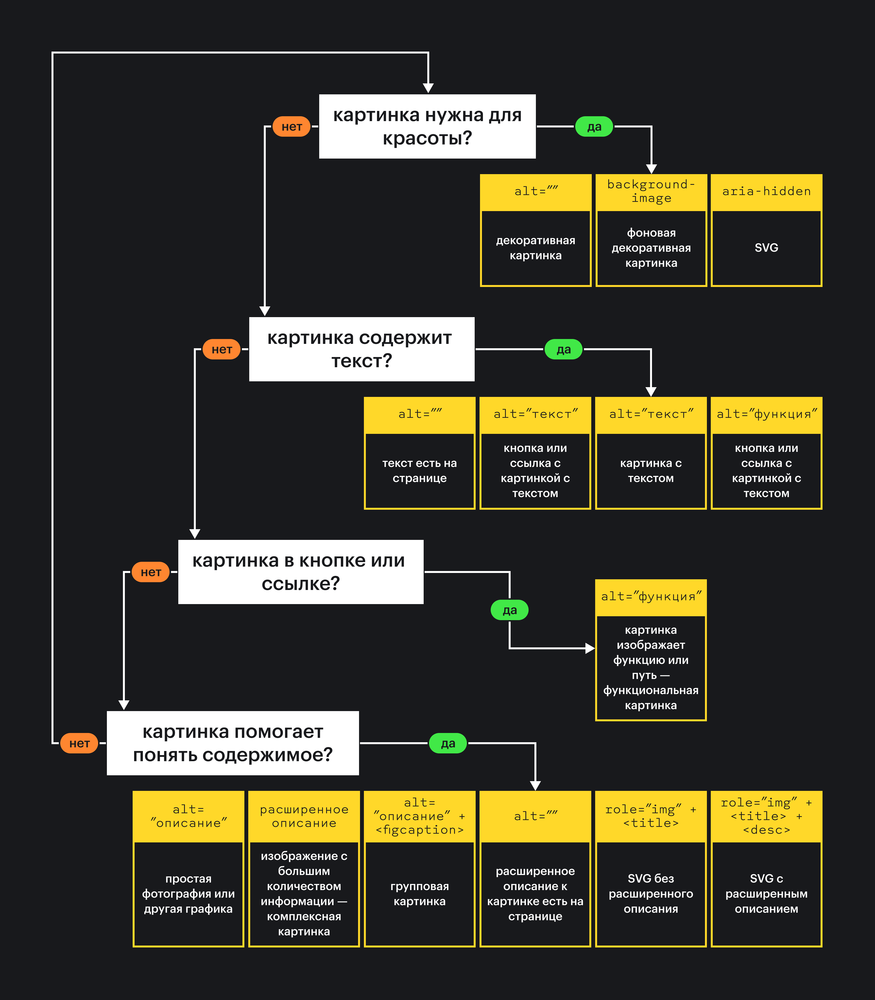

## Кратко

Картинки — распространённый тип контента. Как и другое содержимое страницы, они должны быть доступны для всех пользователей, включая тех, кто пользуется [скринридерами](/a11y/screenreaders/), управляет интерфейсом голосом и отключает картинки для экономии интернет-трафика. Не забудем и про поисковых роботов 🤖

Чтобы изображение стало доступным, у него должен быть альтернативный текст, а в каких-то случаях подпись и подробное описание.

_Альтернативный текст_ — это краткое описание содержимого картинки. Его помещают внутрь атрибута `alt` у [``](/html/img/) или в тег `<title>` у [`<svg>`](/html/svg/). В первую очередь альтернативный текст нужен скринридерам и поисковым роботам, но, если картинка не загрузилась, его увидят и остальные пользователи.

_Подпись_ — это дополнительная информация о картинке, которую видят все пользователи. Она поясняет картинку. Обычно подпись добавляют под изображение. Это может быть важный комментарий к картинке, информация об авторе и дате создания или ссылки. Для подписей используют тег [`<figcaption>`](/html/figure-figcaption/).

_Подробное описание_ — это текст, который подробно описывает важные детали. К примеру, в нём можно описать статистику, если это картинка с графиком. Подробное описание может быть под или над картинкой, а ещё сбоку от неё. Обычно это простой параграф [`<p>`](/html/p/), который в каких-то ситуациях связывают с картинкой с помощью [ARIA-атрибутов](/a11y/aria-attrs/) [`aria-describedby`](/a11y/aria-describedby/) или [`aria-details`](/a11y/aria-details/).

## Виды изображений

Все изображения делятся на две большие группы — смысловые и декоративные.

_Смысловые изображения_ дополняют тексты и другие типы контента. Без них они станут сложными для восприятия. Так что обычно информативные картинки находятся внутри текста или рядом с видео и аудио. Примеры — фотография вашего любимого пса, книжная иллюстрация в статье про «Тома Сойера», иконка в кнопке без текста или скриншот сайта.

Смысловые изображения могут быть разными в зависимости от содержания.

- Информативные — содержат важную для понимания контекста информацию. Например, фотография с собакой или улыбающимся человеком.
- С текстом — содержат текст. Пример — логотип с названием компании.
- Комплексные — содержат много данных. Например, графики, диаграммы, карты и скриншоты.
- Групповые — состоят из нескольких связанных картинок. Например, коллаж с несколькими портретами тапиров.
- Функциональные — показывают, что делает элемент. Например, иконка с крестиком в кнопке для закрытия окна или логотип в меню, который ведёт на главную.

_Декоративные изображения_ нужны для того, чтобы сделать страницу привлекательной и интересной 💅 Если убрать их со страницы, изменится дизайн страницы, но не смысл. К примеру, это могут быть виньетки, фотографии для привлечения внимания, картинки-превью, декоративные скобки у блоков с цитатами, аватарки в личных сообщениях, иконки для красоты.

Чтобы понять, это информативная или декоративная картинка, ответьте на вопрос: «Изображение важно для понимания содержимого?». Если ответ да, то это информативная картинка и её надо описать. Если нет, то это декоративная картинка, описывать её не надо.

## Смысловые картинки

Хорошо описать картинку не всегда просто. В каких-то случаях  — это целое [искусство](https://alt-text-as-poetry.net). К примеру, сложно описать картинку с мемом так, чтобы сохранить шутку, но при этом рассказать, что на ней.

Чтобы понять, как правильно описать картинку, ответьте себе на несколько вопросов:

1. Какую информацию передаёт изображение?
1. Какая это картинка: информативная, комплексная, групповая, функциональная или с текстом?
1. Картинка взывает к эмоциям или призывает к совершению действия?

Если можете представить себе картинку, когда прочитали её описание, это хорошее описание.

Альтернативное описание не должно быть слишком длинным и сложным. Нет оптимального количества символов, но можете встретить рекомендацию про 125 знаков. Дело в том, что [JAWS разбивает одно описание на несколько](https://terrillthompson.com/tests/altlength.html), если в нём больше 125 символов. Однако ни один скринридер не обрезает текст.

На описание также влияет контекст. Например, одну и ту же картинку можно описать по-разному в зависимости от того, где она находится. Это важно учитывать.

В описаниях можно описывать цвета, если они имеют значение или вам важно рассказать про них. Это заблуждение, что цвет ни о чём не скажет человеку со слепотой.

Другое важное правило — не начинайте описание со слов «картинка», «изображение», «фотография» или «графика». Скринридер и так расскажет пользователям, что это ``. В тег по умолчанию встроена эта роль.

Когда на картинке очень много всего, лучше использовать вместо альтернативного описания расширенное. Особенно если это код, математические выражения или графики.

Если хотите, можете ставить точку в конце альтернативного описания. Так, если за картинкой есть другой текст, скринридеры сделают небольшую паузу между двумя объявлениями.

<!-- yaspeller ignore:start -->

Можете найти много примеров описания картинок [на сайте музея дизайна Купер Хьюитт](https://www.cooperhewitt.org/cooper-hewitt-guidelines-for-image-description/).

<!-- yaspeller ignore:end -->

### Информативные картинки

Для информативных картинок важен контекст. Какой вокруг них текст и что хотите передать с помощью графики. Это могут быть эмоции или факты.

Представим, что в кулинарном блоге есть пост про историю пончиков с фотографиями. В этом случае картинки дополняют текст и показывают пончики более наглядно. В этом случае опишите содержимое картинки в `alt`.

```html

```

<iframe title="Информативная картинка" src="demos/informative-img/" height="370"></iframe>

Если картинка не загрузится, все пользователи смогут представить, что на ней.

<iframe title="Сломанная картинка" src="demos/broken-img/" height="210"></iframe>

Давайте попробуем описать портрет пользователя в его профиле. В этом случае кратко расскажите, как выглядит человек.

```html

```

<iframe title="Информативная картинка-портрет" src="demos/portrait-img/" height="430"></iframe>

Если это фотография с вами, можете добавить больше эмоций и рассказать о важных для вас особенностях внешности. Если вы икона стиля, то опишите подробнее одежду 👨‍🎤 Контекст всё решает!

Другой случай — простая картинка с подписью и описанием. Для таких случаев используйте тег `<figure>`. Получается, что надо описать картинку в `alt` и добавить к ней подпись в `<figcaption>`.

```html
<figure>
  
  <figcaption>
    <!-- Подпись к картинке -->
  </figcaption>
</figure>
```

<iframe title="Информативная картинка с подписью" src="demos/informative-img-w-caption/" height="450"></iframe>

<aside>

🚫 Тексты из `alt` и `<figcaption>` должны быть разными и не повторяться.

</aside>

А что делать, если хотите описать важную SVG-графику, которая встроена на страницу? В этом случае проще всего добавить альтернативное описание в специальный тег `<title>`. Скринридеры без проблем зачитывают его содержимое, так что можно обойтись без скрытой подписи в [`aria-label`](/a11y/aria-label/).

Также в случае смысловых SVG рекомендуют задать тегу `<svg>` явную [роль `img`](/a11y/role-img-image/). Это нужно для того, чтобы скринридеры не пытались зачитывать внутренности тега по отдельности и относились к картинке как к одной сущности.

Давайте добавим альтернативное описание для картинки с пёсиком.

```html
<svg role="img" viewBox="0 0 409 344" xmlns="http://www.w3.org/2000/svg">
  <title>
    Зелёная собака повернулась боком и улыбается. На ней ошейник, а на боку
    надпись «a11y».
  </title>
  <!-- Описание фигуры -->
</svg>
```

<iframe title="Информативная SVG-картинка" src="demos/informative-svg/" height="460"></iframe>

Если нужно добавить для встроенного SVG подробное описание, используйте тег `<desc>`. Только учтите, что не все скринридеры объявляют его содержимое. Даже если попытаетесь связать `<svg>` с `<desc>` при помощи [`aria-describedby`](/a11y/aria-describedby/).

```html
<svg role="img" viewBox="0 0 409 344" xmlns="http://www.w3.org/2000/svg">
  <title>
    Зелёная собака повернулась боком и улыбается. На ней ошейник, а на боку
    надпись «a11y».
  </title>
  <desc>
    Маскот Доки — милый пёс по имени Дока Дог. Он всегда спешит на
    помощь разработчикам.
  </desc>
  <!-- Описание фигуры -->
</svg>
```

### Картинки с текстом

Теперь разберёмся с картинками с текстом. Когда это небольшой текст, просто перепишите его в `alt`.

```html

```

<iframe title="Картинка с коротким текстом" src="demos/img-w-short-text/" height="370"></iframe>

Чаще всего картинки с текстом встречаются в логотипах. В этом случае перепишите текст с логотипа в `alt`, если рядом нет названия компании в виде текста.

```html

```

<iframe title="Логотип с текстом" src="demos/logo-w-text/" height="200"></iframe>

Если на картинке большой текст, лучше добавить его на страницу и вообще не использовать картинку. Текст на картинках трудно читать всем пользователям, особенно если её приблизить на смартфоне.

### Комплексные картинки

Для комплексных картинок лучше добавлять подробное описание, а `alt` использовать для краткой подписи.

Чаще всего комплексными бывают графики и скриншоты. Из-за того, что на них много информации, бывает сложно всё уместить в альтернативном описании.

Представим, что хотите показать коллеге, что [на сайте с дудлами Google](https://www.google.com/doodles) есть проблемы с контрастностью. Вы делаете скриншот с открытым инструментом разработчика в Chrome и курсором на проблемной строчке текста.

Чтобы правильно описать скриншот, надо понять контекст. В этом случае важно рассказать именно про эту строчку текста, так что не описывайте другое содержимое страницы. Ещё можно дать подсказку, где найти подробное описание. В примере это предложение «Подробнее в описании после скриншота».

```html

<p>
  <!-- Подробное описание -->
</p>
```

<iframe title="Комплексная картинка" src="demos/complex-img/" height="670"></iframe>

Если хотите программно связать подробное описание с картинкой, то тут пригодятся `aria-describedby` или `aria-details`.

`aria-describedby` помогает связать на одной странице описание и элемент, к которому оно относится.

`aria-details` связывает один элемент с дополнительной подробной информацией о нём. При этом эта информация может быть вообще на другой странице по ссылке. К сожалению, [`aria-details` пока не очень хорошо поддерживается](https://a11ysupport.io/tech/aria/aria-details_attribute) скринридерами.

Давайте свяжем картинку и её описание из примера со страницей с дудлами с помощью `aria-describedby`. Для этого зададим ARIA-атрибут со значением `"desc"` (может быть любой произвольной строкой текста) для `` и добавим к `<p>` атрибут `id` с таким же значением.

```html

<p id="desc">
  <!-- Подробное описание -->
</p>
```

<iframe title="Комплексная картинка c ARIA" src="demos/complex-img-w-aria/" height="670"></iframe>

Внешне ничего не изменится, но скринридеры будут зачитывать дополнительное описание к картинке автоматически после альтернативного.

### Групповые картинки

Особенность групповых картинок в том, что они связаны между собой. Поэтому у них должна быть общая подпись. При этом у отдельных картинок в группе могут быть и отдельные альтернативные описания.

Что делать, когда надо описать скриншот с несколькими картинками? Добавьте к нему подробное описание до или перед картинкой, а `alt` используйте для краткой подписи и указания на описание.

```html
<p>
  <!-- Подробное описание -->
</p>

```

<iframe title="Cкриншот с группой картинок" src="demos/screenshot-w-group-of-imgs/" height="1110"></iframe>

Если это группа отдельных картинок с общей подписью, используйте тег `<figure>`. В этом случае опишите содержимое каждой картинки в `alt`, а в `<figcaprion>` добавьте их общую подпись.

Чтобы улучшить доступность решения, дополнительно свяжите тег `<figure>` с `<figcaption>` с помощью [`aria-labelledby`](/a11y/aria-labelledby/). Этот атрибут используют для краткой видимой подписи к элементу.

```html
<figure aria-labelledby="group-label">
  <figcaption id="group-label">Примеры маргариток разных цветов 🌼</figcaption>
  
  
  
</figure>
```

<iframe title="Групповая картинка с подписью" src="demos/group-img/" height="1220"></iframe>

### Функциональные картинки

`` часто вкладывают внутрь ссылок [`<a>`](/html/a/) и кнопок [`<button>`](/html/button/). Так часто бывает с логотипами в основном меню, ссылками на соцсети, кнопками для закрытия окон или для раскрытия списка со ссылками как в бургерном меню. Так что в этой ситуации всё так же используйте `alt`, но уже не как альтернативное описание, а как подпись.

Главное правило для подписей у кнопок и ссылок — быть кратким. Не нужно пытаться описать то, как выглядит иконка или логотип. Описание ссылок должно рассказывать, куда ведёт ссылка, а кнопок — что она делает.

К примеру, опишем ссылку с логотипом, которая ведёт на главную страницу.

```html
<a href="/home/">
  
</a>
```

<iframe title="Ссылка с логотипом на главную" src="demos/link-w-functional-img-1/" height="290"></iframe>

Обратите внимание, что альтернативный текст в этом случае — название страницы, а не «Логотип компании». Ссылка со словом «логотип» не описывает, куда в итоге попадут пользователи.

Если это ссылка с логотипом, которая ведёт на сайт этой компании, лучше использовать в `alt` название компании.

```html
<a href="https://doka.guide/">
  
</a>
```

<iframe title="Ссылка с логотипом на сайт" src="demos/link-w-functional-img-2/" height="420"></iframe>

В случае кнопок поступаем так же, как со ссылками, — подписываем их в атрибуте `alt` у вложенной внутрь картинки ``.

В примере мы описали функцию кнопки — «Заказать доставку». Старайтесь укладывать в пару слов, когда описываете, для чего нужна кнопка.

```html
<button>
  
</button>
```

<iframe title="Кнопка с функциональной картинкой" src="demos/btn-w-functional-img/" height="210"></iframe>

<aside>

🤷‍♀️ Раньше десктопный VoiceOver объявлял картинки с расширением .svg внутри `` как группу, а не графику. Мобильный VoiceOver вообще такие картинки игнорировал. В сентябре 2021 этот баг официально исправили на macOS 11.5.2 и в iOS 14.7.1.

</aside>

Если внутри кнопки или ссылки `<svg>` и нет видимого текста, есть несколько способов добавления подписи:

- через визуально скрытый текст;
- с помощью `aria-label`.

Для способа с визуально скрытым текстом используют вспомогательный класс _.visually-hidden_ у вложенного внутрь элемента `<span>`.

Подробнее про класс узнаете из «[Как скрыть содержимое от скринридеров](https://doka.guide/a11y/content-hidden/)».

```html
<button>
  <svg width="46" height="36" viewBox="0 0 36 26" xmlns="http://www.w3.org/2000/svg">
    <!-- Описание фигуры -->
  </svg>
  <span class="visually-hidden">Заказать доставку</span>
</button>
```

<iframe title="Кнопка с визуально скрытой подписью" src="demos/btn-w-functional-svg-1/" height="210"></iframe>

Второй способ — добавьте к `<a>` или `<button>` атрибут [`aria-label`](/a11y/aria-label/). Этот атрибут используют для визуально скрытой подписи к элементу, которая при этом доступна для вспомогательных технологий.

```html
<button aria-label="Заказать доставку">
  <svg width="46" height="36" viewBox="0 0 36 26" xmlns="http://www.w3.org/2000/svg">
    <!-- Описание фигуры -->
  </svg>
</button>
```

<iframe title="Кнопка с aria-label" src="demos/btn-w-functional-svg-2/" height="210"></iframe>

Эксперты по доступности часто советуют использовать хак с визуально скрытым текстом. `aria-label` не всегда переводится сервисами для автоматического перевода, а ещё можно забыть перевести содержимое атрибута вручную.

## Декоративные картинки

С декоративными картинками всё просто — в случае `` оставьте `alt` пустым.

Не пропускайте `alt`. Если не будет атрибута, скринридеры попробуют зачитать путь к картинке из атрибута `src`. Когда оставляете в `alt` пробел или символ неразрывного пробела, скринридеры его объявят. Так что будьте внимательны.

Декоративные картинки часто используют в блоках с описанием преимуществ сервисов, как в этом примере. Оставьте `alt` пустым.

```html

```

<iframe title="Декоративная иконка" src="demos/decorative-img/" height="360"></iframe>

Картинки, которые уже подробно описаны на странице, тоже считаются декоративными. В их случае дополнительно описывать их в `alt` избыточно.

```html
<p>
  <!-- Подробный рассказ про венгерских борзых -->
</p>

```

<iframe title="Декоративная фотография" src="demos/decorative-photo/" height="1050"></iframe>

Часто картинки добавляют в ссылки и располагают их рядом с текстом, чтобы расширить область клика. В этом случае это декоративная картинка и её не надо описывать. Оставьте `alt` пустым.

```html
<a href="https://www.reddit.com/">
  
  Reddit
</a>
```

<iframe title="Ссылка с декоративной картинкой" src="demos/link-w-decorative-img/" height="180"></iframe>

Если используете для декоративного изображения `<svg>`, просто не вкладывайте в него тег `<title>`. Также для `<svg>` часто задают атрибут [`aria-hidden`](/a11y/aria-hidden/) со значением `true`. Это нужно для того, чтобы скринридер наверняка не зачитал содержимое тега.

```html
<button>
  <svg aria-hidden="true" width="32" height="32" xmlns="http://www.w3.org/2000/svg">
    <!-- Описание фигуры -->
  </svg>
  <span class="visually-hidden">Посмотреть корзину</span>
</button>
```

<iframe title="Кнопка с декоративной SVG-картинкой" src="demos/btn-w-decorative-svg/" height="180"></iframe>

Ещё можете добавить декоративную картинку на фон страницы или блока с помощью CSS-свойства [`background-image`](/css/background-image/). Тогда скринридеры просто не узнают о том, что на странице есть графика.

```css
.container {
  background-image: url("./images/quote.svg");
  background-repeat: no-repeat;
}
```

<iframe title="Фоновая картинка" src="demos/background-img/" height="240"></iframe>

## Эмодзи и эмотиконы

Эмодзи — это тоже в каком-то смысле картинки.

Скринридеры интересно взаимодействуют с эмодзи. Они используют те подписи, которые хранятся в специальных таблицах символов операционных систем. Поэтому вспомогательные технологии могут объявлять одно и то же эмодзи по разному в зависимости от системы. Например, [эмодзи с красным флагом](https://techcrunch.com/2021/10/20/the-red-flag-meme-is-a-red-flag-for-accessibility/) не везде красный флаг!

Если критически важно, чтобы все скринридеры одинаково зачитывали эмодзи, можно использовать хак с ролью `img` и `aria-label`.

Оберните эмодзи в [`<span>`](/html/span/) и добавьте к тегу `role="img"` и `aria-label` с нужной подписью. В примере это `"Красный флаг"`. Так все скринридеры согласятся с тем, что флаг действительно красный.

```html
<span role="img" aria-label="Красный флаг">🚩</span>
```

<iframe title="Эмодзи с красным флагом" src="demos/emoji/" height="200"></iframe>

Для эмотиконов можно использовать такую же технику с `role="img"` и `aria-label`.

<aside>

🤓 Эмотикон — это изображение эмоции с помощью типографских знаков. В русском языке их обычно называют смайликами.

</aside>

```html
<span role="img" aria-label="Енот">(^>,<^)</span>
```

<iframe title="Эмотикон с енотом" src="demos/emoticon/" height="200"></iframe>

## Выводы

### Распространённые ошибки

- У `` вообще нет `alt`.
- У смыслового изображения пустой `alt`.
- Содержимое `alt` никак не описывает то, что происходит на картинке.
- Содержимое `alt` повторяет текст, который уже есть на странице.
- Описание начинается со слов «картинка», «изображение».
- В `alt` есть не только текст, но и ссылки и эмодзи 🤪
- Подпись к картинке из `<figcaption>` повторяет её альтернативное описание.
- На картинке много текста, но на странице он никак не продублирован.

### Чеклист

Сначала определите, что это за картинка: декоративная (для красоты) или смысловая (с текстом, функциональная, для понимания содержимого).

Если картинка для красоты:

- в `` оставьте `alt` пустым;
- к `<svg>` добавьте `aria-hidden="true"`, не используйте тег `<title>`.
- используйте свойство `background-image`.

Если картинка с текстом:

- в `` перепишите короткий текст с картинки в `alt`;
- для ссылки или кнопки с `` перепишите текст с картинки в `alt`, если не надо описывать функцию или путь;
- для ссылки или кнопки с `` добавьте описание функции в `alt`, если нужно описывать функцию или путь.

Если картинка в кнопке или ссылке:

- для вложенной картинки `` опишите функцию в `alt` — приоритетный способ;
- опишите функцию или путь в скрытой подписи с классом _.visually-hidden_;
- опишите функцию или путь в `aria-label`.

Если картинка важна для понимания содержимого:

- опишите содержимое картинки в `alt` у ``;
- если описание уже есть на странице, оставьте `alt` пустым;
- когда это сложная графика, используйте расширенное описание, его можете связать с `` с помощью `aria-describedby` или `aria-details`;
- групповые картинки оборачивайте в `<figure>` с общей подписью `<figcaption>`;
- добавьте к `<svg>` роль `img` и опишите в `<title>`;
- если нужно подробное описание для `<svg>`, используйте `<desc>`.


