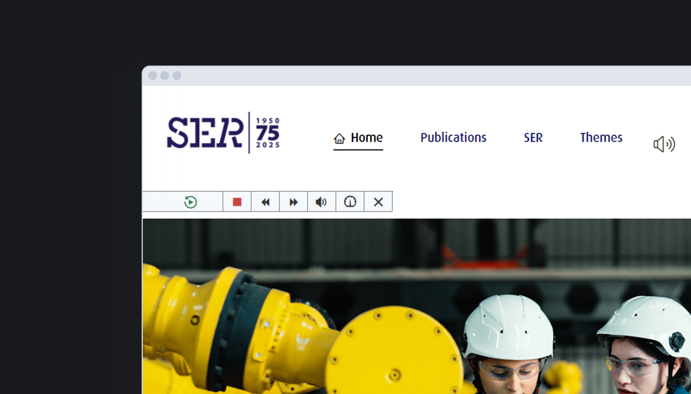
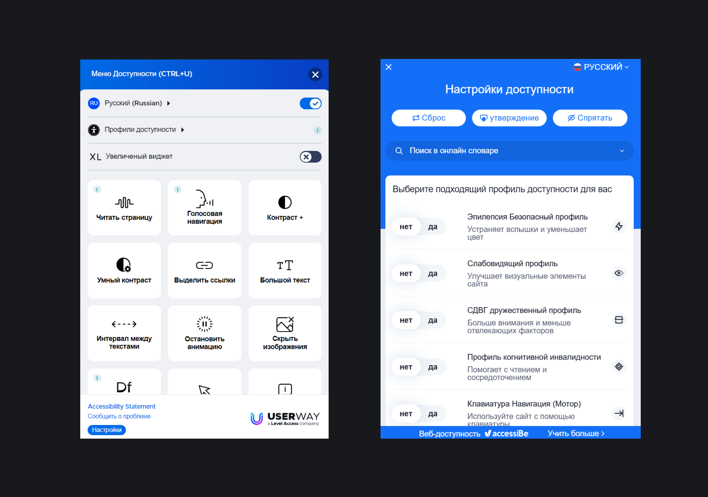
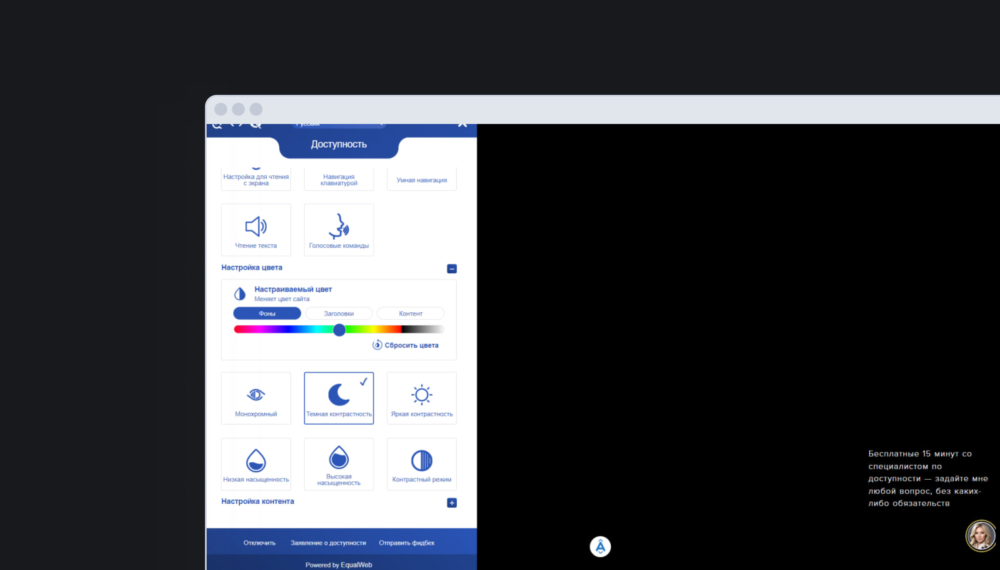
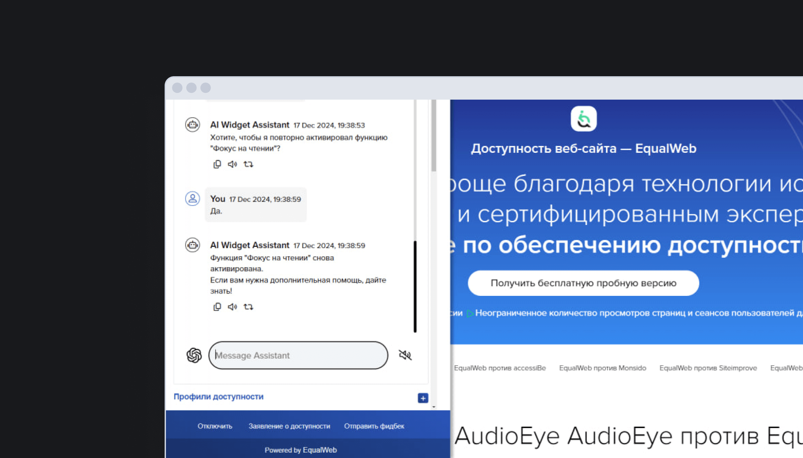
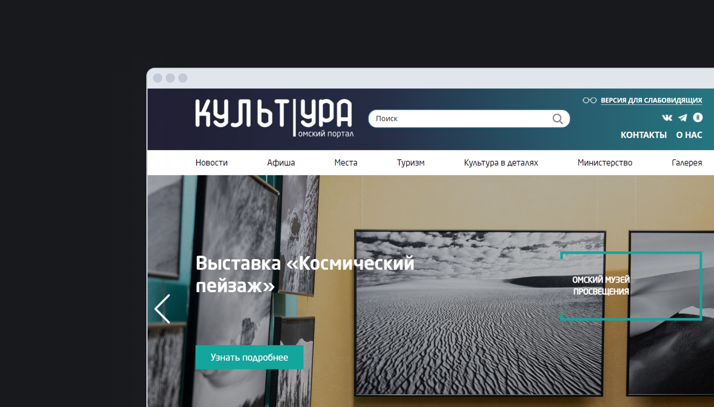

## Кратко

Некоторые считают, что проблемы с веб-доступностью можно решить с помощью специальных программ, плагинов и отдельных версий сайта для слабовидящих и незрячих пользователей. Можно ли улучшить доступность автоматически и насколько это хорошая практика, изучим в статье.

## Оверлеи

_Оверлеи (accessibility overlays, widgets или plugins)_ — это сторонний JavaScript-код, который встраивается на сайт. Оверлей трансформирует отрисованный интерфейс сайта или приложения после его загрузки и добавляет новые функции прямо на страницу.

Первые инструменты для повышения доступности сайтов появились после того, как была завершена работа над первой версией [Руководств по обеспечению доступности веб-контента](/a11y/wcag/) (коротко WCAG). WCAG — основной отраслевой стандарт, определяющий требования к доступности в интернете.

Ранние продукты представляли собой дополнительные элементы управления интерфейсом, зачитывающие содержимое страницы вслух. Разработчики обещали, что такие инструменты приведут к автоматическому соответствию клиентских сайтов рекомендациям WCAG 1.0.

Настройку зачитывания содержимого можно всё ещё встретить на сайтах, в основном, государственных. Обычно переключатель оверлея находится в главном меню и выглядит как иконка с громкоговорителем. При включении оверлея появляется панель управления скоростью, громкостью и порядком чтения, а страница сразу начинает зачитываться.

Оверлеи позволяют увеличивать размер шрифта, изменять цвет и выравнивание текста, настраивать контрастность цветов или межбуквенное пространство. Примеры дополнительных функций оверлеев — увеличение элементов интерфейса, режим симуляции дальтонизма, выделение отдельных строк текста для людей с дислексией, добавление отсутствующего индикатора фокуса и пр.

Поставщики AccessiBe, AccessiWay, AudioEye, UserWay и других оверлеев обещают, что достаточно одной строчки JavaScript, чтобы автоматически устранить проблемы с качеством кода, улучшить дизайн интерфейса и привести сайты в _полное_ соответствие с требованиями законов. Компаниям, установившим оверлеи, больше ничего не нужно менять на сайтах. Попробуем разобраться, так ли это на самом деле.

### Плюсы и минусы

Для начала отметим плюсы. Оверлеи могут решить небольшое количество базовых проблем с контрастностью, величиной текста и клавиатурной навигацией по содержимому сайта.

Минусов у оверлеев гораздо больше.

**Оверлеи вмешиваются в процесс разработки**. Поставщики оверлеев утверждают, что всё, что нужно сделать клиенту, — это установить их продукт для мгновенного, круглосуточного и полного соответствия всем стандартам доступности. Так что для многих владельцев сайтов оверлеи выглядят как волшебная таблетка, которая «вылечит» сайт от проблем с доступностью. В результате владельцы сайтов, на которые встроены оверлеи, могут перестать следить за качеством кода. Это приводит к тому, что сайт становится ещё более недоступным. Пользователи с инвалидностью по-прежнему не получают полный и равный доступ к информации, как этого требуют законы.

К тому же, использование оверлеев означает финансовые расходы. Эти деньги можно было бы потратить на аудит и самостоятельное исправление проблем с доступностью.

**Оверлеи усиливают неравенство в доступе к сайтам**. Оверлеи могут дискриминировать пользователей с особыми потребностями. Если пользователю нужен более крупный текст, он нужен на всех сайтах и во всех приложениях. Когда человек использует высокую контрастность, режим должен поддерживаться во всех интерфейсах. Если пользователю нужно, чтобы текст на сайте зачитывался вслух, содержимое должно быть слышно везде.

Одни и те же функции оверлеев могут принести пользу одной группе пользователей, но снизить удобство интерфейса для других. Именно поэтому и существуют вспомогательные технологии. Пользователи с инвалидностью могут выбрать подходящую именно им вспомогательную технологию. Это может быть программа, функция в операционной системе или альтернативное устройство.

Из-за разнообразия в природе, причинах и степени инвалидности, а также из-за того, что у человека может быть несколько диагназов, ни один из представленных на рынке продуктов не может учесть все пользовательские предпочтения и особенности. Часть барьеров трудно или вообще невозможно устранить. Например, проблемы с доступностью для пользователей с деменцией, тревожными расстройствами или синдромом дефицита внимания (и гиперактивности).

**Оверлеи вносят поверхностные изменения на сайт**. Пока не существует технологий, позволяющих привести уже существующий интерфейс в полное соответствие с законами и стандартами без изменения кода, дизайна, содержимого и функций. Оверлеи не изменяют структуру страниц, поэтому сайты по умолчанию остаются недоступными.

Чтобы сделать интерфейс доступным, требуется время, деньги и изменение процесса разработки. Только эксперты по доступности могут действительно помочь компаниям выстроить процессы разработки таким образом, чтобы продукты получались доступными с самого начала.

**Оверлеи не делают доступным всё содержимое**. Они не исправят проблемы с доступностью для следующих типов содержимого:

- изображения, иконки и другие нетекстовые элементы (из-за проблем с распознаванием контекста);
- видео, аудио, электронные документы и стороннее содержимое;
- формы, например, подписи к полям, обработка ошибок;
- заголовки и их структура в документе;
- интерактивные элементы, например, добавить поддержку клавиатуры и установить правильный порядок фокуса.

**Оверлеи ухудшают пользовательский опыт**. Они отвлекают пользователей от взаимодействия с интерфейсом. К примеру, всплывающее окно может появиться в момент, когда пользователь начал выполнять важные действия. В мобильных версиях сайтов оверлей может занять большу́ю часть экрана, перекрыть другие элементы и так усложнить взаимодействие с интерфейсом.

**Оверлеи конфликтуют со вспомогательными технологиями**. Так как оверлеи в основном изменяют внешний вид страниц и не вносят важных изменений в код, они не решают проблем с доступностью для вспомогательных технологий. Более того, при автоматическом изменении кода может пострадать совместимость сайтов со вспомогательными технологиями, например, [скринридерами](/a11y/screenreaders/).

**Оверлеи добавляют ненужные функции**. Многие настройки в оверлеях бесполезны и избыточны. К примеру, режим высокого контраста уже есть в операционных системах. Размер шрифта легко увеличивается или уменьшается во всех браузерах, а режим экранной лупы есть у… экранной лупы. Если пользователи слушают содержимое, то у них есть скринридеры и режимы чтения в браузерах.

Часть функций оверлеев никак не влияет на пользовательский опыт. К примеру, чёрно-белый режим для людей с дальтонизмом. Пользователям, которые не различает все цвета, важнее контрастность текста и элементов.

**Оверлеи непредсказуемы и ненадёжны**. Так как оверлей — это JavaScript-код, на его работу могут влиять интернет-соединение и производительность устройства пользователя. Оверлей может вообще не загрузиться из-за блокировщика рекламы, самого браузера или бага.

Из-за багов в коде, в оверлеях работают не все настройки. К примеру, пользователи, выбрав режим повышенной тёмной контрастности, могут получить чёрный слой поверх всей страницы.

Часть настроек работает не так, как планировалось. Если пользователь с дислексией автоматически переведёт интерфейс на русский язык и включит OpenDyslexic, то шрифт применится только к знакам из латиницы. Когда пользователь увеличит шрифт, высоту строки и поменяет выравнивание текста, то интерфейс «поплывёт». Иконки останутся на прежних местах, текст уедет в сторону, а ссылки в меню не поместятся на строке и обрежутся. Выравнивание текста по левому краю вообще не сработает.

У оверлеев негибкая структура, а владельцы сайтов не могут исправить баги сами.

**Оверлеи работают нестабильно**. Функции оверлеев работают по-разному и не всегда лучше, чем системные или браузерные. Размер шрифта часто не увеличивается до одного и того же уровня. Например, в Allyable, AudioEye и UserWay текст увеличивается только до 200%, а в EqualWeb и MaxAccess — до 150%. Встроенные в Windows и macOS функции позволяют сильнее увеличить шрифт. Ни один из режимов высокой контрастности в оверлеях не предлагает такого разнообразия, детализации и гибкости в настройках, как в Windows.

**Оверлеи ухудшают производительность**. Оверлеи потребляют ресурсы системы. На слабых устройствах это может приводить к заметному снижению производительности, особенно в играх. Внутриигровые оверлеи, ориентированные на людей с дальтонизмом, потребляют ресурсы центрального процессора (CPU), графического процессора (GPU) и оперативную память (RAM), что может вызвать снижение качества рендеринга и торможение загрузки изображения.

**Оверлеи влияют на поисковую оптимизацию сайтов**. Так как оверлей — это дополнительный код, то может понадобиться дополнительное время на загрузку страниц. От этого ухудшается не только пользовательский опыт, но и [SEO-метрики](/html/seo-for-beginners/). Медленная скорость загрузки страницы и обработки поисковыми роботами понижают сайт в поисковой выдаче.

**Оверлеи не защищают компании от штрафов**. Ни один оверлей не поможет сделать сайт полностью соответствующим стандартам и законам. Следовательно, оверлеи не устраняют юридические риски в регионах и странах, где бизнес обязан делать доступные сайты.

В странах Европейского Союза и США действуют законы, требования которых должно соблюдать большинство частных компаний. Бизнес, игнорирующий законы, получает жалобы, затем судебные иски и потом платит штрафы.

В 2023 [Европейская комиссия заявила](https://www.edf-feph.org/publications/joint-statement-on-accessibility-overlays/), что не считает сайты с оверлеями соответствующими требованиям Директивы о веб-доступности (WAD), Европейского закона о доступности (EAA) и стандарта о закупках EN 301549.

В Штатах около 20% судебных исков касается сайтов с оверлеями, и их количество увеличивается. Например, в 2023 году открыто 449 судебных дел, а 2024 году — 503. Больше статистики по искам в Штатах найдёте на [UsableNet](https://info.usablenet.com/ada-website-compliance-lawsuit-tracker). Уже даже появились юридические фирмы, которые специально ищут сайты с оверлеями, подают в суд на их владельцев, выигрывают дела и получают за это деньги.

**Оверлеи создают угрозу безопасности данных**. Сторонний код на сайте создаёт риск несоблюдения правил хранения и конфиденциальности данных, а ещё не учитывает предпочтения конечных пользователей в объёмах информации, которой они делятся.

Так как поставщики оверлеев могут продавать данные пользователей, появляется риск нарушения Общего регламента по защите персональных данных (GDPR) и Закона Калифорнии о защите персональных данных (CCPA).

**Оверлеи преувеличивают свои возможности**. Поставщики оверлеев преувеличивают количество клиентов и возможности. Этим они создают впечатление, что их продукты популярнее, чем на самом деле.

<aside>

👩‍⚖️ Федеральная торговая комиссия, защищающая права потребителей в США, [оштрафовала accessiBe на 1 миллион долларов](https://www.ftc.gov/news-events/news/press-releases/2025/01/ftc-order-requires-online-marketer-pay-1-million-deceptive-claims-its-ai-product-could-make-websites/) за предоставление ложной гарантии полного соответствия рекомендациям WCAG.

</aside>

Часто утверждается, что повышение доступности сайта — это способ увеличить конверсию. На самом деле никто, тем более поставщики оверлеев, не предоставил доказательств, что внедрение доступности приводит к заметному увеличению конверсии.

На волне популярности искусственного интеллекта и машинного обучения, в сообществе начали говорить, что можно ещё быстрее устранить проблемы с веб-доступностью. Оверлеи подхватили идею и обещают автоматически обнаруживать и устранять ошибки теперь уже основе искусственного интеллекта.

Инструменты с машинным обучением под капотом могут устранить лишь небольшой процент барьеров. У владельцев сайтов может создаться ложное ощущение безопасности, потому что искусственный интеллект сделает всё сам. На практике оверлеи с элементами машинного обучения не обнаруживают сложных проблем с HTML, кастомными элементами и мультимедийным контентом.

Новые функции оверлеев, которые добавляют модели вроде ChatGPT, не всегда работают. Например, умный помощник может не справиться с включением режима фокуса для чтения.

«Умные» оверлеи продолжают ломать пользовательский опыт. Например, они могут сделать интерактивными не те элементы или неправильно описать картинку. Ручное тестирование и исправление багов всё ещё имеют решающее значение для обеспечения максимально возможного уровня доступности сайта. Так что оверлеи не могут заменить экспертов с их пониманием контекста и навыками решения проблем.

**Оверлеи не рекомендуют использовать эксперты**. На громкие заявления производителей оверлеев отреагировало профессиональное сообщество. Более 600 человек из 16 стран подписали заявление против оверлеев «[Overlay Factsheet](https://overlayfactsheet.com/en/)». В списке подписавших письмо не только эксперты по доступности, но и защитники прав людей с инвалидностью, юристы, авторы и редакторы технических спецификаций.

Пользователи доступных интерфейсов тоже критикуют оверлеи. Так, например, Национальная Федерация Незрячих США [призвала запретить использование оверлея AccessiBe](https://nfb.org/about-us/press-room/national-convention-sponsorship-statement-regarding-accessibe/) на американских сайтах.

## Отдельные версии сайтов

_Отдельная версия сайта_ — это одна или несколько страниц, которые находятся по отдельному URL-адресу. Отдельная версия может отличаться наполнением, например, наличием картинок. Ссылка на такую страницу обычно обозначается иконкой в виде очков и текстом «Аа», «Версия для слабовидящих» и т. д.

Особая версия страницы, как правило, — панель с настройками для выбора шрифта, его размера и изменения цветовой темы. Также на отдельной версии сайта отличное от оригинальной страницы расположение содержимого. Это призвано помочь слабовидящим пользователям избежать перегрузки ненужной информацией.

Пример отдельной версии сайта для пользователей со слепотой и слабовидящих можно увидеть на сайте [Омского портала культуры](https://kultura55.ru).

На первом скриншоте обычная версия сайта с изображениями в карусели.

На второй картинке отдельная версия для слабовидящих. На странице нет изображений, увеличен шрифт и установлена чёрно-белая цветовая тема. Дополнительно в отдельной версии сайта можно включить или отключить отрисовку изображений, поменять цветовую тему, величину шрифта и межбуквенное пространство, выбрать тип шрифта (с засечками или без) и изменить межстрочный интервал.

### Достоинства и недостатки

Единственный плюс отдельных версий сайтов — возможность настроить шрифты и цвета под себя. Плюс может стать минусом: пользователи уже могут этим управлять в настройках браузеров или с помощью расширений и плагинов.

Минусов у отдельных версий сайтов для слабовидящих гораздо больше.

Главная проблема отдельных версий заключается в том, что основной сайт всё так же остаётся недоступным. При этом пользователь должен каким-то образом узнать специальной версии страницы и перейти на неё, как правило, с клавиатуры. Если сайт плохо свёрстан, это может стать проблемой.

Следующая проблема — нужно поддерживать две версии сайта вместо одной, а это затратно. Так что существует вероятность того, что отдельная версия будет постоянно устаревать.

Отдельные версии не учитывают потребностей всех пользователей. Например, людей с особенностями цветового восприятия, астигматизмом, дислексией и другими нейроотличиями. Отдельная версия также не решает проблемы пользователей, у которых несколько видов инвалидности.

Разные версии сайта — это сегрегация и дискриминация пользователей. Часто на специальных страницах для слабовидящих меньше изображений или нет совсем, в отличие от обычных. Получается, людям предлагают неполный контент и решают, что им не нужна графика. В последнем госте 52872-2019 указано, что отдельные версии сайтов доступны _только_ для людей со слепотой и слабовидящих.

В идеальной ситуации пользователи должны сами выбирать то, какое содержимое они хотят увидеть и какие настройки использовать. Почитать подробнее про то, в чём проблема разных версий одной страницы, можно в [посте Шери Бёрн-Хабер](https://sheribyrnehaber.medium.com/accessibility-separate-but-equal-is-never-ok-e6e97d893d11).

<aside>

🤖 На российском рынке появились аналоги оверлеев, которые обещают просто и эффективно решить проблемы с доступностью. Прежде всего это плагины и скрипты в конструкторах сайтов. Например, модуль «Мибок: Версия для слабовидящих» в WordPress. Этот модуль автоматически генерирует отдельную версию сайта.

</aside>

## Выводы

Попытки решить проблему доступности интерфейсов с помощью оверлеев или отдельных версий сайтов понятны, но закладывать доступность проще и выгоднее изначально, начиная с продуманного дизайна и заканчивая тщательным тестированием.

Готовые и автоматические решения не удовлетворяют потребности всех пользователей с особыми потребностями. Доступные интерфейсы нужны не только незрячим и слабовидящим людям, но и тем, у кого другие особенности визуально восприятия или когнитивные способности. Многие сталкиваются с барьерами ситуативно. Например, когда сломают руку или воспользуются телефоном при ярком освещении. Сайты и приложения важно адаптировать под разные потребности их пользователей.
