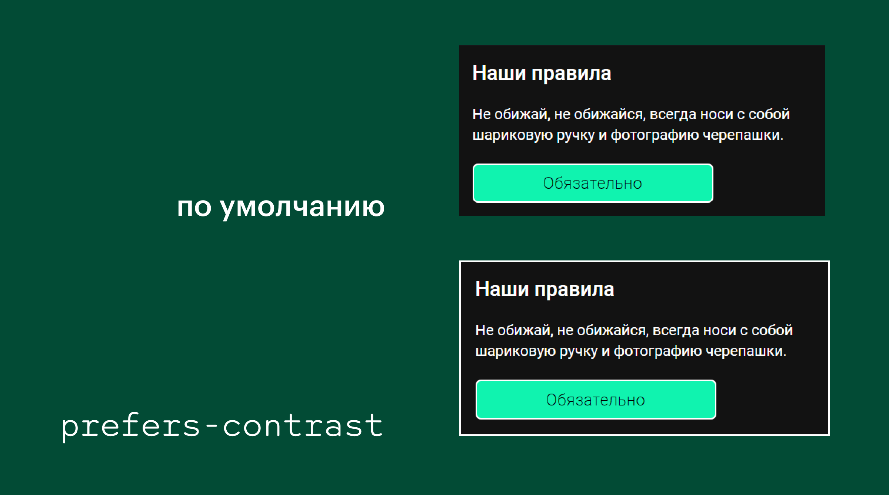

## Кратко

Одно из значений [директивы `@media`](/css/media/) для проверки пользовательских настроек. Отслеживает выбор настроек контрастности в системе.

## Пример

```css
@media (prefers-contrast: more) {
  .image {
    border: 3px solid #000000;
  }
}
```

Давайте зададим модальному окну белую рамку, когда контрастность в системе понижена.

```css
@media (prefers-contrast: more) {
  .dialog {
    border: 2px solid #FFFFFF;
  }
}
```

<iframe title="Поддержка режима увеличенной контрастности" src="demos/dialog-window/" height="300"></iframe>

Если заглянете в демку со включённым режимом повышенной контрастности, у модального окна появится белая обводка.



## Как пишется

У `prefers-contrast` несколько значений:

- `no-preference` — настройки контрастности по умолчанию;
- `more` — контрастность увеличена;
- `less` — контрастность понижена;
- `custom` — выбран [режим принудительных цветов](/a11y/forced-colors/). Например, режим высокой контрастности Windows.

### Поддержка браузерами

На октябрь 2024 года `prefers-contrast` поддерживается [всеми популярными браузерами](https://caniuse.com/?search=prefers-contrast), включая последние версии Chrome, Firefox и Safari. Поддержка в старых версиях браузеров не такая впечатляющая. Для максимальной совместимости используйте директиву [`@supports`](/css/supports/), которая проверяет поддержку CSS-свойств браузерами (feature detection).

### Тестирование и эмуляция

Можете тестировать условие `prefers-contrast` в браузере или повысив, или понизив уровень контрастности интерфейса в системе.

В браузерах на Chromium (например, Chrome и Edge) откройте инструменты разработчика (<kbd>F12</kbd>), зайдите в «Другие инструменты» (More tools) и выберите вкладку «Отрисовка» (Rendering). Во вкладке найдёте опцию «Эмулировать медиафункцию CSS prefers-contrast» (Emulate CSS media feature prefers-contrast).

В операционных системах настройки прозрачности находятся в разделах доступности и специальных возможностей.

<details>
  <summary>macOS</summary>

Системные настройки (System preferences) → Универсальный доступ (Accessibility) → Монитор (Display) → Увеличить контрастность (Increase contrast).
</details>

<details>
  <summary>iOS</summary>

Настройки (Settings) → Универсальный доступ (Accessibility) → Дисплей и размер текста (Display & text size) → Увеличение контраста (Increase contrast).
</details>

## Как понять

`prefers-contrast` отслеживает любые настройки контрастности, не только режим принудительных цветов (повышенная контрастность) как `forced-colors`.

Директива `prefers-contrast` полезна для повышения уровня [доступности сайтов](/a11y/chto-takoe-a11y/). `prefers-contrast` позволяет разработчикам адаптировать стили в зависимости от предпочтений пользователей, особенно людей с ослабленным зрением. Например, увеличение контрастности упрощает восприятие информации, а уменьшение — снимает напряжение с глаз.

## Советы

💡 Пользователи могут изменить настройки контрастности на уровне системы, поэтому убедитесь, что сайт корректно реагирует на эти изменения.

💡 Тестируйте ваш дизайн с разными значениями `prefers-contrast`. Так проверите, насколько дизайн доступен и как обстоят дела с юзабилити в различных режимах.

💡 Для создания комплексных и адаптивных дизайнерских решений используйте вместе с `prefers-contrast` другие значения директивы `@media`.
