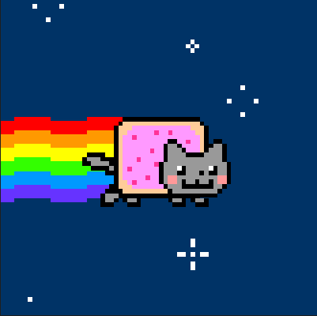

## Кратко

Одно из значений директивы [@media](/css/media/) для проверки пользовательских настроек воспроизведения анимации.
Большинство современных OS позволяют пользователю настраивать параметры анимации в настройках системы. Медиа-запрос `prefers-reduced-motion` позволяет определить, отключена ли или уменьшена анимация в системе, и применять стили CSS, которые это учитывают.

С помощью `prefers-reduced-motion` можно замедлить или полностью отключить анимацию для людей, которые не хотят её видеть.
В примере добавляем плавную прокрутку только для пользователей, у которых не отключена анимация на уровне системы.

```css
@media (prefers-reduced-motion: no-preference) {
  html {
    scroll-behavior: smooth;
  }
}
```

## Как пишется

У `prefers-reduced-motion` есть два значения:

- `no-preference` — настройки анимации по умолчанию.
- `reduce` — анимация отключена.

## Зачем?

Пользователь может отключить анимацию по разным причинам, например:

- не все люди воспринимают анимацию одинаково. То, что может показаться плавным и приятным глазу одним, может раздражать или отвлекать других (мигающая реклама, сложные параллаксы, автовоспроизведение видео);

- медицинские аспекты: у некоторых людей могут быть [вестибулярные расстройства](https://www.a11yproject.com/posts/understanding-vestibular-disorders/), при которых даже простая анимация может вызывать головокружение, чувство тошноты или вызывать судороги;

- сайты с большим количеством анимации могут быстро снижать заряд батареи девайсов или использовать больше трафика (например, для автовоспроизведения видео потребуется больше данных, чем для показа статического изображения).

## Примеры использования
### Пример 1: Отключаем или замедляем анимацию на элементе

Чтобы отключить анимацию элемента или изменить её скорость, если пользователь явно настроил предпочтение для её уменьшения, можно прописать в CSS следующее:

```css
.button {
  /*  Весёлая анимация трясущейся кнопки */
  animation: shake 300ms linear infinite both;
}

/*  Полностью отключает анимацию */
@media (prefers-reduced-motion: reduce) {
  .button {
    animation: none;
  }
}

/* Замедляет анимацию в 2 раза */
@media (prefers-reduced-motion: reduce) {
  .button {
    animation: shake 600ms linear infinite both;
  }
}
```

И наоборот, можем проигрывать анимацию только в том случае, если у пользователя нет предпочтений в показе анимации:

```css
@media (prefers-reduced-motion: no-preference) {
  .button {
    animation: shake 300ms linear infinite both;
  }
}
```

При втором способе записи есть 2 преимущества:
- меньше кода;
- старые браузеры, которые не поддерживают `prefers-reduced-motion`, просто проигнорируют это правило и отобразят только оригинальный элемент без анимации.


### Пример 2: Плавная прокрутка

```css
html {
  scroll-behavior: smooth;
}
```

Если установить [scroll-behaviour: smooth](/css/scroll-behavior/) на [`<html>`](/html/html/), то когда пользователь нажмёт на [якорную ссылку](/html/a/), страница плавно прокрутится до нужной позиции на странице.

К сожалению, в CSS пока нет никакого контроля над скоростью прокрутки страницы. Если страница длинная, то прокрутка может быть очень быстрой, что может оказаться довольно неприятным опытом для людей с чувствительностью к резкой анимации.

Можно обернуть [scroll-behavior](/css/scroll-behavior/) в медиа-запрос, чтобы предотвратить применение плавной прокрутки и просто открыть страницу в нужном месте, если пользователь указал свои предпочтения для снижения уровня анимированности:

```css
@media (prefers-reduced-motion: no-preference) {
  html {
    scroll-behavior: smooth;
  }
}
```

#### А что с JS?

Если необходимо узнать предпочтения по анимации средствами JavaScript, сделать это можно с помощью [matchMedia](/js/match-media/). Так выглядит эта же настройка поведения прокрутки в JS:

```javascript
const prefersReducedMotion = window.matchMedia('(prefers-reduced-motion: reduce)')

a.addEventListener('click', () => {
  const behavior = prefersReducedMotion.matches ? 'auto' : 'smooth'

  window.scrollTo({
    x: 0,
    y: 0,
    behavior
  })
})
```

### Пример 3: Оптимизация загрузки стилей и библиотек для анимации

Если у вас много CSS, связанного с анимацией, можно вынести стили для её воспроизведения в отдельный файл и не грузить его пользователям, которые отказались от анимации:

```javascript
<link rel="stylesheet" href="animations.css" media="(prefers-reduced-motion: no-preference)">
```

Похожим способом можно предотвратить и загрузку тяжёлых библиотек для анимаций. В примере ниже, если пользователь предпочитает уменьшить количество анимации, то функция сделает return и её выполнение прервётся, благодаря чему не произойдёт импорт [Greensock](https://greensock.com/).

```javascript
const prefersReducedMotion = window.matchMedia('(prefers-reduced-motion: reduce)')

const loadGSAPAndInitAnimations = () => {
  if (prefersReducedMotion.matches) return;

  import('gsap').then((object) => {
    const gsap = object.default;
    /* Здесь инициализируем анимацию с использованием GSAP */
  })
};

loadGSAPAndInitAnimations();
```

<aside>

❗️ Обратите внимание, что корректный синтаксис включает круглые скобки:

```javascript
window.matchMedia('(prefers-reduced-motion: reduce)');

 // Так работать не будет!
 window.matchMedia('prefers-reduced-motion: reduce');
```

</aside>

## Поддержка
Имеет [отличную](https://caniuse.com/prefers-reduced-motion) поддержку всеми современными браузерами — глобальная поддержка 95.53%.

## Как изменить предпочтения показа анимации в OS?
В разных OS настройки могут располагаться в разных местах, но искать их нужно в разделах, которые связаны с доступностью и специальными возможностями. В некоторых системах движение можно уменьшить, в других анимация отключается полностью (например, Windows 10).


<details>
  <summary>Windows 10</summary>

  Настройки > Лёгкость доступа > Дисплей > Показать анимацию в Windows

</details>

<details>
  <summary>Windows 11</summary>

  Настройки > Универсальный доступ > Визуальные эффекты > Эффекты анимации

</details>

<details>
  <summary>macOS</summary>

  Системные настройки > Специальные возможности > Дисплей > Уменьшить движение

</details>

<details>
  <summary>iOS</summary>

  Настройки > Основные > Универсальный доступ > Уменьшить движение

</details>

<details>
  <summary>Android 9+</summary>

  Настройки > Специальные возможности > Удалить анимацию.

</details>

## Тестирование и эмуляция настройки

Если хочется посмотреть, как работает `prefers-reduced-motion`, но в настройки OS лезть не хочется, в браузерах на Chromium или Edge можно эмулировать её включение.

### Chrome

1. Откройте средства разработчика (`F12`)
2. Зайдите в «Другие инструменты» (More tools)
3. Выберите вкладку «Отрисовка» (Rendering)
4. Включите «Эмулировать медиафункцию CSS prefers-reduce-motion» (Emulate CSS media feature prefers-reduce-motion).

### Edge

1. Откройте средства разработчика (`F12`) и нажмите `CTRL+SHIFT+P` в Windows/Linux или `COMMAND+SHIFT+P` в macOS — откроется меню Команд.

2. Начните вводить **"reduced"** и выберите [«Эмулировать CSS prefers-reduced-motion»](https://learn.microsoft.com/ru-ru/microsoft-edge/devtools-guide-chromium/accessibility/reduced-motion-simulation-images/reduced-motion-command-menu-entry.png), после чего нажмите Enter.

Посмотрите, проигрывается ли анимация ниже. При активном режиме котик должен быть статичным.


<picture>

  <source
    srcset="images/nyancat.gif"
    type="image/gif"
    media="(prefers-reduced-motion: no-preference)"
    width="250"
    height="250"
  />
  

</picture>

```html
<picture>
  <!-- Анимированный котик -->
  <source
    srcset="nyancat.gif"
    type="image/gif"
    media="(prefers-reduced-motion: no-preference)"
  />
  <!-- Статичный котик -->
  
</picture>
```

## Ссылки

- [MDN](https://developer.mozilla.org/en-US/docs/Web/CSS/@media/prefers-reduced-motion)
- [prefers-reduced-motion: Sometimes less movement is more](https://web.dev/prefers-reduced-motion/)
- [Respecting Users’ Motion Preferences](https://www.smashingmagazine.com/2021/10/respecting-users-motion-preferences/)
