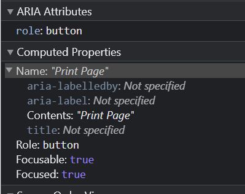

## Кратко

[ARIA-роль виджета](/a11y/aria-roles/#roli-vidzhetov) для кнопки. Роль `button` по умолчанию есть у [`<button>`](/html/button/), [`<summary>`](/html/details/) и [`<input>`](/html/input/) c типами `button`, `image`, `reset`, `submit`.

<aside>

⚠️ Обратите внимание, что явная роль `button` даст [скринридеру](/a11y/screenreaders/) понять, что это кнопка, но у неё нет функциональности тега [`<button>`](/html/button/).

</aside>

## Пример

```html
<div role="button" tabindex="0">Нажми меня</div>
```

<iframe title="Кастомная кнопка с обработчиками клавиш" src="demos/button-with-interaction/" height="150"></iframe>

## Как пишется

Добавьте к тегу `role="button"` и [`tabindex="0"`](/html/global-attrs/#tabindex), чтобы на кнопку можно было установить фокус. Лучше, чтобы это были семантически нейтральные [`<div>`](/html/div/) или [`<span>`](/html/span/). Одно из [правил использования ARIA](/a11y/aria-intro/#pravila-ispolzovaniya) — не перезаписывать роли без необходимости.

Элемент с ролью кнопки должен иметь доступное имя. Это значит, что у кнопки обязательно должен быть текст внутри или атрибуты [`aria-label`](/a11y/aria-label/), [`aria-labelledby`](/a11y/aria-labelledby/) или [`aria-describedby`](/a11y/aria-describedby/) с текстом и таким же ID как у кнопки.

```html
<div role="button" tabindex="0" aria-label="Лайкнуть">❤️</div>
```

В инструментах разработчика в браузере во вкладке «Доступность» (accessibility) найдёте порядок, в котором браузер определяет имя элемента:



Если у кнопки есть текст внутри, не перезаписывайте его значение через [`aria-label`](/a11y/aria-label/):

```html
<!-- ⛔ Так лучше не делать -->
<button aria-label="Принимаю условия соглашения">Согласен</button>
```

Также необходимо прописать поведение кнопки на нажатие клавиш <kbd>Enter</kbd> и <kbd>Space</kbd> через JavaScript.

Нативная кнопка нажимается столько, сколько зажимаете и не отпускаете <kbd>Enter</kbd>. Если нажали на <kbd>Space</kbd>, то кнопка срабатывает только после того, как отпустили клавишу. Чтобы воспроизвести нативное поведение кнопки, слушайте события [`keydown`](/js/element-keydown/) при нажатии на <kbd>Enter</kbd> и [`keyup`](/js/element-keyup/) для <kbd>Space</kbd>

Для `button` можно использовать все [глобальные ARIA-атрибуты](/a11y/aria-attrs/#globalnye-atributy) и пару [атрибутов виджетов](/a11y/aria-attrs/#atributy-vidzhetov):

- [`aria-disabled`](/a11y/aria-disabled/), если у кнопки есть неактивное состояние `disabled` и оно меняется.
- [`aria-expanded`](/a11y/aria-expanded/), если кнопка раскрывает какой-то блок текста или другого содержимого или вызывает попап, выпадающее меню или является его частью. Обычно используется в связке с `aria-haspopup`.
- [`aria-haspopup`](/a11y/aria-haspopup/), когда кнопка открывает попап, выпадающее меню или является его частью.
- [`aria-pressed`](/a11y/aria-pressed/), когда кнопка переключатель — тогл.

<iframe title="Кнопка-переключатель" src="demos/button-toggle/" height="150"></iframe>

## Как понять

Роль нужна для создания кнопок — элементов, при взаимодействии с которыми происходят какие-то действия. Например, открывается модальное окно, отправляются данные из формы, скрывается или показывается блок текста и другое.

## Подсказки

💡 Если используете кнопку для раскрытия и скрытия блока с текстом, прочитайте про теги [`<details>` и `<summary>`](/html/details/). Возможно, они лучше подойдут.

💡 Если добавляете `aria-role="button"` для тега ссылки [`<a>`](/html/a/), то нужно прописать только обработчик на <kbd>Space</kbd>. Активация на <kbd>Enter</kbd> — стандартное поведение для ссылки.

💡 Используйте семантические элементы там, где это возможно. Так создадите доступные элементы без JavaScript.
