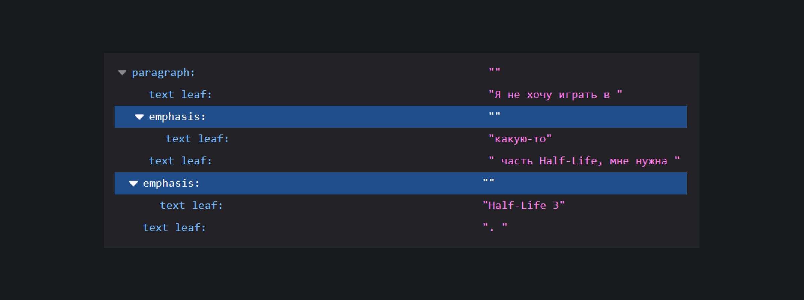
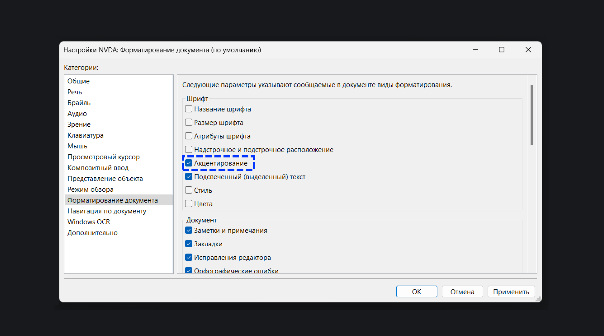

## Кратко

[Роль структуры документа](/a11y/aria-roles/#roli-struktury-dokumenta) из [WAI-ARIA](/a11y/aria-intro/#specifikaciya). Ставит логическое ударение на слово или фразу, то есть выделяет одно или нескольких слов по смыслу среди других.

В HTML роль `emphasis` уже есть у тега [`<em>`](/html/em/).

## Пример

```html
<p>
  Я не хочу <span role="emphasis">рубить</span> ёлку.
</p>
```

## Как пишется

Добавьте к [`<div>`](/html/div/) или [`<span>`](/html/span/) атрибут `role` со значением `emphasis`. Можете задавать роль и другим тегам. Главное, чтобы это был неинтерактивный элемент с коротким текстом. То есть, нельзя использовать `emphasis` в кнопках, ссылках или таблицах.

Элементам с ролью `emphasis` можно задавать почти все [глобальные ARIA-атрибуты](/a11y/aria-attrs/#globalnye-atributy), кроме [`aria-label`](/a11y/aria-label/), [`aria-labelledby`](/a11y/aria-labelledby/) и [`aria-braillelabel`](/a11y/aria-braillelabel/).

На практике `emphasis` нигде не пригодится. Современные браузеры без проблем определяют эту роль у элемента `<em>`:

```html
<p>
  Я не хочу играть в <em>какую-то</em> часть Half-Life,
  мне нужна <em>Half-Life 3</em>.
</p>
```

<iframe title="Текст с элементом em" src="demos/text-with-em-element/" height="360"></iframe>

Загляните в инструменты разработчика, чтобы убедиться, что Firefox вычислил роль `emphasis` у фразы «Half-Life 3».



[Скринридеры](/a11y/screenreaders/) тоже знают о встроенной роли `<em>` с самого начала. Программы не объявляют название роли при чтении текста со смысловым ударением, но могут поменять интонацию. По умолчанию настройка чтения с интонацией выключена, поэтому её нужно включать вручную.



## Особенности

Скринридеры неохотно выделяют слова интонацией, потому что раньше разработчики злоупотребляли `<em>`. Из-за этого современные вспомогательные технологии выделят `<em>` или `<span role="emphasis">` голосом _только_ если им задано CSS-свойство [`font-style: italic`](/css/font-style/) 🤪

```html
<p>
  Она просто <span role="emphasis">обожает</span>
  сырники со сметаной.
</p>
```

```css
[role="emphasis"] {
  font-style: italic;
}
```

<iframe title="Текст с ролью emphasis и свойством font-style" src="demos/text-with-italic-style/" height="360"></iframe>

## Как понять

Роль `emphasis` выделяет слово или фразу среди остального текста. Её используют, когда слово изменяет смысл фразы. Сравните два предложения: «Это _ты_ съел все конфеты?» и «Это ты съел _все_ конфеты?».

Место, куда ставить логическое ударение, зависит от языка текста.
