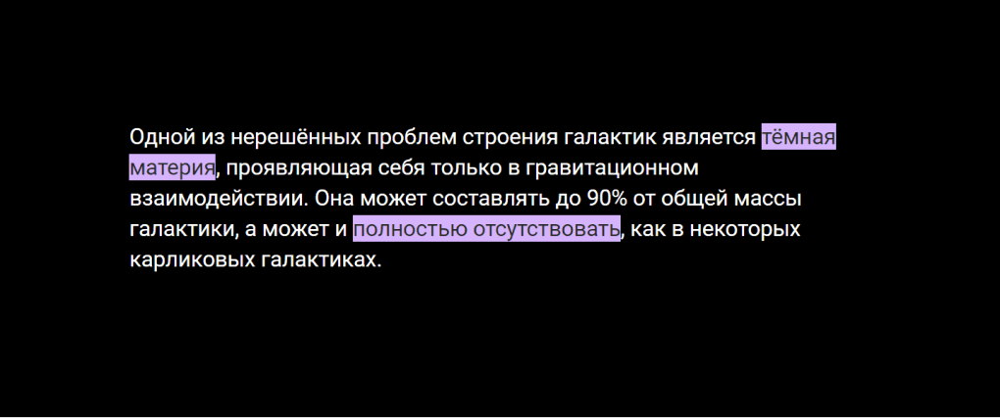

## Кратко

[ARIA-роль структуры документа](/a11y/aria-roles/#ustarevshie-i-nestandartnye-roli), которая определяет выделенный или подсвеченный важный фрагмент текста.

Эквивалент в HTML — [`<mark>`](/html/mark/).

<aside>

👶 Эта роль из черновика [ARIA 1.3](https://w3c.github.io/aria/). Она пока плохо поддерживается и сейчас её лучше не использовать.

</aside>

## Пример

```html
<p>
  Одной из нерешённых проблем строения галактик является
  <span role="mark" class="mark">тёмная материя</span>,
  проявляющая себя только в гравитационном взаимодействии.
  Она может составлять до 90% от общей массы галактики, а может
  и <span role="mark" class="mark">полностью отсутствовать</span>,
  как в некоторых карликовых галактиках.
</p>
```

`mark` не изменяет внешний вид элемента, так что нужно не забывать самим добавлять стили с помощью CSS.

```css
.mark {
  background-color: #FFFFFF;
}
```

<iframe title="Элементы с ролью mark и кастомными стилями" src="demos/text-with-role-mark/" height="500px"></iframe>

## Как пишется

Задайте любому статичному HTML-тегу или ARIA-роли `role="mark"`, лучше всего семантически нейтральным [`<span>`](/html/span/) или [`<div>`](/html/div/).

Пока скринридеры и другие вспомогательные технологии никак не обозначают выделения в тексте, в том числе с помощью интонации. Если это крайне важное выделение в тексте, используйте хак с псевдоклассами [`::before`](/css/before/), [`::after`](/css/after/) и свойством [`content`](/css/content/):

```css
span[role="mark"]::before {
  content: " [начало выделения] ";
}

span[role="mark"]::after {
  content: " [конец выделения] ";
}
```

Благодаря этому трюку пользователи узнают о выделениях в тексте, если в скринридере выбрана специальная настройка, благодаря которой технология зачитывает содержимое из `content`.

### Особенности использования

Если поддерживаете режим высокой контрастности в Windows, не забудьте задать элементу `mark` системный цвет с помощью [значения `forced-colors`](/a11y/forced-colors/) у [директивы `@media`](/css/media/). Благодаря этому цвет выделения заменится на системный и будет таким же контрастным, как остальные цвета.

```css
@media (forced-colors: active) {
  span[role="mark"] {
    color: HighlightText;
    background-color: Highlight;
  }
}
```

Например, в теме «Ночное небо» элементы с ролью `mark` будут выделятся фиолетовым цветом.



## Как понять

ARIA-роли помогают только вспомогательным технологиям. `mark` не изменяет внешний вид элемента и не добавляет никакую функциональность. В большинстве случаев лучше использовать тег `<mark>`.
