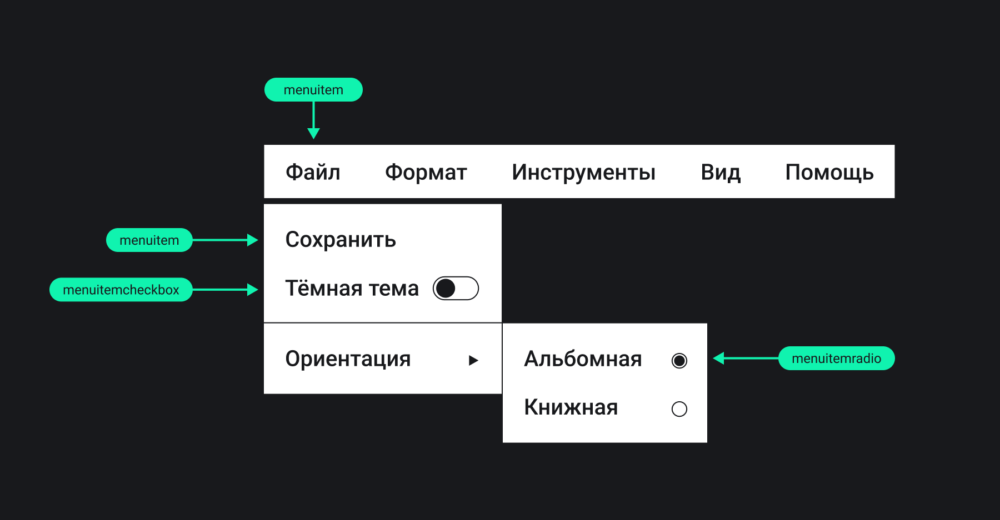

## Кратко

[Самостоятельная роль виджета](/a11y/aria-roles/#roli-vidzhetov) из [WAI-ARIA](/a11y/aria-intro/#specifikaciya) для пункта строки меню или из связанного со строкой подменю.

В HTML нет тега с ролью `menuitem`.

## Пример

```html
<div role="menubar">
  <button
    role="menuitem"
    type="button"
    aria-expanded="false"
    aria-haspopup="menu"
    aria-controls="fonts"
  >
    Начертание
  </button>

  <ul
    role="menu"
    id="fonts"
  >
    <!-- Пункты подменю -->
  </ul>

  <!-- Другие пункты строки меню -->

  <button
    role="menuitem"
    type="button"
    tabindex="-1"
  >
    Новая дока
  </button>
</div>
```

<iframe title="Меню веб-редактора текста" src="demos/app-menu/" height="600"></iframe>

## Как пишется

Задайте `role="menuitem"` любому тегу. Это может быть [`<div>`](/html/div/), [`<span>`](/html/span/), [`<li>`](/html/li/) и даже [`<button>`](/html/button/).

Пункты `menuitem` должны находиться внутри строки меню [`menubar`](/a11y/role-menubar/) или в подменю [`menu`](/a11y/role-menu/). При этом они могут располагаться отдельно или группироваться внутри другого элемента-обёртки [с ролью `group`](/a11y/role-group/).

```html
<div role="menubar">
  <span
    role="menuitem"
    tabindex="0"
  >
    Редактирование
  </span>

  <div role="group">
    <span
      role="menuitem"
      tabindex="-1"
    >
      Помощь
    </span>
    <span
      role="menuitem"
      tabindex="-1"
    >
      Клавиатурные сокращения
    </span>
  </div>

  <span
    role="menuitem"
    tabindex="-1"
  >
    Сохранение
  </span>
</div>
```

У `menuitem` обязательно должно быть имя — краткое название, которое описывают цель пункта меню. Лучше всего добавлять видимые подписи, как «Начертание» в этом примере:

```html
<span
  role="menuitem"
  tabindex="0"
>
  Начертание
</span>
```

Другой способ добавить имя пункту меню, о котором будет знать только [скринридер](/a11y/screenreaders/), — атрибут [`aria-label`](/a11y/aria-label/):

```html
<span
  role="menuitem"
  aria-label="Начертание"
  tabindex="0"
>
  <!-- Иконка -->
</span>
```

Пунктам `menuitem` можно задавать все [глобальные ARIA-атрибуты](/a11y/aria-attrs/#globalnye-atributy), а также некоторые [атрибуты виджетов](/a11y/aria-attrs/#atributy-vidzhetov):

- [`aria-disabled`](/a11y/aria-disabled/) — неактивный пункт.
- [`aria-expanded`](/a11y/aria-expanded/) — пункт, раскрывающий попап.
- [`aria-haspopup`](/a11y/aria-haspopup/) — тип попапа, который раскрывает пункт. Это может быть подменю `menu`, диалоговое окно [`dialog`](/a11y/role-dialog/), выпадающий список [`listbox`](/a11y/role-listbox/), древовидный список [`tree`](/a11y/role-tree/) или сетка [`grid`](/a11y/role-grid/).
- [`aria-setsize`](/a11y/aria-setsize/) — сколько всего пунктов в группе с учётом тех, которых пока нет на странице.
- [`aria-posinset`](/a11y/aria-posinset/) — порядковый номер или положение пункта меню в группе, пока его нет на странице.

### Навигация с клавиатуры

По пунктам строки меню `menubar` перемещаются стрелками влево <kbd>←</kbd> и вправо <kbd>→</kbd>, а внутри `menu` — стрелками вверх <kbd>↑</kbd> и вниз <kbd>↓</kbd>. Для перехода к первому пункту используют <kbd>Home</kbd>, к последнему — <kbd>End</kbd>.

Дополнительно можно отслеживать нажатие на клавиши с буквами и символами при фокусе на строке меню или в подменю. Пользователи смогут быстро переместиться к нужным пунктам, которые начинаются со знака с нажатой клавиши. Например, попасть на пункт «Настройки» при нажатии на клавишу <kbd>H</kbd>.

#### Поведение кнопки

Если задаёте роль `menuitem` неинтерактивным тегам вроде `<div>` или `<span>`, не забудьте сделать их кнопками с точки зрения их поведения. Тут не обойтись без JavaScript.

Настоящие кнопки [`<button>`](/html/button/) срабатывают при нажатии <kbd>Enter</kbd> и пробела, а также при клике и тапе на них. Кнопка нажимается столько, сколько зажимаете и не отпускаете <kbd>Enter</kbd> (событие `keydown`). Если нажали на пробел (событие `keyup`), то действие с кнопкой срабатывает после того, как отпустили клавишу.

#### Управление фокусом

Полностью кастомные пункты `menuitem` также нужно добавить в порядок фокуса с помощью [`tabindex`](/html/global-attrs/#tabindex) со значенем `-1` по умолчанию. Когда пользователь сделал фокус на пункте, меняйте значение на `0`. Имейте в виду, что только у **одного** пункт может быть нулевое значение `tabindex`.

## Как понять

Пункты меню обычно раскрывают попапы или изменяют что-то в интерфейсе. `menuitem` по желаемому поведению и свойствам похожа на другую [роль `button`](/a11y/role-button/), которая по умолчанию есть у одноимённого тега `<button>`.  Некоторые [Accessibility API](/a11y/screenreaders/#accessibility-api) даже вычисляют в случае пунктов строк меню и подменю роль `menubutton`.

`menuitem` — базовый элемент строки меню. Два других — [`menuitemcheckbox`](/a11y/role-menuitemcheckbox/) и [`menuitemradio`](/a11y/role-menuitemradio/). Обычные пункты меню внешне похожи на кнопки или вкладки, `menuitemcheckbox` — на чекбоксы, а `menuitemradio` — на радиокнопки.


