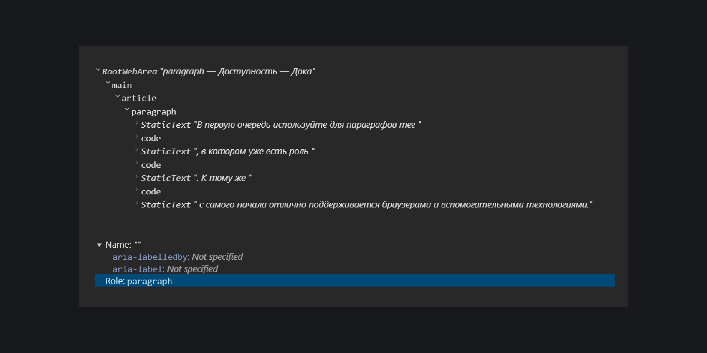

## Кратко

[Роль структуры документа](/a11y/aria-roles/#roli-struktury-dokumenta) из [WAI-ARIA](/a11y/aria-intro/#specifikaciya) для параграфа или абзаца текста.

В вебе параграф и абзац — одно и то же. Это блок текста, который окружён пустыми строками перед и после него.

В HTML для параграфов используют тег [`<p>`](/html/p/).

## Как пишется

В первую очередь используйте для параграфов тег `<p>`, в котором уже есть роль `paragraph`. К тому же `<p>` с самого начала отлично поддерживается браузерами и вспомогательными технологиями.

Откройте эту доку в инструментах разработчика в Chrome и зайдите в превью [дерева доступности](/a11y/a11y-tree/). В превью заметите у каждого `<p>` роль `paragraph`.



Спецификация по ARIA разрешает задавать `role="paragraph"` для [`<div>`](/html/div/) или [`<span>`](/html/span/), но в этом нет смысла. [Скринридеры](/a11y/screenreaders/) всё равно не объявляют роль параграфа, когда зачитывают текст со страницы.

```html
<!-- В этом нет смысла -->

<span role="paragraph">
  Если вообще логику признают наукой о мышлении, то под этим понимают, что
  это мышление составляет голую форму некоторого познания, что логика
  абстрагируется от всякого содержания, и так называемая вторая составная
  часть всякого познания, материя, должна быть дана откуда-то извне, что,
  следовательно, логика, от которой эта материя совершенно независима, может
  только указать формальные условия истинного познания, но не может содержать
  самое реальную истину, не может даже быть путём к реальной истине, так как
  именно суть истины, содержание, находится вне её.
</span>
```

При этом пользователи скринридеров могут перемещаться по параграфам с помощью горячих клавиш. Например, в JAWS для навигации по параграфам используют клавишу <kbd>P</kbd>.

Внутрь элемента с ролью `paragraph` можете вкладывать только строки текста. Если решите обмануть систему и вложить, например, список в параграф, валидатор вас отругает, а скринридеры зачитают всё содержимое параграфа как обычный текст.

```html
<!-- Не играйте с огнём ❌ -->

<p>
  Куда идём мы с Пятачком?
  <ul>
    <li>Секрет.</li>
    <li>Магазин.</li>
    <li>Поликлиника.</li>
    <li>В лес покричать в пустоту.</li>
  </ul>
</p>
```

Элементы с ролью `paragraph` сочетаются со всеми [глобальными ARIA-атрибутами](/a11y/aria-attrs/#globalnye-atributy), кроме скрытой подписи [`aria-label`](/a11y/aria-label/) и дополнительной видимой подписи [`aria-labelledby`](/a11y/aria-labelledby/).

## Как понять

WAI-ARIA, как и любая спецификация, не всегда даёт практические советы. Роль `paragraph` нужна скорее для разработчиков, которые внедряют поддержку HTML-элементов в браузеры, API (Application Programming Interface, Интерфейс программирования приложения) и вспомогательные технологии.
