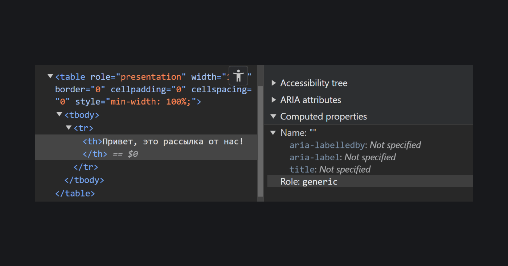
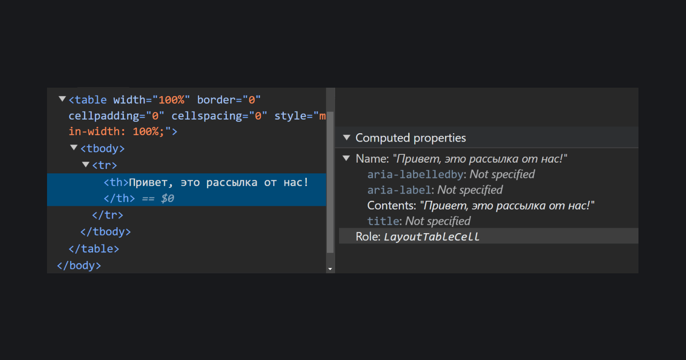

## Кратко

`presentation` — [роль структуры документа](/a11y/aria-roles/#roli-struktury-dokumenta) из WAI-ARIA, которая удаляет семантику элемента. `none` — это другое название для `presentation`.

`presentation` и `none` превращают любой семантический тег в [`<div>`](/html/div/) или [`<span>`](/html/span/) для [скринридеров](/a11y/screenreaders/) и других вспомогательных технологий.

<aside>

🤸‍♀️ Пока что лучше использовать `presentation`. У роли более стабильная поддержка.

</aside>

## Пример

```html
<h1>Говорящий мангуст Джеф</h1>
<hr role="presentation">
<p>
  Загадочное существо, обитавшее на ферме Дорлиш Кэшен неподалеку
  от селения Дэлби на острове Мэн. История о говорящем зверьке
  в середине 1930-х годов активно обсуждалась на страницах
  британской прессы.
</p>
```

<iframe title="Текст с декоративным разделителем" src="demos/decorative-hr/" height="530"></iframe>

В этом примере тег [`<hr>`](/html/hr/) потерял свою семантику и стал просто декоративным разделителем. Из-за этого скринридер не расскажет, что на странице есть элемент с [ролью `separator`](/a11y/role-separator/).

## Как пишется

Добавьте `role="presentation"` или `role="none"` к семантическому тегу — HTML-элементу со встроенной ролью. Например, [`<h1>`](/html/h1-h6/), [`<table>`](/html/table/) или [`<li>`](/html/li/). Исключение — интерактивные элементы, с которыми взаимодействуют пользователи. Это могут быть кнопки [`<button>`](/html/button/), ссылки [`<a>`](/html/a/) или поля [`<input>`](/html/input/) и [`<textarea>`](/html/textarea/).

Хотя современные браузеры больше не удаляют семантику интерактивных тегов из-за `presentation` или `none`, всё равно лучше не нарушать [правила использования ARIA](/a11y/aria-intro/#pravila-ispolzovaniya).

Когда сбрасываете семантику у элемента-родителя, в который вложены дочерние, они потеряют семантику всей семьёй.

К элементам с ролями `presentation` или `none` можно добавлять все [ARIA-атрибуты](/a11y/aria-attrs/), кроме глобальных:

- [`aria-label`](/a11y/aria-label/);
- [`aria-braillelabel`](/a11y/aria-braillelabel/);
- [`aria-labelledby`](/a11y/aria-labelledby/);
- [`aria-describedby`](/a11y/aria-describedby/);
- [`aria-details`](/a11y/aria-details/);
- [`aria-description`](/a11y/aria-description/);
- [`aria-roledescription`](/a11y/aria-roledescription/);
- [`aria-brailleroledescription`](/a11y/aria-brailleroledescription/);
- [`aria-hidden`](/a11y/aria-hidden/);
- [`aria-flowto`](/a11y/aria-flowto/);
- [`aria-keyshortcuts`](/a11y/aria-keyshortcuts/);
- [`aria-current`](/a11y/aria-current/);
- [`aria-controls`](/a11y/aria-controls/);
- [`aria-owns`](/a11y/aria-owns/);
- [`aria-live`](/a11y/);
- [`aria-busy`](/a11y/aria-live/);
- [`aria-atomic`](/a11y/aria-atomic/);
- [`aria-relevant`](/a11y/aria-relevant/).

Если используете атрибуты из списка в теге со сброшенной семантикой, некоторые браузеры и вспомогательные технологии используют встроенную роль элемента и проигнорируют явную `presentation`.

Последнее важное правило для `presentation` и `none` — таким элементам не нужны имена. Это их краткие названия, которые скринридеры читают перед ролью. Не важно, откуда берётся имя у элемента — из текстового содержимого тега или из `aria-label`.

Разберём простой пример со списком. Зададим родительскому [`<ul>`](/html/ul/) явную роль `presentation`:

```html
<ul role="presentation">
  <li>Динозавры.</li>
  <li>Минералы.</li>
  <li>
    Вкусный <a href="#">пирожок</a>.
  </li>
</ul>
```

Для вспомогательных технологий всё превратится в [`<span>`](/html/span/), кроме ссылки `<a>`:

```html
<span>
  <span>Динозавры.</span>
  <span>Минералы.</span>
  <span>
    Вкусный <a href="#">пирожок</a>.
  </span>
</span>
```

`presentation` и `none` пригодятся, когда нужно оставить встроенные стили или логику тега, но не рассказывать вспомогательным технологиям про его семантику. Распространённые ситуации:

- декоративный элемент — картинки для красоты, разделители и похожие элементы;
- таблица для раскладки, как на старых сайтах или в электронных письмах;
- кастомный элемент, внутри которого есть другие с ненужной в этом контексте семантикой. Например, панель вкладок или меню как в редакторе текста.

Декоративная картинка [``](/html/img/) с ролью `presentation` ведёт себя так, как если бы её скрыли от скринридера с помощью `aria-hidden` или CSS-свойства [`display: none`](/css/display/). Такое изображение точно не нужно описывать в [`alt`](/html/img/#alt).

```html

```

Можете встретить вариант декоративной картинки с пропущенным `alt`:

```html

```

Хотя этот пример из спецификации, такой код не пройдёт валидацию. Дело в том, что у элементов с атрибутом `role` обязательно должны быть имена. В случае тега `` имя элемента берётся из `alt`. Также вспомогательные технологии пока плохо поддерживают подобные картинки.

<aside>

🐶 Рекомендуем всегда использовать возможности HTML. Просто оставьте `alt` пустым, если нужна декоративная картинка: ``.

</aside>

На практике `presentation` чаще всего встречается в письмах. Тег [`<table>`](/html/table/) в письмах используют не для хранения данных как обычно, а для визуального выравнивания содержимого. При помощи роли  `presentation` сбросится не только семантика самой таблицы, но и её дочерних элементов — [`<tr>`](/html/tables/#tr), [`<th>`](/html/tables/#th), [`<td>`](/html/tables/#td) и других.

```html
<table
  role="presentation"
  width="100%"
  cellpadding="0"
  cellspacing="0"
  border="0"
  style="color: green;"
>
  <tbody>
    <tr>
      <th>
        Привет, это рассылка от нас!
      </th>
    </tr>
  </tbody>
</table>
```

Если загляните в [дерево доступности](/a11y/screenreaders/#derevo-dostupnosti) в инструменте разработчика в Chrome, заметите, что у `<th>` внутри `<table role="presentation">` вычисляется [роль `generic`](/a11y/role-generic/). Это значит, что для браузеров и других программ это элемент без семантики.



Для сравнения, у `<th>` будет роль `layoutTableCell` в таблице с родной семантикой, но без подписи [`<caption>`](/html/caption/).



`presentation` также часто используют во вкладках и в других кастомных элементах, для которых пока не хватает возможностей HTML. К примеру, вспомогательные технологии в случае вкладок на `<ul>` не расскажут, что пользователь находится на элементе списка.

```html
<ul role="tablist">
  <li role="presentation">
    <a role="tab" href="#">Тапиры</a>
  </li>
  <li role="presentation">
    <a role="tab" href="#">Утконосы</a>
  </li>
</ul>
```

## Подсказки

💡 `presentation` и `none` часто путают с `aria-hidden="true"`. Их разница в том, что атрибут полностью удаляет элемент из дерева доступности. Из-за этого вспомогательные технологии не знают о его семантике, содержимом, состоянии и свойствах.
