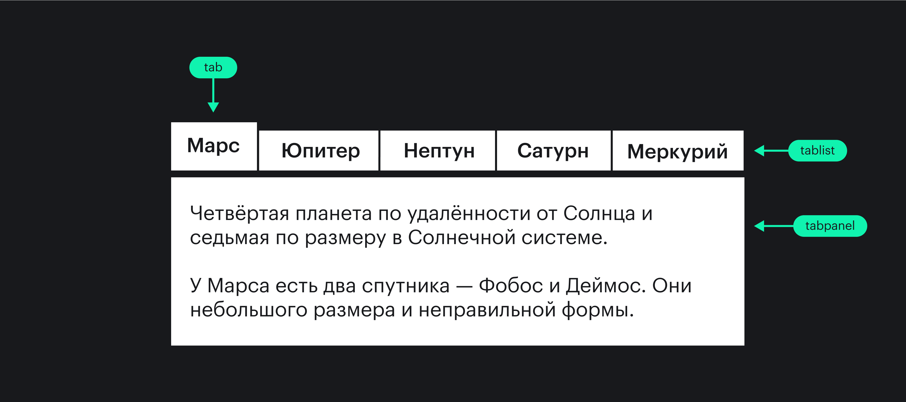

## Кратко

[Составная роль виджета](/a11y/aria-roles/#roli-vidzhetov) из [WAI-ARIA](/a11y/aria-intro/#specifikaciya), которая нужна для группы, списка вкладок. Внутри такого элемента должна быть минимум одна вкладка [с ролью `tab`](/a11y/role-tab/).

В HTML нет тега с роль `tablist`.

## Пример

```html
<h1 id="tabs-label">Необычные животные</h1>
<div role="tablist" aria-labelledby="tabs-label">
  <button
    role="tab"
    type="button"
    id="tab-1"
    aria-selected="true"
    aria-controls="tabpanel-1"
>
    Тапиры
  </button>
</div>

<div
  role="tabpanel"
  id="tabpanel-1"
  tabindex="0"
  aria-labelledby="tab-1"
>
  <p>Травоядные животные с коротким хоботом, которые живут в лесу.</p>
</div>
```

<iframe title="Элемент с ролью tablist" src="demos/tablist/" height="350"></iframe>

При фокусе на группе вкладок [скринридер](/a11y/screenreaders/) прочтёт её примерно так: «Необычные животные, контрол вкладок. Тапиры, выбранная вкладка, одна из двух».

## Как пишется

Добавьте к нужному тегу атрибут `role` со значением `tablist`. Это могут быть любые теги, но лучше всего подойдут семантические нейтральные [`<div>`](/html/div/) или [`<span>`](/html/span/).

К элементу с `tablist` можно применять все [глобальные ARIA-атрибуты](/a11y/aria-attrs/#globalnye-atributy) и [`aria-multiselectable`](/a11y/aria-multiselectable/). Этот атрибут означает, что можно выбрать одновременно несколько вкладок. Без него, по умолчанию, выбирается только одна вкладка.

Также у роли `tablist` по умолчанию есть свойство [`aria-orientation`](/a11y/aria-orientation/) со значением `horizontal`. Благодаря ему пользователи узнают о расположении вкладок и определят, какие клавиши использовать для навигации. Если меняете расположение с горизонтального на вертикальное и располагаете вкладки друг под другом, как это часто делают в мобильных интерфейсах, не забудьте поменять значение `aria-orientation` на `vertical`.

Элементы внутри `tablist` обязательно должны получать фокус с клавиатуры, если они не поддерживают его сами по себе. Это можно сделать с помощью атрибута [`tabindex`](/html/global-attrs/#tabindex) со значением `0`. Альтернативный способ — обрабатывать события при фокусе с помощью JavaScript.

Хорошая практика — давать группе вкладок название. Используйте видимый заголовок подходящего уровня [`<h1>`−`<h6>`](/html/h1-h6/) и свяжите с ним `tablist` при помощи [`aria-labelledby`](/a11y/aria-labelledby/). Если название не должно быть видимым всем, добавьте к `tablist` [`aria-label`](/a11y/aria-label/).

```html
<h3 id="label">Необычные животные</h3>
<div
  role="tablist"
  aria-labelledby="label"
>
  <!-- Вкладки -->
</div>
```

```html
<div
  role="tablist"
  aria-label="Необычные животные"
>
  <!-- Вкладки -->
</div>
```

### Поддержка клавиатуры

Когда пользователь перешёл к `tablist` с помощью <kbd>Tab</kbd>, в фокусе должна оказаться первая активная вкладка с ролью `tab`.

Между горизонтальными вкладками перемещаемся стрелками влево и вправо, а вертикальными — вверх и вниз. Когда на вкладке сделан фокус, она может раскрываться либо автоматически, либо после нажатия на <kbd>Enter</kbd> или пробел.

Если со вкладкой связано выпадающее меню, рекомендуют поддерживать для его открытия сочетание <kbd>Shift F10</kbd>.

Дополнительно, но не обязательно, можно добавить поддержку <kbd>Home</kbd> для возврата к первой вкладке, <kbd>End</kbd> для перехода к последней, <kbd>Del</kbd> для закрытия текущей и перехода к следующей или предыдущей в зависимости от количества вкладок.

## Как понять

Вкладки — это популярный паттерн в вебе и десктопных программах. Когда нажимаешь на название вкладки, открывается новая область с её содержимым или целая страница, как в браузерах.

Визуально вкладки обычно располагают друг за другом по горизонтали, а когда экран небольшой и места мало, то друг под другом по вертикали.

Устройство вкладок в виде схемы:


