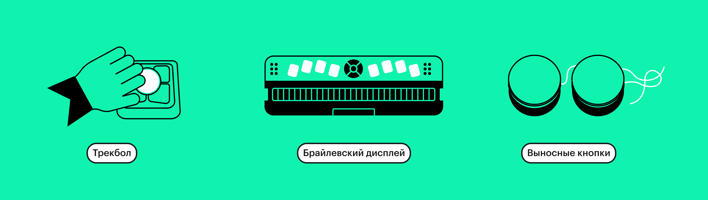
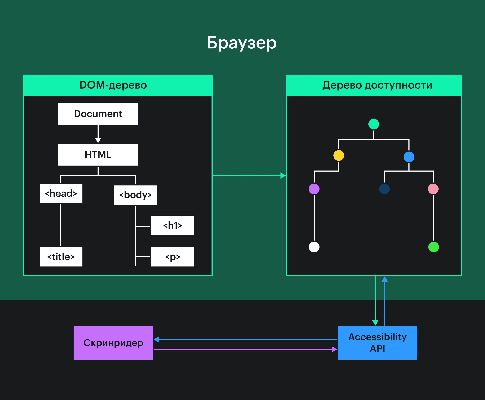
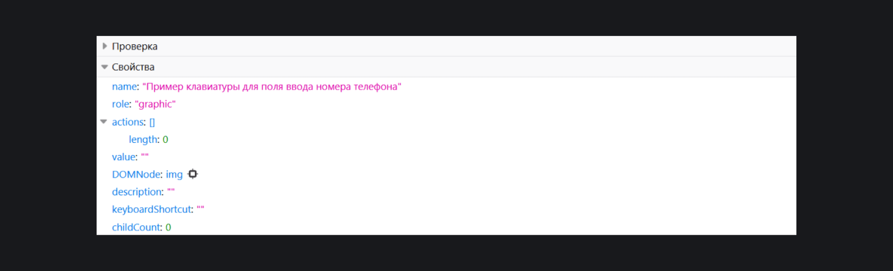
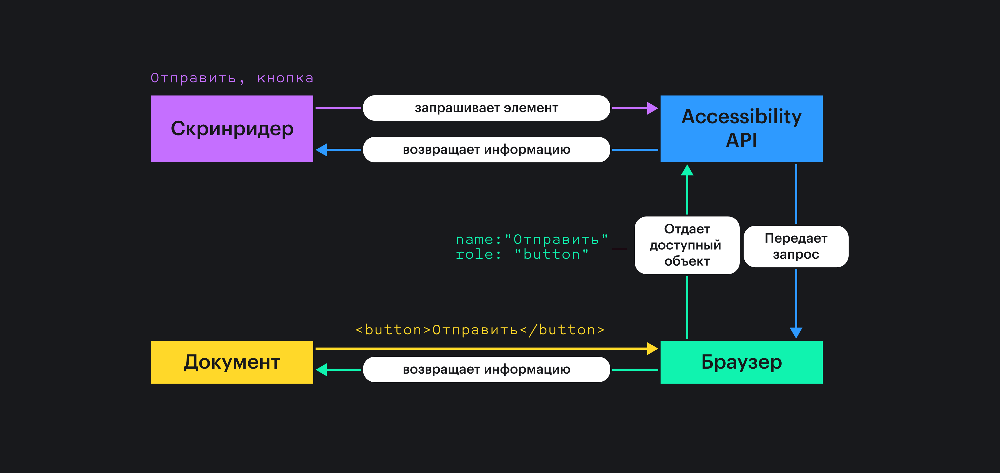
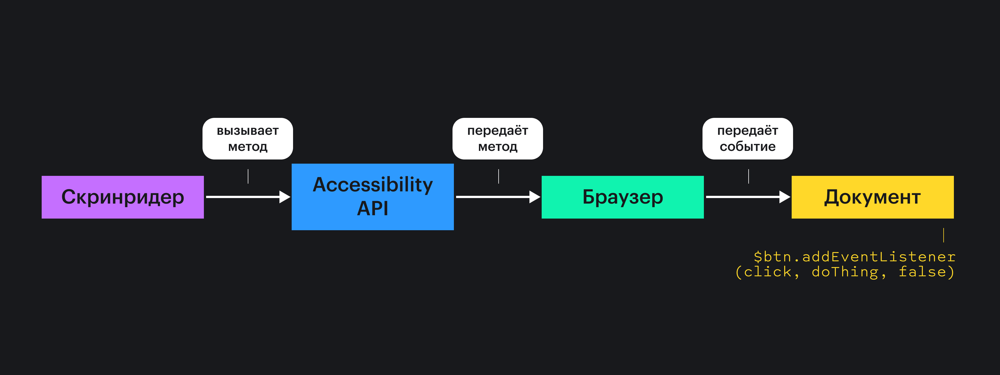
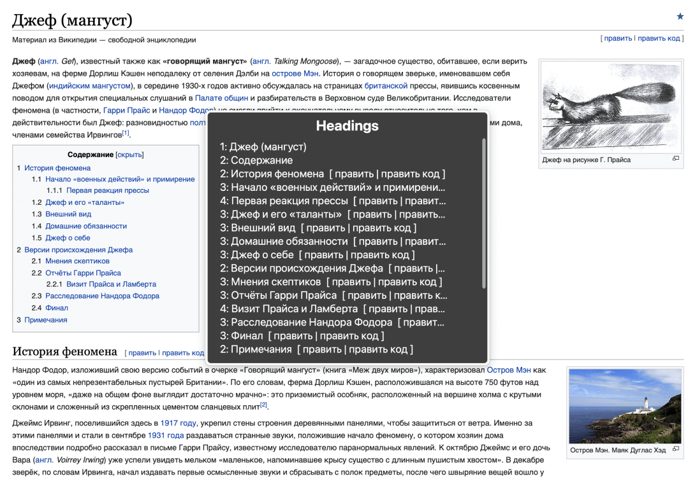

Сайтами и приложениями пользуются разные люди. Кто-то может это делать с любого устройства, а другим нужны _вспомогательные технологии (assistive technology)_. Это такие программы и устройства, которые упрощают взаимодействие пользователей с особыми потребностями с контентом. К примеру, выносные кнопки, трекболы, брайлевские дисплеи, экранные лупы и скринридеры.

Одна из самых популярных вспомогательных технологий — скринридеры 🤖

## Кратко

_Скринридер (screen reader)_ — программа, которая превращает контент интерфейсов в речь или шрифт Брайля. Другие названия — программа экранного доступа или чтения, программа чтения с экрана и экранное считывающее устройство.

Они нужны людям со слепотой и слабовидящим, а также пользователям с когнитивными особенностями, которым легче воспринимать информацию на слух. Например, людям с [дислексией](https://ru.wikipedia.org/wiki/%D0%94%D0%B8%D1%81%D0%BB%D0%B5%D0%BA%D1%81%D0%B8%D1%8F).

Слабовидящие пользователи могут сочетать скринридеры с другой вспомогательной технологией — _экранной лупой (screen magnification)_. Она увеличивает контент на экране и тоже его озвучивает, если это нужно.

## Устройство

Скринридеры состоят из двух частей:

- Программная оболочка — интерфейс программы.
- Движок синтеза речи — способ преобразования текста в речь.

Интерфейсы могут быть написаны на различных языках программирования и поддерживать разные функции, шорткаты (сочетания клавиш), жесты и настройки.

Движки тоже могут отличаться, но чаще всего используют _формантный синтез речи (Formant Text-to-Speech)_. Он основан на искусственных звуках, которые имитируют человеческую речь. Плохо передаёт эмоции, зато тексты зачитываются на любой скорости без потери качества. Это важно, ведь многие люди слушают интерфейсы с высокой скоростью.

Пользователи могут не только изменить движок или скорость речи, но ещё выбрать другие настройки пунктуации, объёма объявлений, голоса, способы навигации и так далее.

## Виды скринридеров

Операционные системы тесно связаны со скринридерами, поэтому для каждой есть свои программы чтения с экрана:

- Windows — [JAWS](https://www.freedomscientific.com/products/software/jaws/) (платный и скачиваемый), [NVDA](https://www.nvaccess.org/about-nvda/) (бесплатный и скачиваемый) и [Narrator](https://support.microsoft.com/ru-ru/windows/%D0%BF%D0%BE%D0%BB%D0%BD%D0%BE%D0%B5-%D1%80%D1%83%D0%BA%D0%BE%D0%B2%D0%BE%D0%B4%D1%81%D1%82%D0%B2%D0%BE-%D0%BF%D0%BE-%D0%B8%D1%81%D0%BF%D0%BE%D0%BB%D1%8C%D0%B7%D0%BE%D0%B2%D0%B0%D0%BD%D0%B8%D1%8E-%D1%8D%D0%BA%D1%80%D0%B0%D0%BD%D0%BD%D0%BE%D0%B3%D0%BE-%D0%B4%D0%B8%D0%BA%D1%82%D0%BE%D1%80%D0%B0-e4397a0d-ef4f-b386-d8ae-c172f109bdb1) (бесплатный и предустановленный).
- macOS и iOS — [VoiceOver](https://www.apple.com/ru/accessibility/vision/), предустановлен.
- Android — [TalkBack](https://support.google.com/accessibility/android/topic/3529932), предустановленный.
- Linux — [Orca](https://help.gnome.org/users/orca/stable/), тоже установлен по умолчанию в системе.
- Chrome OS — [ChromeVox](https://support.google.com/chromebook/answer/7031755), предустановленный. Можно скачать как расширение в браузеры на Chromium.

Более полный список можно найти в [Википедии](https://en.wikipedia.org/wiki/List_of_screen_readers).

У скринридеров разная популярность среди пользователей, как у браузеров. Следить за статистикой можно через ежегодные [опросы пользователей WebAIM](https://webaim.org/projects/). Это американская компания, которая занимается доступностью.

В лидеры чаще всего попадают:
- JAWS или NVDA и Chrome. Периодически меняются местами.
- Десктопный и мобильный VoiceOver и Safari.
- TalkBack и Chrome.

Эта статистика полезна для тестирования и помогает понять, в каких скринридерах лучше тестировать в первую очередь.

## Как работают скринридеры

Скринридеры могут озвучить любой контент на странице. Например, текст из параграфов и заголовков, списки, альтернативные описания изображений, ссылки, переключатели и другие интерактивные элементы. Также они озвучивают роли элементов и как с элементом можно взаимодействовать.

Программа не берёт контент сразу из вкладки браузера. Это происходит через посредника — _Accessibility API (Accessibility Application Programming Interface)_. В свою очередь, браузеры передают Accessibility API данные об элементах со страницы в виде _дерева доступности (acessibility tree)_.

Скринридеры могут взаимодействовать и с [другими API](/tools/api/), но давайте подробнее разберёмся с Accessibility API и деревом доступности.

### Accessibility API

Это набор интерфейсов операционных систем, который передаёт скринридерам из браузеров информацию о пользовательских интерфейсах. Если точнее, то о структуре документа, семантике, зависимостях внутри контента и о его состояниях.

Ещё Accessibility API получает от браузеров сообщения о событиях на странице, обрабатывает их и помогает скринридерам на них реагировать. Это может быть всплытие окна с ошибкой, открытие или закрытие выпадающего списка или выбор чекбокса.

Есть несколько реализаций Accessibility API.

- Windows: [Microsoft Active Accessibility](https://docs.microsoft.com/en-us/windows/win32/winauto/microsoft-active-accessibility) (MSAA), расширяющий его [IAccessible2](https://wiki.linuxfoundation.org/accessibility/iaccessible2/start) (IA2) и более новый [UI Automation](https://docs.microsoft.com/en-us/windows/win32/winauto/entry-uiauto-win32) (UIA).
- macOS, iOS: [NSAccessibility](https://developer.apple.com/documentation/appkit/nsaccessibility) (AXAPI).
- Linux: [Assistive Technology Service Provider Interface](https://gitlab.gnome.org/GNOME/at-spi2-core/) (AT-SPI).

Браузеры умеют поддерживать сразу несколько API.

<aside>

📊 Нет прямого способа отследить количество пользователей скринридеров, т. к. браузеры не хранят информацию о взаимодействии с Accessibility API. Это не баг, а фича для конфиденциальности данных.

</aside>

### Дерево доступности

Это представление элементов документа в виде дерева на основе [DOM](/js/dom/) (Document Object Model). Похоже на [DOM-дерево](/js/dom/#iz-chego-sostoit-dom), только состоит не из HTML-элементов, а из _доступных объектов (accessible object)_.

<aside>

🌳 Дерево доступности не полностью копирует DOM-дерево. Например, в него не попадают скрытые элементы с `display: none`, `visibility: hidden`, атрибутом `hidden` или декоративные `
`.

</aside>

Доступный объект включает:

- Роль (role). Она соответствует типу элемента. Например, есть роли `button`, `link` или `banner`.
- Имя (name), если есть. Его также называют доступным именем (accessible name). Помогает лучше понять, что это за объект и его цель. Обычно озвучивается при фокусе. Оно берётся из текстового содержимого тегов или атрибутов. К примеру, имя элемента `<button>Зарегистрироваться</button>` — «Зарегистрироваться».
- Описание (description) и/или вспомогательный текст (helper text), если есть. Дополнение к имени. Озвучивается, если выбрана такая настройка в скринридере.
- Свойства и методы. Содержат детали о раскладке (layout) и возможных действиях. К примеру, можно ли изменить значение элемента или как-то иначе с ним взаимодействовать.

Во многие [семантические теги](/html/#semantika) роли уже встроены. Роль `<a>` — `link`, `<header>` — `banner`, `<ul>` — `list`. Полный список можно найти на [странице с HTML-элементами и именами](https://russmaxdesign.github.io/html-elements-names/). Поэтому для доступности важна семантическая вёрстка. Если вместо `<button>` использовать `
` с событием `onclick`, то у него не будет роли кнопки и её поведения. Пользователи скринридеров не узнают, что элемент кликабельный.

Посмотреть на дерево доступности можно в инспекторах браузеров во вкладке с доступностью. Например, так выглядит `` в виде объекта дерева в Firefox. У него роль `graphic` (в Chrome будет `img`), а имя — это описание картинки из атрибута `alt`.

Роли, имена и поведение элементов можно явно задавать и изменять с помощью _[ARIA-разметки](https://www.w3.org/TR/wai-aria-1.1/) (Accessible Rich Internet Applications)_. Это вспомогательная техника для создания более доступного контента для скринридеров. Расширяет возможности HTML с помощью специальных атрибутов и ролей.

Одно из главных правил её использования — стараться не использовать ARIA. Так что она пригодится, когда не хватает возможностей HTML. К примеру, для сложных интерактивных элементов — вкладок, выпадающих списков, модальных окон или оповещений об ошибках. В этом случает ARIA-атрибуты и JavaScript сделают поведение контрола понятным и предсказуемым.

## Как взаимодействуют браузеры, скринридеры и Accessibility API

Представим, что пользователь скринридера добрался до кнопки «Отправить»:

1. Сначала скринридер запрашивает информацию о кнопке.
1. Accessibility API получает запрос и передаёт его браузеру.
1. Браузер проверяет DOM и находит нужный элемент и его стили.
1. Теперь браузер может преобразовать элемент из DOM в понятный формат для Accessibility API. Это и есть объект из дерева доступности с именем и ролью. После этого браузер отдаёт его API.
1. API возвращает эту информацию скринридеру.
1. Скринридер объявляет: «Отправить, кнопка». Ура!

Теперь пользователь решил нажать на кнопку, чтобы что-то отправить:

1. Скринридер вызывает метод из Accessibility API.
1. Accessibility API идёт к браузеру и сообщает о вызове метода.
1. Браузер ищет и обрабатывает событие с учётом того, есть ли обработчик события.
1. Представим, что на сайте есть скрипт, который отслеживает события. В этом случае он выполняется, и происходит нужное действие при клике на кнопку.

## Особенности навигации по контенту

Навигация со скринридерами по страницам и экранам отличается от обычной.

Клавиатурный фокус устанавливается только на интерактивных элементах. Например, на кнопках и ссылках. Пользователи переходят от одного элемента к другому и так перемещаются по интерфейсу.

Скринридеры при навигации с клавиатуры тоже могут устанавливать фокус на интерактивных элементах и перемещаться по ним, делая при этом объявления. Но это не самый удобный способ навигации для людей, которые не видят интерфейс. Поэтому у пользователей скринридеров есть другой, более удобный вариант — навигация по неинтерактивным элементам. С помощью специальных шорткатов в разных скринридерах открываются списки элементов со страницы. Так можно перемещаться по заголовкам, параграфам, строкам, ориентирам (landmark regions) и другим элементам. Один из самых популярных способов такой навигации — заголовки.

На скриншоте в VoiceOver открыт список всех заголовков из статьи на Википедии.

Пользователи мобильных скринридеров для перемещения по странице проводят пальцем по экрану, слушают объявления и так проходят через все элементы. Для взаимодействия с элементом нужно два раза тапнуть по экрану, а для перехода от одного к другому — свайпнуть вправо или влево. В мобильных скринридерах с помощью жестов тоже можно открыть навигацию по заголовкам, строкам, словам или ссылкам.

Дополнительно скринридеры могут зачитывать всё подряд.

Из [видео Молли Бёрк](https://youtu.be/7OEZX5lsQG8) вы узнаете, как выглядит на практике навигация с помощью VoiceOver на телефоне и ноутбуке.

## Тестирование

У браузеров и скринридеров разная поддержка HTML, CSS и ARIA. Из-за этого объявление контента может отличаться, а где-то могут попадаться специфическое поведение или баги.

Возьмём для примера список со ссылками из демки и послушаем его в разных скринридерах.

<iframe title="Ненумированный список из трёх внешних ссылок" src="demos/list-with-links/" height="150"></iframe>

<video controls poster="images/video-cover.png" width="700">
  <source src="video/list-and-screenreaders.mp4" type="video/mp4">
  <source src="video/list-and-screenreaders_safari.mp4" type="video/mp4">
</video>

Расшифровка видео:
- NVDA 2021.2 и Chrome 95: «Список из 3 элементов. Рыбы, ссылка. Пёсели, ссылка. Лягухи, ссылка».
- JAWS 2022 и Chrome 95: «Список из 3 элемента. Рыбы, ссылка. Пёсели, ссылка. Лягухи, ссылка».
- TalkBack на Android 10 и Firefox 94.1: «Рыбы, элемент списка, 2 из 3. Роль «список», 3 пункта. Пёсели, элемент списка, 3 из 3. Лягухи, элемент списка, 4 из 3». Объявляет информацию об элементах на английском, не зачитывает роль ссылки и неправильно считает элементы списка (баг).
- VoiceOver и Safari 15.1: «Рыбы, ссылка. Пёсели, ссылка. Лягухи, ссылка». Не объявляет, что это список из трёх элементов из-за свойства `list-style` со значением `none`. Оно сбрасывает семантику списка для этого скринридера.

Чтобы не столкнуться с неожиданной проблемой во время тестирования, можно заранее узнать о поддержке HTML и ARIA скринридерами:

- [Accessibility Support](http://a11ysupport.io/). Can I Use в мире доступности.
- [Базы PowerMapper Software](https://www.powermapper.com/tests/) с результатами тестирования совместимости вспомогательных технологий.

Ручное тестирование находит больше проблем с доступностью для скринридеров, чем [автоматические инструменты](https://www.w3.org/WAI/ER/tools/). Для него требуются определённые знания, навыки и опыт, но есть несколько основных советов:

1. Навигация по интерфейсу с клавиатуры найдёт многие проблемы до тестирования со скринридерами.
1. Тестируйте минимум в одном скринридере на поддерживаемых платформах. Выбрать популярные виды помогут [опросы пользователей WebAIM](https://webaim.org/projects/).
1. Проверяйте интерфейсы не только в последних версиях скринридеров и браузеров, но и в более ранних. Пользователи с особыми потребностями не так быстро обновляют программы.
1. Обращайте внимание на комбинации скринридеров и браузеров. Если программа ведёт себя странно только в одном браузере, то это могут быть особенности совместимости или баг.

Больше практических рекомендаций собрано в [руководстве BBC по тестированию со вспомогательными технологиями](https://bbc.github.io/accessibility-news-and-you/assistive-technology/testing.html).

У разных скринридеров есть свои шорткаты и жесты, о которых полезно знать при тестировании:

- [Шорткаты в NVDA](https://dequeuniversity.com/screenreaders/nvda-keyboard-shortcuts).
- [Шорткаты в JAWS](https://dequeuniversity.com/screenreaders/jaws-keyboard-shortcuts).
- [Шорткаты в VoiceOver](https://dequeuniversity.com/screenreaders/voiceover-keyboard-shortcuts).
- [Жесты в TalkBack](https://dequeuniversity.com/screenreaders/talkback-shortcuts).
- [Жесты в мобильном VoiceOver](https://dequeuniversity.com/screenreaders/voiceover-ios-shortcuts).

Не обязательно тестировать с реальными скринридерами. Это можно сделать в [BrowserStack](https://www.browserstack.com) и в специальном сервисе от [Assistiv Labs](https://assistivlabs.com).

Учитывайте, что реальные пользователи используют скринридеры постоянно и выработали особенные паттерны взаимодействия с интерфейсами. К тому же, они слушают контент на очень высокой скорости. И это быстрее, чем двойная скорость на YouTube! Так что ручное тестирование поможет обнаружить основные проблемы, но полностью не заменит пользовательское.

## Выводы

Вспомогательные технологии важны для многих людей, а для кого-то это единственный способ взаимодействовать с сайтом. Скринридер — одна из самых популярных разновидностей таких технологий.

Скринридер озвучивает контент интерфейсов и помогает пользователям проходить через него разными способами. Это могут быть интерактивные и неинтерактивные элементы.

Озвучивать контент скринридерам помогают Accessibility API и браузеры, которые создают дерево доступности. Часть элементов попадает в дерево вместе со встроенными ролями, доступными именами, дополнительным описанием и способами взаимодействия с ними.

У разработчиков уже есть несколько клёвых инструментов, чтобы сделать доступный интерфейс для скринридеров. Это HTML, CSS, иногда ARIA и JavaScript.

Не всегда получается сразу написать хороший интерфейс. Здесь на помощь приходит тестирование, особенно ручное.

Больше узнать о скринридерах помогут эти ссылки:

- [Semantics to Screen Readers](https://alistapart.com/article/semantics-to-screen-readers/).
- [Accessibility APIs: A Key To Web Accessibility](https://www.smashingmagazine.com/2015/03/web-accessibility-with-accessibility-api/).
- [How A Screen Reader User Surfs The Web](https://youtu.be/OUDV1gqs9GA), видео.
- [Browsing with a desktop screen reader](https://tetralogical.com/blog/2021/09/29/browsing-with-a-desktop-screen-reader/).
- [Browsing with a mobile screen reader](https://tetralogical.com/blog/2021/10/05/browsing-with-a-mobile-screen-reader/).
