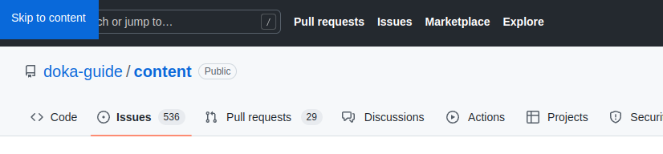

## Кратко

Skip link (далее скип-линк) — специальный элемент на странице в виде гиперссылки, который помогает быстро перейти к контенту при использовании клавиатуры, пропустив блок с навигацией.

Обычно скип-линк используют для пропуска меню навигации вверху страницы, но область применения ничем не ограничена. Например, можно сделать переход из начала секции с комментариями к полю ввода нового комментария. Главное — не переборщить. Большое число ссылок может запутать пользователя.

## Пример

Для примера давайте откроем страницу [задачи](https://github.com/doka-guide/content/issues/2985) по добавлению доки про скип-линк. У GitHub вверху расположено меню, в котором есть строка поиска, ссылка на страницу пулреквестов и много чего ещё. Если мы будем переходить по разным страницам, то придётся кучу раз нажать <kbd>Tab</kbd>, чтобы добраться до контента.

К счастью, GitHub добавляет на страницы скип-линк. Если нажать <kbd>Tab</kbd>, когда страница открылась и мы находимся в самом верху, то в верхнем левом углу появится блок с надписью «Skip to content». Если теперь нажмём <kbd>Enter</kbd>, то перейдём сразу к контенту. В нашем случае это будет интерфейс репозитория.



## Как реализовать

Самая простая реализация — якорная ссылка, которая видна только при фокусе. Тогда пользователи клавиатуры в первую очередь сфокусируются на ней, когда нажмут <kbd>Tab</kbd>. При этом [скринридеры](/html/screenreaders/) прочитают её, а пользователи мыши даже не будут знать о её существовании. Такая ссылка им не нужна.

Допустим, у нас есть сайт с простой навигацией:

<iframe title="Пример с простой навигацией без скип-линка" src="demos/basic/" height="610"></iframe>

Если будем использовать клавиатуру для навигации, то придётся 5 раз нажать <kbd>Tab</kbd>, чтобы добраться до основного контента. И так придётся делать на каждой новой странице.

Давайте добавим скип-линк, чтобы упросить навигацию. Для этого в самое начало [`<body>`](/html/body/) перед блоком навигации добавим ссылку, которая видна только при фокусе.

```html
<body>
  <a class="skip-link" href="#main">
    Перейти к контенту
  </a>
  <!-- Навигация -->
  <main id="main">
    <!-- Остальной контент страницы -->
  </main>
</body>
```

Заметьте, что мы скрываем ссылку при помощи [`transform: translateY(-100%)`](/css/transform/). Просто сделать [`display: none`](/css/display/#kak-pishetsya) нельзя, тогда скринридеры её проигнорируют.

```css
.skip-link {
  display: block;
  position: absolute;
  top: 0;
  left: 0;
  padding: 10px 15px;
  background: #F498AD;
  transform: translateY(-100%);
}
```

Когда ссылка в фокусе, покажем её, вернув значение по умолчанию `transform`:

```css
.skip-link:focus {
  transform: translateY(0);
}
```

<iframe title="Пример со скип-линком" src="demos/with-skip-link/" height="610"></iframe>

Теперь на странице сразу же появится скип-линк, когда нажмём <kbd>Tab</kbd>. С её помощью можем сразу перейти к контенту, не тратя время на навигацию. Если всё-таки интересует какой-то пункт в меню, можем нажать <kbd>Tab</kbd> ещё раз. Тогда скип-линк скроется, а фокус окажется на первом интерактивном элементе на странице.
