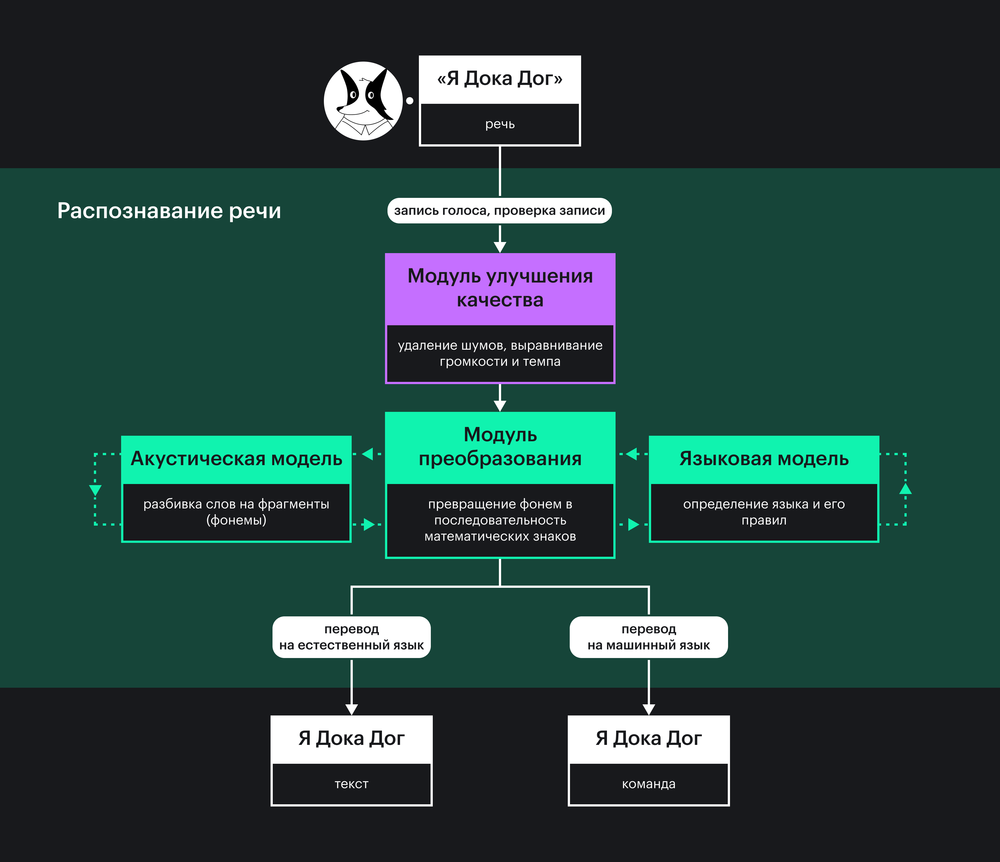
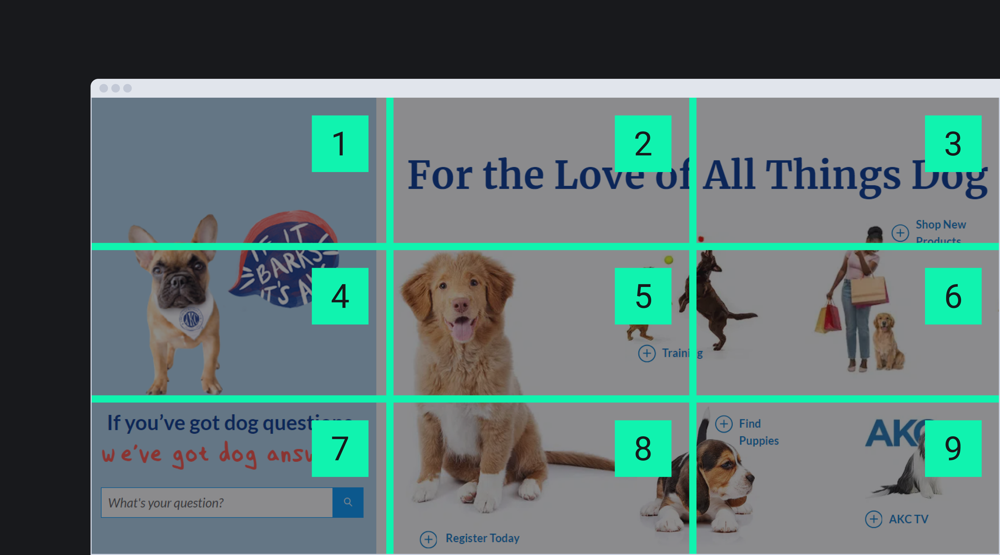

Сайтами и приложениями пользуются разные люди. Кто-то может это делать с любого устройства, а другим нужны _вспомогательные технологии (assistive technology)_. Это такие программы и устройства, которые упрощают взаимодействие пользователей с особыми потребностями с содержимым сайтов.

В статье разберёмся с тем, что такое технологии распознавания речи. Скорее всего, вы уже знаете или пользовались ими в повседневной жизни и не воспринимали их как особые вспомогательные технологии. В действительности распознавание речи устраняет барьеры для людей, которые не могут взаимодействовать с интерфейсами руками из-за физического состояния или внешних факторов.

## Кратко

_Технологии распознавания речи (speech recognition technology)_ — это общий термин для программ и приложений, которые слушают человеческую речь и превращают её в цифровой текст как в вебе или выполняют голосовые команды на разных устройствах. Такие технологии ещё называют автоматическим или компьютерным распознаванием речи 🗣️

<aside>

🔐 Не путайте распознавание речи с _распознаванием голоса (voice recognition)_. Технологии для анализа голоса определяют, кто говорит, и игнорируют содержание сказанного.

</aside>

Программы и приложения для распознавания речи важны нескольким группам пользователей:

- Люди с моторными особенностями. Например, с ампутацией рук, параличом или артритом.
- Пользователи с особенностями зрения: слабовидящие, со слепотой, светобоязнью и так далее.
- Пользователи с когнитивными особенностями, которым сложно писать и читать. К примеру, с [дислексией](https://ru.wikipedia.org/wiki/%D0%94%D0%B8%D1%81%D0%BB%D0%B5%D0%BA%D1%81%D0%B8%D1%8F), [дисграфией](https://ru.wikipedia.org/wiki/%D0%94%D0%B8%D1%81%D0%B3%D1%80%D0%B0%D1%84%D0%B8%D1%8F) или тем, кто плохо знает язык.
- Люди с временными ограничениями: переломами, [травмой повторяющихся нагрузок](https://www.nhs.uk/conditions/repetitive-strain-injury-rsi/) и похожими состояниями.

Конечно, управлять интерфейсами голосом удобно всем. Мы не всегда можем взять в руки телефон или сесть за компьютер из-за внешних ограничений. К примеру, в этот момент ведём машину, готовим ужин или держим на руках кота 🐈

Технологии распознавания речи часто сочетают с другими вспомогательными технологиями — [скринридерами](/a11y/screenreaders/), экранными лупами, выносными компьютерными кнопками и эргономическими клавиатурами.

## Виды технологий

Выделяют несколько видов технологий распознавания речи в зависимости от задач и устройства. При этом все они могут быть уже встроены в операционную систему или их можно установить отдельно.

**Преобразование речи в текст** (speech-to-text, коротко STT). Расшифровывают сказанные слова и преобразуют их в цифровой текст, по которому можно перемещаться и редактировать его голосом. Другая важная функция — распознавание и выполнение голосовых команд. Это может быть клик по кнопке, запуск программы, переход по ссылке или навигация по странице.

Функция преобразования текста в речь по умолчанию есть во всех операционных системах. Это голосовой доступ на Windows и Android и голосовой контроль на macOS и iOS. Другие, уже скачиваемые программы — [Dragon](https://www.nuance.com/dragon.html) и [e-Speaking Voice](https://e-speaking.com).

**Диктовка**. Помогает людям набирать и редактировать текст голосом, а ещё записывает аудио.

Программы и приложения для диктовки тоже есть в операционных системах. К примеру, на macOS и в iOS это [функция диктовки текста](https://support.apple.com/en-gb/guide/mac-help/mh40584/mac), а в Android — [Gboard](https://support.google.com/gboard/answer/6380730?hl=en&co=GENIE.Platform%3DAndroid). Эта функция встречается и в разных программах и веб-сервисах. К примеру, [голосовой набор в Google Документах](https://support.google.com/docs/answer/4492226?hl=en) или [диктовка в Windows Word](https://support.microsoft.com/en-gb/office/dictate-your-documents-in-word-3876e05f-3fcc-418f-b8ab-db7ce0d11d3c#Tab=Windows). Можете найти и отдельные сервисы для записи текстов и голосовых заметок. Примеры — [Otter.ai](https://otter.ai) и [Speechnotes](https://speechnotes.co).

**Расшифровка**. Анализирует аудио, видео и превращает речь в текст. В тексте могут быть временные отметки, если это субтитры, или сплошной текст, когда это расшифровка.

Примеры — [Amazon Transcribe](https://docs.aws.amazon.com/transcribe/) и [Whisperer](https://openai.com/research/whisper).

**Человекомашинные интерфейсы**. Распознают человеческую речь и отвечают на запросы голосом, похожим на человеческий. Они могут делать письменные заметки, устанавливать таймеры, напоминать о событиях в календаре, искать информацию по сайтам и консультировать, прокладывать маршрут на карте и много чего ещё.

К человекомашинным интерфейсам относятся голосовые ассистенты вроде [Alexa](https://developer.amazon.com/en-US/alexa), [Siri](https://www.apple.com/siri/), [Google Assistant](https://assistant.google.com), [Cortana](https://www.microsoft.com/en-us/cortana), [Алисы](https://alice.yandex.ru) или Ultifi для автомобилей General Motors. Другая разновидность таких интерфейсов — чат-боты. Их можно встретить во многих веб-сервисах и на сайтах. К примеру, [Manychat](https://manychat.com) и [Woebot](https://woebothealth.com).

## Как работают

Программы и приложения для распознавания речи — технологии, которые находятся на стыке информатики и лингвистики. Они решают проблему взаимодействия людей с компьютерами и другими устройствами с помощью голоса.

<aside>

🤖 Другая технология преобразования текста в речь (text-to-speech technology, коротко TTS) противоположна распознаванию речи. Её практическая реализация — скринридеры и синтезаторы речи.

</aside>

Современное распознавание речи построено на нейронных сетях. С помощью набора математических символов (математических моделей) они воссоздают сеть нервных клеток как у людей и других животных. Такое устройство программ помогает им быстрее, точнее и эффективнее решать свои задачи.

Теперь представим, что вы используете Dragon и управляете интерфейсом сайта голосом. Что именно происходит в этот момент?

Сначала программа записывает ваш голос и находит посторонние звуки, помехи и искажения. После запись и информация о её качестве передаётся в модуль, который делает её менее шумной, выравнивает громкость, подстраивается под темп и другие особенности речи. На следующем этапе выделенные небольшие кусочки слов (фонемы) преобразуются в последовательность математических знаков, а ещё определяется язык, его правила. Данные о языке и его особенностях берутся из акустических и языковых моделей. На последнем шаге происходит главное — математические знаки становятся понятными командами для устройств или преобразуются в текст на естественном языке. Например, на английском, японском или норвежском.



Программы и приложения для распознавания речи не всегда понимают речь человека. Например, из-за сильного акцента, заикания и других особенностей произношения. Чтобы решить эту проблему, технологические компании объединили усилия в проекте [Speech Accessibility Project](https://speechaccessibilityproject.beckman.illinois.edu). Его цель — собрать как можно больше образцов речи людей с разными особенностями и научить акустические и языковые модели понимать их. То есть сделать их персонализированными.

## Особенности навигации

Кроме диктовки текстов, заполнения форм, открытия и закрытия вкладок в браузере, можно просматривать сайты и управлять ими с помощью голосовых команд. Они могут отличаются друг от друга в разных программах и приложениях, а ещё их можно настраивать под себя. Вот несколько списков с командами в разных программах и приложениях:

- [Список команд для голосового доступа на Windows](https://support.microsoft.com/en-us/topic/voice-access-command-list-dac0f091-87ce-454d-8d57-bef38d3d8563).
- [Команды для голосового контроля на macOS](https://support.apple.com/en-gb/guide/mac-help/mh40719/mac).
- [Список команд для голосового контроля в iOS](https://support.apple.com/en-gb/guide/iphone/iph2c21a3c88/ios).
- [Команды голосового доступа в Android](https://support.google.com/accessibility/android/answer/6151854?sjid=3130814211912173617-EU).
- [Шпаргалка с командами в Dragon](https://www.nuance.com/products/help/dragon/dragon-for-pc/enx/professionalgroup/main/Content/Web/web_basics.htm).

Навигация голосом по сайтам похожа на навигацию с клавиатуры или с помощью касаний. К примеру, страницы прокручивают командами «Стрелка вверх», «Стрелка вниз» или «Скролить в конец». Для перехода от одного интерактивного элемента к другому говорят «Нажать <kbd>Tab</kbd>», для возврата к предыдущему — «Нажать <kbd>Shift Tab</kbd>». В мобильных версиях сайтов для перемещения между элемантами используют команды «Свайпнуть вперёд» и «Свайпнуть назад». Чтобы нажать на кнопку или ссылку, надо прочитать название элемента и назвать команду «Нажать», «Перейти» или «Тап».

Программы распознавания речи могут имитировать даже поведение мышки. Чтобы управлять таким образом страницей, используют команды «Переместить мышку вниз», «Переместить мышку вверх» и «Стоп». Голосом регулируют и скорость перемещения курсора мыши. Звучит удобно, но пользователи распознавания речи чаще используют имитацию поведения клавиатуры. Управление курсором с помощью голоса занимает больше времени и требует точности.

Также можно называть элементы не по имени, а по порядковому номеру на странице. Если в меню не так много пунктов, достаточно сказать «Перейти два», и так открыть вторую ссылку из четырёх.

Другая важная команда — «Показать сетку». _Сетка (grid или mouse grid)_ визуально делит интерфейс сайта на несколько пронумерованных ячеек. На картинке показано, как она примерно выглядит. Страница разделена на девять ячеек с помощью вертикальных и горизонтальных линий. В углу каждой ячейки подписан её номер: 1, 2, 3, 4, 5, 6, 7, 8 и 9.



Сетки включают, когда на сайте есть кнопки с графикой или несколько одинаковых ссылок. Предположим, на странице три кнопки с иконкой денежной купюры, шестерёнкой и корзиной. Пользователь хочет перейти в настройки, но команда «Нажать настройки» не работает. Чтобы решить проблему, он использует команду «Показать сетку», назовёт номер ячейки с нужной кнопкой и команду «Нажать».

Во многих программах сетка включается автоматически, если у разных ссылок одно и то же название. В этом случае элементы с повторяющимся текстом визуально пронумеруются. Пользователю останется только сказать номер нужной ссылки и команду «Перейти».

Если сложно всё это представить, посмотрите [видео про навигацию голосом по сайту](https://www.youtube.com/watch?v=yGOP2fOp7TA).

## Как сделать доступно

Доступность графических интерфейсов сайтов и приложений может как упростить, так и усложнить жизнь пользователям голосового управления. Есть даже отдельные _пользовательские голосовые интерфейсы_ (voice-user interface, коротко VUI). Ими управляют **только** голосом.

Разберём только основные советы, как сделать обычный интерфейс сайта более доступным для голосового управления.

**Семантика**. Да-да, опять [семантика](/html/semantics/). Мы уже упоминали, что голосовое управление похоже на навигацию с клавиатуры. Если используем `<div onclick="clickOnButton()">` вместо старого-доброго [`<button>`](/html/button/), пользователи не смогут её нажать ни голосом, на с клавиатуры. Это же не настоящая кнопка [с ролью `button`](/a11y/role-button/).

Конечно, явная [ARIA-роль](/a11y/aria-roles/) кнопки сделает `<div>` доступным для голосового управления, но это плохая практика. Так нарушаете одно из базовых правил [ARIA](/a11y/aria-intro/) — не использовать ARIA. Ещё в теге `<button>` уже по умолчанию есть и роль, и нужное поведение. Вам не придётся писать лишний код.

```html
<!-- Так плохо 😩 -->
<div
  class="button"
  role="button"
  onclick="clickOnButton()"
>
  Оплатить доставку
</div>
```

```html
<!-- Так хорошо ❤️ -->
<button>
  Оплатить доставку
</button>
```

<aside>

🔮 Часто кнопки выглядят как ссылки, а ссылки — как кнопки. Эта визуальная неразбериха влияет на голосовое управление. Пользователь может принять один элемент за другой и использовать неправильную команду. К примеру, «Перейти» вместо «Нажать».

</aside>

**Видимое имя**. Имена — это то, как называются ссылки, кнопки и другие интерактивные элементы. Они могут быть видимыми всем или только скринридерам. Атрибут [`aria-label`](/a11y/aria-label/) и визуально скрытый CSS-стилями текст — два распространённых способа добавить невидимое имя.

Казалось бы, всё хорошо, элемент как-то называется, в чём же проблема? Пользователи голосового управления **смотрят на интерфейс**, а не слушают его. Когда у элемента нет видимого имени, с ним нельзя взаимодействовать голосовыми командами. Из-за этого приходится открывать сетку, а это занимает больше времени. Также не все люди знают, что такая функция вообще есть в программах распознавания речи.

Называйте интерактивные элементы так, чтобы их имена не только слышали, но и видели.

```html
<!-- Так плохо 😩 -->
<input type="text" aria-label="Кличка собаки">
```

```html
<!-- Так хорошо ❤️ -->
<label for="dog-name">Кличка собаки</label>
<input type="text" id="dog-name">
```

Что делать, если никак не заменить картинки и иконки на текст? В этом случае придумайте простое и очевидное имя. Мало кто угадает, что ссылка с иконкой шестерёнки называется «Настройки личного кабинета нашего дорогого пользователя». У текста «Настройки» больше шансов, что его угадают.

```html
<!-- Так плохо 😩 -->
<a
  href="#"
  aria-label="Настройки личного кабинета
  нашего дорогого пользователя"
>
  ⚙️
</a>
```

```html
<!-- Так чуть лучше ❤️ -->
<a href="#" aria-label="Настройки">
  ⚙️
</a>
```

**Интерактивные элементы**. Пользователи голосового управления взаимодействуют со ссылками, кнопками, полями и похожими элементами так же, как пользователи клавиатуры. Это значит, что на них устанавливается клавиатурный фокус при помощи клавиш <kbd>Tab</kbd> или <kbd>Shift Tab</kbd>.

Возвращаемся опять к семантике. Теги `<a>` или [`<input>`](/html/input/) доступны для клавиатуры по умолчанию. Когда вместо тега для кнопки действительно нужен `<div>`, добавьте к нему хотя бы [`tabindex="0"`](/html/tabindex/).

```html
<!-- Так плохо 😩 -->
<div
  class="button"
  role="button"
  onclick="clickOnButton()"
  tabindex="0"
>
  Оплатить доставку
</div>
```

```html
<!-- Идеально ❤️ -->
<button>
  Оплатить доставку
</button>
```

Не убирайте элементы из порядка фокуса атрибутом `tabindex="-1"`, когда они уже в нём. Исключение — временно скрытые интерактивные элементы как в модальных окнах или раскрывающих меню.

```html
<!-- Так плохо 😩 -->
<button tabindex="-1">
  Подписаться на рассылку
</button>
```

```html
<!-- Отлично ❤️ -->
<button>
  Подписаться на рассылку
</button>
```

Наконец, не удаляйте стили фокуса. Без них пользователи не узнают, на каком элементе находятся.

**Одно имя**. На сайтах часто встречаются кнопки, поля и другие интерактивные элементы с видимым именем и атрибутом `aria-label` одновременно.

```html
<!-- Не повторять в домашних условиях -->
<button aria-label="Удалить">
  Отменить
</button>
```

Визуально кнопка называется «Отменить». Для вспомогательных технологий оно станет «Удалить», так как `aria-label` перезаписывает видимое имя. Пользователь голосового управления не отменит действие командой «Нажать отменить, потому что для браузера и программы распознавания речи на странице нет такого элемента.

Проблему с перезаписыванием имени легко решить — просто не используйте `aria-label` для элемента, у которого уже есть видимое имя.

```html
<!-- Так хорошо ❤️ -->
<button>
  Отменить
</button>
```

**Уникальное имя**. Все хоть раз в жизни встречали легендарные ссылки «читать дальше» и «тут». Бывает, что на одной странице их несколько. Когда вы видите интерфейс, то полагаетесь на контекст. Например, ссылка «тут» после предложения «багеты на заказ» ведёт на страницу об условиях и ценах на багеты.

Контекст не поможет пользователям голосового управления, когда на странице одни «тут». Показ сетки, даже автоматический, тоже отнимает время.

Лучший выход из ситуации с неуникальными ссылками — называть их по-разному. Это не только упростит голосовое управление, но порадует пользователей скринридеров и поисковых роботов.

```html
<!-- Так плохо 😩 -->
<p>
  Рассказываем про багеты на заказ <a href="#">тут</a>.
</p>
```

```html
<!-- Так хорошо ❤️ -->
<p>
  Рассказываем о персональных решениях ваших проблем
  в разделе про <a href="#">багеты на заказ</a>.
</p>
```

**Всё важное — не скрывать**. Не перекрывайте важное содержимое и элементы другими блоками. К примеру, немодальное окно с ловушкой фокуса или большое по высоте плавающее меню загораживают кнопки, ссылки, важные тексты и так далее. Тултип вряд ли найдут все категории пользователей.

**Дизайн**. Не будем вдаваться в ещё больше дизайнерских подробностей. Просто напомним, что стоит использовать крупные и читаемые шрифты, большие по размерам интерактивные элементы и контрастные тексты. В общем, интерфейс сайта и его содержимое должно быть видно.

## Тестирование

🚧
