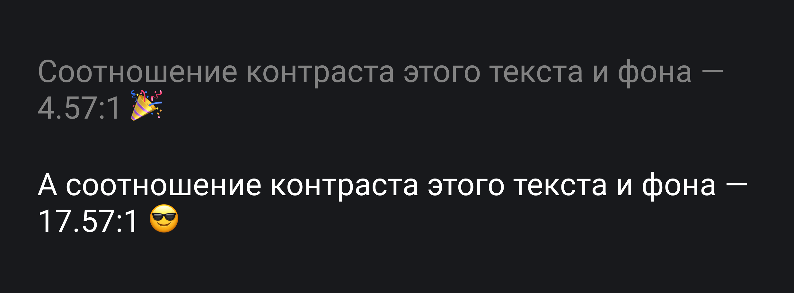

## Кратко

В [Web Content Accissibility Guidlines](/a11y/wcag/) (Руководствах по доступности веб-контента, коротко WCAG) есть уровни соответствия. Уровень соответствия означает, какая группа критериев уже поддерживается в интерфейсе или будет поддерживаться в будущем.

Уровни впервые появились во [WCAG 2.0](https://www.w3.org/TR/WCAG20/) ([перевод на русский](https://www.w3.org/Translations/WCAG20-ru/)) и есть во всех [версиях WCAG 2](/a11y/wcag/#versii-wcag).

## Для чего нужны

Уровни помогают расставить приоритеты при разработке интерфейсов и их тестировании. К примеру, во время аудита доступности сайта проверяете его соответствие определённому уровню критериев из WCAG.

Также уровни указывают в [официальных документах о доступности продуктов](https://web-standards.ru/articles/a11y-audit-basics/#section-24) — заявлении о доступности или заявлении о соответствии.

Достигнуть соответствия WCAG означает, что в интерфейсе выполнены все критерии какого-то уровня. Например, если стремитесь к уровню A, должны быть выполнены все критерии этого уровня. Если хотите соответствовать уровню AA, нужно выполнить критерии предыдущего уровня A и собственно AA. Когда выбираете максимальный уровень AAA, должны выполняться критерии всех трёх уровней.

## Уровни соответствия

Есть три уровня — самый минимальный A, средний AA и максимальный AAA.

Каждый критерий относится к одному из трёх уровней соответствия. Какие-то критерии касаются одного аспекта доступности и бывают только одного уровня. К примеру, только [1.4.1. Использование цвета](https://www.w3.org/WAI/WCAG21/Understanding/use-of-color.html) уровня A касается барьера, связанного с передачей смысла только цветом. Часть критериев описывает один аспект доступности, но с разной степенью продвинутости. Например, как критерии о контрастности — [1.4.3. Контраст (минимальный)](https://www.w3.org/WAI/WCAG21/Understanding/contrast-minimum.html) и [1.4.6. Контраст (продвинутый)](https://www.w3.org/WAI/WCAG21/Understanding/contrast-enhanced.html).

Минимальный критерий контрастности уровня AA рекомендует, что соотношение между текстом обычного размера и фоном должно быть минимум 4.5:1. Продвинутый критерий уровня AAA уже требует соотношения как минимум 7:1. На картинке первый текст соответствует минимальному критерию, а второй — продвинутому.

Во WCAG 2.0 всего 38 критериев уровня A и AA и 23 критерия AAA, во WCAG 2.1 — 50 критериев уровня A и AA и 28 критериев AAA, а во WCAG 2.2. — 57 критериев уровня A и AA и 30 критериев AAA.

### Уровень A

[Критерии уровня A](https://www.w3.org/WAI/WCAG21/quickref/?currentsidebar=%23col_customize&levels=aa%2Caaa) связаны с основными аспектами веб-доступности, которые влияют на большинство пользователей с инвалидностью. Например, на этом уровне есть критерии про альтернативные тексты для картинок, субтитры для видео и расшифровку для аудио, доступ с клавиатуры к основной функциональности интерфейса, язык страниц, управление анимацией и другие базовые вещи.

Если сайт не соответствует критериям уровня A, практически все пользователи с инвалидностью и вспомогательные технологии не смогут взаимодействовать с интерфейсом.

Когда проводите аудит или тестирование, лучше не проверять только критерии уровня A. Зато их важно учитывать на этапе дизайна, создания контента и написания кода.

### Уровень AA

[Критерии уровня AA](https://www.w3.org/WAI/WCAG21/quickref/?currentsidebar=%23col_customize&levels=a%2Caaa) касаются более сложных барьеров, с которыми также может столкнуться большинство пользователей.

Критерии этого уровня касаются аудиодескрипции для видео и субтитров для прямых трансляций, минимального соотношения контрастности текста и фона и нетекстового содержимого (картинок, иконок), заголовков на странице, видимого клавиатурного фокуса у элементов и прочего.

<aside>

👄 Аудиодескрипция — голосовое описание предметов, пространства или действий в видео, которое помогает лучше понять происходящее на экране людям со слепотой или слабовидящим.

</aside>

WCAG рекомендует ориентироваться на уровень AA. Кстати, законы о цифровой доступности также обычно требуют соответствия именно этому уровню.

### Уровень AAA

[Критерии уровня AAA](https://www.w3.org/WAI/WCAG21/quickref/?currentsidebar=%23col_customize&levels=a%2Caa) — это максимальный уровень доступности, который можете достичь с WCAG. Большинство критериев AAA касаются барьеров для определённой аудитории пользователей. Например, для людей с когнитивными особенностями — [дислексией](https://ru.wikipedia.org/wiki/%D0%94%D0%B8%D1%81%D0%BB%D0%B5%D0%BA%D1%81%D0%B8%D1%8F), [синдромом дефицита внимания](https://ru.wikipedia.org/wiki/%D0%A1%D0%B8%D0%BD%D0%B4%D1%80%D0%BE%D0%BC_%D0%B4%D0%B5%D1%84%D0%B8%D1%86%D0%B8%D1%82%D0%B0_%D0%B2%D0%BD%D0%B8%D0%BC%D0%B0%D0%BD%D0%B8%D1%8F_%D0%B8_%D0%B3%D0%B8%D0%BF%D0%B5%D1%80%D0%B0%D0%BA%D1%82%D0%B8%D0%B2%D0%BD%D0%BE%D1%81%D1%82%D0%B8), умственной отсталостью и так далее.

К примеру, есть критерии AAA про перевод видео на [язык жестов](https://ru.wikipedia.org/wiki/%D0%96%D0%B5%D1%81%D1%82%D0%BE%D0%B2%D1%8B%D0%B5_%D1%8F%D0%B7%D1%8B%D0%BA%D0%B8), продвинутый уровень контраста, полную поддержку клавиатуры без исключений, повторную аутентификацию пользователей без потери данных из прошлой сессии, расшифровку аббревиатур, текстов разных уровней сложности и прочего.

Уровень AAA сложно достичь, поэтому его лучше не выбирать как основную цель для тестирования и аудита. При этом хорошо попробовать соответствовать хотя бы некоторым критериям максимального уровня, чтобы ещё больше расширить аудиторию пользователей и улучшить их пользовательский опыт.

## Отличия от уровней WCAG 3

Во [WCAG 3](https://www.w3.org/TR/wcag-3.0/) уровни A, AA и AAA заменят на бронзовый, серебряный и золотой.

Бронза — минимальный уровень, который равен AA. Контент, который не соответствует требованиям этого уровня, не соответствует WCAG 3.

Серебро — это более высокий уровень соответствия требованиям доступности, который похож на AAA.

Золото — самый высокий уровень соответствия.
