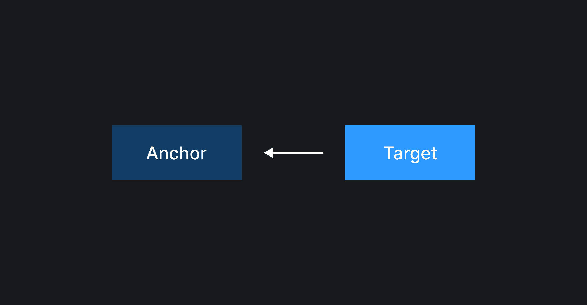

## Что такое Anchor Positioning?

При разработке интерфейсов нам требуется уметь создавать элементы, которые будут связаны друг с другом. Например, иконка и текст тултипа или селектбокс и выпадающий список. При этом нам важно, чтобы связанность и видимость элементов сохранялась при изменении вьюпорта, скролла или других взаимодействиях пользователя с интерфейсом.

Ранее не было особого выбора для реализации подобных компонентов. Статично связать два элемента мы могли с помощью относительного и абсолютного видов [позиционирования](/css/position/), а для реализации адаптивности компонента к изменению окружающей его среды нужно было использовать JavaScript.

И это было жутко неудобно. Требовалось вкладывать один элемент в другой, что не всегда возможно по семантике. А реализация адаптивности на JavaScript была не самой тривиальной задачей и могла негативно влиять на отзывчивость страницы, если это всё неправильно приготовить.

Чтобы решить эту проблему был придуман Anchor Positioing, который позволяет один элемент привязать к другому, как к якорю (*anchor — англ. якорь*), а также декларативно описать его поведение: в каких местах относительно якоря может располагаться элемент, в какие моменты он должен быть виден или скрыт, а также, как размер элемента зависит от размера якоря.

Технология сейчас в стадии активного развития и внедрения, что-то в ней может меняться. Пожалуйста, обращайтесь к [спецификации](https://www.w3.org/TR/css-anchor-position-1/), если не нашли чего-то в этом гайде.

## Основные термины

- **Якорный элемент (якорь / anchor):** элемент, к которому должен быть привязан и относительно которого позиционироваться другой элемент.
- **Таргет элемент (таргет / target):** элемент, который должен быть привязан к якорю.



## Свойства якорного элемента

### `anchor-name`

```css
.anchor {
  anchor-name: --anchor;
}
```

Свойство `anchor-name` объявляет элемент якорным. Оно задаёт имя, с помощью которого другие элементы могут сослаться на текущий, чтобы спозиционироваться относительно него.

Возможные значения:

- `none` — значение по умолчанию, якорное имя не задаётся;
- `<anchor-name>` — якорное имя, должно начинаться с двух тире.

Более подробно про свойство `anchor-name` читайте в отдельной [доке](/css/anchor-name/).

## Свойства, функции и директивы для таргет элемента

### `position-anchor`

```css
.target {
  position: absolute;
  position-anchor: --anchor;
}
```

Свойство `position-anchor` определяет якорный элемент, к которому по умолчанию должен быть привязан текущий таргет элемент.

Возможные значения `position-anchor`:

- `auto` — значение по умолчанию, дефолтное якорное имя не задаётся;
- `<anchor-name>` — имя, заданное в свойстве [`anchor-name`](#anchor-name) якорного элемента, должно начинаться с двух тире.

Кстати, не забудьте указать для таргет элемента `position: absolute` или `position: fixed`, так как Anchor Positioning работает только с данными видами позиционирования.

Более подробно про свойство `position-anchor` читайте в отдельной [доке](/css/position-anchor/).

### `anchor()`

```css
.target {
  top: anchor(bottom);
  left: anchor(right);
}
```

Функция `anchor()` помогает привязать таргет элемент к одной из сторон якорного элемента. Она ссылается на параметры позиционирования якорного элемента и может быть применена только в [inset-свойствах](/css/inset/).

<iframe title="Позиционируем элемент с помощью функции anchor()" src="demos/anchor-function-top-left/" height="490"></iframe>

Более подробно про функцию `anchor()` читайте в отдельной [доке](/css/anchor-function/).

### `anchor-center`

```css
.target {
  justify-self: anchor-center;
}
```

`anchor-center` – новое значение для `justify` и `align-self` свойств, при котором таргет элемент центруется относительно якоря по соответствующей оси.

<iframe title="Позиционируем элемент с помощью значения anchor-center" src="demos/anchor-center/" height="490"></iframe>

`anchor-center` может быть применимо для свойств:

- [`justify-self`](/css/justify-self/);
- [`align-self`](/css/align-self/);
- [`justify-items`](/css/justify-items/);
- [`align-items`](/css/align-items/);
- [`place-self`](/css/place-self/);
- [`place-items`](/css/place-items/).

### `position-area`

Позволяет расположить таргет элемент относительно якоря используя концепцию сетки.

Если обвести бордером границы вьюпорта, а затем провести визуальные линии сверху, снизу, справа и слева относительно якоря, то у нас получится девять ячеек, к которым можно обращаться с помощью ключевых слов `top`, `center`, `bottom`, `left`, `right` или с помощью их логических эквивалентов.


Лучше понять, какое значение прописать для свойства `position-area`, чтобы расположить его в нужном месте поможет интерективная демка ниже. В ней можно кликать на любую из ячеек, чтобы выбрать одну ячейку. Также можно зажать и тянуть, чтобы выбрать несколько ячеек.

<iframe title="Интерактивная демка, показывающася работу position-area" src="demos/position-area/" height="500"></iframe>

Более подробно про свойство `position-area` читайте в отдельной [доке](/css/position-area/).

### `position-try-fallbacks`

```css
.target {
  position-area: top center;
  position-try-fallbacks: flip-block;
}
```

Свойство `position-try-fallbacks` задаёт альтернативные варианты расположения таргет элемента, которые браузер может попробовать применить, если таргет элемент перестал помещаться целиком в своем начальном положении, заданном в свойстве [`position-area`](#position-area).

Есть несколько вариантов значений и подходов для работы с `position-try-fallbacks`:

- `none` — список альтернативных расположений остается пустым. Значение по умолчанию;
- `<try-tactic>` – применяет заранее определенные стратегии альтернативного расположения элемента. Существует три стратегии:
  - `flip-block` – элемент будет менять свое расположение в блочном направлении;
  - `flip-inline` – элемент будет менять свое расположение в строчном направлении;
  - `flip-start` – элемент будет менять ось расположения: если он находился в начале одной оси, то он переместится в начало противоположной оси; если элемент находился в конце одной оси, то он переместится в конец противоположной оси;
- `<position-area>` – альтернативное расположение, заданое с помощью значения для свойства [`position-area`](#position-area);
- `<position-try-option>` – имя альтернативного расположения, заданного с помощью директивы [`@position-try`](#position-try).

Все вышеперечисленные варианты значений (кроме `none`) можно комбинировать между собой и указывать несколько вариантов через запятую:

```css
.target {
  position-area: top;
  position-try-fallbacks: flip-block, left, right;
}
```

Попробуйте в демке ниже перетащить якорь к рамзным границам экрана.

<iframe title="Показываем работу свойства position-try-fallbacks" src="demos/position-try-fallbacks/" height="400"></iframe>

Более подробно про свойство `position-try-fallbacks` читайте в отдельной [доке](/css/position-try-fallbacks/).

### `@position-try`

```css
@position-try --try-option-name {
    property: value;
}
```

Директива `@position-try` объединяет набор стилей для альтернативного расположения таргет элемента под именем, которое можно использовать в качестве значения для свойства [`position-try-fallbacks`](#position-try-fallbacks).

Например, можем для фолбэк-значения добавить отступ и увеличить ширину таргет элемента:

```css
.target {
  position-area: top;
  position-try-fallbacks: --bottom;
  width: 300px;
}

@position-try --bottom {
  position-area: bottom;
  margin-top: 20px;
  width: 600px;
}
```

Попробуйте в демке ниже переместить якорный элемент сверху-вниз и обратно. Увидите, что в нижней позиции ширина таргета увеличивается и появляется отступ, которого не было в начальной позиции.

<iframe title="Показываем работу директивы @position-try" src="demos/position-try-rule/" height="400"></iframe>

Более подробно про директиву `@position-try` читайте в отдельной [доке](/css/position-try-rule/).

### `position-try-order`

```css
.target {
  position-area: top;
  position-try-fallbacks: flip-block, flip-inline;
  position-try-order: most-width;
}
```

Свойство `position-try-order` определяет порядок применения возможных вариантов расположения таргет элемента. Оно указывает на что браузер должен обращать внимание в первую очередь, когда выбирает, какой из фолбэков применить.

Имеет несколько значений:

- `normal` – фолбэки будут пробовать примениться в том порядке, в котором они указаны внутри свойства [`position-try-fallbacks`](#position-try-fallbacks). Значение по умолчанию;
- `most-width` – фолбэки начнут применяться, начиная с самого широкого (самой широкой ячейки);
- `most-height` – фолбэки начнут применяться, начиная с самого высокого (самой высокой ячейки).

Также для `most-width` и `most-height` существуют логические эквиваленты `most-block-size` и `most-inline-size`.

Посмотреть на работу свойства `position-try-order` можно в демке ниже.

<iframe title="Показываем работу свойства position-try-order" src="demos/position-try-order/" height="450"></iframe>

Более подробно про свойство `position-try-order` читайте в отдельной [доке](/css/position-try-order/).

### `position-try`

```css
.target {
  position-try: most-width flip-inline, bottom;
}
```

Свойство `position-try` является шорткатом для свойств [`position-try-order`](#position-try-order) и [`position-try-fallbacks`](#position-try-fallbacks). Вначале указывается порядок применения (который можно опустить), далее указываются фолбэки через запятую.

Более подробно про свойство `position-try` читайте в отдельной [доке](/css/position-try/).

### `position-visibility`

```css
.target {
  position-visibility: anchors-visible;
}
```

Свойство `position-visibility` определяет в каких случаях таргет элемент должен быть виден.

Например, с помощью него можно сделать так, чтобы таргет элемент мог скрываться, когда якорь пропадает с экрана. Попробуйте пролистать текст туда-сюда в демке ниже.

<iframe title="Показываем работу значения anchors-visible свойства position-visibility" src="demos/position-visibility-anchors-visible/" height="480"></iframe>

Свойство `position-visibility` принимает несколько значений:

- `always` – таргет элемент будет виден всегда, пока полностью или частично помещается на экран, видимость таргета не зависит от видимости якоря;
- `no-overflow` – таргет элемент будет скрываться, если происходит `overflow` – таргет элемент не помещается целиком ни в одну из позиций: ни в [начальную](#position-area), ни в [фолбэчную](#position-try-fallbacks);
- `anchors-visible` – таргет элемент будет виден, пока виден якорный элемент. Если якорь скрылся, таргет тоже перестанет быть видимым. Является значением по умолчанию.

Более подробно про свойство `position-visibility` читайте в отдельной [доке](/css/position-visibility/).

### `anchor-size()`

```css
.target {
  width: anchor-size(width);
}
```

С помощью `anchor-size()` можно получить значения ширины и высоты якорного элемента. Функция пригодится, если размеры таргет элемента должны зависеть от размеров якоря.

<iframe title="Демонстрация работы функции anchor-size()" src="demos/anchor-size-function/" height="480"></iframe>

Более подробно про функцию `anchor-size()` читайте в отдельной [доке](/css/anchor-size-function/).

## Свойства контейнера якорного элемента

### `anchor-scope`

```css
.container {
  anchor-scope: all;
}
```

Свойство `anchor-scope` ограничивает область применения указанных якорных имён поддеревом текущего элемента. За счёт этого можно использовать одно и то же якорное имя на разных элементах, например, в списках.

<iframe title="Показываем работу свойсва anchor-scope" src="demos/anchor-scope/" height="500"></iframe>

В демке выше три раза используется одно и то же якорное имя: в каждом элементе списка оно повторяется. Без использования `anchor-scope` все таргет элементы будут ссылаться на последний якорь в DOM-дереве. `anchor-scope` помогает это всё разрулить, ограничивая область видимости якорного имени поддеревом элемента списка.

Свойство `anchor-scope` принимает в себя три типа значений:

- `none` — ни одно якорное имя не будет ограничено поддеревом текущего элемента. Значение по умолчанию;
- `<anchor-name>` — список якорных имен через запятую, видимость которых должна быть ограничена поддеревом текущего элемента. Например, `--a, --b`;
- `all` — все якорные имена в поддереве текущего элемента должны быть доступны только в рамках этого элемента.

Более подробно про свойство `anchor-scope` читайте в отдельной [доке](/css/anchor-scope/).

## Использование нескольких якорей одновременно

```css
.anchor-1 {
  anchor-name: --anchor-1;
}

.anchor-2 {
  anchor-name: --anchor-2;
}

.target {
  position: absolute;
  top: anchor(--anchor-1 bottom);
  left: anchor(--anchor-1 right);
  right: anchor(--anchor-2 left);
  bottom: anchor(--anchor-2 top);
}
```

Anchor Positioning позволяет привязывать один и тот же таргет элемент сразу к нескольким якорям одновременно. И это можно очень классно использовать на практике. Например, как в демке ниже, меняя местоположение якорей, мы можем влиять на размер таргет элемента: делать его больше, меньше, или совсем сделать невидимым.

<iframe title="Использование нескольких якорей позволяет влиять на размер таргета" src="demos/multiple-anchors/" height="450"></iframe>

Использовать эту механику можно и при реализации UI-компонентов. Например, используя несколько якорей одновременно, можно сверстать тултип, который умеет показываться с каждой из четырёх сторон, при этом его хвостик всегда будет направлен в нужную сторону. Попробуйте в демке ниже перетащить кнопку к разным границам экрана – тултип будет адаптироваться.

<iframe title="Тултип на базе anchor positioning" src="demos/tooltip/" height="400"></iframe>

Кстати, разбор реализации такого тултипа можете найти в нашем [рецепте](/recipes/tooltip/#adaptivnyy-na-osnove-popover-api-i-css-anchor-positioning).

## Где применять?

Anchor Positioning открывает перед разработчиками очень крутые возможности. То, что раньше было возможно только при помощи JavaScript, теперь можно описать декларативно на CSS. Всё зависит только от полёта вашей фантазии.

Мы немножко поразмышляли, и прикинули, где Anchor Positioning точно может пригодиться.

### UI-компоненты

Как мы уже убедились в этом гайде выше, Anchor Positioning может быть полезен при проектировании тултипа. Также можно реализовать и другие компоненты, части которых, должны быть привязаны друг к другу. Например, меню. Попробуйте открыть несколько вложенных уровней меню и проскроллить к разным частям экрана – выпадающие списки смогут адаптироваться.

<iframe title="Меню на базе anchor positioning" src="demos/menu/" height="450"></iframe>

### Transition-переходы

Также можно использовать Anchor Positioning для реализации классных transition-переходов. Например, для ховера элементов навигации. Попробуйте навести последовательно на несколько ссылок в демке ниже – задний фон будет перетекать от одного элемента к другому.

<iframe title="Transition-эффект на ховер элементов навигации" src="demos/nav-with-transition/" height="320"></iframe>

### Визуальные подсказки

Можно реализовать различные визуальные подсказки в интерфейсе. Например, подсказки, указывающие на максимальное и минимальное значения в графике.

<iframe title="Подсказки для графика" src="demos/help-in-chart/" height="400"></iframe>

### Графы

На базе Anchor Positioning можно построить граф. Если добавить поверх drag'n'drop, то вершины можно двигать в разные стороны и ничего не будет отваливаться.

<iframe title="Граф" src="demos/graph/" height="420"></iframe>

### Анимации

И какой-же фронтенд без крутилок и свистелок? Anchor Positioning можно использовать и для построения классных анимацией.

<iframe title="Граф" src="demos/animation/" height="400"></iframe>

## Доступность

Используя Anchor Positioning важно не забывать про доступность. Данное апи позволяет нам только визуально связать элементы друг с другом. Описание семантической связи лежит на плечах разработчика.

## Шпаргалка

Чтобы лучше сориентироваться в дальнейшем, какое из CSS-свойств отвечает за какую фичу Anchor Positoining, собрали для вас таблицу-шпаргралку.

| Фича                         | CSS-свойство |
|------------------------------|--------------|
| якорь и таргет              | [`anchor-name`](#anchor-name), [`position-anchor`](#position-anchor) |
| местоположение               | [`anchor()`](#anchor), [`position-area`](#position-area), [`anchor-center`](#anchor-center) |
| размер                       | [`anchor-size()`](#anchor-size) |
| адаптивность местоположения  | [`position-try`](#position-try-1), [`position-try-fallbacks`](#position-try-fallbacks), [`position-try-order`](#position-try-order), [`@position-try`](#position-try) |
| видимость                    | [`position-visibility`](#position-visibility) |
| область применения           | [`anchor-scope`](#anchor-scope) |

## Полезные ссылки

1. [Спецификация](https://www.w3.org/TR/css-anchor-position-1/)
1. [Роман Комаров – Future CSS: Anchor Positioning](https://kizu.dev/anchor-positioning-experiments/)
1. [Anchoreum: игра для изучения Anchor Positioning](https://anchoreum.com/)
