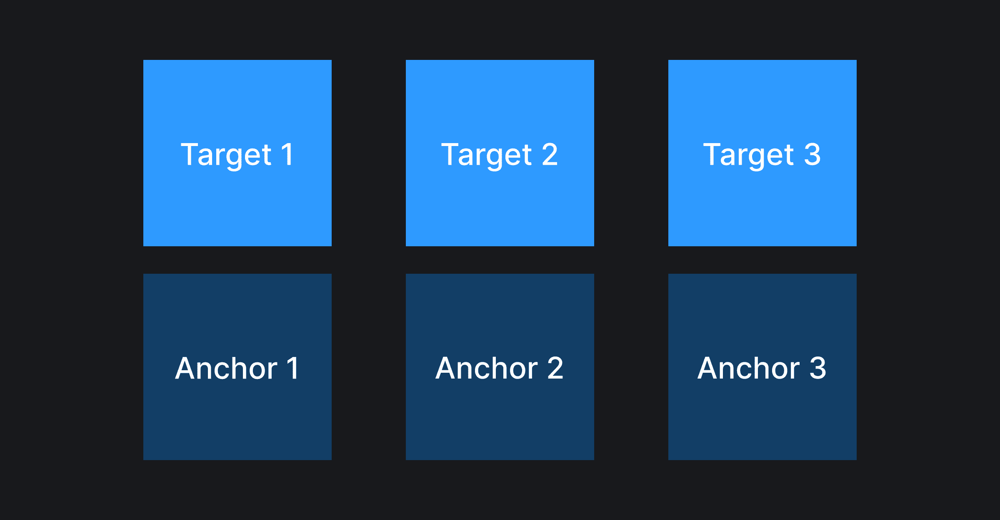
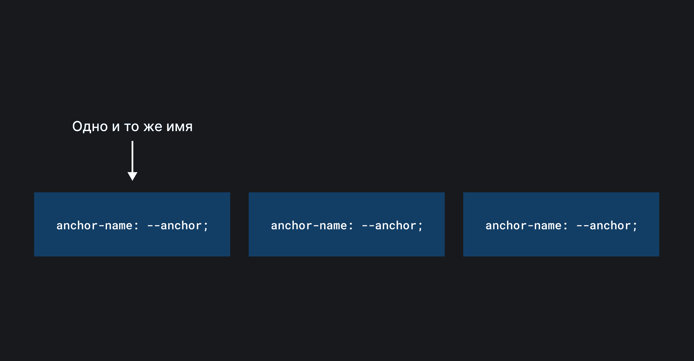
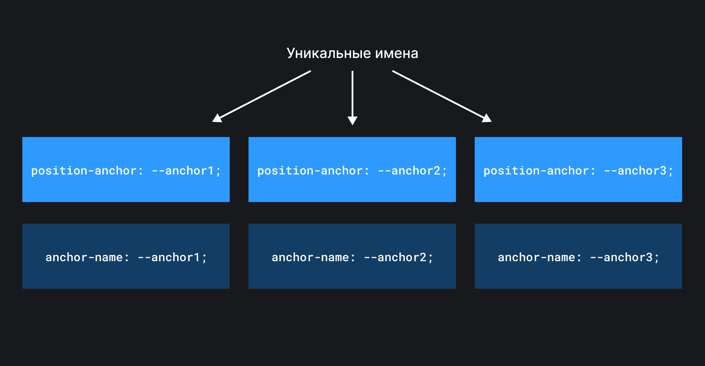
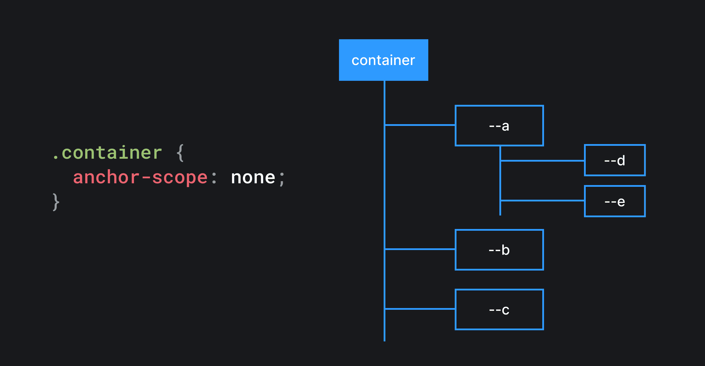

## Кратко

Свойство `anchor-scope` ограничивает область применения указанных якорных имён в поддереве текущего элемента.

## Пример

```css
.container {
  anchor-scope: all;
}
```

## Как понять

Представим, что нам нужно сверстать список, в каждом элементе которого есть якорный и таргет элементы (второй привязан к первому). Выглядеть это должно примерно, как на картинке ниже.



Попробуем это реализовать.

Добавляем HTML-разметку.

```html
<ul>
  <li>
    <div class="anchor">Anchor 1</div>
    <div class="target">Target 1</div>
  </li>
  <li>
    <div class="anchor">Anchor 2</div>
    <div class="target">Target 2</div>
  </li>
  <li>
    <div class="anchor">Anchor 3</div>
    <div class="target">Target 3</div>
  </li>
</ul>
```

Затем связываем таргет элементы с якорем.

```css
.anchor {
  anchor-name: --anchor;
}

.target {
  position: absolute;
  position-anchor: --anchor;
  position-area: top;
}
```

Запускаем код в браузере и видим, что на экране отображен только третий таргет элемент. Куда же подевались ещё два?

<iframe title="Используем несколько раз один и тот же anchor-name без anchor-scope – таргет элементы прилипают к последнему якорю" src="demos/without-anchor-scope-1/" height="480"></iframe>

Если добавим отступов для дебага, то увидим, что, на самом деле все, три таргет элемента присутствуют на экране, просто они почему-то прикрепились к последнему якорю. Почему так происходит?

<iframe title="Используем несколько раз один и тот же anchor-name без anchor-scope – таргет элементы прилипают к последнему якорю (с отступами)" src="demos/without-anchor-scope-2/" height="480"></iframe>

В данном примере мы использовали одно и то же якорное имя для нескольких элементов.



Чтобы привязать таргет элемент к якорю, браузер ищет последний элемент в DOM с указанным якорным именем и прикрепляет элемент к нему.


Как починить? Можно использовать уникальные имена для каждого якоря.



Но это может быть не всегда удобно, так как нужно либо заранее придумать и прописать в коде уникальные имена, либо описывать эту логику на JavaScript (чего хотелось бы избежать).

Чтобы решить подобную проблему было придумано свойство `anchor-scope`, которое позволяет ограничить видимость якорного имени поддеревом конкретного элемента.

## Как пишется

Свойство `anchor-scope` принимает в себя три типа значений:

- `none` — ни одно якорное имя не будет ограничено поддеревом текущего элемента. Значение по умолчанию; 
- `<anchor-name>` — список якорных имен через запятую, видимость которых должна быть ограничена поддеревом текущего элемента. Например, `--a, --b`; [Схема, объясняющая работу anchor-scope: --a, --b](images/anchor-scope-a-b.png)
- `all` — все якорные имена в поддереве текущего элемента должны быть доступны только в рамках этого элемента. [Схема, объясняющая работу anchor-scope: all](images/anchor-scope-all.png)

Теперь, когда мы знаем, как работает свойство `anchor-scope`, починить нашу демку будет проще простого.

```css
.anchor {
  anchor-name: --anchor;
}

.target {
  position: absolute;
  position-anchor: --anchor;
  position-area: top;
}

/*
  Ограничиваем область видимости якоря элементом списка.
*/
ul li {
  anchor-scope: --anchor;
}
```

<iframe title="Используем несколько раз один и тот же anchor-name с anchor-scope – таргет элементы прилипают к своему якорю" src="demos/with-anchor-scope/" height="500"></iframe>
