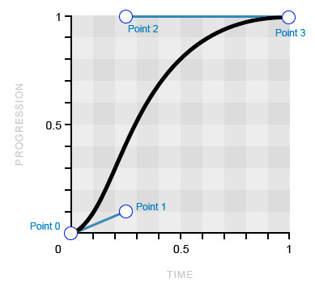

## Кратко

Веб в процессе развития из текста с картинками превратился в интерактивное пространство. Заходя на разные сайты, вы постоянно видите анимации. От микроскопических реакций на наведение курсора до сложных сцен.

<iframe title="CSS-анимация магазинчика" src="demos/shop-animation/" height="520"></iframe>

Первые анимации реализовывались при помощи Flash и JavaScript. Позже многие инструменты были внедрены в CSS. Именно о CSS-анимациях мы поговорим в этой статье.

CSS-анимации могут проигрываться без дополнительных действий со стороны пользователя и состоять из нескольких шагов.

Список свойств для создания CSS-анимаций:

- [`animation-name`](/css/animation-name/);
- [`animation-duration`](/css/animation-duration/);
- [`animation-iteration-count`](/css/animation-iteration-count/);
- [`animation-direction`](/css/animation-direction/);
- [`animation-timing-function`](/css/animation-timing-function/);
- [`animation-delay`](/css/animation-delay/);
- [`animation-play-state`](/css/animation-play-state/);
- [`animation-fill-mode`](/css/animation-fill-mode/);
- [`animation`](/css/animation/).

Для создания _ключевых кадров_ используется директива [`@keyframes`](/css/keyframes/).

## `@keyframes`

Что из себя представляет любая анимация? Это переход от одного состояния элемента к другому состоянию.

Чтобы рассказать браузеру, с чего начать и чем закончить анимацию, используется директива `@keyframes`.

Представим, что у нас есть два блока: розовый круг и синий квадрат. Мы хотим написать анимацию так, чтобы розовый круг превращался в синий квадрат, а синий квадрат превращался в розовый круг.

<iframe title="Круг и квадрат — CSS-анимации — Дока" src="demos/circle-square/" height="300"></iframe>

Начать создание нашей анимации нужно с разложения её на шаги — _ключевые кадры_. Наша анимация будет простая, у неё будет всего два ключевых кадра.

Чтобы превратить розовый круг в синий квадрат, нам нужно будет поменять три свойства: [`width`](/css/width/), [`height`](/css/height/) и [`background-color`](/css/background-color/).

Чтобы прописать ключевые кадры, используем директиву `@keyframes`:

```css
@keyframes circle-to-square {
  from {
    width: 50px;
    height: 50px;
    background-color: #F498AD;
  }
  to {
    width: 200px;
    height: 200px;
    background-color: #2E9AFF;
  }
}
```

После ключевого слова `@keyframes` мы должны написать **имя анимации**. Оно понадобится нам, чтобы связать анимацию для конкретного элемента с ключевыми кадрами. Желательно, чтобы имя анимации было уникальным.

<aside>

👉 Если в коде встречается несколько директив с одинаковыми именами, то будет воспроизводиться последняя, стоящая ниже в коде анимация.

</aside>

Ключевые кадры могут прописываться при помощи ключевых слов `from` (начальный кадр) и `to` (конечный кадр). Это удобно, если у вас всего два ключевых кадра. Если же кадров больше двух, то можно использовать проценты.

Добавим нашей анимации промежуточный шаг, когда наш круг будет фиолетовым прямоугольником:

```css
@keyframes circle-to-square {
  from {
    width: 50px;
    height: 50px;
    background-color: #F498AD;
  }
  50% {
    width: 50px;
    height: 200px;
    background-color: #7F6EDB;
  }
  to {
    width: 200px;
    height: 200px;
    background-color: #2E9AFF;
  }
}
```

Браузер расшифровывает ключевое слово `from` как `0%`, а ключевое слово `to` как `100%`.

<iframe title="Круг и квадрат c @keyframes" src="demos/circle-square-keyframes/" height="300"></iframe>

Мы прописали ключевые кадры анимации, но пока ничего не происходит 🥲

Чтобы анимация начала проигрываться, нам нужно присвоить её какому-то элементу, чтобы браузер понимал, какой элемент на странице анимировать.

## `animation-name`

Для присвоения анимации элементу как раз нужно имя, которое мы придумали.

```css
.child-one {
  animation-name: circle-to-square;
}
```

Теперь браузер знает, что ключевые кадры анимации с названием `circle-to-square` должны применяться к элементу с классом `child-one`.

Кроме имени анимации можно указать `none`, значение по умолчанию. Означает отсутствие анимации. Удобно использовать для сброса анимации.

Например, можно указать это значение для элемента по ховеру:

```css
.element {
  animation: some-animation;
}

.element:hover {
  animation: none;
}
```

Но анимация всё ещё не работает! Потому что браузер не знает, за какое время нужно изменять свойства элемента.

## `animation-duration`

При помощи свойства `animation-duration` пропишем длительность одного цикла анимации. Значение этого свойства указывается в секундах `s` или миллисекундах `ms`.

Пусть круг превращается в квадрат за 5 секунд:

```css
.child-one {
  animation-name: circle-to-square;
  animation-duration: 5s;
}
```

<iframe title="Круг и квадрат c длительностью" src="demos/circle-square-duration/" height="300"></iframe>

<aside>

👌 Если указать `0s`, то ключевые кадры будут пропущены, анимация применится мгновенно.

</aside>

Ура! Анимация проигрывается! Но только один раз... Есть вероятность, что пользователь просто не увидит анимации — она закончится раньше, чем он доскроллит до этого места страницы.

## `animation-iteration-count`

При помощи свойства `animation-iteration-count` можно указать, сколько раз анимация будет проигрываться.

В качестве значения указывается число, означающее количество повторений, или ключевое слово `infinite`. Если указано `infinite`, то анимация будет повторяться бесконечно. Это значение встречается чаще всего!

```css
.child-one {
  animation-name: circle-to-square;
  animation-duration: 5s;
  animation-iteration-count: infinite;
}
```

<iframe title="Круг и квадрат c итерациями" src="demos/circle-square-iteration/" height="300"></iframe>

Теперь анимация проигрывается постоянно, но вы наверняка видите, что после последнего кадра происходит резкий скачок к исходному состоянию. Выглядит откровенно так себе.

## `animation-direction`

Свойство `animation-direction` сообщает браузеру, должна ли анимация проигрываться в обратном порядке.

Доступные значения:

- `normal` — **значение по умолчанию**, анимация воспроизводится от начала до конца, после чего возвращается к начальному кадру.
- `reverse` — анимация проигрывается в обратном порядке, от последнего ключевого кадра до первого, после чего возвращается к последнему кадру.
- `alternate` — каждый нечётный повтор (первый, третий, пятый) анимации воспроизводится в прямом порядке, а каждый чётный повтор (второй, четвёртый, шестой) анимации воспроизводится в обратном порядке.
- `alternate-reverse` — аналогично значению `alternate`, но чётные и нечётные повторы меняются местами.

```css
.child-one {
  animation-name: circle-to-square;
  animation-duration: 5s;
  animation-iteration-count: infinite;
  animation-direction: alternate;
}
```

<iframe title="Круг и квадрат c направлением анимации" src="demos/circle-square-direction/" height="300"></iframe>

Теперь анимация красиво проигрывается. Круг плавно становится квадратом, а потом снова плавно превращается в круг 😌

По факту наша анимация работает, можно оставить так. Но есть что улучшить!

## `animation-timing-function`

Анимации пришли в веб в попытке стереть границу между реальным миром и компьютерным. В реальном мире вещи не меняют свои свойства мгновенно. Мячик перемещается из вашей руки на пол не моментально, а плавно меняя свою позицию в пространстве.

CSS-анимации по умолчанию проигрываются линейно, меняя свойства элемента на равные доли в равные промежутки времени. Такое поведение редко встречается в реальной жизни. Тот же мячик начинает своё движение медленно и со временем ускоряется.

При помощи свойства `animation-timing-function` можно задать, как будет развиваться анимация между ключевыми кадрами: равномерно, или сначала быстро, потом медленно, или по каким-то сложным внутренним законам.

### `linear`

Анимация проигрывается равномерно, без колебаний скорости.

### `linear(число, число, ...)`

Не путать с ключевым словом `linear` выше, это отдельная функция. Она задаёт кривую через набор контрольных точек прогресса, между которыми браузер интерполирует линейно.

```css
.ball {
  animation-timing-function: linear(
    0, 0.5, 0.75, 0.85, 0.925, 1,
    0.94, 0.98, 1, 0.985, 1
  );
}
```

У каждой точки можно явно задать процент времени, к которому она должна быть достигнута, вторым числом после неё: `linear(0, 0.25 75%, 1)`. Без процентов точки распределяются по временной шкале равномерно.

Правила формата строгие: точек должно быть минимум две, значения — только числа (никаких ключевых слов вроде `start`/`middle`/`end`), а проценты у соседних точек идут строго по возрастанию.

### `ease`

Значение по умолчанию. Анимация начинается медленно, затем быстро разгоняется и снова замедляется к концу.

### `ease-in`

Анимация начинается медленно и плавно ускоряется к концу.

### `ease-out`

Анимация начинается быстро и плавно замедляется к концу.

### `ease-in-out`

Анимация начинается и заканчивается медленно, ускоряясь в середине.

### `cubic-bezier(x1, y1, x2, y2)`

Временная функция, описывающая тип ускорения в виде кривой Безье.



По оси _x_ располагается временная шкала анимации, а по оси _y_ — прогресс анимации. Это очень мощный инструмент для создания разнообразных анимаций со сложными внутренними законами.

Значения `x1` и `x2` должны находиться в диапазоне от 0 до 1 включительно. Задавая значения `y1` и `y2` меньше 0 или больше 1, можно добиться эффекта пружины.

Редко когда разработчики пишут эту функцию _из головы_. Чаще всего используется инструмент визуализации, позволяющий изменять значения и сразу видеть, как будет выглядеть анимация. Такой [конструктор](/css/animation-timing-function/#konstruktor-krivyh) — сразу для `cubic-bezier()` и `linear()` — есть в статье про `animation-timing-function`.

### `step-start`

Задаёт пошаговую анимацию, разбивая её на отрезки, изменения происходят в начале каждого шага.

### `step-end`

Пошаговая анимация, изменения происходят в конце каждого шага.

### `steps(количество шагов, положение шага)`

Функция, указывающая, что анимация должна воспроизводиться _шагами_, резко переходя от одного состояния к другому.

Первый параметр указывает, на сколько отрезков нужно разбить анимацию. Значением должно быть целое положительное число больше 0.

Второй параметр необязательный, указывает позицию шага — момент, когда начинается анимация. Возможные значения:

- `jump-start` — первый шаг происходит при значении `0`.
- `jump-end` — последний шаг происходит при значении `1`.
- `jump-none` — все шаги происходят в пределах от `0` до `1` включительно.
- `jump-both` — первый шаг происходит при значении `0`, последний — при значении `1`.
- `start` — ведёт себя как `jump-start`.
- `end` — ведёт себя как `jump-end`.

Со значением `start` анимация начинается в начале каждого шага, со значением `end` — в конце каждого шага с задержкой. Задержка вычисляется как результат деления времени анимации на количество шагов. Если второй параметр не указан, используется значение по умолчанию `end`.

Очень сложно представить, как же будет выглядеть анимация при каждом из этих значений. Гораздо информативнее — сравнить графики всех разобранных функций сразу:

<iframe title="Графики и живое движение всех временных функций, включая linear() и cubic-bezier() с эффектом пружины" src="demos/timing-functions/" height="900"></iframe>

Вернёмся к нашему розовому кругу и укажем, что он должен превращаться в синий квадрат нелинейно, медленно разгоняясь к концу анимации.

```css
.child-one {
  animation-name: circle-to-square;
  animation-duration: 5s;
  animation-iteration-count: infinite;
  animation-direction: alternate;
  animation-timing-function: ease-in;
}
```

<iframe title="Круг и квадрат c временными функциями" src="demos/circle-square-timing-funcs/" height="300"></iframe>

Анимация стала более естественной, не такой _компьютерной_.

Пришло время заняться правой фигурой и превратить синий квадрат в розовый круг. Используем практически те же самые свойства, что и для круга, только зададим другое значение для свойства `animation-direction`, чтобы шаги анимации воспроизводились в обратном порядке:

```css
.child-two {
  animation-name: circle-to-square;
  animation-duration: 5s;
  animation-iteration-count: infinite;
  animation-direction: alternate-reverse;
  animation-timing-function: ease-in;
}
```

<iframe title="Круг и квадрат c обратной анимацией" src="demos/circle-square-reverse/" height="300"></iframe>

Сейчас обе фигуры меняются синхронно. Добавим правой фигуре небольшую задержку.

## `animation-delay`

Свойство задаёт задержку воспроизведения анимации. Значением может быть любое число, как отрицательное, так и положительное.

Если значение положительное, то будет задержка перед началом анимации. Если значение отрицательное, то анимация начнётся как бы _за кадром_.

Пусть анимация правого элемента начнётся с задержкой -2.5 секунды. Так она будет начинаться с середины:

```css
.child-two {
  animation-name: circle-to-square;
  animation-duration: 5s;
  animation-iteration-count: infinite;
  animation-direction: alternate-reverse;
  animation-timing-function: ease-in;
  animation-delay: -2.5s;
}
```

<iframe title="Круг и квадрат c задержкой" src="demos/circle-square-delay/" height="300"></iframe>

## `animation-play-state`

Свойство, позволяющее ставить анимацию на паузу и запускать снова.

Доступные значения:

- `running` — анимация проигрывается (значение по умолчанию).
- `paused` — анимация ставится на паузу. При повторном запуске анимации она продолжается с того места, где была остановлена.

Добавим возможность взаимодействовать с нашей анимацией. Пусть по наведению курсора анимация ставится на паузу, а если курсор убран, то продолжает проигрываться.

```css
.child:hover {
  animation-play-state: paused;
}
```

## `animation-fill-mode`

Последнее свойство анимации — `animation-fill-mode` — сообщает браузеру, нужно ли применять стили ключевых кадров **до** или **после** проигрывания анимации.

Доступные значения:

- `none` — стили анимации не применяются до и после проигрывания анимации (значение по умолчанию).
- `forwards` — после окончания анимации элемент сохранит стили последнего ключевого кадра.
- `backwards` — после окончания анимации к элементу будут применены стили первого ключевого кадра.
- `both` — до начала анимации к элементу применяется первый ключевой кадр, а после окончания анимации элемент останется в состоянии последнего ключевого кадра.

Для лучшего понимания работы этих значений посмотрите демо 👇

<iframe title="Эквалайзеры с разными режимами animation-fill-mode" src="demos/traffic-lights/" height="610"></iframe>

## `animation`

`animation` — это мега-шорткат, в котором можно за раз указать значения для всех перечисленных выше свойств, начинающихся на `animation-`.

Значения указываются через пробел. Порядок указания значений не важен. Из-за того, что значения этих свойств очень разные, браузер сам догадывается, какое значение к какому свойству относится. Важно только помнить, что первое значение времени будет воспринято как значение `animation-duration` (длительность анимации), а второе — `animation-delay` (задержка воспроизведения).

Для работы анимации совсем не обязательно перечислять все значения. Достаточно указать имя анимации и её длительность. Для остальных свойств будут установлены значения по умолчанию.

```css
.child-two {
  animation: circle-to-square 2s infinite alternate-reverse ease-in 1s;
}
```

## Несколько анимаций

Есть возможность применить к одному элементу сразу несколько анимаций. Для этого нужно перечислить несколько значений через запятую. Возможно указать любое количество значений для любого из свойств анимации. Анимации будут воспроизводиться одновременно.

Например, разобьём предыдущую анимацию на две отдельные. Одна будет отвечать за изменение формы элемента, а вторая за изменение цвета.

```css
@keyframes circle-to-square {
  from {
    width: 50px;
    height: 50px;
  }
  50% {
    width: 100%;
    height: 50px;
  }
  to {
    width: 100%;
    height: 100%;
  }
}

@keyframes color-change {
  from {
    background-color: #F498AD;
  }
  50% {
    background-color: #7F6EDB;
  }
  to {
    background-color: #2E9AFF;
  }
}
```

И присвоим обе анимации одному элементу, при этом задав первой задержку, и указав разное время воспроизведения.

```css
.child {
  animation:
    circle-to-square 10s infinite alternate ease-out 1s,
    color-change 5s alternate linear infinite;
}
```

<iframe title="Круг с анимацией по ховеру" src="demos/circle-hover/" height="300"></iframe>

В итоге форма меняется за 10 секунд, а цвет перетекает из розового в синий за 5 секунд. А потом обратно. Очень красиво и медитативно 🙌
