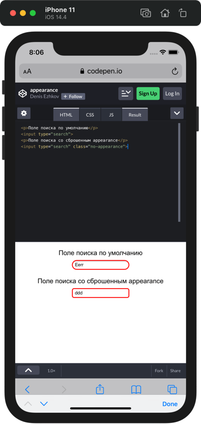

## Кратко

Некоторые элементы форм имеют уникальный внешний вид в каждой операционной системе. Например, выпадающий список в macOS внешне выглядит совсем не так, как такой же выпадающий список в Windows.

Свойство `appearance` позволяет задавать внешний вид одних элементов другим элементам. При этом браузер будет отрисовывать их с учётом текущей операционной системы пользователя и темы оформления.

В настоящее время используется в основном `appearance: none` для сброса системных стилей, остальные значения не работают практически ни в одном браузере.

## Как понять

Свойство `appearance` может использоваться как для задания, так и для сброса внешнего вида элемента.

### Сбрасываем внешний вид

Если задать `appearance: none`, то происходит «сброс» внешнего вида элемента. Приведение его к общему знаменателю во всех браузерах и всех операционных системах.

Например, в браузере Safari на iOS поле ввода с атрибутом `type="search"` принудительно стилизуется скруглёнными углами, тенями и рамками. Чтобы не перекрывать каждое свойство по отдельности, можно задать такому полю `appearance: none`.

<iframe title="Стандартное поле поиска и поле с appearance" src="demos/search-fields/" height="200"></iframe>



Если пример открыть _не в мобильном браузере_, то разница не заметна, так как в десктопных браузерах внешний вид полей ввода более или менее унифицирован.

### Меняем внешний вид элемента

Значение `appearance`, отличное от `none`, задаётся, чтобы применить специфичные для платформы стили к элементам, у которых этих стилей нет.

В этом случае, если нам нужно, чтобы поле ввода выглядело как поле поиска, мы можем задать `appearance: searchfield`

<iframe title="Текстовое поле и якобы поле поиска" src="demos/text-pseudo-search-fields/" height="200"></iframe>


## Как пишется

```css
.element {
  appearance: none;
}
```

Значение по умолчанию:

```css
.element {
  appearance: auto;
}
```

<aside>

💡 Можно заметить, что в примерах выше некоторые CSS-свойства начинаются с префиксов `-moz-`, `-webkit` или `-ms-`. Такие префиксы называются [**вендорными**](/css/vendor-prefixes/) и используются довольно редко. Вендорными префиксами снабжаются те CSS-свойства, которые ещё официально не утверждены стандартом, либо пока не поддерживаются браузером в полной мере. Так, например, свойства с префиксом `-moz-` будут применяться только браузером на движке `Gecko` (Mozilla Firefox).

</aside>
