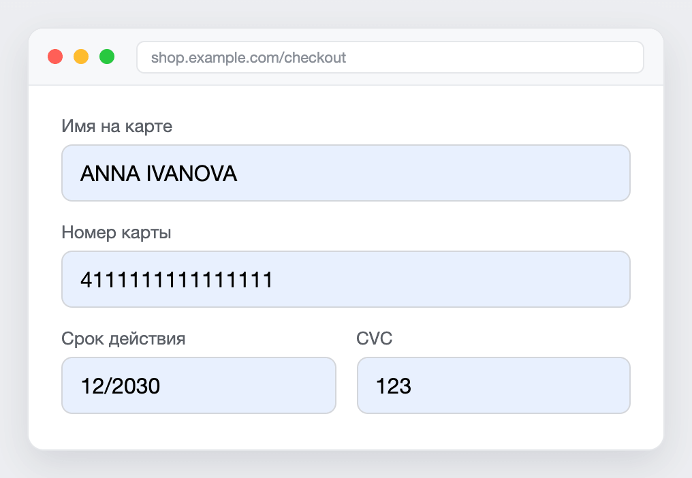
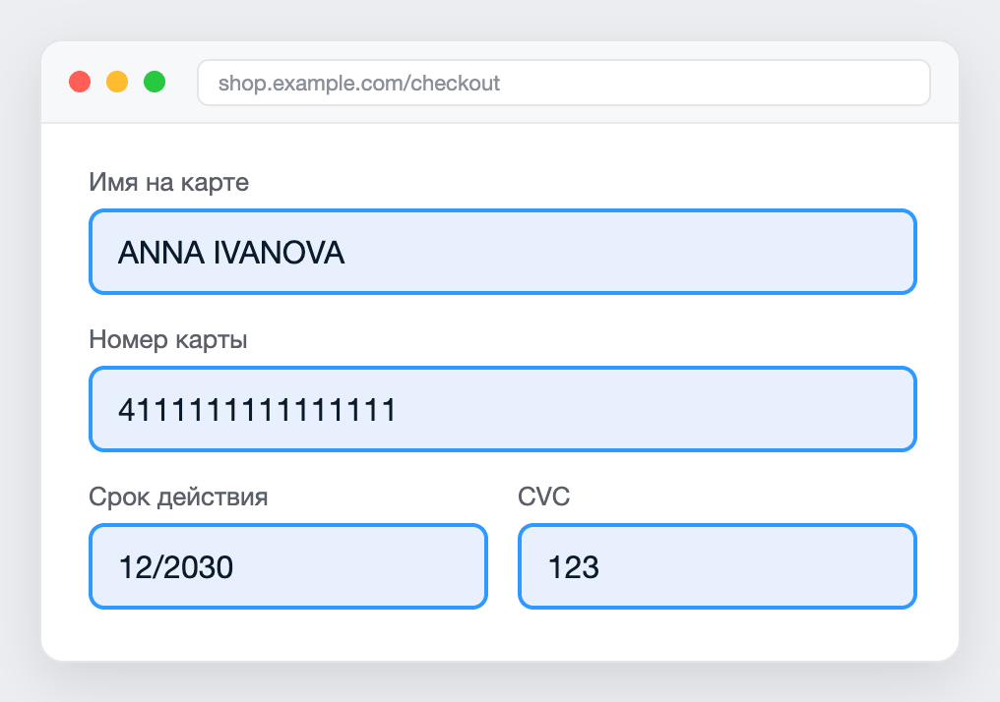

## Кратко

`:autofill` — псевдокласс, который находит поля формы, куда браузер сам подставил сохранённые данные: адрес, телефон, почту. Нужен, чтобы подсвеченные браузером поля не выбивались из дизайна формы.

## Пример

```css
/* Автозаполненные поля выделяем рамкой */
input:autofill {
  border: 2px solid #2E9AFF;
  border-radius: 4px;
}
```

## Как пишется

```css
/* Псевдокласс цепляется к селектору поля */
input:autofill,
textarea:autofill {
  border-color: #2E9AFF;
}

/* И комбинируется с другими псевдоклассами */
input:autofill:focus {
  outline: 2px solid #2E9AFF;
}
```

## Как понять

Браузеры умеют запоминать данные, которые пользователь вводит в формы, и предлагать их в других похожих полях. Например, если вы один раз ввели свою почту на сайте, браузер может предложить её же при регистрации на другом ресурсе. Когда пользователь соглашается на такое предложение, браузер подставляет значение в поле — это и есть автозаполнение.

Псевдокласс `:autofill` срабатывает именно в этот момент, когда браузер самостоятельно вставил данные в поле. Он позволяет переопределить стандартное оформление таких полей, которое может отличаться от дизайна вашего сайта.



### Как ведёт себя автозаполнение

- Автозаполнение происходит только по инициативе браузера. Запустить его через JavaScript нельзя.
- Браузер может подставить значения сразу в несколько [`<input>`](/html/input/), например в `<input type="email">` и `<input type="tel">`.
- Пока пользователь не редактирует поле, оно считается автозаполненным и соответствует `:autofill`.
- Если пользователь удалит подставленное значение, а потом вернёт его обратно (даже то же самое), поле перестанет считаться автозаполненным, потому что теперь значение ввёл пользователь, а не браузер.

### Что стилизуется, а что нет

Браузер красит автозаполненное поле сам: Chrome ставит голубоватый фон, Safari жёлтый. Эти правила лежат в служебной таблице стилей браузера и помечены флагом [`!important`](/css/important/), поэтому у выбранного автозаполненного поля вашими правилами не перебиваются [`background-color`](/css/background-color/), [`background-image`](/css/background-image/) и [`color`](/css/color/). Так задумано: подсветка сообщает пользователю, что значение подставил браузер, а не сайт.

Всё остальное стилизуется как обычно: [`border`](/css/border/), [`border-radius`](/css/border-radius/), [`box-shadow`](/css/box-shadow/), [`outline`](/css/outline/), отступы. Обычно этого хватает, чтобы поле не выбивалось из формы.

Цвет текста тоже можно задать, только не через `color`. В браузерах на движках WebKit и Blink для этого есть `-webkit-text-fill-color`, и вот его браузер не блокирует.

```css
input:autofill {
  -webkit-text-fill-color: #0B1B2E;
  border: 2px solid #2E9AFF;
  border-radius: 8px;
}
```



Рамку браузер отдал, а фон оставил себе, это хорошо видно в сравнении с первым скриншотом. Если голубая подсветка не вписывается, её оттенок меняет [`color-scheme`](/css/color-scheme/): в тёмной схеме Chrome берёт приглушённо-синий. Отдельных правил для этого писать не нужно, достаточно объявить схему для страницы.

Если дизайн требует именно своего фона, остаются обходные приёмы. О них в разделе «На практике».

## Подсказки

💡 Прописывайте корректные значения [`autocomplete`](/html/autocomplete/) у полей, чтобы браузер предлагал уместные данные и чаще попадал в `:autofill`.
💡 Не полагайтесь на `:autofill` для валидации: это лишь визуальное состояние, а не факт корректности данных.
