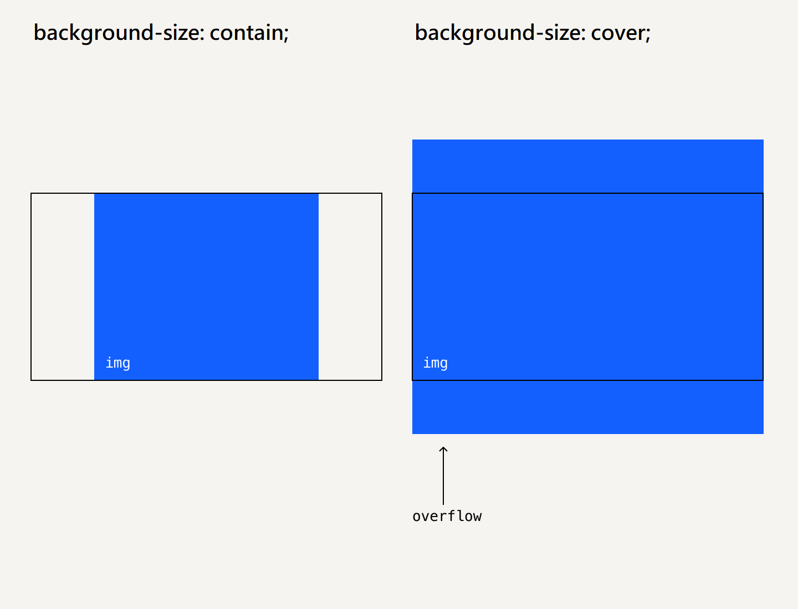

## Кратко

Свойство `background-size` позволяет изменять размер фонового изображения. Если фоновая картинка не совпадает по размеру с размерами блока, то при помощи этого свойства можно сделать так, чтобы она, картинка занимала всю площадь блока или, наоборот, была определённого размера.

## Пример

Создадим блок и в качестве фона зададим ему красивую панораму:


```html
<div class="element"></div>
```

```css
.element {
  height: 100vh;
  background-color: #f1f1f1;
  background-image: url("landscape.jpg");
  background-repeat: no-repeat;
}
```

<iframe title="Фон без управления размером" src="demos/fullsize/" height="400"></iframe>

Если не указывать свойство `background-size`, то будет видна только небольшая часть картинки. Но хотелось бы, чтобы фон, несмотря на его нестандартный размер, смотрелся хорошо.

Укажем свойство `background-size` со значением `100% 100%`. По логике с таким значением фон должен занимать 100% высоты элемента и 100% ширины элемента.

<iframe title="Фон с размером 100% 100%" src="demos/100-100/" height="400"></iframe>

Если у вас широкий монитор, то можно и не заметить подвоха, но на узких мониторах картинка будет деформироваться и сплющиваться по ширине.

Есть способ заставить картинку занять всю доступную площадь и при этом не деформироваться. Зададим `background-size: cover` — _cover_ переводится с английского как «обложка».

<iframe title="Фон при значении cover" src="demos/cover/" height="400"></iframe>

В этой версии ещё добавлено свойство `background-position` со значением `center`, чтобы в области видимости был центр изображения.

Теперь изображение подстраивается под размеры элемента без деформации. Лишнее просто обрезается. Именно значение `cover` используется чаще всего для создания красивых фонов.



## Как понять

Свойство `background-size` управляет размерами картинки внутри элемента, для которого эта картинка задана фоном.

## Как пишется

В качестве значения для свойства `background-size` можно задавать:

- Точный размер в любых [единицах измерения](/css/numeric-types/), доступных в вебе.
- Проценты. Размер в процентах будет рассчитываться от размеров элемента.
- Ключевое слово `auto`. Размер изображения остаётся неизменным. Кстати, это ключевое слово является значением по умолчанию.
- Ключевое слово `cover`. Изображение масштабируется без изменения пропорций так, чтобы закрыть фон всего элемента. Короткая сторона изображения подстраивается под соответствующую сторону элемента. А длинная сторона закрывает длинную сторону элемента, а остальное, что не попало в поле видимости, обрезается.
- Ключевое слово `contain`. Изображение масштабируется без изменения пропорций так, чтобы полностью поместиться в элемент.

Размеры в единицах измерения или процентах можно комбинировать с ключевым словом `auto`. Первое значение будет отвечать за ширину фонового изображения, а второе — за высоту.

Ключевое слово `auto` в случае комбинации позволяет сохранять пропорции изображения.

## Подсказки

💡 Значение по умолчанию — `auto`.

💡 Значение свойства не наследуется.

💡 Чаще всего используется значение `cover`. Второе по популярности значение — `contain`. Также часто можно увидеть значение `100% 100%`, но с ним следует быть аккуратным. Точные размеры фона указываются крайне редко. Не принято оставлять значение по умолчанию.

💡 Свойство размера фона можно анимировать при помощи свойства [`transition`](/css/transition/) 🥳
