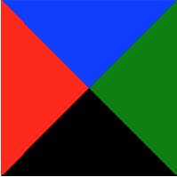

🛠 При помощи `border` можно рисовать различные геометрические фигуры. Например, треугольник. Для этого потребуется задать прозрачную рамку с двух сторон и непрозрачную рамку с третьей стороны.

```html
<div class="top"></div>
```

```css
.top {
  width: 0;
  height: 0;
  /* Прозрачная рамка слева, ширина х */
  border-left: 50px solid transparent;
  /* Прозрачная рамка справа, ширина х */
  border-right: 50px solid transparent;
  /* Цветная рамка снизу, ширина х * 2 */
  border-bottom: 100px solid red;
}
```

Такой вид получается из-за того, что прозрачные рамки перекрывают часть цветной рамки.

Наглядно видно наложение рамок на этой картинке:



В итоге можно создать треугольники, смотрящие в любую сторону. Этот приём можно использовать, чтобы не тянуть в проект мелкие иконки треугольников или стрелок.

<iframe title="Треугольники" src="../demos/triangles/" height="415"></iframe>

🛠 Ещё немного про треугольники. А точнее, стрелки. Их тоже можно создать при помощи `border`, но тут понадобится подключить свойство [`transform`](/css/transform/), чтобы повернуть элемент с рамками на 45 градусов в нужную сторону:

```html
<div class="arrows">
  <div class="arrow _prev"></div>
  <div class="arrow _next"></div>
</div>
```

```css
.arrows {
  max-width: 1200px;
  height: 250px;
  margin: 0 auto;
  background-color: #f1f1f1;
}

.arrow {
  /* Рисуем квадрат */
  width: 50px;
  height: 50px;

  /* Задаём левую рамку */
  border-left: 5px solid #ff0001;
  /* Задаём нижнюю рамку */
  border-bottom: 5px solid #ff0001;
}

.arrow._prev {
  /* Поворачиваем квадрат нижним левым углом влево */
  transform: rotate(45deg);
}

.arrow._next {
  /* Поворачиваем квадрат нижним левым углом вправо */
  transform: rotate(
    -135deg
  );
}
```

<iframe title="Стрелки для слайдера" src="../demos/arrows/" height="360"></iframe>

Чем не стрелки для слайдера? 🤗

🛠 Часто встречающийся дизайнерский приём — появление рамки вокруг элемента при наведении на него курсора мыши.

Если просто добавлять рамку по селектору `:hover`, то элемент будет дёргаться. Причина в том, что размер элемента увеличивается на ширину рамки. Чтобы подобных подёргиваний не происходило, изначально задайте рамку нужной толщины, но установите ей прозрачный цвет (`transparent`). А по наведению курсора просто меняйте цвет на нужный. Profit! Вы прекрасны 😄
