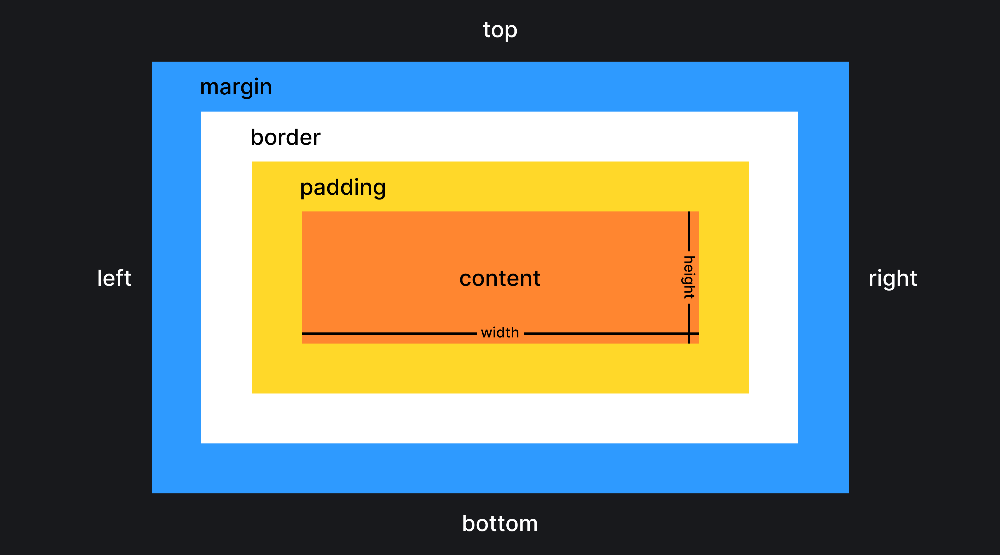

## «Всё — прямоугольник»

Каждый элемент на веб-странице — это прямоугольник, к которому во время отрисовки браузеры применяют CSS-свойства. Чтобы конечные размеры элементов не были для вас сюрпризом и вы точно понимали, из чего они складываются, нужно разобраться с одной из основных концепций вёрстки — блочной моделью.

## Блочная модель

Блочная модель, она же box model — это алгоритм расчёта размеров каждого отдельного элемента на странице, которым браузеры пользуются при отрисовке. Чтобы точно понимать, каким в итоге получится блок и сколько места он займёт, держите в голове следующую картинку:



Ровно такую же схему, но в других цветах можно увидеть в инструментах разработчика любого из браузеров. Например, так выглядит блочная модель элемента в Chrome:


Блочная модель состоит из нескольких CSS-свойств, влияющих на размеры элемента:

- `width` — ширина элемента;
- `height` — высота элемента;
- `padding` — внутренние отступы от контента до краёв элемента;
- `border` — рамка, идущая по краю элемента;
- `margin` — внешние отступы вокруг элемента.

### Ширина и высота

При помощи свойств [`width`](/css/width/) и [`height`](/css/height/) можно задавать размеры контентной области блока.

_Контентной областью_ называется условное внутреннее пространство блока, где располагается контент. В примере ниже мы создаём блок при помощи тега [`<div>`](/html/div/), а внутрь вкладываем контент — текст:

```html
<div>
  Вместе весело шагать по просторам!
</div>
```

По умолчанию элементы с блочным отображением (`display: block`) занимают всю ширину родителя, если явно не задано другое. А вот высота элемента подстраивается под контент.

Элементы со строчным (`display: inline`) или строчно-блочным (`display: inline-block`) отображениями по умолчанию подстраивают и ширину, и высоту под вложенный контент. Однако строчно-блочному можно и произвольно задать размеры: ширину (`width`) и высоту (`height`).

Если элемент должен занимать больше места, чем вложенный в него контент, то мы меняем его ширину и высоту так, как нам захочется. Напишем стили для примера выше:

```css
div {
  width: 200px;
  height: 200px;
}
```

Теперь элемент будет размером 200 на 200 пикселей.

### `padding`

Свойство [`padding`](/css/padding/) отвечает за внутренние отступы. В рамках разговора о блочной модели важно помнить, что по умолчанию внутренние отступы прибавляются к ширине и высоте элемента.

Добавим к стилям из примера выше внутренние отступы:

```css
div {
  width: 200px;
  height: 200px;
  padding: 25px 15px;
}
```

Теперь ширина блока будет равна 200 + 15 + 15 = 230 пикселей. А высота будет равна 200 + 25 + 25 = 250 пикселей. Внутренние отступы прибавились к ширине и высоте.

### `border`

При определении размеров элемента в расчёт берутся и рамки, за которые отвечает свойство [`border`](/css/border/).

Пусть у элемента из примера выше будет рамка со всех сторон:

```css
div {
  width: 200px;
  height: 200px;
  padding: 25px 15px;
  border: 5px solid hotpink;
}
```

Теперь конечные размеры элемента будут:

- 200 + 15 + 15 + 5 + 5 = 240 пикселей в ширину
- 200 + 25 + 25 + 5 + 5 = 260 пикселей в высоту

### `margin`

Внешние отступы, за которые отвечает свойство [`margin`](/css/margin/), не прибавляются непосредственно к размерам элемента, но влияют на то, сколько места на странице он занимает.

Если элементу из нашего примера мы зададим внешние отступы, то он будет занимать больше места, двигая при этом своих соседей:

```css
div {
  width: 200px;
  height: 200px;
  margin: 50px;
  padding: 25px 15px;
  border: 5px solid hotpink;
}
```

## `box-sizing`

По умолчанию браузеры рассчитывают размеры элемента ровно так, как описано выше, прибавляя внутренние отступы и рамки к ширине и высоте. С этим могут быть связаны неприятные сюрпризы, когда элемент в вёрстке занимает больше места, чем вы ожидаете.

Мы можем поменять стандартное поведение и указать браузеру, что ширина и высота, заданные в CSS, должны включать в себя в том числе внутренние отступы и рамки. Делается это при помощи свойства [`box-sizing`](/css/box-sizing/).
