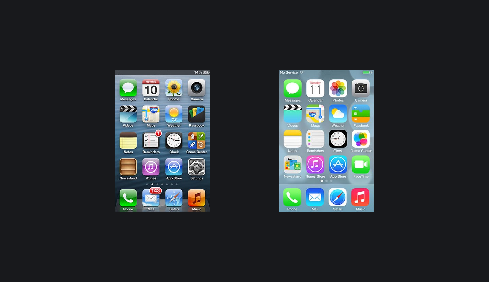

## Кратко

Свойство, бросающее тень на ваши блоки 👤

Создано, чтобы имитировать объекты реального мира и создавать иллюзию объёма для плоских элементов интерфейса.

## Пример

Частая ситуация — выделить кнопку, задав ей тень, что визуально сделает её объёмной.

```html
<button class="button">Купить немедленно!</button>
```

Помимо основных оформительских стилей задаём нашей кнопке тень:

```css
.button {
  box-shadow: -15px 15px 0 0 #ED6742;
}
```

Получаем псевдообъёмную кнопку, которая парит над страницей:

<iframe title="Объёмная кнопка" src="demos/button/" height="200"></iframe>

## Как пишется

Каждая тень состоит из следующих значений:

- Два, три или четыре значения размера с единицами измерения:
  - Если задано два значения, то они расшифровываются как смещение по оси _x_ и по оси _y_.
  - Если задано третье значение, то оно интерпретируется как радиус размытия.
  - Если задано четвёртое значение, то оно отвечает за радиус распространения.
- Дополнительно (необязательно) можно указать ключевое слово `inset`, которое превратит тень из внешней во внутреннюю.
- Чаще всего, но не обязательно, нужно указывать цвет тени в любом доступном формате цвета.

Разберёмся со всем этим чуть подробнее:

`inset` — если ключевое слово не указано в значении, то тень располагается снаружи элемента. Если указать это ключевое слово, то элемент как будто будет вогнут внутрь и его стенки будут отбрасывать тень внутрь.

Смещения по осям _x_ и _y_ — обязательные значения для тени. Могут принимать любые числовые значения, в том числе отрицательные. Значение по умолчанию равно 0 для обеих осей. Если первое значение положительное, то тень будет справа от элемента, если отрицательное — слева. Если второе значение положительное, то тень будет снизу, если отрицательное — сверху.

Радиус размытия — опциональное значение, **положительное** числовое значение с единицами измерения. По умолчанию значение 0, что делает его указание необязательным. Если не указываете его или задаёте 0, то край тени будет резким, без размытия. Чем больше значение, тем шире область размытия и тем светлее сама тень.

Радиус распространения — опциональное значение, любое числовое значение с единицами измерения. По умолчанию равно 0, размеры тени совпадают с размерами элемента. Если указано отрицательное значение, то тень будет меньше, если положительное, то тень будет больше.

Цвет — вроде бы опциональное, но на самом деле обязательное значение цвета тени. Почему? Если не указывать цвет, то решение остаётся за браузером. Как правило, браузер берёт значение свойства [`color`](/css/color/) того элемента, которому задана тень. Но Safari отрисует прозрачную тень. Если вам действительно нужен цвет тени, совпадающий с цветом текста элемента, то это можно указать явно при помощи ключевого слова [`currentColor`](/css/web-colors/).

Можно задавать несколько теней для одного элемента, перечисляя их через запятую.

```css
.button {
  box-shadow:
    0 5px 10px gray,
    -5px -10px 20px pink;
}
```

## Как понять

Поскольку всё в вебе по умолчанию плоское и нет источников освещения, тени просто невозможны в компьютерном мире.

Чтобы сделать компьютеры менее враждебными и вызвать у пользователя знакомые эмоции при работе с интерфейсом, дизайнеры периодически обращаются к скевоморфизму с максимально объёмными элементами и тенями.



Слева старый дизайн иконок Apple в стиле скевоморфизма.


Новые, современные эксперименты с дизайном в стиле неоморфизма. Обратите внимание на количество теней (внутренних и внешних) у каждого из элементов. Именно за счёт теней создаётся объём одноцветных элементов.

## Подсказки

💡 Свойство задаёт тень именно для блока. Тень будет совпадать с формой блока. Если вы сделали круглый блок при помощи, например, [`border-box`](/css/box-sizing/), то тень тоже будет круглой. Если не менять форму элемента, то тень будет прямоугольной.

💡 Если нужна тень для букв в тексте, используйте свойство [`text-shadow`](/css/text-shadow/).
