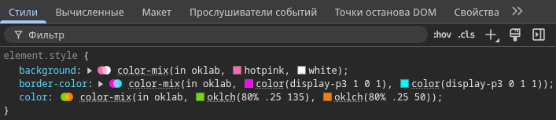

## Кратко

CSS-функция `color-mix()` позволяет смешивать два цвета в определённом цветовом пространстве. Это удобно для получения светлых и тёмных вариаций цветов, создания оттенков для состояний наведения и активности, а также для согласованных тем без препроцессоров.

## Пример

Светлая и тёмная версии брендового цвета для разных состояний кнопки:

```css
:root {
  --brand: #2E9AFF;
}

.button {
  background: var(--brand);
  color: white;
}

.button:hover {
  /* светлее: добавляем белый */
  background: color-mix(in oklab, var(--brand) 80%, white);
}

.button:active {
  /* темнее: добавляем чёрный */
  background: color-mix(in oklab, var(--brand) 70%, black);
}
```

## Как пишется

Функция `color-mix()` принимает три аргумента, разделённых запятыми. 

Первый аргумент — метод интерполяции цвета. Он состоит из ключевого слова `in`, названия цветового пространства и опционально — метода интерполяции оттенка (для полярных пространств).

Второй и третий аргументы — два цвета для смешивания. Для каждого можно опционально указать процентное соотношение в итоговой смеси.

```css
color-mix(<метод-интерполяции>, <цвет> [<процент>]?, <цвет> [<процент>]?)

<метод-интерполяции> = in <цветовое-пространство> [<метод-интерполяции-оттенка>]?
```

<iframe title="Визуализация смешивания цветов" src="demos/mix-colors/" height="700"></iframe>

## Как понять

### Метод интерполяции цвета

Интерполяция цвета — это способ найти промежуточный цвет между двумя заданными цветами по определённому правилу. Например, при смешивании красного и синего получится нечто среднее между ними. Итог зависит от того, как именно считать этот "средний" цвет, то есть от выбранного цветового пространства.

Первый аргумент функции состоит из трёх частей:​

1. Ключевое слово `in` (обязательно)

2. Название цветового пространства (обязательно) — система координат для описания цвета

3. Метод интерполяции оттенка (необязательно, только для полярных пространств) — определяет путь перехода от одного оттенка к другому

#### Цветовые пространства

Цветовые пространства — это разные системы для описания цвета. Они делятся на два типа:

**Прямоугольные цветовые пространства**

Цвет задаётся тремя числовыми значениями, каждое из которых отвечает за свою характеристику цвета.

- `srgb`
- `srgb-linear`
- `display-p3`
- `a98-rgb`
- `prophoto-rgb`
- `rec2020`
- `lab`
- `oklab`
- `xyz`
- `xyz-d50`
- `xyz-d65`

**Полярные (цилиндрические) цветовые пространства**

Цвет описывается через оттенок (`hue`) — угол на цветовом круге от 0° до 360° — и два дополнительных параметра, которые меняются в зависимости от пространства. Эта система удобна, потому что оттенок легко представить как точку на круге.

- [`hsl`](/css/web-colors/#hsl)
- [`hwb`](/css/web-colors/#hwb)
- `lch`
- `oklch`

#### Метод интерполяции оттенка

Определяет направление перехода от одного оттенка к другому на цветовом круге. Применяется только к полярным цветовым пространствам: [`hsl`](/css/web-colors/#hsl), [`hwb`](/css/web-colors/#hwb), `lch`, `oklch` и является необязательным.​

Принимает значения: `shorter hue`, `longer hue`, `increasing hue`, `decreasing hue`, ключевое слово `hue` — обязательно.

- `shorter` — браузер выбирает кратчайший путь между двумя цветами. Это значение используется по умолчанию, если метод интерполяции не указан.​​

**Пример:**

```css
/* Красный (0°) и синий (240°) */
color-mix(in hsl shorter hue, red, blue);
```
Здесь два пути:

Короткий: 0° → 300° → 240° = 120°

Длинный: 0° → 60° → 120° → 180° → 240° = 240°

С `shorter hue` браузер пойдёт через пурпурный, с `longer hue` — через жёлтый, зелёный, голубой.

<iframe title="Визуализация метода shorter hue" src="demos/shorter-hue/" height="700"></iframe>

- `longer` — браузер выбирает длинный путь между двумя цветами. Всегда берёт дугу, которая больше или равна 180°.​

<iframe title="Визуализация метода longer hue" src="demos/longer-hue/" height="700"></iframe>

- `increasing` — браузер всегда идёт по часовой стрелке (в сторону увеличения градусов), независимо от того, какой путь короче.

**Пример:**

```css
/* Красный (0°) и синий (240°) */
color-mix(in hsl increasing hue, red, blue);
```

С `increasing hue` браузер пойдёт от 0° → 60° → 120° → 180° → 240° (через жёлтый, зелёный, голубой), даже если обратный путь был бы короче.

<iframe title="Визуализация метода increasing hue" src="demos/increasing-hue/" height="700"></iframe>

- `decreasing` — идёт в направлении уменьшения угла (против часовой стрелки). В примере выше это был бы путь от 0° через 360° → 300° → 240° (через пурпурный).

<iframe title="Визуализация метода decreasing hue" src="demos/decreasing-hue/" height="700"></iframe>


**Разница между `increasing`/`decreasing` и `shorter`/`longer`:**

На первый взгляд кажется, что `shorter` и `increasing` ведут себя одинаково, как и `longer` и `decreasing`. Разница в том, что `shorter`/`longer` выбирают путь по длине дуги (короткий или длинный), а `increasing`/`decreasing` — по направлению (по часовой или против часовой стрелки), игнорируя длину.

### Цвет

Второй и третий аргументы — два цвета для смешивания. Каждый цвет может иметь процент (0–100%), который определяет его долю в результате. 

Если процент не указан, браузер применит 50% для каждого цвета. Если сумма процентов не равна 100%, браузер автоматически пересчитает оба значения пропорционально.

#### Допустимые значения

Согласно спецификации [CSS Color Module Level 5](https://drafts.csswg.org/css-color-5/#color-syntax), в качестве цвета можно передавать:​

- [Hex-коды](/css/web-colors/#hex)
- [Именованные цвета (например, `red`, `blue`)](/css/web-colors/#nazvanie-cveta)
- Функции: [`rgb()`](/css/web-colors/#rgb), [`rgba()`](/css/web-colors/#rgb), [`hsl()`](/css/web-colors/#hsl), [`hsla()`](/css/web-colors/#hsl), [`hwb()`](/css/web-colors/#hwb), `lab()`, `lch()`, `oklab()`, `oklch()`
- Функция [`color()`](/css/color-function/)
- [`transparent​`](/css/web-colors/#transparent​)

**Нельзя передавать:​**

- [`currentColor`](/css/web-colors/#currentcolor)
- `system-color`
- `contrast-color()`
- [`light-dark()`](/css/light-dark/)
- `device-cmyk()`

#### Проценты

Процентные значения для обоих цветов всегда должны в сумме давать 100%. Браузер автоматически приводит их к этому условию:

**Если сумма больше 100%**

Оба процента пропорционально уменьшаются, чтобы в сумме получилось 100%. Например, 75% и 50% (всего 125%) пересчитываются до 60% и 40%:​

```css
color-mix(in oklab, blue 75%, red 50%);
/* Эквивалентно */
color-mix(in oklab, blue 60%, red 40%);
```

**Если сумма меньше 100%**

Проценты остаются неизменными, но результат становится прозрачным. При 20% и 40% (всего 60%) цвет будет на 60% непрозрачным:​

```css
color-mix(in lch, blue 20%, red 40%);
/* Результат 60% непрозрачный */
```

**Если процент указан для одного цвета**

Второй цвет получает оставшуюся долю до 100%:​

```css
color-mix(in lab, blue 30%, red);
/* Эквивалентно blue 30%, red 70% */
```

**Особые случаи:**

- Если оба процента опущены, каждый цвет получит по 50%.​

- Если оба процента равны 0%, функция не работает.​

- Проценты должны быть в диапазоне 0–100%. Если указать значение больше 100%, то значение будет невалидным и функция не будет работать.​

- Функция [`calc()`](/css/calc/) в качестве процента работать не будет: её результат невозможно предсказать и он может выходить за пределы допустимого диапазона.

## Как использовать

### Создание цветовой шкалы

Шкала оттенков из одного базового цвета:

```css
:root {
  --brand: #2E9AFF;

  /* Светлые варианты */
  --brand-95: color-mix(in oklab, var(--brand) 5%, white);
  --brand-90: color-mix(in oklab, var(--brand) 10%, white);
  --brand-80: color-mix(in oklab, var(--brand) 20%, white);
  --brand-60: color-mix(in oklab, var(--brand) 40%, white);
  --brand-40: color-mix(in oklab, var(--brand) 60%, white);
  --brand-20: color-mix(in oklab, var(--brand) 80%, white);

  /* Тёмные варианты */
  --brand-dark-80: color-mix(in oklab, var(--brand) 80%, black);
  --brand-dark-60: color-mix(in oklab, var(--brand) 60%, black);
}
```

### Работа с широкими гаммами

Тема с широкой гаммой и фолбэком:

```css
.card {
  /* Фолбэк для sRGB */
  background: color-mix(in oklab, #2E9AFF 85%, white);

  /* Если есть поддержка P3, используем широкую гамму */
  background: color-mix(in oklab, color(display-p3 0.1 0.5 1) 85%, white);
}
```

### Работа с прозрачностью

```css
.badge {
  --bg: color-mix(in oklab, #2E9AFF 70%, white);
  background: var(--bg);
  color: white;
}

.badge--muted {
  /* Подмешиваем прозрачный цвет — результат тоже будет полупрозрачным */
  background: color-mix(in oklab, var(--bg) 60%, rgba(0, 0, 0, 0) 40%);
}
```

### Контраст и доступность

При проектировании интерфейсов стремитесь к достаточному контрасту текста и фона (WCAG 2.1: 4.5:1 для обычного текста). `color-mix()` удобно использовать для осветления или затемнения базового цвета до приемлемого контраста; проверяйте результат инструментами проверки контраста.

## Подсказки

### Проверка поддержки

Рекомендуется предусматривать фолбэк для старых версий браузеров:

```css
.element {
  background: #2E9AFF; /* фолбэк */
}

@supports (color: color-mix(in oklab, black, white)) {
  .element {
    background: color-mix(in oklab, #2E9AFF 85%, white);
  }
}
```

## Как дебажить

Для отладки `color-mix()` лучше всего подходит Chrome DevTools. На панели «Стили» можно изменить цвета с помощью колорпикера. Рядом с функцией видна миниатюра смешанных цветов, а при наведении курсора видно, какой цвет получился.



### Важно помнить

- Смешивание учитывает прозрачность: если один из цветов полупрозрачный, итог может быть полупрозрачным.
- Если аргументы `color-mix()` невалидны (неподдерживаемое пространство, относительные цвета, отрицательные проценты), всё значение свойства считается невалидным. Поэтому всегда указывайте фолбэк-цвет перед функцией.
- Помните о нормализации процентов: сумма больше 100% допустима, но будет пересчитана. Отрицательные значения — ошибка.
- При смешении в широких гаммах (например, `display-p3`) на sRGB-устройствах цвета будут сжаты в доступный охват. В критичных местах сравнивайте результат визуально и обеспечивайте sRGB-альтернативы.
