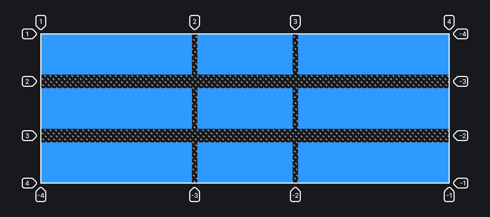

## Кратко

Задаёт отступы между колонками и рядами в грид-раскладке.

## Пример

```css
.container {
  display: grid;
  grid-template-columns: 1fr 200px 1fr;
  grid-template-rows: repeat(3, 150px);
  /* Отступы между колонками */
  column-gap: 10px;
  /* Отступы между рядами */
  row-gap: 50px;
}
```



## Как пишется

Указывайте одно значение размера в любых единицах измерения.

## Подсказки

💡 В инспекторе Firefox отступы заштриховываются, так их можно отличить от грид-элементов.

<aside>

📝 Полный список свойств гридов можно посмотреть в [гайде по grid](/css/grid-guide/).

</aside>
