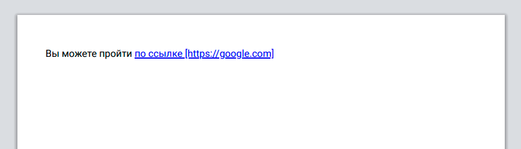

## Кратко

Свойство `content` подставляет содержимое, которого нет в HTML-разметке, чаще всего в псевдоэлементы `::before` и `::after`. В качестве значения можно передать разные типы: изображение, градиент или текст.

## Пример

```css
a::after {
  content: "👉";
  margin-right: 5px;
}
```

## Как пишется

Изображение в качестве содержимого. Может применяться к любому элементу.

```css
div {
  content: url("http://www.example.com/test.png");
}
```

Все значения ниже могут применяться ТОЛЬКО к псевдоэлементам [`::before`](/css/before/) и [`::after`](/css/after/).

Строка текста:

```css
div::before {
  content: "prefix";
}
```

Значения счётчиков с использованием функций `counter()` и `counters()`:

```css
div::before {
  content: counter(chapter_counter);
}

div::before {
  content: counters(section_counter, ".");
}
```

Значения HTML-атрибутов с использованием функции [`attr()`](/css/attr/):

```css
div::before {
  content: attr(value string);
}
```

Ключевые слова, зависящие от языка страницы и положения в тексте:

```css
div::before {
  content: open-quote;
  content: close-quote;
  content: no-open-quote;
  content: no-close-quote;
}
```

Использование нескольких значений одновременно. Исключение — ключевые слова `normal` и `none`:

```css
div::before {
  content: open-quote counter(chapter_counter);
}
```

Ключевые слова, которые нельзя комбинировать с другими значениями:


```css
div::before {
  content: normal;
  content: none;
}
```

## Как понять

Чаще всего свойство `content` применяется к псевдоэлементам `::before` и `::after`. В зависимости от значения свойства псевдоэлемент принимает тот или иной вид:

- Если значение — просто строка, она подставится на место псевдоэлемента. Как правило, это до или после текстового содержимого тега.
- Есть несколько зарезервированных слов, которые также можно указывать в качестве значения. Используются они как совместно со свойством [`quotes`](/css/quotes/), так и в автоматическом режиме:

  - `open-quote` обозначает **открывающую** кавычку цитаты для текущего языка. Например, для русского это будет открывающая угловая кавычка (`«`);
  - `close-quote` обозначает **закрывающую** кавычку цитаты для текущего языка. Например, для русского это будет закрывающая угловая кавычка (`»`);

```html
<blockquote>
  Вспомните, как говорили мушкетёры: <q>Один за всех, все за одного!</q>
</blockquote>
```

```css
blockquote {
  quotes: "«" "»" "„" "”";
}

blockquote::before {
  content: open-quote;
}

blockquote::after {
  content: close-quote;
}
```

Результат

```
«Вспомните, как говорили мушкетёры: „Один за всех, все за одного!”»
```

  - `no-open-quote` и `no-close-quote` кавычку не показывают, но браузер всё равно считает, что цитата открылась или закрылась. Это важно для вложенных цитат: от глубины вложенности зависит, какую пару кавычек из `quotes` браузер возьмёт на следующем уровне;
  - Если значение — результат `counter()` или `counters()`, псевдоэлемент будет содержать вычисленное значение счётчика в текущий момент. Эти функции работают совместно со свойствами `counter-reset` и `counter-increment`;
  - Интереснее всего работает функция `attr()`.

С помощью неё можно вывести в псевдоэлемент значение любого атрибута тега:

```html
<p>
  Ваш рейтинг: <span data-tip="Вычисляется на основе активности">212</span>
</p>
```

```css
[data-tip] {
  position: relative;
  cursor: help;
}

[data-tip]:hover::after {
  opacity: 1;
  visibility: visible;
}

[data-tip]::after {
  content: attr(data-tip);
  position: absolute;
  top: 140%;
  left: 50%;
  transform: translateX(-50%);
  opacity: 0;
  visibility: hidden;
}
```

<iframe title="Всплывающая подсказка к рейтингу" src="demos/rating/" height="250"></iframe>

Ну и конечно же разработчики спецификации позаботились о нас и сделали возможность собрать сразу несколько значений в общую строку:

```html
<p>Вы можете пройти <a href="https://google.com">по ссылке</a></p>
```

```css
@media print {
  a[href]::after {
    content: " [" attr(href) "] ";
  }
}
```

В результате так выведется на печать:



- Значением свойства `content` может быть ссылка `url(...)` на изображение. В этом случае содержимое элемента заменяется на это изображение. Нужно помнить о том, что при таком способе мы не можем управлять размером изображения.

```html
<div class="replaced" data-alt="Логотип компании">
  Название компании
</div>
```

```css
.replaced {
  content: url("https://example.com/logo.svg");
}

.replaced::after {
  /* не будет отображаться, если замена элемента поддерживается */
  content: " (" attr(data-alt) ")";
}
```

Результат


- К значению можно добавить альтернативный текст, он попадёт в дерево доступности, и скринридер прочитает его вместо самого содержимого. Текст пишут через слэш после основного значения:

```css
.icon::before {
  content: url("upvote.svg") / "Проголосовать за";
}

.rating::before {
  content: "★" / "Оценка: высокая";
}
```

Если содержимое чисто декоративное и скринридеру его озвучивать не нужно, вместо текста после слэша указывают пустую строку:

```css
.decoration::before {
  content: "❧" / "";
}
```

Без alt-текста скринридеры по-разному озвучивают сгенерированный контент: где-то читают, где-то пропускают. Слэш убирает эту неопределённость.

## Подсказки

💡 Если мы используем `url()` в качестве значения свойства `content` для тега, то псевдоэлементов у такого тега не будет.

💡 Alt-текст через слэш работает с любым типом значения: строкой, `url()`, `attr()`, `counter()`. Комбинировать несколько значений в списке перед слэшем можно, а вот несколько alt-текстов после него — нет, разрешён только один.
