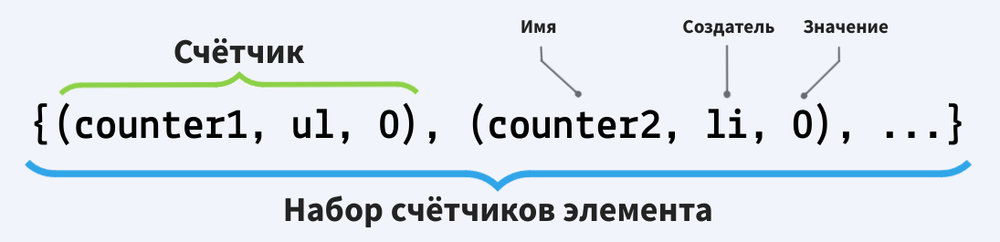
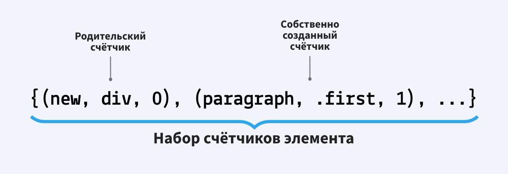
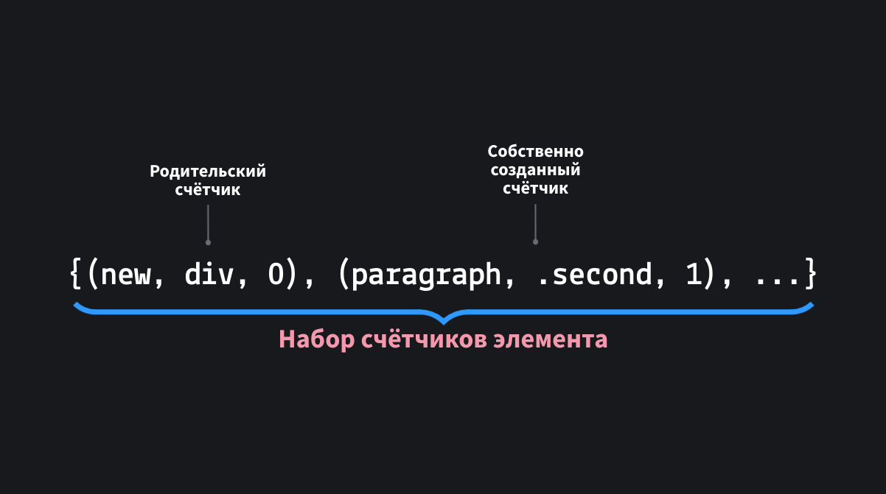
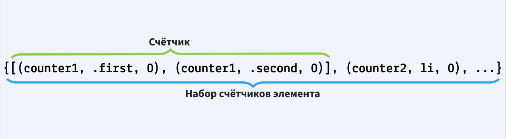
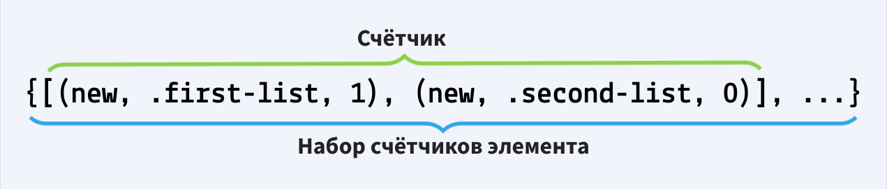
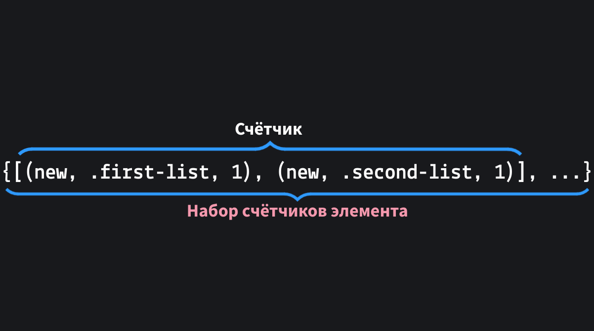
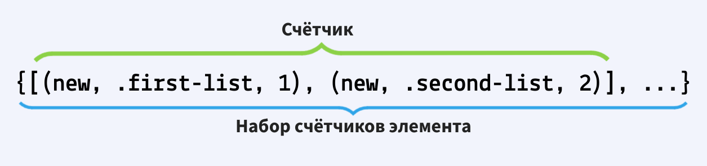
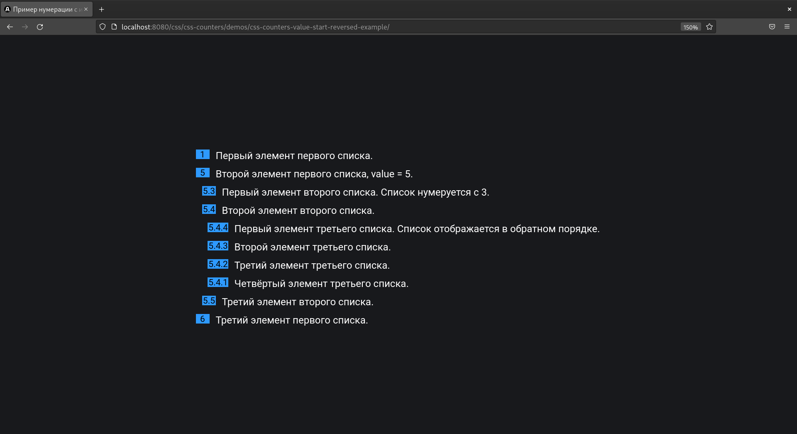

## Кратко

CSS-счётчики — это мощный инструмент для нумерации любых элементов страницы, не только списков.

<iframe title="Демонстрация свойства" src="demos/base-example" height="700"></iframe>

Основные свойства для работы со счётчиками:

- [`counter-reset`](/css/counter-reset/) — создаёт счётчик;
- [`counter-increment`](/css/counter-increment/) — увеличивает числовое значения счётчика;
- [`counter-set`](/css/counter-set/) — устанавливает точное значение счётчика.

Помимо свойств, с помощью которых можно управлять счётчиками, создавать их, есть две основных функции для подставления значения счётчика [`counter()`](/css/counter-counters/) и [`counters()`](/css/counter-counters/).


### `counter-reset`

Перед тем как воспользоваться значением счётчика, этот счётчик нужно создать. Счётчики создаются при помощи свойства `counter-reset`.

```css
ul {
  conter-reset: example 0;
}
```

В качестве значения сначала указывается имя счётчика, а затем его начальное целочисленное значение.

Имена счётчиков чувствительны к регистру, например значения: `example` и `EXAMPLE` — это два разных, не связанных между собой счётчика.

Нельзя использовать ключевые слова: `none`, `initial`, `inherit`, `unset`, `default` в качестве названий счётчиков.

Также счётчики подчиняются [принципу каскада](/css/cascade/), например:

```css
h1 {
  counter-reset: counter1 -1;
}

h1 {
  counter-reset: counter2 99;
}
```

В таком случае применится только последнее [CSS-правило](/css/css-rule/) для элемента [`<h1>`](/html/h1-h6/).

Чтобы свойство `counter-reset` сработало для обоих счётчиков из примера выше необходимо указать их вместе через пробел:

```css
h1 {
  counter-reset: counter1 1 counter2 99;
}
```

Или вот такой пример:

```css
h1 {
  counter-reset: counter 1 counter 2;
}
```

В значении свойства `counter-reset` указаны два одинаковых счётчика, в таком случае будет учитываться только последний.

### `counter-increment`

Чтобы значение счётчика начало увеличиваться на определённое значение от элемента к элементу необходимо указать свойство `counter-increment`.

```css
li {
  counter-increment: example 2;
}
```

Теперь каждый элемент [`<li>`](/html/li/) в документе будет увеличивать значение счётчика `example` на 2.

Рассмотрим пример:

```html
<ul>
  <li class="first">Значение счётчика example равно 1</li>
  <li class="second">Значение счётчика example равно 10</li>
  <li class="third">Значение счётчика example равно 15</li>
</ul>
```

Создадим счётчик `example` на элементе [`<ul>`](/html/ul/) с начальным значением 0:

```css
ul {
  counter-reset: example 0;
}
```

Укажем разное значение увеличения счётчика для каждого элемента `<li>`:

```css
.first {
  counter-increment: example 1;
}

.second {
  counter-increment: example 9;
}

.third {
  counter-increment: example 6;
}
```

Как это работает будет более подробно расписано дальше. Но в конечном итоге пример выше выглядит так:

<iframe title="Демонстрация свойства" src="demos/increment-example" height="475"></iframe>

<aside>

🎰 Если в значении свойства `counter-increment` встречается несколько счётчиков с одинаковым именем, они будут обрабатываться по порядку.

</aside>

```css
li {
  /* Значение счётчика example будет равнятся 15 на этом элементе */
  counter-increment: example 1 example 6 example 9;
}
```

### `counter-set`

Вам неожиданно понадобилось изменить порядок нумерации элементов в списке, чтобы после 3 пункта шёл сразу 9? `counter-set` отлично подойдёт для этой задачи:

Рассмотрим пример:

```html
<ul>
  <li class="first">Значение счётчика example равно 1</li>
  <li class="second">Значение счётчика example равно 9</li>
  <li class="third">Значение счётчика example равно 10</li>
</ul>
```

Создадим счётчик `example` на элементе `<ul>` с начальным значением 0:

```css
ul {
  counter-reset: example 0;
}
```

Укажем увеличения значения счётчика `example` на элементе `<li>`, а для элемента с классом `second` добавим свойство `counter-set`:

```css
li {
  counter-increment: example 1;
}

.second {
  counter-set: example 9;
}
```

<iframe title="Демонстрация свойства" src="demos/set-example" height="475"></iframe>

Может показаться, что второй элемент с классом `second` должен иметь значение 10, а не 9, потому что на него применяются сразу два свойства `counter-increment` и `counter-set`, однако при вычислении значения используется определённый [порядок](/css/css-counters/#poryadok-vychisleniya-znacheniya).

Сначала выполняется свойство `counter-increment` и значение счётчика увеличивается на 1, но затем сразу же переписывается свойством `counter-set` устанавливая точное значение 9.

<aside>

🎰 Если в значении свойства `counter-set` встречается несколько счётчиков с одинаковым именем, установится только последнее указанное значение.

</aside>

```css
li {
  /* Значение счётчика example будет равнятся 9 на этом элементе */
  counter-set: example 1 example 6 example 9;
}
```

<aside>

⚠️ Данное свойство пока не поддерживается в браузере Safari.

</aside>

### `counter()` и `counters()`

Свойства `counter-increment`, `counter-set` не отображают фактическое значение счётчиков. Эти свойства только управляют ими.

Но когда речь заходит о том, чтобы отобразить значения того или иного счётчика на помощь приходят функции `counter()` и `counters()`.

Их отличия будет описаны подробнее дальше.

Возьмём один из примеров который уже был представлен выше:

```html
<ul>
  <li class="first">Значение счётчика example равно 1</li>
  <li class="second">Значение счётчика example равно 10</li>
  <li class="third">Значение счётчика example равно 15</li>
</ul>
```

Создадим счётчик `example` на элементе `<ul>` с начальным значением 0:

```css
ul {
  counter-reset: example 0;
}
```

Укажем разное значение увеличения счётчика для каждого элемента `<li>`:

```css
.first {
  counter-increment: example 1;
}

.second {
  counter-increment: example 9;
}

.third {
  counter-increment: example 6;
}
```

Теперь, чтобы значения счётчика начали отображаться в документе воспользуемся функцией `counter()`.

Подставляем значение счётчика `example` на каждый [псевдоэлемент](/css/pseudoelements/) [`::marker`](/css/marker/) элемента `<li>`:

```css
li::marker {
  content: counter(example);
}
```

<iframe title="Демонстрация свойства" src="demos/increment-example" height="475"></iframe>

В обоих функциях есть необязательный аргумент, который указывает стиль счётчика, например, вместо использования десятичной системы счисления — данное значение устанавливается по умолчанию, можно указать строчную римскую нумерацию, то есть тип `lower-roman`:

```css
li::marker {
  content: counter(example, lower-roman);
}
```

<iframe title="Демонстрация свойства" src="demos/lower-roman-example" height="475"></iframe>

О других стилях счётчика можно посмотреть в доке по свойству [`list-style-type`](/css/list-style-type/).

## Основные термины

1. **Набор счётчиков** — это коллекция неповторяющихся между собой счётчиков, которые имеет элемент. Эта коллекция пополняется наследуемыми счётчиками от другого элемента и счётчиками которые элемент создал сам.

  Изначально каждый элемент или псевдоэлемент в документе имеет пустой набор счётчиков.

  Каждый счётчик, который попадает в эту коллекцию, имеет внутри себя следующие данные:

  - имя — идентификатор, который указывается при создании счётчика;
  - создатель — элемент, который его создал;
  - значение — целочисленное значение счётчика.

  Представить это можно так:

  

2. **Явный счётчик** — это счётчик который создали вы.
1. **Неявный счётчик** — это счётчик который автоматически создаётся браузером.
1. **Последний счётчик** — это самый последний счётчик с указанным именем из набора счётчиков.

## Порядок вычисления значения

Значения счётчика из набора на каждом отдельном элементе может быть разным. Значение счётчика на текущем элементе вычисляется поэтапно:

1. Сначала наследуется набор счётчиков.
1. Если на элементе указано свойство `counter-reset` — создаётся новый счётчик.
1. Если на элементе указано свойство `counter-increment` — значение счётчика увеличивается.
1. Если на элементе указано свойство `counter-set` — устанавливается точное значение счётчика.

И только теперь, после всех вычислений, значением счётчика можно воспользоваться через функции `counter()` и `counters()`.

## Создание и наследование счётчиков

### Наследование

Элемент наследует свой начальный набор счётчиков от своего родителя и предыдущего одноуровневого элемента.

Затем он берёт значения этих счётчиков из набора счётчиков предыдущего элемента в порядке [дерева](/js/dom/). Предыдущий элемент может быть:

- родителем;
- одноуровневым элементом;
- дочерним элементом предыдущего одноуровневого элемента.

Создадим счётчик на элементе `<ul>` и проследим как счётчик будет наследоваться элементами, которые находятся внутри.

```html
<ul>
  <li class="first">Первый элемент
    <p class="paragraph">Параграф</p>
  </li>
  <li class="second">Второй элемент</li>
</ul>
```

Создаём счётчик c именем `new` на элементе `<ul>` с начальным значением 0:

```css
ul {
  counter-reset: new 0;
}
```

Теперь у элемента `<ul>` в наборе имеется один счётчик с именем `new` созданный им же.

Укажем, чтобы на элементах `<li>` с классом `first`, `second` и элементе [`<p>`](/html/p/) с классом `paragraph` значение счётчика `new` увеличивалось на 1:

```css
.first,
.paragraph,
.second {
  counter-increment: new 1;
}
```

Первый дочерний элемент с классом `first` наследует свой начальный набор счётчиков от родительского элемента `<ul>`.

Также `<ul>` является предшествующим элементом в порядке дерева, поэтому элемент с классом `first` наследует также значение счётчика `new` — 0, а затем сразу же увеличивает его на 1.

Теперь значение счётчика `new`, на элементе `<li>` с классом `first`, равняется 1.

Тоже самое происходит с элементом у которого класс `paragraph`. Он наследует счётчик `new` от своего родительского элемента с классом `first`, а также его значение — 1, а затем сразу же увеличивает его на 1.

Теперь значение счётчика `new`, на элементе `<p>` с классом `paragraph`,  равняется 2.

Однако элемент с классом `second` немного отличается. Он наследует счётчик `new` от своего предыдущего одноуровневого элемента `<li>` с классом `first`, и вместо того, чтобы наследовать значение 1, он наследует значение 2 от элемента с классом `paragraph`, предыдущего элемента в порядке дерева, а затем сразу же увеличивает его на 1.

Теперь значение счётчика `new`, на элементе `<li>` с классом `second`, равняется 3.

Подставим значение счётчика `new` в псевдоэлемент `::before` для элемента `<p>` и `::marker` для элементов с классом `first`, `second` чтобы пронумеровать их:

```css
li::marker,
p::before {
  content: counter(new);
}
```

<iframe title="Демонстрация свойства" src="demos/inheritance-example" height="475"></iframe>

### Создание счётчиков

После наследования набора счётчиков от предыдущего одноуровневого элемента и родительского элемента происходит создание счётчиков.

Создавать новые счётчики может не только свойство `counter-reset`.

Если вы применили свойство `counter-increment` или `counter-set` или воспользовались функцией `counter()` или `counters()` и указали в значении свойства, функции имя несуществующего счётчика:

```css
li {
  /* Сначала создаст счётчик с именем new, а затем увеличит его значение на 2 */
  counter-increment: new 2;
}

li {
  /* Сначала создаст счётчик с именем new, а затем установит его значение на 2 */
  counter-set: new 2;
}

li::marker {
  /* Сначала создаст счётчик с именем new, а затем подставит его значение */
  content: counter(new);
}

li::marker {
  /* Аналогично */
  content: counters(new, '.');
}
```

В таком случае сначала создастся новый счётчик на элементе с именем `new` и начальным значением 0. После создания счётчика, свойство `counter-increment`, `counter-set`, функция `counter()`, `counters()` начнут действовать как обычно.

Представим ситуацию. Если элемент уже содержит унаследованный счётчик с именем `n`, который был создан одноуровневым предыдущим элементом, и вы создаёте на элементе счётчик с точно таким же именем `n`, в таком случае этот счётчик заменит унаследованный.

Рассмотрим пример. Создадим элемент [`<div>`](/html/div/) с 3 элементами `<p>` внутри и проследим как счётчик будет наследоваться элементами.

```html
<div>
  <p class="first">Первый абзац</p>
  <p class="second">Второй абзац</p>
  <p class="third">Третий абзац</p>
</div>
```

Создаём счётчик c именем `new` на элементе `<div>` с начальным значением 0:

```css
div {
  counter-reset: new 0;
}
```

Теперь у элемента `<div>` в наборе имеется один счётчик с именем `new` созданный им же.

Создаём ещё один счётчик, но на элементе `<p>` с именем `paragraph`:

```css
p {
  counter-reset: paragraph 1;
}
```
Первый дочерний элемент с классом `first` наследует свой начальный набор счётчиков от родительского элемента `<div>` и также создаёт собственный счётчик с именем `paragraph`.

Теперь у элемента `<p>` с классом `first` в наборе два счётчика: один унаследованный от родительского элемента `<div>`, второй собственно созданный счётчик.



Так как `<div>` является предшествующим элементом в порядке дерева, элемент с классом `first` наследует также значение счётчика `new` — 0.

Следующий элемент `<p>` с классом `second` унаследует точно такой же набор счётчиков от предыдущего одноуровневого элемента `<p>` с классом `first`, но как только это произойдёт он перезапишет счётчик `paragraph` элемента `<p>` c классом `first` на собственно созданный счётчик.



Последний элемент `<p>` с классом `third` сделает абсолютно тоже самое.

Подставим значение счётчика `paragraph` в псевдоэлемент `::before` элементов с классом `first`, `second`, `third` чтобы пронумеровать их:

```css
p::before {
  content: counter(paragraph);
}
```

<iframe title="Демонстрация свойства" src="demos/reset-example" height="475"></iframe>

Так как счётчик `paragraph` не увеличивался, при помощи свойства `counter-increment`, значение счётчика на всех элементах `<p>` будет 1.

### Вложенные счётчики и область применения

Представим ещё одну ситуацию. Если элемент уже содержит унаследованный счётчик с именем `n`, который был создан родительским элементом (любым, необязательно родительским элементом текущего элемента), и вы создаёте на элементе счётчик с точно таким же именем `n`, в таком случае этот счётчик вложится в уже существующий счётчик.

Представить это можно так:



Рассмотрим пример. Создадим многоуровневый список создав счётчик на элементе `<ul>` и проследим как счётчик будет наследоваться элементами, которые находятся внутри.

```html
<ul class="first-list">
  <li class="one">Первый элемент первого списка
    <ul class="second-list">
      <li class="one-one">Первый элемент второго списка</li>
      <li class="one-two">Второй элемент второго списка</li>
    </ul>
  </li>
  <li class="two">Второй элемент первого списка</li>
</ul>
```

Создаём счётчик c именем `new` на элементе `<ul>` с начальным значением 0:

```css
ul {
  counter-reset: new 0;
}
```

Теперь у элемента `<ul>` с классом `first-list` в наборе имеется один счётчик созданный им же.

Укажем, чтобы на элементе `<li>` значение счётчика `new` увеличивалось на 1:

```css
li {
  counter-increment: new 1;
}
```

Первый дочерний элемент с классом `one` наследует свой начальный набор счётчиков от родительского элемента `<ul>` c классом `first-list`.

Также `<ul>` с классом `first-list` является предшествующим элементом в порядке дерева, поэтому элемент с классом `one` наследует также значение счётчика `new` — 0, а затем сразу же увеличивает его на 1.

Теперь значение счётчика `new`, на элементе `<li>` с классом `one`, равняется 1.

В элементе `<li>` с классом `one` появляется ещё один элемент `<ul>` с классом `second-list`.

Элемент `<ul>` с классом `second-list` наследует счётчик `new` от своего родительского элемента с классом `one`, после этого он создаёт собственный счётчик с именем `new`, но так как счётчик с таким же именем, созданный родительским элементом `<ul>` с классом `first-list` уже есть в наборе, то этот счётчик не будет удалён, а вложится в уже существующий.

Получается примерно следующий набор счётчиков у элемента `<ul>` с классом `second-list`:



На этом моменте область действия счётчика `new` элемента `<ul>` с классом `first-list` заканчивается. И если применить свойство `counter-increment`, `counter-set` чтобы повлиять на значение счётчика `new` меняться будет только последний счётчик с именем `new` в наборе.

Первый дочерний элемент с классом `one-one`, элемента `<ul>` с классом `second-list`, наследует свой начальный набор счётчиков от родительского элемента.

Также `<ul>` c классом `second-list` является предшествующим элементом в порядке дерева, поэтому элемент с классом `one-one` наследует также значение счётчика `new` — 0, а затем сразу же увеличивает его на 1. Но увеличивает не счётчик созданный элементом `<ul>` с классом `first-list`, а счётчик, который создал его родительский элемент `<ul>` с классом `second-list`.



Элемент `<li>` с классом `one-two` наследует счётчик `new` от своего предшествующего одноуровневого элемента с классом `one-one`, а также его значение — 1, а затем сразу же увеличивает его на 1. Но опять же, увеличивает не счётчик созданный элементом `<ul>` с классом `first-list`, а счётчик, который создал его родительский элемент `<ul>` с классом `second-list`.



Самый последний элемент `<li>` с классом `two` наследует набор счётчиков от предыдущего одноуровневого элемента — элемента `<li>` с классом `one`.

Так как предыдущий элемент в порядке дерева — это элемент `<ul>` с классом `second-list`, элемент с классом `two` наследует значение счётчика `new`, но только не того счётчика `new`, который создал элемент `<ul>` с классом `second-list`, а счётчика который создал элемент `<ul>` с классом `first-list` и затем сразу же увеличивает его на 1.

Теперь значение счётчика `new`, на элементе `<li>` с классом `two`, равняется 2.

<iframe title="Демонстрация свойства" src="demos/nested-counters-example" height="475"></iframe>

## Разница между `counter()` и `counters()`

В итоговой демке выше нумерация (значение счётчиков) была выведена при помощи функции `counters()`.

Функция `counters()` выводит значения всех счётчиков с указанным именем в наборе:


Вторым аргументом функции `counters()` важно указать разделитель в виде строки. Эта строка будет разделять значения всех счётчиков с указанным именем.

Функция `counter()` выводит значение только последнего счётчика с указанным именем.

Выведем ту же саму демку, но используем функцию `counter()`:

<iframe title="Демонстрация свойства" src="demos/counter-example" height="475"></iframe>


## Свойства `display` и `content`

Свойства `counter-reset`, `counter-increment`, `counter-set` не будут действовать на элементах которые не создают блок. Например на элементах с [`display: none`](/css/display) или псевдоэлементах с [`content: none`](/css/content).

Рассмотрим пример:

```html
<div>
  <p class="display">Абзац с display: none</p>
  <p class="content">Абзац с content: none</p>
  <p class="first">Нормальный абзац</p>
  <p class="second">Последний нормальный абзац</p>
</div>
```

Создаём счётчик c именем `new` на элементе `<div>` с начальным значением 0:

```css
div {
  counter-reset: new 0;
}
```

Укажем, чтобы на элементе `<p>` с классами `first`, `second` значение счётчика `new` увеличивалось на 1:

```css
p.first,
p.second {
  counter-increment: new 1;
}
```

Далее укажем основные свойства для элементов с классом `display` и `content` и также укажем, чтобы значение счётчика `new` увеличивалось на 1:

```css
p.display {
  counter-increment: new 1;
  display: none;
}

p.content::before {
  counter-increment: new 1;
  content: none;
}
```

Пронумеруем элементы с классом `first` и `second` через функцию `counter()`:

```css
p.first::before,
p.second::before {
  content: counter(new);
}
```

<iframe title="Демонстрация свойства" src="demos/display-content-example" height="475"></iframe>

Как видно элемент `<p>` с классом `display` и псевдоэлемент `::before` элемента с классом `content` не увеличили значение счётчика `new`.

<aside>

🎰 Элементы с [`visibility: hidden`](/css/visibility) не подчиняются этому правилу и увеличивают значение счётчика.

</aside>


## Неявный счётчик элементов списка

В дополнение к любым явно определённым в CSS счётчикам, любые элементы с `display: list-item` автоматически имеют в своём наборе специальный неявный счётчик с именем `list-item`.

Например, элементы `<li>` по умолчанию имеют свойство `display` со значением `list-item`.

Счётчиком `list-item` можно также управлять, как и обычным явным счётчиком.

Если в значении свойства `counter-increment` явно не указывается значение на которое счётчик `list-item` будет увеличиваться от элемента к элементу, то он автоматически увеличивается браузером на 1 для каждого элемента со свойством `display: list-item`.

Именно поэтому, когда вы объявляете список [`<ol>`](/html/ol/) элементы `<li>` в списке автоматически нумеруются.

Даже если вы попытаетесь указать свойство `counter-increment` со значением `none` на элементе `<li>` неявный счётчик `list-item` всё равно продолжит нумерацию. Эта защита сделана специально.

Однако если вы укажете другое значение, например:

```css
li {
  counter-increment: list-item 2;
}
```

автоматическое увеличение счётчика `list-item` будет переопределено и теперь его значение будет увеличиваться на 2.

Вы также можете указать значение 0, тогда счётчик `list-item` вообще перестанет увеличиваться.

Рассмотрим пример:

```html
<ol>
  <li>Первый элемент</li>
  <li>Второй элемент</li>
  <li>Третий элемент</li>
</ol>
```

Укажем, чтобы на элементе `<li>` значение неявного счётчика `list-item` увеличивалось на 2:

```css
li {
  counter-increment: list-item 2;
}
```

<iframe title="Демонстрация свойства" src="demos/implicit-counter-example" height="475"></iframe>

На самом деле это очень удобно, когда уже есть готовый неявный счётчик. Если вам нужно создать многоуровневый нумерованный список это можно сделать в два счёта:

```html
<ol>
  <li>Первый элемент первого списка
    <ol>
      <li>Первый элемент второго списка</li>
      <li>Второй элемент второго списка</li>
    </ol>
  </li>
  <li>Второй элемент первого списка</li>
</ol>
```

Выведем нумерацию при помощи функции `counters()`:

```css
li::marker {
  content: counters(list-item, '.');
}
```

Всё! Больше ничего делать не нужно.

<iframe title="Демонстрация свойства" src="demos/implicit-counter-counters-example" height="475"></iframe>

### Особенность списка `<ol>`

Любые вносимые в HTML изменения нумерации списка также будут учитываться счётчиком.

Например, если вы укажете в списке `<ol>` атрибут `start` и укажете значение с которого следует начинать нумерацию или `reversed`, чтобы пронумеровать список в обратном порядке, данные атрибуты будут учитываться при нумерации списка. Также это касается элемента `<li>` и его атрибута [`value`](/html/li/#value):

```html
<ol>
  <li>Первый элемент первого списка</li>
  <li value="5">Второй элемент первого списка, value = 5
    <ol start="3">
        <li>Первый элемент второго списка. Список нумеруется с 3</li>
        <li>Второй элемент второго списка
          <ol reversed>
            <li>Первый элемент третьего списка. Список отображается в обратном порядке</li>
            <li>Второй элемент третьего списка</li>
            <li>Третий элемент третьего списка</li>
            <li>Четвёртый элемент третьего списка</li>
          </ol>
        </li>
        <li>Третий элемент второго списка</li>
    </ol>
  </li>
  <li>Третий элемент второго списка</li>
</ol>
```

Выведем нумерацию при помощи функции `counters()`:

```css
li::marker {
  content: counters(list-item, '.');
}
```

<iframe title="Демонстрация свойства" src="demos/value-start-reversed-example" height="675"></iframe>

Полная поддержка подобного поведения, пока что, реализована только в Mozilla Firefox.


