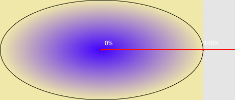

## Кратко

Функция `radial-gradient` используется для задания фона в виде радиального (кругового, эллиптического) градиента.

## Пример

```css
.element {
  background-image: radial-gradient(#6e4aff, #49A16C);
}
```

## Как это понять

Градиент — это плавный переход между цветами. Радиальный градиент — это переход, который начинается в точке и расходится от неё подобно кругам на воде. Радиальный градиент не обязательно должен быть круговым. Форма по умолчанию — это эллипс, который заполняет всю площадь элемента.



<iframe title="Radial gradient" src="demos/gradient.html"></iframe>

## Как пишется

Самый простой градиент задаётся двумя цветами.
```css
.element {
  background-image: radial-gradient(#09ff00, red);
}
```
В этом случае начальная точка помещается в центр элемента, а градиент рисуется таким образом, чтобы в углах элемента был последний указанный в скобках цвет.

Цветов мы можем перечислить сколько угодно. Браузер сам распределит градиент таким образом, чтобы последний цвет всегда заходил в угол элемента:

```css
.element {
  background-image: radial-gradient(yellow, coral, blue, green, white, black);
}
```
<iframe title="Simple gradient" src="demos/simple-gradient.html"></iframe>

### Форма градиента

Задаётся ключевым словом `circle` или `ellipse` (по умолчанию):
```css
.element {
  background-image: radial-gradient(circle, #09ff00, red);
}
```

### Положение центра

Мы можем задавать положение центральной точки, используя те же ключевые слова, что и для [`background-position`](/css/doka/background-position), но с приставкой `at`: `at left`, `at top`, `at right`, `at bottom`, `at center` (по умолчанию). Значения можно сочетать, чтобы поместить центр градиента в нужный угол элемента: `at top left` — центр градиента в верхнем левом углу.

<iframe title="Position center by sides" src="demos/gradient-position-sides.html"></iframe>

Вместо ключевых слов мы можем использовать точные значения: `at 20% 50%` или `at 130px 500px`.

<iframe title="Position center using length" src="demos/gradient-position-length.html"></iframe>

### Размер градиента

Используя следующие ключевые слова, можно задать размер конечной формы градиента:

- `closest-side` — градиент имеет такую форму, что заканчивается у ближайшей к центру границы элемента;
- `farthest-side` — градиент заканчивается у дальней от центра границы элемента;
- `closest-corner` — форма градиента подбирается таким образом, чтобы его край проходил через ближайший к центру угол;
- `farthest-corner` — край градиента будет проходить через дальний от центра угол.

<iframe title="Gradient shape" src="demos/gradient-shape.html"></iframe>

### Повторяющийся градиент

Если градиент должен многократно повторяться от центра к краям, можно использовать функцию `repeating-radial-gradient()`.

<iframe title="Repeating gradient" src="demos/gradient-repeat.html"></iframe>

### Множественные градиенты

Множественный фон элемента может применяться и к градиентам

<iframe title="Multiple gradients" src="demos/gradient-multi.html"></iframe>
