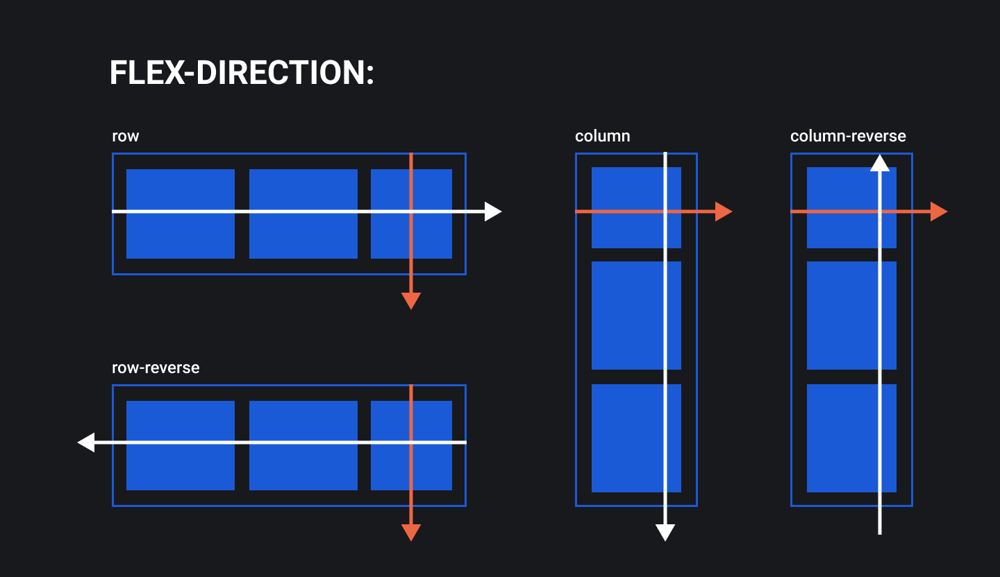

## Кратко

Свойство управляет направлением основной оси внутри флекс-контейнера. Поскольку поперечная ось всегда идёт перпендикулярно основной оси, то при помощи этого свойства мы управляем и её поведением тоже.

Если совсем просто, то это свойство расставляет флекс-элементы в ряд или в колонку.

## Пример

В коде ниже флекс-контейнеру устанавливается горизонтальное направление основной оси. Поперечная ось при этом будет идти сверху вниз, хотя явно мы этого и не прописываем.

```css
.container {
  display: flex;
  flex-direction: row;
}
```

## Как понять

Одной из задач при создании флексбоксов была реализация простого механизма с расстановкой блоков в ряд или в колонку. Для этого были введены понятия осей — основной и поперечной.

И, конечно, понадобилось свойство для управления ими. Так и появилось свойство `flex-direction`, способное управлять обеими осями сразу.

## Как пишется

### Возможные значения

- `row` (значение по умолчанию) — основная ось идёт горизонтально слева направо, поперечная ось идёт вертикально сверху вниз.
- `row-reverse` — основная ось идёт горизонтально справа налево, поперечная ось идёт вертикально сверху вниз.
- `column` — основная ось идёт вертикально сверху вниз, поперечная ось идёт горизонтально слева направо.
- `column-reverse` — основная ось идёт вертикально снизу вверх, поперечная ось идёт горизонтально слева направо.



<aside>

🔃 Важный момент: на сайтах с направлением письма справа налево (RTL), например, в арабском языке, для значений `row` и `row-reverse` основная ось будет идти в обратном направлении. Для значений `column` и `column-revers` своё направление поменяет поперечная ось.

</aside>

## Подсказки

💡 Как только зададите `display: flex` для родителя, его дети выстроятся в ряд. Не пишите дополнительно свойство `flex-direction`, если не требуется менять это поведение.

<aside>

📝 Полный список свойств флексбоксов можно посмотреть в [гайде по flexbox](/css/flexbox-guide/).

</aside>
