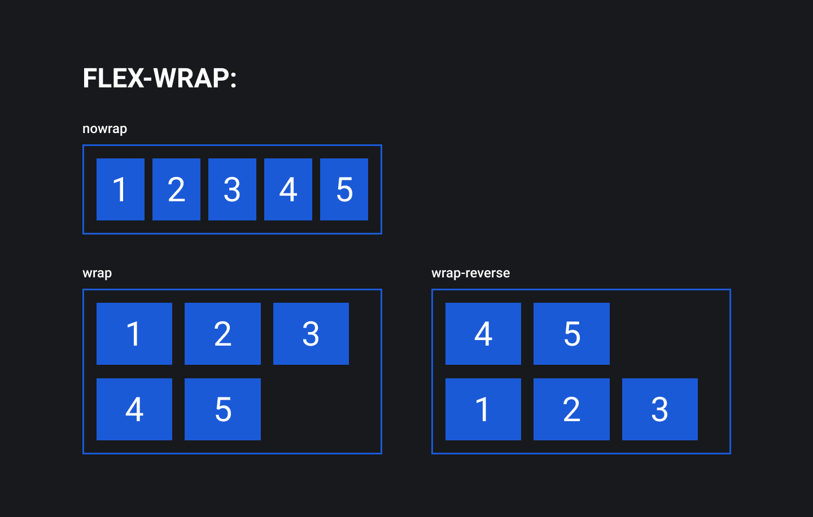

## Кратко

Флекс-элементы по умолчанию стараются уместиться в один ряд, даже если размер им не позволяет.

Чтобы изменить это поведение, свойству `flex-wrap` нужно задать значение, отличное от `nowrap`.

## Пример

Флекс-элементы, вложенные во флекс-контейнер с классом `.container`, не будут переноситься в новый ряд ни при каких обстоятельствах. Всегда будут стоять в один.

```css
.container {
  display: flex;
  flex-wrap: nowrap;
}
```

## Как понять

Внутри флекс-контейнера элементы располагаются вдоль основной оси. Стандартным поведением считается расположение элементов в один ряд.

Если вы позволяете элементам переноситься на новый ряд, изменив значение свойства `flex-wrap`, то для каждой строки будут созданы дополнительные основные оси. Каждый ряд будет вести себя как отдельный флекс-контейнер, но с общим управлением.

## Как пишется

По умолчанию значение у свойства `flex-wrap` — `nowrap`. При этом флекс-элементы помещаются (или пытаются уместиться) в один ряд и не переносятся на новую строку, даже если не влезают в размеры родителя.

Установив значение `wrap`, мы можем изменить это поведение, и флекс-элементы будут иметь возможность перенестись в новый ряд, если не влезают в одну линию в рамках родителя.

Ещё одно возможное значение — `wrap-reverse`. В этом случае элементы будут располагаться снизу вверх, заполнив собой сперва нижний ряд, а те, что не влезли, перепрыгнут в ряд выше.



## Подсказки

💡 Ситуация, когда сумма размеров элементов превышает размер родителя, называется _переполнение контейнера_. Именно это произойдёт, если вы не разрешите флекс-элементам переноситься на новый ряд.

<aside>

📝 Полный список свойств флексбоксов можно посмотреть в [гайде по flexbox](/css/flexbox-guide/).

</aside>
