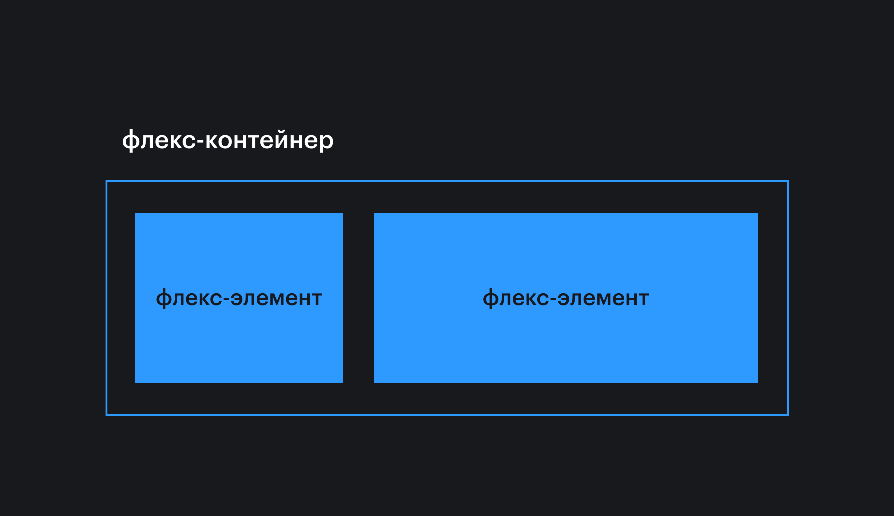
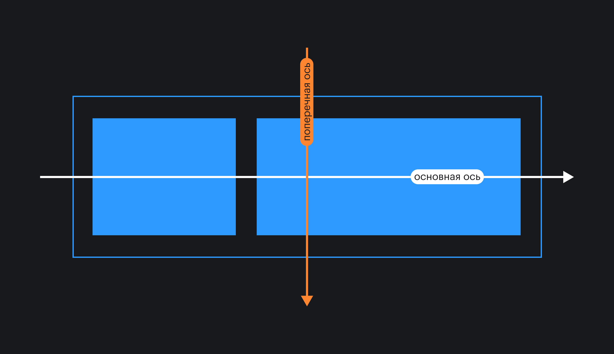
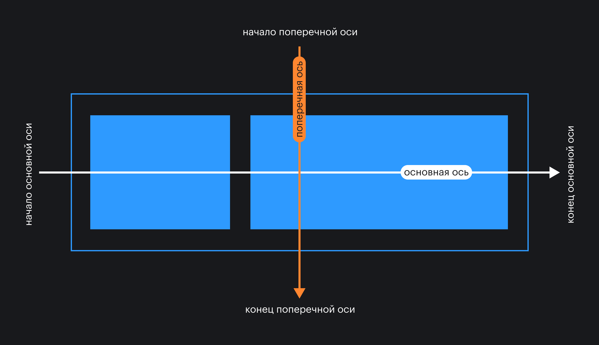
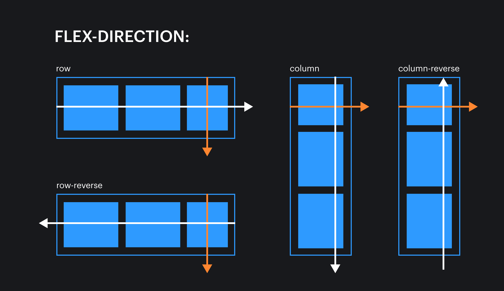
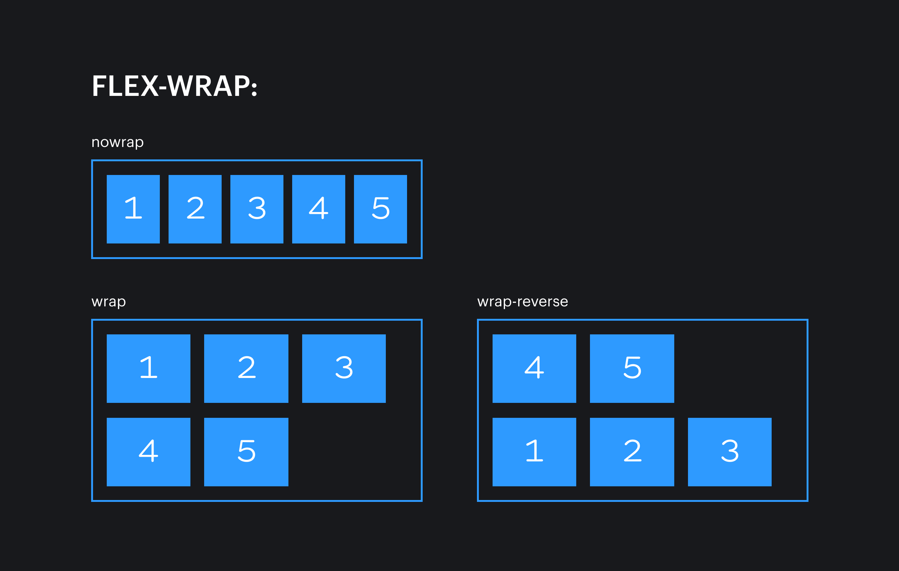

## Что это?

Долгое время веб-интерфейсы были статичными — сайты разрабатывались и просматривались только на экранах мониторов стационарных компьютеров. Однако с десяток лет назад, совсем недавно по историческим меркам, у нас появилось огромное разнообразие экранов — от мобильных телефонов до телевизоров, — на которых мы можем взаимодействовать с сайтами. Так родилась необходимость в гибких системах раскладки.

Идея флексбоксов появилась ещё в 2009 году, и этот стандарт до сих пор развивается и прорабатывается. Основная идея флексов — гибкое распределение места между элементами, гибкая расстановка, выравнивание, гибкое управление. Ключевое слово — **гибкое**, что и отражено в названии (_flex — англ. гибко_).

## Основные термины

- **Флекс-контейнер:** элемент, к которому применяется свойство `display: flex`. Вложенные в него элементы подчиняются правилам раскладки флексов.
- **Флекс-элемент:** элемент, вложенный во флекс-контейнер.



- **Основная ось:** основная направляющая флекс-контейнера, вдоль которой располагаются флекс-элементы.
- **Поперечная (побочная, перпендикулярная) ось:** ось, идущая перпендикулярно основной. Позже вы поймёте, для чего она нужна.



- **Начало / конец основной оси**: точки в начале и в конце основной оси соответственно. Это пригодится нам для выравнивания флекс-элементов.
- **Начало / конец поперечной оси**: точки в начале и в конце поперечной оси соответственно.



- **Размер по основной оси (основной размер)**: размер флекс-элемента вдоль основной оси. Это может быть ширина или высота в зависимости от направления основной оси.
- **Размер по поперечной оси (поперечный размер)**: размер флекс-элемента вдоль поперечной оси. Это может быть ширина или высота в зависимости от направления поперечной оси. Этот размер всегда перпендикулярен основному размеру. Если основной размер — это ширина, то поперечный размер — это высота, и наоборот.


## Свойства флекс-контейнера

### `display`

```css
.container {
  display: flex;
}
```

Когда мы задаём какому-то элементу значение `flex` для свойства `display`, мы превращаем этот элемент в флекс-контейнер. Внутри него начинает действовать флекс-контекст, его дочерние элементы начинают подчиняться свойствам флексбокса.

Снаружи флекс-контейнер выглядит как блочный элемент — занимает всю ширину родителя, следующие за ним элементы в разметке переносятся на новую строку.

```css
.container {
  display: inline-flex;
}
```

Если контейнеру задано значение `inline-flex`, то снаружи он начинает вести себя как строчный (инлайн) элемент — размеры зависят только от внутреннего контента, встаёт в строку с другими элементами. Внутри это ровно такой же флекс-контейнер, как и при предыдущем значении.

### `flex-direction`

Свойство управления направлением основной и поперечной осей.

```css
.container {
  display: flex;
  flex-direction: row;
}
```

Возможные значения:

- `row` (значение по умолчанию) — основная ось идёт горизонтально слева направо, поперечная ось идёт вертикально сверху вниз.
- `row-reverse` — основная ось идёт горизонтально справа налево, поперечная ось идёт вертикально сверху вниз.
- `column` — основная ось идёт вертикально сверху вниз, поперечная ось идёт горизонтально слева направо.
- `column-reverse` — основная ось идёт вертикально снизу вверх, поперечная ось идёт горизонтально слева направо.



Важный момент: на сайтах с направлением текста справа налево, например, на сайте на арабском языке, для значений `row` и `row-reverse` основная ось будет идти в обратном направлении. Для значений `column` и `column-revers` своё направление поменяет поперечная ось.

### `flex-wrap`

```css
.container {
  display: flex;
  flex-wrap: nowrap;
}
```

По умолчанию значение у свойства `flex-wrap` — `nowrap`. При этом флекс-элементы помещаются (или пытаются уместиться) в один ряд и не переносятся в новый ряд, даже если не влезают в размеры родителя.

Установив значение `wrap`, мы можем изменить это поведение, и флекс-элементы будут иметь возможность перенестись в новый ряд, если не влезают в одну линию в рамках родителя.

Ещё одно возможное значение — `wrap-reverse`. В этом случае элементы будут располагаться снизу вверх, заполнив собой сперва нижний ряд, а те, что не влезли, перепрыгнут в ряд выше.



### `flex-flow`

Это свойство-шорткат для одновременного определения значений свойств `flex-direction` и `flex-wrap`.

```css
.container {
  display: flex;
  flex-flow: column wrap;
}
```

Или:

```css
.container {
  display: flex;
  flex-flow: row nowrap;
}
```


Как и со всеми шорткатами, с этим стоит быть осторожным. Хоть он и позволяет сэкономить пару строк кода, в случае переопределения одного из значений придётся переписывать свойство целиком, повторяя второе значение, которое не меняется. В таком случае проще было бы иметь два отдельных свойства и менять значения отдельно.

### `justify-content`

```css
.container {
  display: flex;
  justify-content: space-between;
}
```

Свойство позволяет выравнивать флекс-элементы внутри флекс-контейнера по основной оси.

Возможные значения:

- `flex-start` (значение по умолчанию) — элементы прижимаются к краю, от которого начинается основная ось.
- `flex-end` — элементы прижимаются к краю, у которого основная ось заканчивается.
- `start` — элементы прижимаются к тому краю, откуда начинается чтение на том языке, на котором отображается сайт. Например, для русского языка элементы прижмутся к левому краю при горизонтальной основной оси, а для арабского языка — к правому краю.
- `end` — элементы прижимаются к краю, противоположному началу направления чтения на том языке, на котором отображается сайт. Например, при горизонтальной основной оси на русском языке элементы прижмутся к правому краю.
- `left` — элементы прижмутся к левому краю родителя. В случае, если указано свойство `flex-direction: column`, значение срабатывает как `start`.
- `right` — элементы прижмутся к правому краю. В случае, если указано свойство `flex-direction: column`, значение срабатывает как `end`.
- `center` — элементы выстраиваются по центру родителя.
- `space-between` — крайние элементы прижимаются к краям родителя, оставшиеся выстраиваются внутри контейнера равномерно, так, чтобы между ними были одинаковые отступы.
- `space-around` — свободное пространство делится поровну между элементами и по половине от этой доли размещается по бокам от каждого элемента. Таким образом, между соседними элементами будет равное расстояние, а снаружи крайних элементов — по половине этого расстояния.
- `space-evenly` — свободное место будет распределено так, чтобы расстояние между любыми двумя элементами было одинаковым и расстояние от крайних элементов до края было таким же.

Хотя большинство значений поддерживаются основными браузерами, с некоторыми из них могут быть трудности. Поэтому лучше на всякий случай проверяйте поддержку на [Can I use](https://caniuse.com/#search=justify-content%20flex).

### `align-items`

```css
.container {
  display: flex;
  align-items: center;
}
```

Свойство выравнивания элементов внутри контейнера по поперечной оси.

Возможные значения:

- `stretch` (значение по умолчанию) — элементы растягиваются вдоль поперечной оси так, чтобы заполнить всего родителя. Это очень удобно, если вы делаете двухколоночный макет. Раньше приходилось при помощи разных костылей добиваться одинаковой высоты, а теперь достаточно сделать контейнер флексом, и колонки по умолчанию будут одной высоты.
- `flex-start` или `start` — элементы выстраиваются у начала поперечной оси. Разница между ними лишь в том, что второе значение «уважает» направление чтения выбранного языка.
- `flex-end` или `end` — элементы выстраиваются у конца поперечной оси. Разница между первым и вторым значениями аналогична предыдущему пункту.
- `center` — элементы выстраиваются по центру поперечной оси.
- `baseline` — элементы выравниваются по базовой линии текста. «Базовая линия» — baseline — воображаемая линия, проходящая по нижнему краю знаков шрифта (без учёта выносных элементов).

Это может быть сложно понять сразу, поэтому мы сделали демку. Обратите внимание, что вне зависимости от размера шрифта все блоки выравниваются по базовой линии первой строки.

<iframe title="Выравнивание по базовой линии" src="demos/baseline/" height="500"></iframe>

### `align-content`

```css
.container {
  display: flex;
  align-content: center;
}
```

Свойство распределяет свободное пространство по поперечной оси между рядами флекс-элементов. Предположим, у вас 11 элементов в 3 рядах. Если размер родителя по поперечной оси позволяет, то при помощи `align-content` можно распределять строчки элементов: по верхнему краю, по нижнему, по центру или равномерно.

Не имеет видимого значения, если элементы располагаются в один ряд.

Возможные значения:

- `stretch` (значение по умолчанию) — ряды растягиваются одинаково, так, чтобы занять всё доступное пространство родителя.
- `flex-start` / `start` — все ряды располагаются у начала поперечной оси. Первое значение не зависит от направления чтения текущего языка, в отличие от второго.
- `flex-end` / `end` — все ряды располагаются у конца поперечной оси. `end` «уважает» направление чтения текущего языка.
- `center` — ряды выравниваются по центру родителя.
- `space-between` — первый ряд прижимается к началу поперечной оси, последняя — к концу поперечной оси, а остальные располагаются так, чтобы свободное пространство было поделено на отступы между ними равномерно.
- `space-around` — отступы у каждого ряда равнозначны отступам у любого другого ряда.
- `space-evenly` — отступы между рядами и от краёв родителя одинаковые.

### `gap`

С помощью этого свойства можно с лёгкостью задавать отступы между строками и столбцами.

Является краткой записью свойств `row-gap` и `column-gap`.

Может иметь одно или два значения. Если указано только одно, то `column-gap` автоматически равен `row-gap`. Если указаны два значения, то первое будет задавать отступы между колонками (`column-gap`), а второе — между рядами (`row-gap`).

Значения можно указывать в любых доступных [единицах измерения](/css/numeric-types/), включая проценты.
Допускается использование функции [`calc()`](/css/calc/).

```css
.container {
  display: flex;
  gap: 30px calc(10rem - 10px);
}
```

## Свойства флекс-элемента

### `order`

```css
.container {
  display: flex;
}

.item {
  order: 3;
}
```

При помощи свойства `order` можно менять порядок отображения флекс-элементов внутри флекс-контейнера.

По умолчанию элементы отображаются в том порядке, в котором они расположены в разметке, а значение свойства `order` равно 0.

Значение задаётся в виде целого отрицательного или положительного числа. Элементы встают по возрастающей.


### `flex-grow`

```css
.container {
  display: flex;
}

.item {
  flex-grow: 1;
}
```

Это свойство указывает, может ли вырастать флекс-элемент при наличии свободного места, и насколько. По умолчанию значение равно 0. Значением может быть любое положительное целое число (включая 0).

Если у всех флекс-элементов будет прописано `flex-grow: 1`, то свободное пространство в контейнере будет равномерно распределено между всеми.

Если при этом одному из элементов мы зададим `flex-grow: 2`, то он постарается занять в два раза больше свободного места, чем его соседи.

### `flex-shrink`

```css
.container {
  display: flex;
}

.item {
  flex-shrink: 3;
}
```

Свойство `flex-shrink` полностью противоположно свойству `flex-grow`. Если в контейнере не хватает места для расположения всех элементов без изменения размеров, то свойство `flex-shrink` указывает, в каких пропорциях элемент будет уменьшаться.

Чем больше значение у этого свойства, тем быстрее элемент будет сжиматься по сравнению с соседями, имеющими меньшее значение.

Значение по умолчанию — 1. Значением может быть любое целое положительное число (включая 0).

Два предыдущих свойства работают с пропорциональным разделением пространства, не с конкретными размерами. Они довольно непростые, даже опытный разработчик не всегда знает, как они в точности работают. Загляните в конец статьи, если хотите подробнее почитать о каждом из них.

### `flex-basis`

```css
.container {
  display: flex;
}

.item {
  flex-basis: 250px;
}
```

Свойство `flex-basis` указывает на размер элемента до того, как свободное место будет распределено (см. [flex-grow](/css/flexbox-guide/#flex-grow)).

Значением может быть размер в любых относительных или абсолютных единицах: `20rem`, `5vw`, `250px`. А также можно использовать ключевое слово `auto` (значение по умолчанию). В этом случае при расчёте размера элемента будут приниматься во внимание значения свойств `width`, `max-width`, `min-width` или аналогичные свойства высоты, в зависимости от того, в каком направлении идёт основная ось.

Если никакие размеры не заданы, а свойству `flex-basis` установлено значение `auto`, то элемент занимает столько пространства, сколько нужно для отображения контента.

### `flex`

```css
.container {
  display: flex;
}

.item {
  flex: 1 1 auto;
}
```

Свойство-шорткат, с помощью которого можно указать значение трёх свойств одновременно: `flex-grow`, `flex-shrink` и `flex-basis`. Первое значение является обязательным, остальные опциональны.

Значение по умолчанию: `0 1 auto`, что расшифровывается как `flex-grow: 0`, `flex-shrink: 1`, `flex-basis: auto`.

Возможные значения:

```css
/* 0 0 auto */
flex: none;

/* Одно значение, число без единиц: flex-grow */
flex: 2;

/* Одно значение, ширина/высота: flex-basis */
flex: 10em;
flex: 30px;
flex: auto;
flex: content;

/* Два значения: flex-grow | flex-basis */
flex: 1 30px;

/* Два значения: flex-grow | flex-shrink */
flex: 2 2;

/* Три значения: flex-grow | flex-shrink | flex-basis */
flex: 2 2 10%;

/* Глобальные значения */
flex: inherit;
flex: initial;
flex: unset;
```

### `align-self`

```css
.container {
  display: flex;
  align-items: flex-start;
}

.item {
  align-self: flex-end;
}
```

При помощи этого свойства можно выровнять один или несколько элементов иначе, чем задано у родительского элемента. Например, в коде выше у родителя задано выравнивание вложенных элементов по верхнему краю родителя. А для элемента с классом `.item` мы задаём выравнивание по нижнему краю.

### Ссылки

1. [Как реально работает `flex-grow`](https://medium.com/p/557d406be844)
2. [Как реально работает `flex-shrink`](https://medium.com/p/c41e40767194)
3. [Песочница Флексбоксов](https://yoksel.github.io/flex-cheatsheet/)
4. [Game: Flexbox Froggy](https://flexboxfroggy.com/#ru)
5. [Game: Flexbox Defense](http://www.flexboxdefense.com/)
6. [Game: Flexbox Ducky](https://courses.cs.washington.edu/courses/cse154/flexboxducky/)
7. [Курс по Флексбоксам от Wes Bos](https://flexbox.io/)
