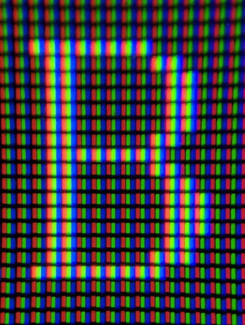
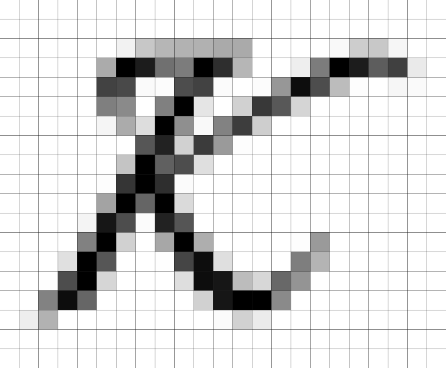
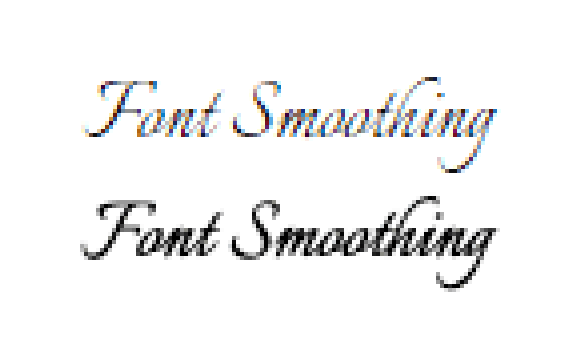
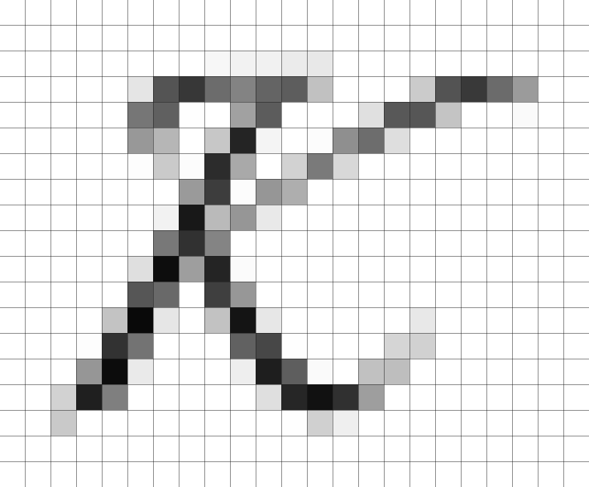
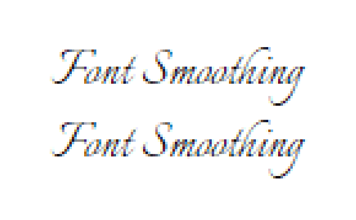
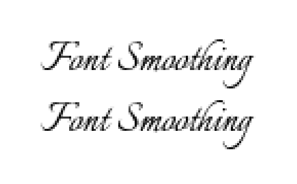
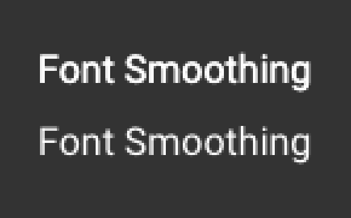

<aside>

🧪 **Осторожно!** Это свойство нестандартное. Используйте его, только если вам _очень_ нужно добиться изменения сглаживания, и внимательно проверяйте работу в разных браузерах и на разных платформах. В данный момент свойство работает только на macOS. Поддержку можно проверить на [Can I use](https://caniuse.com/font-smooth).

</aside>

## Кратко

В разных операционных системах и разных браузерах используются разные механизмы сглаживания шрифта. Браузерные варианты свойства `font-smooth` позволяют управлять сглаживанием шрифта, пока только в macOS.

## Пример

В этом примере мы меняем сглаживание текста на всей странице. Поскольку свойство `font-smooth` нестандартное, каждый браузер реализовал его по-своему: название свойства примерно одинаковое (за исключением [префиксов](/css/vendor-prefixes/)), но значения разные. Несмотря на это, иногда можно получить одинаковые результаты.

```css
body {
  -webkit-font-smoothing: antialiased;
  -moz-osx-font-smoothing: grayscale;
}
```

Сглаживание на экране с низкой плотностью пикселей (1x), без сглаживания и со сглаживанием:


Сглаживание на экране с высокой плотностью пикселей (2x), без сглаживания и со сглаживанием:


## Как понять

Большинство экранов состоит из пикселей, каждый из которых — это группа из трёх лампочек разного цвета: красной, зелёной и синей. Эти лампочки редко имеют прямоугольную форму, а некоторые даже не расположены по обычной сетке.



Фото [Зака Лезермана](https://www.zachleat.com/web/font-smooth/).

Символы шрифта — это векторные фигуры (глифы), которые при отрисовке нужно так расположить на пикселях экрана, чтобы было максимально похоже на оригинал. Чем сложнее шрифт и тоньше у него линии, тем сложнее их передать «грубыми» пикселями.

Посмотрите, как хвостик у буквы К отрисовывается лесенкой:



Браузеры сглаживают фигуры по-разному, в зависимости от движка, свойств экрана и операционной системы. Например, вот так выглядит текст _Font Smoothing_ шрифтом [Italianno](https://fonts.google.com/specimen/Italianno) в браузере Chrome на Windows (сверху) и на macOS (снизу).

Обратите внимание! Это рендеринг по умолчанию, без применения `font-smooth`.



Если вы привыкли к Windows, вам покажется знакомым и приятным первое сглаживание, если к macOS — второе. А может быть и наоборот — всё зависит не только от привычки, но и от размера шрифта, цвета текста и фона. То есть нет «правильного» сглаживания, есть сглаживание по умолчанию.

Свойство `font-smooth` управляет сглаживанием шрифта. Например, значения `antialiased` (в браузерах идущих от движка WebKit) или `grayscale` (в Firefox) включает сглаживание оттенками серого. Только в браузерах, идущих от WebKit, можно включить [субпиксельное сглаживание](https://en.wikipedia.org/wiki/Subpixel_rendering).



В полной мере передать изменение сглаживания можно только на макроснимках экрана. Но на первый взгляд включение сглаживания оттенками серого делает рисунок шрифта тоньше, а субпиксельное сглаживание — толще.

## Как пишется

Из-за того, что свойство `font-smooth` не является частью стандарта CSS, каждый браузер реализует его на своё усмотрение.

Поэтому нельзя просто написать `font-smooth: antialiased`, например. Нужно писать свойство с [префиксами](/css/vendor-prefixes/):

- `-webkit-font-smoothing` для браузеров, идущих от движка WebKit (Safari, Chrome, Opera, Edge);
- `-moz-osx-font-smoothing` для Firefox.

Но на этом сложности не заканчиваются. В каждом из браузеров реализован разный набор значений.

### Значения для WebKit

- `auto` (по умолчанию) — позволяет браузеру решить, какое сглаживание применять.
- `none` — отключает сглаживание.
- `antialiased` — включает сглаживания оттенками серого, когда в сглаживании участвуют целые пиксели, то есть горят все три лампочки.
- `subpixel-antialiased` — включает субпиксельное сглаживания, когда в сглаживании участвуют части пикселей, то есть некоторые лампочки могут не гореть.

### Значения для Firefox

- `auto` (по умолчанию) — позволяет браузеру решить, какое сглаживание применять.
- `grayscale` — сглаживает по аналогии со значением `antialiased` для WebKit.

Firefox не поддерживает отключение сглаживания или субпиксельное сглаживание.

### Примеры значений

Чтобы проверить как работают все комбинаций свойств и значений, мы собрали даже те, которые не работают вместе:

```css
.none {
  -webkit-font-smoothing: none;
  -moz-osx-font-smoothing: none;
}

.grayscale {
  -webkit-font-smoothing: antialiased;
  -moz-osx-font-smoothing: grayscale;
}

.subpixel {
  -webkit-font-smoothing: subpixel-antialiased;
  -moz-osx-font-smoothing: subpixel-antialiased;
}
```

<iframe title="Примеры сглаживания font-smooth" src="demos/smooth/" height="150"></iframe>

Демо в Chrome: значение `none` отключает сглаживание совсем.


Демо в Firefox: значение `none` просто не работает.


## Особенности применения

Идея включить одинаковое сглаживание шрифтов в вашем дизайне на всех устройствах, на первый взгляд, кажется отличной. Однако стоит учитывать важные особенности: привычки пользователей, браузерную поддержку и контраст с фоном.

### Привычки пользователей

Если вы попытаетесь привести сглаживание шрифта привычному на Windows или принятому в графическом редакторе, вы можете не учесть, что все остальные тексты в браузере и за его пределами будут по-прежнему сглаживаться так, как принято по умолчанию в операционной системе. Это может вызвать дискомфорт и сложности с чтением.

### Браузерная поддержка

Свойство `font-smooth` совсем не работает на Windows, Android и даже iOS.

Chrome на Windows:



Firefox на Windows:



### Контраст с фоном

При включении сглаживания оттенками серого (самое частое применение), рисунок шрифта становится заметно тоньше, что уменьшает его контрастность, особенно на тёмном фоне. Об этом стоит помнить, создавая тёмные темы. Но аналогично может просесть и контрастность на белом фоне при небольших размерах шрифта или изначально неконтрастном цвете текста.



## Подсказки

💡 Важно ещё раз акцентировать внимание, что это свойство — не часть стандарта. Оно реализуется и поддерживается по инициативе браузеров и может измениться или пропасть в любой момент.

💡 Свойство совсем не работает ни в одном из браузеров на Windows, Android и iOS.
