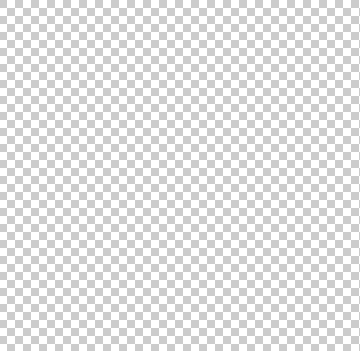
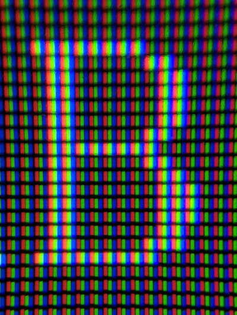

::: callout 🧪

**Осторожно!** Это свойство нестандартное. Используйте его только если вам очень нужно добиться этого эффекта и внимательно проверяйте работу в разных браузерах и на разных платформах. Поддержку можно проверить на [Can I Use](https://caniuse.com/font-smooth).

:::

## Кратко

В разных операционных системах и разных браузерах используются разные механизмы сглаживания шрифта.
Свойство `font-smooth` убирает разницу отображения на разных устройствах, включает один режим сглаживания для всех.

## Пример

В этом примере мы «включаем» среднюю степень сглаживания шрифтов на всём сайте. Поскольку свойство `font-smooth` не стандартное, каждый браузер реализовал его по-своему. Поэтому мы вынуждены писать свойство с [вендорными префиксами](/css/vendor-prefixes) (в работе).

```css
body {
  -webkit-font-smoothing: antialiased;
  -moz-osx-font-smoothing: grayscale;
}
```

## Как понять

Любой экран состоит из пикселей — чаще всего это небольшие квадраты.



Каждый пиксель в свою очередь состоит из трёх лампочек разного цвета: красный, зелёный и синий.



При отрисовке текста такая геометричность может доставлять неудобства. Особенно если выбран декоративный шрифт с непрямыми линиями.

Посмотрите, как хвостик у буквы К отрисовывается лесенкой:


Свойство `font-smooth` управляет сглаживанием шрифта. Например, значения `antialiased` или `grayscale` окрашивают пиксели, находящиеся по краям буквы в полупрозрачный цвет. Таким образом края буквы кажутся более плавными.


Издалека текст со свойством `font-smooth` выглядит аккуратнее и лучше читается:


Визуально шрифт со средней или сильной степенью сглаживания кажется тоньше.

## Как пишется

Из-за того, что свойство `font-smooth` не является частью стандарта CSS каждый браузер реализует его на своё усмотрение.

Поэтому нельзя просто написать `font-smooth: none`, например. Нужно писать свойство с [вендорными префиксами](/css/vendor-prefixes) (в работе):

— `-webkit-font-smoothing` для браузеров на платформе WebKit (Chrome, Opera, Safari, Edge);
— `-moz-osx-font-smoothing` для FireFox.

Но на этом сложности не заканчиваются. В каждом из браузеров реализован разный набор значений.

### Значения для WebKit:

— `auto` — *значение по умолчанию*, позволяет браузеру решить какую степень сглаживания применять.
— `none` — отключает сглаживание шрифтов.
— `antialiased` — средняя степень сглаживания, пиксели по краям буквы светятся как бы в пол силы, все три лампочки включены. В итоге получается один из оттенков серого.
— `subpixel-antialiased` — сильная степень сглаживания, пиксели по краям буквы светят в пол силы. Но в отличие от `antialiased` берётся исходный цвет буквы и как бы приглушается. Не имеет аналога для FireFox, а значит поддерживается ещё меньшим числом устройств, чем само свойство `font-smooth`.

### Значения для FireFox:

- `auto` — *значение по умолчанию*, позволяет браузеру решить какую степень сглаживания применять.
— `grayscale` — сглаживает шрифт по аналогии со значением `antialiased` для WebKit.

## Область использования

Идея врубить одинаковое сглаживание на всех операционных системах и во всех браузерах кажется отличной. Но этот подход избыточен, поскольку на многих устройствах поддержка этого свойства вообще не реализована. Ярким примером служит платформа Андройд.

По этой причине стоит прибегать к этому методу точечно, ограничивая область действия:

```css
@media screen and (-webkit-min-device-pixel-ratio: 2), screen and (min-resolution: 2dppx) {
	body {
		-moz-osx-font-smoothing: grayscale;
		-webkit-font-smoothing: antialiased;
	}
}
```

## Подсказки

💡 Важно ещё раз акцентировать внимание, что это свойство — не часть стандарта. Реализуется и поддерживается по инициативе и прихоти браузеров. Может измениться или пропасть в любой момент.

💡 Максимальный эффект этого свойства заметен, если светлый текст находится на тёмном фоне.

💡 Свойство может не иметь видимого эффекта в Windows.
