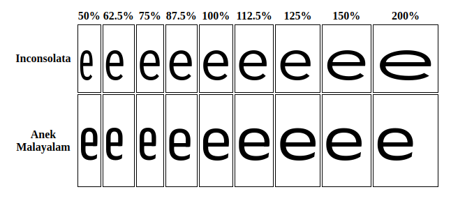

## Кратко

Свойство `font-stretch` устанавливает узкое, нормальное или широкое начертание шрифта. Как и в случае [`font-weight`](/css/font-weight/), браузер не меняет рисунок шрифта, а выбирает из доступных шрифтов подходящие начертания, если они описаны в `@font-face` или есть в системном шрифте.

## Как пишется

Некоторые шрифты имеют дополнительные начертания, в которых символы могут быть у́же (`condensed`) или шире (`expanded`) нормальной ширины. Если используемый вами шрифт не предполагает таких начертаний, то свойство `font-stretch` действовать не будет.

**Возможные значения:**

- `normal` — нормальная или «текстовая» ширина шрифта (значение по умолчанию).
- `semi-condensed`, `condensed`, `extra-condensed`, `ultra-condensed` — сжатое начертание разной степени.
- `semi-expanded`, `expanded`, `extra-expanded`, `ultra-expanded` — расширенное начертание разной степени.
- проценты — точное указание процентов. Отрицательные значения недопустимы. Границы диапазона зависят от того, какие значения поддерживает шрифт.


Пример двух разных шрифтов с значениями, указанными в процентах

Интерактивный пример использования процентов в качестве значения:

<iframe title="Интерактивный пример с процентами" src="demos/interactive/" height="400"></iframe>

**Сопоставление ключевых слов с числовыми значениями:**

- `ultra-condensed` — 50%;
- `extra-condensed` — 62.5%;
- `condensed` — 75%;
- `semi-condensed` — 87.5%;
- `normal` — 100%;
- `semi-expanded` — 112.5%;
- `expanded` — 125%;
- `extra-expanded` — 150%;
- `ultra-expanded` — 200%.

<aside>

⚠️ Некоторые шрифты поддерживают не все значения. Так, Roboto Flex поддерживает значения в диапазоне от 25 до 151% и в примере ниже `font-stretch` будет иметь значение 151%, а не 200%, как ожидалось.

```css
p {
  font-family: "Roboto Flex", sans-serif;
  font-stretch: ultra-expanded;
}
```

Посмотреть, какие начертания поддерживает шрифт можно на [Google Fonts](https://fonts.google.com/variablefonts?vfaxis=wdth).

</aside>

Пример использования ключевых слов в качестве значения:

<iframe title="Ключевые слова" src="demos/keywords/" height="865"></iframe>

## Подсказки

💡 Google API определяет ваш браузер для обеспечения совместимости (не все браузеры поддерживают вариативность шрифтов). Но из-за неточностей, некоторые браузеры, которые её поддерживают (например Opera), все равно получают статические шрифты. Имейте это в виду при работе с Google Fonts.
