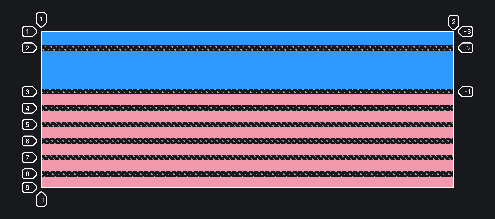

## Кратко

Если элементов внутри грид-контейнера больше, чем может поместиться в объявленные явно ряды и колонки, то для них создаются автоматические, неявные ряды и колонки. При помощи свойств `grid-auto-columns` и `grid-auto-rows` можно управлять размерами этих автоматических рядов и колонок.

## Пример

В этом примере создаются две явные колонки размером 50 и 150 пикселей соответственно. Элементы, начиная с третьего, в эти две строки не помещаются, и для них создаются автоматические ряды. При помощи свойства `grid-auto-rows` мы указываем, что автоматические ряды должны иметь размер 15 пикселей.

```css
.container {
  display: grid;
  grid-template-rows: 50px 150px;
  grid-auto-rows: 15px;
  gap: 10px;
}

.item {
  background: lightblue;
}

.item:nth-child(n + 3) {
  background: pink;
}
```



## Как понять

Если вы не уверены в количестве элементов, вложенных в грид-контейнер, то стоит предусмотреть автоматические колонки или ряды.

С помощью свойства `grid-auto-columns` мы указываем правило или паттерн создания неявных колонок.

Свойство `grid-auto-rows` управляет неявными рядами.

## Как пишется

В качестве значения можно указать одно или более значений размеров создаваемых неявных грид-полос. При указании более одного значения размеры разделяются пробелами.

Если указано несколько значений, то паттерн будет повторяться, пока все элементы не поместятся в раскладку.

## Подсказки

<aside>

📝 Полный список свойств гридов можно посмотреть в [гайде по grid](/css/grid-guide/).

</aside>
