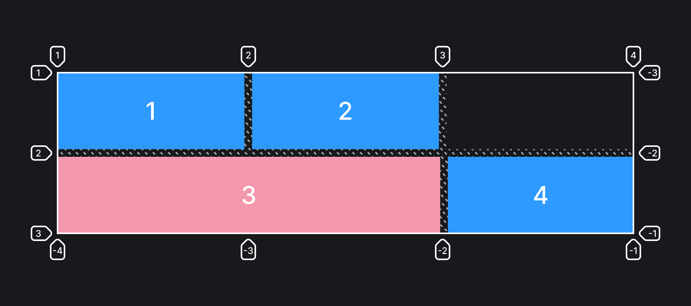

## Кратко

Если грид-элементов больше, чем явно объявленных колонок или рядов, то они **автоматически** размещаются внутри родителя. А вот каким образом — в ряд или в колонку — можно указать при помощи свойства `grid-auto-flow`.

## Пример

Принципы работы этого свойства удобнее всего изучать на примере, когда есть большой блок, который не помещается в одну грид-ячейку.

```css
.container {
  display: grid;
  /* Три колонки */
  grid-template-columns: auto auto auto;
  /* Два ряда */
  grid-template-rows: auto auto;
  /* Автоматическое размещение в ряд */
  grid-auto-flow: row;
  /* Отступы между ячейками */
  gap: 10px;

  /* Для красоты */
  padding: 10px;
  background: #f1f1f1;
}

.item {
  min-height: 50px;
  text-align: center;
  padding: 20px 0;
  font-size: 30px;
  line-height: 1;
  background: lightblue;
}

.item3 {
  /* Занимает один ряд и растягивается на две колонки */
  grid-column: span 2;
  background: pink;
}
```



Как видите, третий элемент не поместился в последнюю ячейку первого ряда и был перенесён на следующую строку. Следующий за ним четвёртый элемент встал в ближайшую доступную ячейку во втором ряду.

## Как понять

Свойство `grid-template-rows` _командует_ браузеру, во сколько рядов выстраивать вложенные элементы. И какого размера должны быть эти ряды.

## Как пишется

- `row` (значение по умолчанию) — автоматически размещаемые элементы выстраиваются в ряды.
- `column` — автоматически размещаемые элементы выстраиваются в колонки.
- `dense` — браузер старается заполнить _дырки_ (пустые ячейки) в разметке, если размеры элементов позволяют. Можно сочетать с остальными значениями.

Для иллюстрации работы ключевого слова `dense` добавим его к значению свойства `grid-auto-flow` в примере выше:

```css
.container {
  grid-template-columns: auto auto auto;
  /* Автоматическое размещение в ряд */
  grid-auto-flow: row dense;
}
```


Теперь четвёртый элемент встал в ряд, но занял при этом пустую ячейку в первом ряду. Браузер старается закрыть все _дырки_ в сетке, переставляя подходящие элементы на свободные места.

## Подсказки

<aside>

📝 Полный список свойств гридов можно посмотреть в [гайде по grid](/css/grid-guide/).

</aside>
