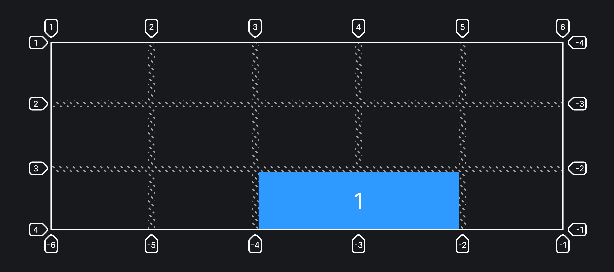

## Кратко

Свойства-шорткаты для `grid-column-start` + `grid-column-end` и `grid-row-start` + `grid-row-end` соответственно. [Статья про эти свойства](/css/grid-start-end/).

Значения для `*-start` и `*-end` разделяются слэшем.

Можно использовать ключевое слово `span`, буквально говорящее «растянись на столько-то». А на сколько, указывает стоящая за ним цифра.

## Пример

Элемент начинается с третьей линии по горизонтали и растягивается на 2 ячейки. По вертикали элемент начинается от линии с именем `[third-line]` и заканчивается у четвёртой линии:

```css
.item1 {
  grid-column: 3 / span 2;
  grid-row: third-line / 4;
}
```



## Как пишется

Используйте доступные значения свойств [`grid-column-start`, `grid-column-end`, `grid-row-start` и `grid-row-end`](/css/grid-start-end/), разделяя их слэшем.

## Подсказки

💡 Если опустить слэш и второе значение, то элемент будет размером в одну ячейку.

<aside>

📝 Полный список свойств гридов можно посмотреть в [гайде по grid](/css/grid-guide/).

</aside>
