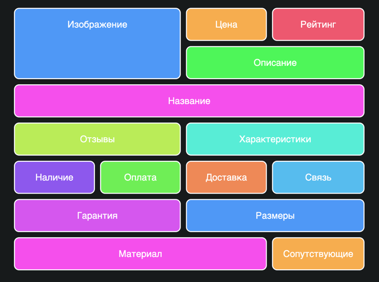

Грид выручит, когда нужно сверстать сложную сетку, которая  меняется в зависимости от размеров экрана устройства. Возьмём пример с интерфейсом онлайн-магазина:

<iframe title="Как разбивать яйца" src="demos/cracking/" height="250"></iframe>
Сетка десктопа

Сетка мобильной версии

В мобильной версии нужно сильно поменять порядок отображения, а для SEO нужно сохранить определённый порядок.

Вот как это работает:
<iframe title="Как разбивать яйца" src="demos/cracking/" height="600"></iframe>
