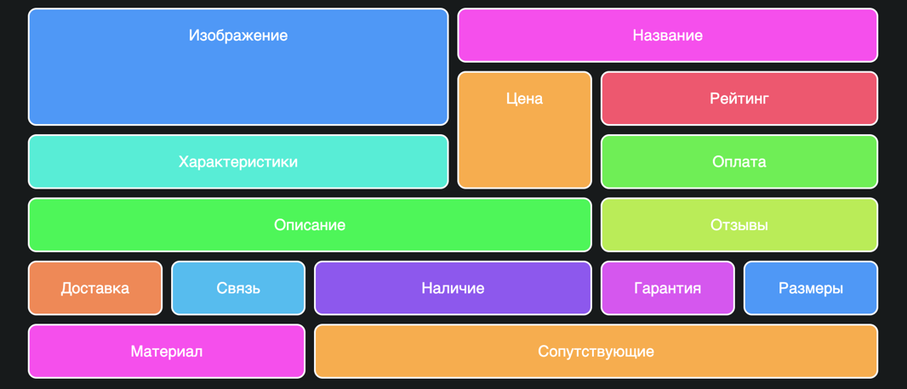
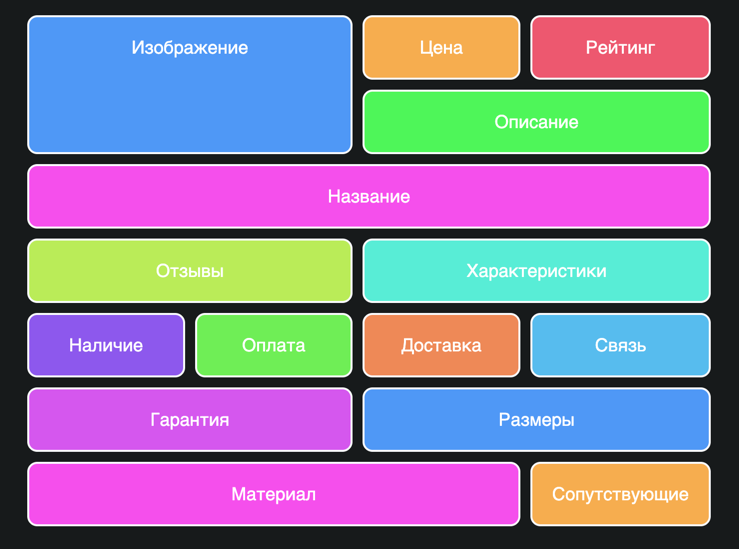

grid выручит, когда нужно сверстать сложную сетку, которая  меняется в зависимости от размеров экрана устройства. Возьмём пример с интерфейсом онлайн-магазина:

Сетка десктопа

Сетка мобильной версии

В мобильной версии нужно сильно поменять порядок отображения, а для SEO нужно сохранить определённый порядок.

Вот как это работает:
https://meded90.github.io/grid-guide/
Исходный код:
https://github.com/meded90/grid-guide/blob/main/index.html
